# Flow chi tiết Hermes

Nguồn: [plan Hermes](../../docs/plans/hermes-orchestrator-plan.md), trạng thái ghi ngày 27/9/2026. Phase 0 có code, chưa kiểm tra end-to-end YouTube/Hermes/Telegram; Phase 1–4 là thiết kế dự kiến.

**Điểm cần sửa trong plan:** skill radar ack trước khi trả lời gửi Telegram. Nếu ack thành công nhưng gửi thất bại, lần pull sau bỏ qua video. Muốn bảo đảm at-least-once cần xác nhận giao tin trước ack hoặc bổ sung outbox bền với retry. Đây là ghi chú review, chưa thay đổi implementation.

Nhánh xử lý lỗi/sửa stage trong sơ đồ mô tả hành vi cần có; hợp đồng retry, idempotency và phục hồi job còn phải chốt trước triển khai. Luồng làm lại frame N cũng chưa có tool riêng được định nghĩa trong plan.

## Kiến trúc và ranh giới trách nhiệm

[PNG](01-architecture.png) · [SVG](01-architecture.svg) · [Mermaid](01-architecture.mmd) · [Excalidraw](01-architecture.excalidraw)

## Phase 0: Radar tin tức → Telegram

[PNG](02-news-radar.png) · [SVG](02-news-radar.svg) · [Mermaid](02-news-radar.mmd) · [Excalidraw](02-news-radar.excalidraw)

## Phase 1: Viết script → chuyển DNA Spy

[PNG](03-write-and-transfer.png) · [SVG](03-write-and-transfer.svg) · [Mermaid](03-write-and-transfer.mmd) · [Excalidraw](03-write-and-transfer.excalidraw)

## Phase 2: Cook video → duyệt / sửa / hủy

[PNG](04-auto-cook-and-approval.png) · [SVG](04-auto-cook-and-approval.svg) · [Mermaid](04-auto-cook-and-approval.mmd) · [Excalidraw](04-auto-cook-and-approval.excalidraw)

## Phase 3–4: Research, đề tài và vận hành

[PNG](05-research-and-operations.png) · [SVG](05-research-and-operations.svg) · [Mermaid](05-research-and-operations.mmd) · [Excalidraw](05-research-and-operations.excalidraw)

Các file `.excalidraw` mở tại excalidraw.com → File → Open để chỉnh sửa.