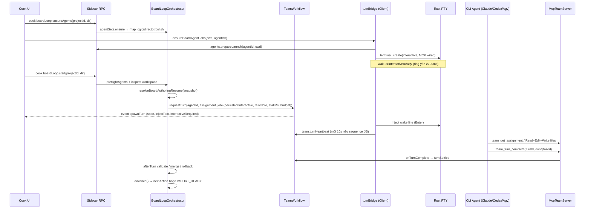

# Plan: Copy y hệt kiến trúc Agent / Terminal / MCP + Board Loop từ dna-spy

> **Ngày:** 2026-08-09  
> **Nguồn:** `/Users/jc/Documents/Sth/Taphoa/makemoney/dna-spy`  
> **Đích:** `/Users/jc/Documents/Sth/Taphoa/makemoney/writer-room` (greenfield hiện tại: Spy-only Tauri + `packages/*`)  
> **Mục tiêu:** Port nguyên kiến trúc điều phối agent (Rust PTY, Team Workflow, MCP loopback, client turn-bridge, artifact-driven resume) — không port domain Board/Cook storyboard. Domain Writer Room sẽ **gắn vào cùng harness**.

---

## 0. Tóm tắt một dòng

```text
UI bấm Start
  → Orchestrator resolve nextAction từ artifacts trên disk
  → TeamWorkflow.requestTurn(agent, task, persistentInteractive)
  → emit spawnTurn
  → Client auto-open / inject terminal (Tauri PTY)
  → Agent làm việc + gọi MCP team_turn_complete
  → Orchestrator validate/rollback/advance
  → Crash/Dừng/Retry vẫn resume đúng cổng vì state = files + SQLite turns
```

**Luật vàng (copy nguyên văn từ Board loop):**  
*Agent viết bản nháp; app mới là người ký.* Artifact bằng chứng do app ghi. Sau mỗi turn app validate; fail → rollback preimage → retry có budget.

---

## 1. Bản đồ nguồn (dna-spy) — đọc trước khi code

### 1.1 Lớp platform & contract

| Layer | Path nguồn | Vai trò |
| --- | --- | --- |
| Shared DTO | `dna-spy/shared/src/terminal.ts` | `TerminalCreate*`, `AgentDefinition`, `AgentLaunchSpec`, `TeamMessage`, `TeamAssignment`, guards |
| Pure resume FSM | `dna-spy/shared/src/board-authoring-resume.ts` | `resolveBoardAuthoringResume(snapshot)` — **không** biết file/process |
| Rust PTY | `dna-spy/src-tauri/src/terminal/{mod.rs,ring.rs}` | `terminal_create/write/resize/kill/list/snapshot`, Channel per-session, ring 2 MiB |
| ADR | `dna-spy/docs/decisions/0010-terminal-agent-structured-first.md` | Structured-first, injection-last; MCP HTTP loopback |

### 1.2 Lớp sidecar (Bun)

| Module | Path | Vai trò |
| --- | --- | --- |
| AgentManager | `sidecar/src/agents/{index,adapters,config,worktree}.ts` | Config agents, adapter CLI, MCP config per-agent, readiness (auth/trust), launch specs |
| TeamStore | `sidecar/src/team/store.ts` | Messages, turns, assignments, acks, resumeSessionRef, audit |
| TeamWorkflow | `sidecar/src/team/workflow.ts` | `requestTurn` → guards → queue → `spawnTurn` / watchdog / interrupt / settle |
| McpTeamServer | `sidecar/src/team/mcp.ts` | HTTP `127.0.0.1:random` + bearer; tools team_* |
| App MCP (optional) | `sidecar/src/mcp/{app-server,registry,audit}.ts` | Capability tools domain (dna_spy) — tách khỏi team hub |
| BoardLoopOrchestrator | `sidecar/src/cook/board-loop.ts` (~3870 LOC) | **Mẫu pipeline** trigger / advance / dispatch / validate / rollback / retry |
| Board agent set | `sidecar/src/cook/board-agent-set.ts` | Clone agent ephemeral per workspace run |
| Cook job (stage dài) | `sidecar/src/cookjob.ts` | Stage manager (research/script/images…) — parallel-safe, abort, progress stream |
| RPC surface | `sidecar/src/main.ts` | `cook.boardLoop.{start,status,stop,retry,ensureAgents}`, `team.*`, `agents.*` |

### 1.3 Lớp client (React)

| Module | Path | Vai trò |
| --- | --- | --- |
| turnBridge | `client/src/components/agents/turnBridge.ts` | `spawnTurn` → inject pane / launch tab; heartbeat ring; settle |
| ensureBoardAgentTabs | cùng file | **Tự bật 3 terminal interactive** trước loop |
| terminalApi / store | `client/src/components/terminal/*` | Tauri invoke + xterm + tabs |
| agentApi | `client/src/components/agents/agentApi.ts` | RPC + subscribe team events |
| Cook UI | Cook board panel (api `cookBoardLoop*`) | Start / Stop / Retry / poll status |

### 1.4 Luồng Cook Video → Board → Director (tham chiếu trigger)



**Các RPC/control surface cần copy đúng tên khái niệm:**

| Action | Nguồn | Hành vi |
| --- | --- | --- |
| Prepare workspace | Cook prepare | Viết context + scripts app-owned, đóng `workspaceRunId` |
| ensureAgents | `cook.boardLoop.ensureAgents` | Map role → agentId (base hoặc clone) |
| Auto terminal | `ensureBoardAgentTabs` | Mở pane interactive + MCP trước khi start |
| Start | `cook.boardLoop.start` | Inspect → advance lần 1 |
| Status | `cook.boardLoop.status` | Derive từ disk + overlay running turn |
| Stop | `cook.boardLoop.stop` | `interruptTurn` + rollback preimage pending |
| Retry | `cook.boardLoop.retry` | Clear attempt/cycle history + advance lại |
| Heartbeat | `team.turnHeartbeat` | Client → workflow (stall detection) |
| Settle | `team.turnComplete` / MCP `team_turn_complete` | Process exit **hoặc** agent báo xong |

---

## 2. Cơ chế cốt lõi phải copy y hệt (không “gần giống”)

### 2.1 Process authority = Rust PTY (ADR-1/2)

- Commands: `terminal_create`, `terminal_write`, `terminal_resize`, `terminal_kill`, `terminal_list`, `terminal_snapshot`
- Output: **Tauri Channel per-session**, chunk `{ sequence, data base64 }`, batch 8–16 ms
- Ring buffer scrollback ~2 MiB; reattach qua snapshot (UI unmount không mất log)
- `readOnly` cho pane headless; Board/Writer loop dùng interactive (`readOnly: false`)
- Bind `turnId` vào create request để race exit-before-map không mất settle

**Writer-room hiện tại:** `src-tauri` chỉ shell sidecar/daemon HTTP — **chưa có** `terminal/`. Phải port module này.

### 2.2 Structured-first + inject chỉ cho persistent interactive (ADR-4 + evolution Board)

Hai mode cùng tồn tại:

| Mode | Khi nào | Cơ chế settle |
| --- | --- | --- |
| **Headless turn** | Team chat / job `orchestrated && !persistentInteractive` | Process exit → `turnComplete` |
| **Persistent interactive** | Board loop (và Writer Room loop copy) | Agent gọi MCP `team_turn_complete`; inject chỉ là wake line ngắn |

**Không** đoán ready/busy từ prompt pattern. Ready = ring sequence ổn định sau spawn (client-side `waitForInteractiveReady`).

### 2.3 TeamWorkflow guards & watchdog

Copy từ `team/workflow.ts`:

- Global guards: `maxTurns`, `maxDurationMinutes`, `maxQueueDepth`, `maxTurnsPerPair`, `cooldownSeconds`, `maxWakeRetries`
- Scoped budget per pipeline run: `{ scope, maxTurns, maxDurationMinutes, cooldownSeconds }`
- 1 active turn / agent; exclusive turn cho loop
- Watchdog 2 tầng:
  - `stallMs` — không heartbeat (không output mới) → kill sớm (Board: 7 phút; logic im lặng: 20 phút)
  - `timeoutMs` — hard cap (Board: 30 phút)
- Heartbeat **chỉ client** gửi (sidecar không sở hữu PTY)
- Orchestrated turn **không** auto-retry trên exit≠0 — loop sở hữu retry/resume
- Events: `spawnTurn`, `turnSettled`, `turnTimeout`, `interrupt`, `agentPaused`, `guard`, `stopAll`

### 2.4 MCP Team Server (ADR-5)

- Một process HTTP `127.0.0.1:0` + bearer token mỗi lần sidecar start
- Tools bắt buộc:
  - `team_send_message` (+ idempotencyKey)
  - `team_read_messages` / `team_ack_messages`
  - `team_get_assignment`
  - `team_update_status`
  - `team_turn_complete`
- AgentManager ghi MCP config per-agent trước launch (`mcp-{agentId}.json` / settings adapter)
- App MCP (domain tools) provision **ephemeral per launch**, không trộn token team

### 2.5 AgentManager + adapters

Copy:

- Adapters: `claude-code`, `codex`, `agy`, `gemini`
- `prepareLaunch` / `buildInteractiveTurnSpec` / `buildHeadlessTurnSpec`
- `launchReadiness`: auth status + Claude trust dialog (fail-fast trước khi đốt 4 PTY rỗng)
- `workingDirectoryMode: project | isolated-worktree`
- Board/Writer loop: `skipWorktree: true`, `overrideCwd: workspaceDir`, `allowedTools: Read/Edit/Write`
- `buildInjectLine`: wake 1 dòng → agent gọi `team_get_assignment` (không nhét task dài vào keystroke)

### 2.6 Artifact-driven resume (trái tim Board loop)

**Pure function** (shared, unit-testable):

```text
inspect workspace → BoardAuthoringResumeSnapshot
  → resolveBoardAuthoringResume(snapshot)
  → { state, nextAction, batchIndex?, reason, importReady, staleArtifacts }
```

Quy tắc:

1. State sống trên disk (artifacts/checkpoint/hash), **không** trong RAM orchestrator.
2. Upstream gate hỏng luôn thắng downstream.
3. App re-derive script app-owned mỗi Start/Retry (`validate.mjs`…); không tin bản copy cũ trong workspace.
4. Mỗi dispatch: snapshot protected files + owned chunk preimage; settle fail → restore byte-exact.
5. Attempt key = semantic input hash (packet/chunk), không chỉ stage name — tránh inherit budget sai.
6. Cycle detector (`actionHistory`) + polish oscillation → halt + yêu cầu human Retry.
7. `dispatch-log.jsonl` append-only mỗi quyết định (route tag + reason rút gọn ERROR).
8. Stop: interrupt đúng turn + rollback transaction; giữ `recoveryHint` nếu rollback chưa xong.
9. Retry: clear attempts, actionHistory, polishFailures, budget scope; recover pending journal.

### 2.7 Client turnBridge (auto terminal)

Copy semantics từ `turnBridge.ts`:

1. `ensure*AgentTabs(cwd, agentIds)` — mở đủ pane trước Start
2. `spawnTurn` + `interactiveRequired`:
   - Có live pane cùng agentId → inject
   - `restartInteractive` → kill pane cũ, launch mới, inject
   - Không có pane → **không** silent fallback headless cho interactiveRequired (fail turn -1)
3. Heartbeat poll 10s trên `terminal_snapshot.sequence`
4. 1 automation pane / agent (`paneByAgent`) — retry không nhân tab
5. Dedup `launchingTurns` / StrictMode safe

---

## 3. Writer-room hiện tại vs gap

| Thành phần | writer-room hiện tại | Gap |
| --- | --- | --- |
| Tauri shell | Spawn daemon HTTP, feature flag Spy | Chưa PTY module |
| Daemon | `packages/daemon` HTTP Spy + writer packs | Chưa agents/team/MCP/workflow |
| UI | Preact pages Spy/Writer stub | Chưa terminal drawer, agents page, turn bridge |
| Contracts | Spy schema only | Chưa `shared/terminal` types |
| Orchestration | Không | Cần WriterLoop theo mẫu BoardLoop |
| Legacy trong dna-spy/writer-room | tmux + pane-runner + orchestrator domain | **Không port** path cũ; dùng path dna-spy sidecar/Tauri |

Greenfield SDD 001 (MySQL + Training) vẫn latent; plan này **không** implement Training. Plan này dựng **Agent Harness** dùng được cho Writer pipeline (và sau này gắn Training roles).

---

## 4. Target layout trong writer-room

```text
writer-room/
  shared/
    src/
      terminal.ts                 # port y nguyên contracts
      writer-authoring-resume.ts  # pure FSM (tương đương board-authoring-resume)
  packages/
    daemon/   # hoặc rename sidecar — giữ tên daemon nếu muốn
      src/
        agents/                   # port AgentManager + adapters
        team/                     # store + workflow + mcp
        writer/
          writer-loop.ts          # BoardLoopOrchestrator pattern
          writer-agent-set.ts
          writer-workspace.ts     # prepare inspect compile
        mcp/
          app-server.ts           # domain tools (spy read, pack, …) optional phase 2
        rpc/  or http routes
  packages/web/
    src/
      components/
        terminal/                 # xterm + store + api
        agents/                   # turnBridge, agentApi
      pages/
        Agents.tsx
        WriterRun.tsx             # Start/Stop/Retry + status
  src-tauri/src/
    terminal/
      mod.rs
      ring.rs                     # port từ dna-spy
```

**Transport note:** dna-spy dùng JSON-RPC over sidecar stdin + events. writer-room hiện HTTP daemon. Hai lựa chọn (chốt ADR trước code):

| Option | Pros | Cons |
| --- | --- | --- |
| **A. Giữ HTTP daemon + SSE/WS events** | Khớp stack hiện tại | Phải redesign event `spawnTurn` (SSE) + auth local |
| **B. Port JSON-RPC sidecar pipe như dna-spy** | Copy gần 1:1 `main.ts` handlers | Đụng shell Tauri nhiều hơn |

**Khuyến nghị:** **Option A** với contract event **y hệt** (`TeamEvent` union), chỉ đổi transport:

- RPC → `POST /rpc` hoặc REST mirror `POST /writer/loop/start`…
- Events → SSE `GET /events/team` stream `TeamEvent`
- PTY vẫn Tauri Channel (không qua HTTP)

---

## 5. Mapping domain: Board → Writer Room

Không copy storyboard; copy **state machine shape**.

### 5.1 Agents (tối thiểu 2–3, mirror 3-pane contract)

| Board | Writer Room (đề xuất) | Adapter gợi ý |
| --- | --- | --- |
| `board-claude` (Logic) | `writer-analyst` — contract/brief/backbone | claude-code |
| `board-codex` (Director) | `writer-author` — draft + revision | codex hoặc claude-code |
| `board-agy` (Polish) | `writer-editor` — hard-gate review | codex / agy |

UI: `ensureWriterAgentTabs` mở đủ panes trước loop.

### 5.2 Artifact graph & nextAction (v1 Writer)

Thay `BoardAuthoringResumeSnapshot` bằng `WriterAuthoringResumeSnapshot`:

| Checkpoint (app-owned / agent-owned) | nextAction khi fail |
| --- | --- |
| workspace prepared (context/title, sources, config) | NONE / BLOCKED |
| `output/editorial-contract.json` + claim ledger | `AUTHOR_CONTRACT` |
| human commissioning gate file (optional v1 skip → auto) | `WAIT_HUMAN` hoặc skip |
| `output/direction-lock.json` | `AUTHOR_DIRECTION` |
| `output/draft-vNNN.md` + parse OK | `AUTHOR_DRAFT` |
| `output/review-vNNN.json` + hard gates | `RUN_REVIEW` |
| repair budget remaining | `AUTHOR_REPAIR` |
| all gates pass | `IMPORT` / `PUBLISH_READY` |

Pure: `resolveWriterAuthoringResume(snapshot)` — unit test table-driven copy style `board-authoring-resume`.

### 5.3 PendingTurn kinds

```ts
type WriterPendingKind =
  | 'contract'
  | 'direction'
  | 'draft'
  | 'review'
  | 'repair';
```

Mỗi kind: `taskNote` (prompt file paths + allowed write paths), preimage protected, `retryKeys`, `stallMs`.

### 5.4 Dispatch job flags (y hệt Board)

```ts
workflow.requestTurn(agentId, 'assignment', undefined, {
  taskNote,
  overrideCwd: run.dir,
  skipWorktree: true,
  allowedTools: ['Read', 'Edit', 'Write'],
  orchestrated: true,
  persistentInteractive: true,
  freshContext: true,          // review/repair isolation
  restartInteractive: attemptNumber > 1,
  exclusive: true,
  timeoutMs: 30 * 60_000,
  stallMs: 7 * 60_000,         // widen for silent-think roles if needed
  budget: { scope: `writer:${projectId}:${runId}`, maxTurns, maxDurationMinutes: 240 },
});
```

---

## 6. Logs, lỗi, resume — contract bắt buộc

### 6.1 Logs

| Log | Location | Nội dung |
| --- | --- | --- |
| Dispatch log | `{ws}/context/writer-loop/dispatch-log.jsonl` | timestamp, nextAction, routeTag, reason (ERROR lines only) |
| Team audit | SQLite `team_audit` | turn_requested/started/failed/completed, guard_triggered |
| Terminal ring | Rust memory + UI | raw CLI output; snapshot on reattach |
| Job progress (optional stages) | HTTP progress events | message stream kiểu cookjob |
| Turn status | SQLite turns + in-memory run.status | running agentId, turnId, error string |

**UI error surface:** `status.error` + `status.reason` (như BoardLoopStatus). User thấy mã dạng:

- `CLAUDE_AUTH_REQUIRED` / `CLAUDE_TRUST_REQUIRED`
- `WRITER_LOOP_CYCLE_DETECTED: …`
- `STOP_ROLLBACK_PENDING: …`
- `… failed artifact validation three times. Fix … then Retry.`

### 6.2 Lỗi theo lớp

| Lớp | Ví dụ | Hành xử |
| --- | --- | --- |
| Preflight | CLI missing, not logged in, untrusted | Throw trước dispatch; UI Retry sau khi user sửa |
| Spec build | worktree/MCP write fail | turn failed, agentPaused, không spam PTY |
| Spawn/inject | no interactive pane | teamTurnComplete(-1) |
| Stall/timeout | no ring progress | turnTimeout → settle failed → orchestrator rollback |
| Artifact validate | schema/hard gate | rollback preimage + repairContext + retry ≤3 per semantic key |
| Cycle/oscillation | same nextAction loop | stop, require human Retry |
| Human stop | Stop button | interruptTurn + rollback transaction |

### 6.3 Resume matrix

| Tình huống | Hành vi mong đợi |
| --- | --- |
| App crash giữa turn | Workspace files + journal (nếu có) còn; Start/Retry → inspect → nextAction đúng cổng; pending incomplete không được coi done |
| User Stop | Rollback owned files; status.stopped; Retry resumes |
| Turn exit ≠ 0 | Rollback; attempts++; repair evidence trong taskNote lần sau |
| Sidecar restart | TeamStore durable turns reconcile stale; client re-ensure panes; loop Start lại (không auto-resume mid-turn trừ journal recover) |
| UI close terminal drawer | `terminal_snapshot` reattach — không mất scrollback |
| Retry sau cycle halt | Clear actionHistory + attempts + budget scope |

**Journal pattern (copy polish-transaction):** với turn có multi-file mutation (draft+sidecar), ghi `writer-transaction-v1.json` trước dispatch; Stop/crash recover restore preimage.

---

## 7. Phased implementation (copy-first)

### Phase 0 — Spike & pin (0.5–1 ngày)

- [ ] Pin commit/path nguồn dna-spy đang đọc
- [ ] Chốt transport ADR: HTTP+SSE (khuyến nghị) vs JSON-RPC pipe
- [ ] Chốt 3 agent profiles mặc định + executable paths
- [ ] Smoke: `claude auth status`, `codex login status` trên máy dev

### Phase 1 — Contracts + Rust PTY + Terminal UI (copy nguyên)

**Deliverables:**

- `shared/src/terminal.ts` (port)
- `src-tauri/src/terminal/*` + commands trong `lib.rs` + capabilities
- Web: terminal drawer, tabs, xterm, invoke wrappers, ring reattach
- Tests: Rust ring buffer unit; smoke create/kill mock shell (`/bin/zsh -i` or `cat`)

**Acceptance:** mở app → New Terminal tab → gõ lệnh → kill → reopen snapshot còn history.

### Phase 2 — Agents + MCP Team + Workflow (copy nguyên)

**Deliverables:**

- `packages/daemon/src/agents/*`
- `packages/daemon/src/team/{store,workflow,mcp}.ts`
- RPC/HTTP: list/save agents, prepareLaunch, launchReadiness, team send/read, turnComplete/heartbeat
- SSE/event stream `TeamEvent`
- Client: Agents page + `initTurnBridge` + `ensureWriterAgentTabs`
- Config: `writer-room-data/config/agents.json` (schema version 1 như dna-spy)

**Acceptance:**

1. Launch 1 agent interactive với MCP
2. Gửi team message mention agent → spawnTurn → inject hoặc headless
3. Agent gọi `team_get_assignment` / `team_turn_complete` (manual test script)
4. Stall: im lặng > stallMs → timeout event

### Phase 3 — Writer Loop orchestrator (pattern BoardLoop, domain Writer)

**Deliverables:**

- `shared/src/writer-authoring-resume.ts` + unit tests exhaustive table
- `writer-workspace.ts` prepare: context inputs, prompt.md, validate script app-owned
- `writer-loop.ts`: start/status/stop/retry/advance/dispatchFor/afterTurn/rollback
- `writer-agent-set.ts` (optional clone per run — port nếu cần parallel projects)
- UI WriterRun: Ensure agents → Start → live status → Stop/Retry; link terminal drawer
- Dispatch log + status.error codes

**Acceptance (happy path mock adapters):**

1. Prepare workspace từ title + source pack  
2. Start → terminal panes auto open  
3. Contract → Draft → Review artifacts xuất hiện đúng path  
4. Kill app mid-draft → reopen → Retry tiếp đúng stage  
5. Inject schema fail 3 lần → halt với message Retry  
6. Stop mid-turn → files restored to preimage  

### Phase 4 — Domain hardening & Spy glue

- [ ] App MCP tools: read Spy source pack snapshot (read-only), write writer export
- [ ] Hard gates review parse (reuse ý tưởng 6 gates từ legacy docs, **implement mới**)
- [ ] Progress events + library publish
- [ ] Windows ConPTY CI smoke nếu ship Windows

### Phase 5 — Không làm trong plan này

- Training / MySQL SDD 001
- Board storyboard / Continuity Director / image cook
- Port `dna-spy/writer-room` tmux orchestrator
- Multi-user / remote MCP

---

## 8. File-level copy checklist (source → dest)

### Must port nearly verbatim

| Source | Dest |
| --- | --- |
| `shared/src/terminal.ts` | `shared/src/terminal.ts` |
| `src-tauri/src/terminal/*` | `src-tauri/src/terminal/*` |
| `sidecar/src/agents/*` | `packages/daemon/src/agents/*` |
| `sidecar/src/team/*` | `packages/daemon/src/team/*` |
| `client/.../turnBridge.ts` | `packages/web/src/components/agents/turnBridge.ts` |
| `client/.../terminal/*` | `packages/web/src/components/terminal/*` |
| `shared/src/board-authoring-resume.ts` | **pattern** → `writer-authoring-resume.ts` (rename states) |
| `sidecar/src/cook/board-loop.ts` core | **pattern** → `writer-loop.ts` (cắt Continuity/Polish wave; giữ start/stop/retry/advance/dispatch/rollback/cycle) |

### Port có chỉnh

| Source idea | Writer-room adaptation |
| --- | --- |
| `cook.boardLoop.*` RPC | `writer.loop.*` HTTP |
| Board agent ids | writer-* ids |
| `inspectBoardAuthoringWorkspace` | `inspectWriterWorkspace` |
| `DISPATCH_LOG_PATH` | `context/writer-loop/dispatch-log.jsonl` |
| Board validator `validate.mjs` | Writer validate script (JSON schema + hard gates) |

### Explicitly do NOT copy

- `cook/board-*.ts` story/continuity/image QA (~thousands LOC domain)
- `cookjob` image/tts/render stages (trừ pattern progress/abort nếu Writer có research stage)
- Legacy `dna-spy/writer-room/src/{tmux,pane-runner,orchestrator}.ts`
- Orca / open_source copies

---

## 9. Test plan (mirror dna-spy maturity)

| Layer | Tests |
| --- | --- |
| Pure resume | Table: missing contract → AUTHOR_CONTRACT; draft ok review missing → RUN_REVIEW; stale hash → re-run upstream |
| TeamWorkflow | guards reject; exclusive; stall fire; orchestrated no auto-retry; interruptTurn narrow |
| MCP server | tools/list, auth bearer reject, turn_complete hook |
| Agent adapters | buildHeadless/Interactive args snapshot (golden strings) |
| Writer loop | start→dispatch mock; fail validate→rollback; retry clears cycle; stop rollback journal |
| Turn bridge | (jsdom/integration) inject path preferred over new pane; restartInteractive replaces pane |
| Rust | ring buffer wrap; readOnly write reject |

---

## 10. Rủi ro & quyết định cần user confirm

1. **Transport:** HTTP+SSE (khuyến nghị) vs JSON-RPC sidecar pipe?  
2. **Default agents:** 2 (writer+editor) hay 3 (analyst+author+editor) ngay v1?  
3. **Human gates:** v1 auto-skip commissioning/direction hay bắt buộc UI gate như legacy Writer Room?  
4. **Package name:** giữ `daemon` hay rename `sidecar` cho đồng bộ docs dna-spy?  
5. **CON-1 SDD:** plan này **cố ý** port harness agent từ dna-spy (không port Training domain). Nếu SDD cần update ADR “Harness exception”, ghi thêm decision record.

---

## 11. Definition of Done (copy architecture)

Kiến trúc được coi là **đã copy y hệt** khi:

1. Một click Start Writer loop → **tự mở** terminal panes MCP-wired.  
2. Orchestrator chỉ điều phối bằng **inspect artifacts + requestTurn**, không “gọi LLM API trực tiếp” cho agent roles.  
3. Agent nhận task qua **MCP assignment**, chốt turn bằng **team_turn_complete**.  
4. Fail/stop/crash/retry đều **resume đúng nextAction** từ disk.  
5. Stall detection dựa **ring heartbeat**, không scrape prompt.  
6. Dispatch log + status.error đủ để debug “vì sao agent này được gọi”.  
7. Process kill/cleanup thuộc **Rust PTY**, không orphan CLI.

---

## 12. Thứ tự làm việc đề xuất (execution order)

```text
P0 ADR transport + agent roster
 → P1 Rust PTY + Terminal UI
 → P2 Agents + Team MCP + Workflow + turnBridge
 → P3 WriterLoop + resume pure + workspace prepare
 → P4 Spy read tools + hard gates + publish
```

Mỗi phase shippable độc lập; P3 là lúc “Cook → Board → Director feel” xuất hiện đầy đủ trên Writer flow.

---

## 13. Tham chiếu nhanh khi implement

- ADR structured-first: `dna-spy/docs/decisions/0010-terminal-agent-structured-first.md`
- Board pipeline narrative: `dna-spy/docs/product/board-loop-pipeline.md`
- Plan gốc terminal: `dna-spy/plans/plan-agent-terminal-workflow.md`
- Core loop: `dna-spy/sidecar/src/cook/board-loop.ts` (`start` ~1174, `dispatchFor` ~1827, `onTurnSettled` ~2166)
- Turn bridge auto-open: `dna-spy/client/src/components/agents/turnBridge.ts` (`ensureBoardAgentTabs` ~143)
- Workflow spawn: `dna-spy/sidecar/src/team/workflow.ts` (`requestTurn` / `dispatchNext` / `heartbeat`)

---

*Plan này chỉ mô tả kiến trúc & thứ tự port. Không sửa code production cho đến khi user approve Phase 0 decisions (mục 10).*

---

## Implementation progress (2026-08-09)

### Done

- [x] `packages/shared` — terminal/agent/team contracts (+ `grok` adapter kind)
- [x] Default 4 agents: `claude`, `codex`, `agy`, `grok` (seed into `writer-room-data/agents/team.json`)
- [x] `packages/daemon` agents + team store/workflow/MCP + harness
- [x] HTTP API: `/api/agents/*`, `/api/team/*`, SSE `/api/team/events`
- [x] Web Agents page (`#/agents`) — list + **CRUD form** (＋ Agent mới / Edit / Delete) + Seed 4 defaults
- [x] `GET /api/agents` re-seeds defaults if empty; `POST /api/agents/seed-defaults`; save accepts top-level agent body
- [x] Rust PTY module ported under `src-tauri/src/terminal/` + commands registered
- [x] Tests: `packages/daemon/test/agents-defaults.test.ts`
- [x] Persist path: `writer-room-data/agents/team.json`

### Deferred (parked — nối khi làm chức năng)

Canonical process: **[`deferred-agent-terminal-writer-loop.md`](./deferred-agent-terminal-writer-loop.md)**  
Board pointer: [`plan/deferred-agent-terminal-process.md`](../../plan/deferred-agent-terminal-process.md)

| ID | Phần | Status |
|----|------|--------|
| P-DEF-1 | Terminal drawer + turnBridge (auto-open, inject, heartbeat) | deferred |
| P-DEF-2 | WriterLoop + pure resume + prepare workspace | deferred |
| P-DEF-3 | E2E wire: Assign/Start → pane → MCP settle → (loop advance) | deferred |

Harness baseline **không** block Spy-only. Chỉ kéo 3 phần trên khi feature Writer/agent UI cần chúng.
