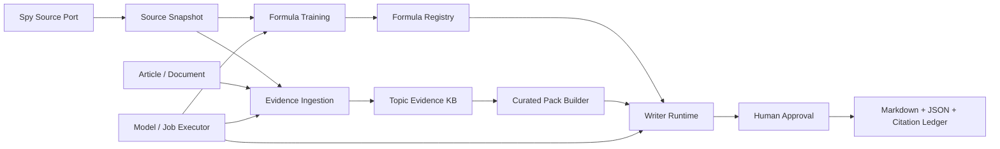

# Writer Domain Architecture v2: Formula Training + Writer Runtime

> **Ngày:** 2026-08-09  
> **Trạng thái:** Draft — chờ xác nhận ADR ở mục 17  
> **Phạm vi:** Chỉ mô tả domain Writer Room, gồm Formula Training, Topic Evidence KB và Writer Runtime  
> **Tách từ:** `copy-dna-spy-agent-terminal-architecture-v2.md`  
> **Không thay thế:** tài liệu port Agent / Terminal / MCP; domain chỉ phụ thuộc các contract thực thi trừu tượng ở mục 4

---

## 0. Tóm tắt một dòng

```text
Transcript của kênh
  → học và kiểm chứng Formula "viết như thế nào"
  → publish Formula Package bất biến

Nguồn theo chủ đề
  → Topic Evidence KB + Curated Pack "có gì đáng nói"
  → Thesis + Story Brief "bài muốn chứng minh điều gì"
  → Architecture + Draft + Evidence + Review
  → Human Approve + Export
```

Hai lane chỉ gặp nhau tại **Formula Package đã publish**. Training không quyết định nội dung của một bài cụ thể; Writer không được tự sửa Formula đang dùng.

---

## 1. Mục tiêu và phạm vi

### 1.1 Mục tiêu

1. Học được các quy tắc phong cách có khả năng chuyển sang chủ đề mới, thay vì chép wording hoặc topic của video nguồn.
2. Tạo script có luận điểm rõ, không ghép cơ học nhiều transcript.
3. Mọi factual claim trong bản được duyệt đều truy ngược được tới bằng chứng cụ thể.
4. Mọi workflow dài đều có checkpoint, retry cap, cost cap và khả năng resume.
5. Đo được Formula, Thesis và Topic Evidence có thực sự làm nội dung tốt hơn hay không.

### 1.2 Trong phạm vi

- Formula Training offline cho một style/channel/language.
- Formula versioning, validation, human gate và publish.
- Topic Evidence KB theo claim-level.
- Curated Pack cho từng Writer project.
- Thesis, Story Brief, Story Architecture, Draft, Review, Repair, Approval và Export.
- Model tiering, job contract, artifact contract, resume và observability ở cấp domain.

### 1.3 Ngoài phạm vi

- Rust PTY, terminal pane, turn bridge và Team MCP implementation.
- Storyboard, image, TTS, render và video assembly.
- Multi-user, RBAC và remote collaboration.
- Tự động publish video lên nền tảng bên ngoài.
- Fine-tune model hoặc training model weight.
- Vector search trong MVP nếu FTS/hybrid filtering chưa trở thành bottleneck đo được.

---

## 2. Các invariant xuyên hệ thống

| ID | Invariant | Cách enforce |
| --- | --- | --- |
| D1 | **Đề xuất tách khỏi xác nhận.** Thành phần sinh rule không tự quyết định rule có giá trị | Dev evaluation + final frozen holdout + human blind gate |
| D2 | **Không loop không trần** | FSM constant, attempt cap, token/cost/time budget |
| D3 | **Research, Thesis và Formula là ba lớp khác nhau** | Input projector và artifact schema riêng |
| D4 | **Formula không chứa topic knowledge** | Entity/ngram/semantic leak scan + human audit |
| D5 | **Writer không thấy raw corpus đầy đủ** | Chỉ cấp Story Brief, Curated Pack, exact Formula Package và target constraints |
| D6 | **Citation không chỉ là marker** | Structural binding + semantic entailment/number check |
| D7 | **Published Formula bất biến** | Content hash, version manifest, không overwrite |
| D8 | **Project pin exact Formula version** | `formula_version_id` nằm trong immutable run manifest |
| D9 | **State sáng tạo do artifact quyết định** | Inspect artifact + hash; không tin trạng thái RAM hoặc lời model báo xong |
| D10 | **Human là người approve cuối** | Approval artifact app-owned, bind đúng draft/evidence/formula hashes |

---

## 3. Kiến trúc domain



### 3.1 Component ownership

| Component | Sở hữu | Không được làm |
| --- | --- | --- |
| Formula Training | dataset split, facet/rule candidates, evaluation | Không publish trực tiếp, không ghi Writer project |
| Formula Registry | immutable version, lifecycle, manifest | Không synthesize hoặc sửa rule |
| Topic Evidence KB | source, claim, evidence, verification | Không chứa writing rule |
| Curated Pack Builder | snapshot claim phù hợp với project | Không tạo thesis hoặc prose |
| Writer Runtime | thesis, brief, architecture, draft, repair | Không ghi Formula hoặc KB |
| Approval/Export | human approval, citation ledger, render output | Không sửa draft âm thầm |
| Model/Job Executor | chạy bounded task và trả result envelope | Không tự advance domain FSM |

---

## 4. Contract với hạ tầng thực thi

Domain không phụ thuộc task chạy qua terminal agent hay gọi provider API. Mọi task dùng hai contract sau.

### 4.1 ModelTask

```ts
interface ModelTask {
  taskId: string;
  runId: string;
  runEpoch: number;
  kind: string;
  role: string;
  inputManifest: ArtifactRef[];
  promptVersion: string;
  outputSchemaVersion: string;
  modelPolicy: {
    tier: 'strong' | 'mid' | 'cheap';
    familyConstraint?: string;
    freshContext: boolean;
  };
  budget: {
    maxAttempts: number;
    timeoutMs: number;
    maxInputTokens?: number;
    maxOutputTokens?: number;
    maxCostUsd?: number;
  };
}
```

### 4.2 TaskResult

```ts
interface TaskResult {
  taskId: string;
  runId: string;
  runEpoch: number;
  status: 'succeeded' | 'failed' | 'cancelled' | 'stale';
  outputArtifacts: ArtifactRef[];
  provider?: string;
  model?: string;
  providerRequestId?: string;
  usage?: { inputTokens: number; outputTokens: number; costUsd?: number };
  startedAt: string;
  completedAt: string;
  error?: { code: string; message: string; retryable: boolean };
}
```

Domain chỉ commit result khi `runEpoch` và input hashes vẫn là current. Response về muộn sau Stop/Retry bị đánh dấu `stale`, không được ghi artifact head hoặc advance FSM.

---

## 5. Target layout

```text
shared/
  src/
    writer-contracts.ts
    formula-contracts.ts
    evidence-contracts.ts
    writer-authoring-resume.ts
    formula-training-resume.ts

packages/daemon/src/
  platform/
    jobs/                         # generic bounded jobs + fencing
    models/                       # ModelTask executor / provider adapters
    artifacts/                    # immutable artifacts + manifests
  formula/
    formula-loop.ts
    formula-store.ts
    fingerprint.ts
    facet-config.ts
    evaluate.ts
    registry.ts
  evidence/
    source-port.ts
    source-projector.ts
    store.ts
    ingest.ts
    verify.ts
    retrieve.ts
    pack.ts
    citation.ts
  writer/
    writer-loop.ts
    writer-workspace.ts
    thesis.ts
    review.ts
    approval.ts
    export.ts

packages/web/src/pages/
  FormulaRun.tsx
  FormulaRegistry.tsx
  WriterRun.tsx
  WriterReview.tsx
```

`shared/` phải được thêm vào workspace/typecheck hoặc chuyển thành `packages/contracts/`; không để contract nằm ngoài build graph.

---

## 6. Artifact và version contract

Mọi artifact có envelope chung:

```ts
interface ArtifactRef {
  id: string;
  kind: string;
  schemaVersion: string;
  contentHash: string;
  relativePath: string;
  createdAt: string;
  createdBy: 'app' | 'human' | 'model' | 'job';
  inputHashes: string[];
}
```

Quy tắc:

1. Artifact đã commit không bị overwrite; regenerate tạo version mới.
2. Artifact head chỉ là pointer tới version current.
3. Upstream hash đổi làm descendant thành stale nhưng không xóa bản cũ.
4. Mỗi model execution lưu input artifact hashes, prompt version, model/config và usage.
5. App-owned artifact gồm validation report, evaluation aggregate, Formula manifest, approval và export manifest.
6. Human artifact phải bind đúng `subjectHash`, actor, timestamp và decision.

---

## 7. Lane A — Formula Training

### 7.1 Dataset và split

Input tối thiểu đề xuất:

- Tổng 8–12 transcript sạch để tạo Formula candidate.
- Tách ba nhóm, không chỉ train/validation:
  - **Train:** sinh facet/rule candidates.
  - **Dev:** chọn, loại hoặc sửa rule.
  - **Final frozen holdout:** chỉ dùng một lần để quyết định publish.
- Cùng series, near-duplicate hoặc cùng script template phải nằm cùng một split.
- Final holdout có ít nhất hai topic cluster khác train khi dữ liệu cho phép.
- Mọi transcript pin content hash, quality flags và normalization version.

Nếu compiler đọc kết quả final holdout rồi sửa Formula, candidate đã qua tuning và phải dùng final holdout mới; không được gọi lại cùng tập là release proof.

### 7.2 Fingerprint

Fingerprint là thống kê mô tả style, không phải phiếu chất lượng độc lập.

Ví dụ feature:

- hook length và thời điểm promise;
- sentence-length distribution;
- question/direct-address density;
- POV/pronoun distribution;
- paragraph/transition rhythm;
- close/CTA shape;
- evidence density và vị trí evidence.

Mỗi feature phải ghi:

- tokenizer/language pipeline;
- transcript quality và missingness;
- normalization theo content mode/độ dài khi phù hợp;
- distribution/interval, không chỉ một target point.

Fingerprint chỉ được dùng làm non-regression target sau khi đạt test-retest và discriminant benchmark ở mục 15.

### 7.3 Formula FSM

```text
DATASET_FROZEN
  → FP_READY
  → FACETS_EXTRACTED
  → RULES_SYNTHESIZED
  → RULES_SANITIZED
  → DEV_VALIDATED
  → FORMULA_COMPILED
  → HUMAN_REVIEWED
  → FINAL_TESTED
  → PUBLISHED | SHELVED
```

| Stage | Owner | Output | Stop condition |
| --- | --- | --- | --- |
| DATASET_FROZEN | app/human | `dataset-manifest.json` | Split hợp lệ và hashes đã pin |
| FP_READY | app code | `style-fingerprint.json` | Một deterministic pass |
| FACETS_EXTRACTED | bounded jobs | `facet-cards/*` | Một task/facet/video; lỗi lưu tombstone |
| RULES_SYNTHESIZED | strong model | `rule-candidates.json` | Một task/facet, max rule/facet cố định |
| RULES_SANITIZED | app + utility | `sanitized-rules.json` | Schema, dedupe, entity/topic reject |
| DEV_VALIDATED | blind evaluation | `dev-evaluation.json` | Mỗi bundle/rule policy test đúng số repeat |
| FORMULA_COMPILED | strong model | Formula candidate | Một compile + tối đa một schema repair |
| HUMAN_REVIEWED | human | `human-review.json` | Accept/reject bind candidate hash |
| FINAL_TESTED | blind evaluation | `final-scorecard.json` | Final set không được dùng để tune |
| PUBLISHED | app | immutable Formula Package | Tất cả release gate pass |
| SHELVED | app | postmortem | Terminal state, không auto-tune |

### 7.4 Facet candidates

Sáu facet khởi điểm:

1. Hook.
2. Structure.
3. Evidence use.
4. Transition.
5. Voice.
6. Close/CTA.

Đây là config versioned, không phải ontology vĩnh viễn. Existing Spy hook/voice/structure analysis phải được tái sử dụng khi contract/evidence phù hợp để tránh gọi model lại không cần thiết.

Rule candidate cần có:

```ts
interface RuleCandidate {
  id: string;
  facet: string;
  instruction: string;
  appliesWhen: string[];
  avoidWhen: string[];
  supportingVideoIds: string[];
  evidenceRefs: EvidenceRef[];
  confidence: number;
}
```

Không promote từng rule từ kết quả A/B của cả bundle. Chọn một trong hai policy:

- publish/rollback bundle;
- hoặc rule-level/leave-one-out evaluation có attribution rõ.

### 7.5 Formula Package

```text
formulas/{styleProfileId}/{version}/
  formula.md
  avoid.md
  exemplars.md
  fingerprint-targets.json
  manifest.json
  scorecard.json
  leak-report.json
```

`manifest.json` chứa:

- formula ID/version;
- style profile/language/recommended modes;
- rule IDs và priority;
- content hashes của mọi file;
- dataset/prompt/evaluator policy versions;
- model execution refs;
- human approval ref;
- published timestamp.

Giới hạn đề xuất: tối đa **1.200 tokens và 20 active rules**, thay vì hard 4KB byte limit. Exemplar phải synthetic/abstract hoặc có quyền sử dụng phù hợp; không đưa raw topic wording vào runtime package.

---

## 8. Lane B — Topic Evidence KB

### 8.1 Source Snapshot contract

Writer/Training không parse Markdown Source Pack để lấy provenance. `SpySourcePort` phải trả snapshot cấu trúc:

```ts
interface SourceSnapshot {
  id: string;
  kind: 'youtube' | 'article' | 'document';
  canonicalUrl?: string;
  publisher?: string;
  title: string;
  publishedAt?: string;
  retrievedAt: string;
  contentHash: string;
  qualityFlags: string[];
  segments: Array<{
    id: string;
    startSec?: number;
    endSec?: number;
    anchor?: string;
    text: string;
    contentHash: string;
  }>;
}
```

Nguồn là untrusted data. `source-projector.ts` đóng gói text vào schema/delimiter bất biến và loại khả năng source trở thành instruction.

### 8.2 Storage đề xuất

MVP local-first dùng SQLite riêng cho Writer domain, không ghi vào `spy.sqlite`. FTS5/BM25 là retrieval mặc định; chỉ thêm vector index khi benchmark chứng minh keyword/hybrid retrieval không đủ.

Schema logic:

```sql
sources(
  id, kind, canonical_url, publisher, title,
  published_at, retrieved_at, content_hash, authority_tier,
  independence_cluster_id, quality_flags_json
)

source_segments(
  id, source_id, locator, text, content_hash
)

claims(
  id, niche_id, canonical_hash, text, type,
  confidence, status, valid_from, valid_to,
  created_at, updated_at
)

claim_evidence(
  claim_id, segment_id, relation,
  entailment_score, extractor_execution_id
)

claim_conflicts(
  claim_id, conflicting_claim_id, reason, status
)

verifications(
  id, claim_id, method, verdict,
  source_independence_count, checked_at, execution_id
)
```

Claim status:

- `UNVERIFIED`
- `SINGLE_SOURCE`
- `CORROBORATED`
- `AUTHORITATIVE`
- `DISPUTED`
- `REJECTED`
- `STALE`

Hai URL không mặc nhiên là hai nguồn độc lập. Corroboration phải dùng `independence_cluster_id`; factual claim rủi ro cao cần nguồn authoritative trước approval.

### 8.3 Ingestion

```text
Source Snapshot
  → segment validation
  → atomic claim extraction
  → exact quote/locator binding
  → canonicalization/dedupe candidates
  → contradiction detection
  → verification queue
```

Vector similarity, nếu có, chỉ tạo merge candidate; không tự merge claim hoặc tự đánh dấu verified.

### 8.4 Curated Pack

Curated Pack là immutable snapshot theo Writer run:

```ts
interface CuratedPack {
  id: string;
  projectId: string;
  nicheId: string;
  query: string;
  kbSnapshotVersion: string;
  retrievalConfigHash: string;
  claims: PackClaim[];
  conflicts: ClaimConflict[];
  gaps: string[];
  createdAt: string;
  contentHash: string;
}
```

Pack ưu tiên `AUTHORITATIVE > CORROBORATED > SINGLE_SOURCE`, nhưng không được tự loại conflict để tạo narrative sạch giả tạo.

Abort với `BLOCKED_SOURCES_WEAK` khi:

- thiếu claim đáp ứng policy tối thiểu;
- không có evidence locator;
- must-use claim đang disputed/rejected/stale;
- nguồn quá đồng nhất theo independence cluster;
- pack không đủ để tạo luận điểm có support/counterpoint.

---

## 9. Writer Runtime

### 9.1 Input project

Một Writer project pin:

- title;
- audience;
- language;
- content mode;
- target length;
- exact Formula version/hash;
- Curated Pack ID/hash;
- prompt/evaluator policy versions.

Không dùng `latest Formula` trong active run.

### 9.2 Artifact graph

```text
Project Manifest
  → Curated Pack
  → Thesis Candidates
  → Selected Thesis + Story Brief
  → Story Architecture
  → Draft
  → Structural Citation Report
  → Semantic Evidence Report
  → Critic Review #1
  → Repair (nếu cần)
  → các gate chạy lại + Critic Review #2
  → PUBLISH_READY | REVIEW_BUDGET_EXHAUSTED
  → Human Approval
  → Export
```

### 9.3 Checkpoint và owner

| Checkpoint | Artifact | Owner |
| --- | --- | --- |
| Project prepared | `project-manifest.json` | app |
| Curated Pack | `curated-pack.json` | app job |
| Thesis candidates | `thesis-candidates.json` | editorial role |
| Story Brief | `story-brief.json` | editorial role/human selection |
| Architecture | `architecture-vNNN.json` | author role |
| Draft | `draft-vNNN.md` | author role |
| Citation report | `citation-report-vNNN.json` | app code |
| Evidence report | `evidence-report-vNNN.json` | evidence job + app aggregate |
| Critic review | `review-vNNN.json` | critic role |
| Approval | `approval.json` | human/app |
| Export manifest | `export-manifest.json` | app |

### 9.4 Thesis và Brief

Thesis candidates có 3–5 lựa chọn, mỗi lựa chọn gồm:

- một câu tranh luận được;
- supporting claim IDs;
- counterpoint/conflict IDs;
- novelty/source-independence note;
- risk và rejected reason.

Story Brief gồm:

- selected thesis;
- belief before/after;
- tension;
- audience promise;
- must-use/allowed claim IDs;
- counterpoint handling;
- avoid angles;
- target mode/length.

`must_use_claim_ids` chỉ được chứa claim đáp ứng verification policy hoặc disputed claim đã được brief yêu cầu trình bày rõ là tranh chấp.

### 9.5 Story Architecture

Mỗi section định nghĩa:

```text
question → reveal → evidence IDs → counterpoint → transition → target words
```

Architecture không được tạo claim mới. Nếu evidence thiếu, nó ghi gap và block/return research, không bù bằng suy đoán.

### 9.6 Citation và evidence gate

Draft dùng binding dạng `[c:CLAIM_ID]` trong bản làm việc. Export có thể loại marker khỏi prose nhưng phải giữ Citation Ledger tương ứng.

Structural gate kiểm tra deterministic:

- marker syntax;
- claim ID thuộc Curated Pack;
- locator/quote tồn tại;
- number/date/entity binding;
- không dùng rejected/stale claim;
- mỗi factual span đã được bind.

Semantic gate kiểm tra:

- sentence được claim/evidence entail;
- qualifier và phạm vi không bị làm mạnh hơn;
- number/date không bị biến đổi;
- single-source attribution/hedge;
- conflict được trình bày đúng trạng thái.

Numeric, causal, safety-sensitive và judge-disagreement case phải escalation sang model mạnh hoặc human.

### 9.7 Review budget không mơ hồ

Mỗi automatic run có tối đa:

- 2 critic review calls;
- 1 author repair call;
- mỗi deterministic/semantic gate chạy lại sau repair;
- schema repair tối đa 1 lần cho từng model output.

Luồng:

```text
Draft gates pass
  → Review #1
  → PASS: PUBLISH_READY
  → FAIL: Repair #1
      → rerun citation/evidence gates
      → Review #2
          → PASS: PUBLISH_READY
          → FAIL: WRITER_REVIEW_BUDGET_EXHAUSTED
```

Human Retry tạo `runEpoch` mới và explicit budget mới; không tiếp tục âm thầm trong cùng run.

### 9.8 Stale/invalidation

```text
Source/claim change
  → Curated Pack và toàn bộ descendants stale

Thesis selection change
  → Brief, Architecture, Draft, Review, Approval stale

Formula version change
  → Architecture, Draft, Review, Approval stale

Draft repair
  → Citation, Evidence, Review, Approval stale
```

Stale artifact vẫn đọc được để audit nhưng không thể approve/export như current.

---

## 10. Model tiering và quality routing

| Task | Default tier | Escalation |
| --- | --- | --- |
| Thesis, Brief, Architecture, Draft, Repair | Strong | Fail schema/quality → bounded fresh attempt |
| Critic review | Strong hoặc mid khác family | Judge disagreement → human |
| Facet extraction | Cheap | Low confidence/schema fail → drop hoặc strong sample audit |
| Rule synthesis/Formula compile | Strong | Một schema repair |
| Claim extraction | Cheap-first | Numeric/causal/complex → strong |
| Claim verification | Mid/strong | Disputed/high-risk → human/authoritative source |
| Pairwise judge | Khác family với generator | Periodic human calibration |
| Fingerprint/schema/hash/structural citation | Code | Không dùng LLM |

Model rẻ không được là người ký duy nhất ở factuality gate hoặc Formula release gate.

---

## 11. Resume, idempotency và concurrency

### 11.1 Stage ledger

Mỗi stage item có semantic key:

```text
(runId, runEpoch, stage, inputHash, promptVersion, modelVersion, itemKey)
```

Status:

- `pending`
- `running`
- `succeeded`
- `failed`
- `dropped`
- `cancelled`
- `stale`

Không resume bằng cách chỉ đếm số dòng JSONL. JSONL là export; stage ledger/atomic files mới quyết định item đã hoàn thành hay chưa.

### 11.2 Commit rule

1. Worker/model không tự advance FSM.
2. App validate result schema và input hashes.
3. App commit chỉ khi fencing token/runEpoch còn current.
4. Stop tăng epoch hoặc revoke token; late result bị stale.
5. Retry giữ immutable artifact cũ, tạo attempt/run epoch mới.

### 11.3 Budget

Mọi run có:

- max stage attempts;
- max concurrent calls;
- max wall-clock;
- max input/output tokens;
- max variable cost;
- abort signal propagation;
- no auto-retry đối với schema/business failure không retryable.

---

## 12. Security và trust boundary

1. Transcript, article, document và claim quote luôn là untrusted data.
2. Source projector tách instruction khỏi data bằng typed envelope và delimiter bất biến.
3. Model task chỉ nhận file/artifact allowlist; output path được app kiểm tra.
4. Không ghi provider secret, raw auth config hoặc full sensitive source vào log.
5. Render Markdown/HTML phải escape stored content.
6. SQL luôn parameterized.
7. App-owned gate/approval không nằm trong vùng agent được phép ghi.
8. Formula exemplar phải qua rights/retention policy và leak scan.
9. Mọi export ghi provenance manifest; xóa/archive source phải tuân theo retention policy.

---

## 13. API domain tối thiểu

```text
POST /api/formula-runs
GET  /api/formula-runs/{id}
POST /api/formula-runs/{id}/actions/start|stop|retry
POST /api/formula-runs/{id}/actions/human-review
POST /api/formula-runs/{id}/actions/publish

GET  /api/formulas
GET  /api/formulas/{versionId}

POST /api/evidence/sources/import
GET  /api/evidence/claims
POST /api/evidence/packs
GET  /api/evidence/packs/{id}

POST /api/writer-projects
GET  /api/writer-projects/{id}
POST /api/writer-projects/{id}/actions/start|stop|retry
POST /api/writer-projects/{id}/actions/select-thesis
POST /api/writer-projects/{id}/actions/approve
POST /api/writer-projects/{id}/actions/export
```

Yêu cầu chung:

- Mutating command có idempotency key.
- Response dài trả operation ID, không giữ HTTP request trong model call.
- Error envelope có stable `code`, message đã sanitize, retryable và artifact/stage reference.
- Status trả current stage, current artifact heads, stale reasons, budget/usage và blocking decision.

---

## 14. Phased delivery — domain only

### D0 — Manual Value Gate

- Tạo Formula v0 thủ công từ source hiện có.
- Tạo Curated Pack có evidence locator cho một tập title holdout.
- Test riêng Formula effect và Thesis effect trước khi tự động hóa workflow lớn.
- Ghi editor time, model usage, factual support và pairwise rating.

**Gate:** đạt tiêu chí mục 15 mới đầu tư FormulaLoop tự động.

### D1 — Contracts và platform primitives

- Shared artifact/model/job/evidence contracts.
- SQLite migrations, immutable artifact store và stage ledger.
- Model executor có abort, usage, retry và cost budget.
- `SpySourceSnapshot` public contract.

### D2 — Evidence MVP + Writer Runtime

- Source import và claim extraction có exact locator.
- Curated Pack theo title, chưa cần vector.
- Thesis → Brief → Architecture → Draft.
- Structural + semantic evidence gates.
- Hai review calls/một repair call.
- Human approval + Markdown/JSON/Citation Ledger export.

### D3 — Writer Value Gate

- Blind test 20–30 title.
- Chốt Formula, Thesis và Evidence contribution riêng.
- Chỉ tiếp tục automation nào chứng minh có gain hoặc giảm editor effort.

### D4 — Persistent Topic Evidence KB

- Cross-project claim reuse.
- Source independence, contradiction, freshness, background verification.
- FTS/hybrid retrieval benchmark.
- Chỉ thêm sqlite-vec nếu benchmark chứng minh cần.

### D5 — FormulaLoop automation

- Dataset split/freeze UI.
- Facet jobs, rule synthesis/sanitize.
- Dev evaluation, compile, blind human review, final frozen holdout.
- Immutable Formula Registry.

### D6 — Scale và calibration

- Kênh thứ hai.
- Content-mode routing.
- Cost/latency/error calibration.
- Retention performance đối chiếu sau đủ số video, không dùng retention sớm làm causal proof cho Formula.

---

## 15. Quality gates đo được

### 15.1 Formula value gate

Với 20 title holdout độc lập, ba rater mù/title và majority vote ở cấp title:

- GO khi Formula thắng ít nhất 15/20 title.
- 11–14/20 là inconclusive; lấy thêm 10 title mới.
- GO cumulative khi đạt ít nhất 20/30 và không vi phạm guardrail.
- NO-GO khi ≤10/20 hoặc làm giảm quality guardrail.
- Channel-likeness tăng tối thiểu 0,5/5 trung bình.
- Publishability/factuality không giảm quá 0,2/5.
- Median editor active time giảm tối thiểu 20%.
- Severe unsupported claims không tăng.

Formula và Thesis phải được test riêng hoặc bằng factorial 2×2 với mọi biến còn lại được giữ cố định.

### 15.2 Citation/evidence gate

- Claim ID và exact locator tồn tại: 100%.
- Semantic support precision: ≥95% trên labeled audit set.
- Factual-claim coverage recall: ≥90%.
- Major unsupported numeric/causal claims: 0.
- False-positive factual flag: ≤5% trên tập tối thiểu 200 câu đã gán nhãn.

Nếu chưa đạt, citation checker chỉ là advisory/repair tool, không được gọi là anti-hallucination guarantee.

### 15.3 KB automation gate

Human audit tối thiểu 100 extracted claims, stratify theo claim type:

- Atomic extraction precision ≥95%.
- Exact quote/locator ≥98%.
- Quote-to-claim entailment ≥95%.
- Source-independence classification ≥90%.
- Contradiction recall ≥85%.

### 15.4 Fingerprint gate

- Test-retest reliability ≥0,8 trên feature đủ dữ liệu.
- Within-channel holdout gần hơn matched cross-channel ở ≥80% sample, hoặc channel-ID benchmark AUC ≥0,8 trên ít nhất ba kênh.
- Nếu không đạt, fingerprint chỉ dùng observability, không dùng làm release vote.

### 15.5 Operational gate

- Job failure cần manual retry <5%.
- Không duplicate committed artifact sau crash/retry.
- P95 wall-clock không quá 2× baseline đã chốt.
- Online variable cost/title không quá 1,5× baseline và không vượt absolute budget do Product Owner đặt.
- Báo cáo cost/title bao gồm amortized Formula Training và human minutes.

---

## 16. Test plan

| Layer | Tests |
| --- | --- |
| Formula FSM | Split invalid, tombstone card, dev fail, final fail, stale human review, shelved terminal state |
| Writer FSM | Weak pack block, stale Formula, review #1 fail → repair → review #2 pass/fail, human approval binding |
| Artifact | Immutable versions, input hash invalidation, stale descendants, late result fencing |
| Evidence | Marker, nonexistent ID, multi-claim sentence, number drift, qualifier strengthening, conflict/hedge |
| KB | Idempotent ingest, canonical candidate, source independence, contradiction, freshness |
| Security | Prompt injection fixture, path escape, stored XSS, secret redaction, unauthorized app-owned artifact write |
| Model executor | Abort, timeout, schema repair cap, usage/cost accounting, provider retry classification |
| Evaluation | Blind order randomization, tie, judge disagreement, frozen holdout cannot be reused after tuning |
| Export | Marker removal không mất Citation Ledger, exact Formula/draft/evidence hashes trong manifest |

---

## 17. Architecture decisions cần xác nhận

- [ ] **ADR-W1 — Domain source of truth:** local-first SQLite + immutable artifact files thay cho MySQL SDD 001.
  - Rationale: single-user, zero-ops, khớp daemon hiện tại.
  - Trade-off: phải có migration, backup, locking và explicit reconciliation giữa DB/artifact.
  - User confirmed: _Pending_

- [ ] **ADR-W2 — Execution abstraction:** domain phát `ModelTask`/`TaskResult`, không phụ thuộc persistent terminal hay direct API.
  - Rationale: giữ Writer design độc lập với Agent Harness.
  - Trade-off: platform phải cung cấp adapter và fencing chuẩn.
  - User confirmed: _Pending_

- [ ] **ADR-W3 — Retrieval MVP:** FTS5/BM25 trước; vector index chỉ thêm sau benchmark.
  - Rationale: giảm native packaging và embedding complexity khi dữ liệu còn nhỏ.
  - Trade-off: semantic recall có thể thấp hơn ở query diễn đạt lệch.
  - User confirmed: _Pending_

- [ ] **ADR-W4 — Human gates:** human review bắt buộc cho Formula publish và final Writer approval.
  - Rationale: quality metric và factuality automation chưa đủ trưởng thành.
  - Trade-off: giảm mức tự động hóa.
  - User confirmed: _Pending_

- [ ] **ADR-W5 — Review budget:** hai critic calls và một repair call cho mỗi automatic Writer run.
  - Rationale: FSM rõ ràng, bounded và có final critic verification.
  - Trade-off: issue còn lại sau review #2 cần human Retry.
  - User confirmed: _Pending_

- [ ] **ADR-W6 — Formula release proof:** train/dev/final frozen holdout, fingerprint là non-regression metric chứ không phải vote.
  - Rationale: tránh tuning leakage và Goodhart theo surface style.
  - Trade-off: cần nhiều title/human rating hơn.
  - User confirmed: _Pending_

---

## 18. Definition of Done

### Formula Training hoàn thành khi

1. Dataset/split được freeze bằng hashes.
2. Mọi task bounded và resume theo stage ledger.
3. Rule/bundle có evidence và evaluation attribution rõ.
4. Formula không chứa topic entity/claim/raw wording vượt leak policy.
5. Final frozen holdout chưa bị dùng để tune candidate.
6. Human blind review và measurable release gate pass.
7. Published Formula Package bất biến, có manifest/scorecard/leak report.

### Writer Runtime hoàn thành khi

1. Project pin exact Formula và Curated Pack hashes.
2. Thesis/Brief/Architecture/Draft có schema và stale rules.
3. Mọi approved factual claim có exact evidence locator và semantic support.
4. Review/repair không vượt budget và không có ambiguous transition.
5. Stop/Retry không nhận late result của epoch cũ.
6. `PUBLISH_READY` vẫn cần human approval.
7. Export Markdown/JSON/Citation Ledger bind đúng current artifact heads.
8. Cost, latency, edit time và quality metrics được ghi theo run/title.

---

## 19. Tài liệu tham chiếu

| Nguồn | Mức | Vai trò |
| --- | --- | --- |
| `copy-dna-spy-agent-terminal-architecture-v2.md` | CRITICAL | Nguồn domain FormulaLoop, Topic KB và WriterLoop ban đầu |
| `docs/specs/001-greenfield-training-writer-room/solution-design.md` | CRITICAL | Invariant về isolation, reproducibility, versioning, evidence và approval; storage/execution cần ADR supersede |
| `packages/spy/src/source-pack.ts` | HIGH | Cho thấy Source Pack hiện tại chưa giữ segment locator và có truncation |
| `packages/spy/src/schema.ts` | HIGH | Public evidence/transcript contracts hiện có để xây `SpySourceSnapshot` |
| Agent/Terminal/MCP architecture plan | MEDIUM | Một implementation khả dĩ của `ModelTask` executor; không phải domain dependency |

---

*Tài liệu này cố ý không mô tả pane, PTY, turn bridge hoặc Team MCP. Những thành phần đó có thể thực thi `ModelTask`, nhưng Formula Training và Writer Runtime phải giữ nguyên hành vi nếu executor được thay bằng API worker hoặc một cơ chế khác.*
