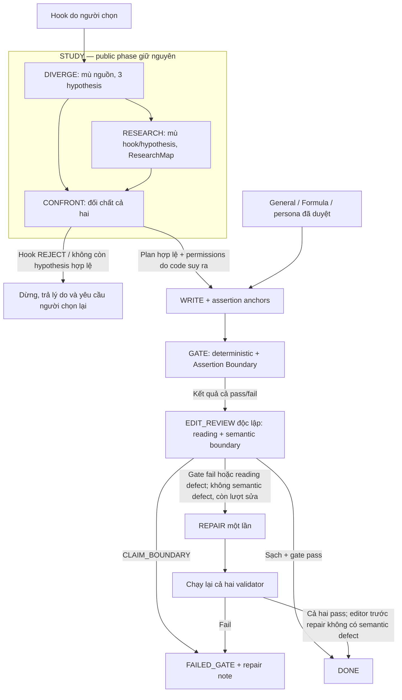

# Writer v2 — Đúng sự thật, có đường dây riêng, có người kể

> Bản chuẩn duy nhất · Hợp nhất ngày 2026-09-06 · Đối chiếu source tại `02b094c94d5e7394e3d39000923520214d9544e4`.
> Đây là tài liệu sản phẩm, trạng thái, triển khai và nghiệm thu; không nạp nguyên văn vào agent prompt.

**Bài viết ra khỏi pipeline phải đúng sự thật và đọc lên như một người thật đang nghĩ.**

Mọi cơ chế dưới đây phục vụ đồng thời hai vế này. Kiểm chứng phải giữ được quyền diễn đạt,
lập trường và nhịp suy nghĩ; biên tập không được dùng “chất người” để hợp thức hóa fact
hay tiểu sử bịa. Hoàn thành module, chạy test hoặc xuất bản được một video đều chưa đủ
để kết luận đã hoàn thành goal.

Đọc [luồng chính](#main-loop) trước. Sau đó [goal](#goal), [trạng thái thật](#status),
[luồng](#flows) và [việc tiếp theo](#delivery) để nắm tình hình. Tra [persona](#persona),
[nghiệm thu](#acceptance), [14 khoản nợ](#backlog) và [SDD 005 đầy đủ](#sdd-005)
khi cần thực hiện hoặc review.

<a id="main-loop"></a>

## 0. Luồng chính — chốt 2026-09-06

> Phần này quyết định việc làm tiếp. §1–§9 bên dưới là mô tả goal, hiện trạng đo được,
> sổ nợ và thiết kế đích; chúng là tham chiếu, **không phải điều kiện nghiệm thu** của luồng chính.
> Plan chi tiết từng việc: [writer-main-loop-plan.md](./writer-main-loop-plan.md).

Chủ kênh đọc bản hợp nhất và kết luận: luồng đang quá nhiều bước. Ưu tiên là một luồng
chạy ổn định trước; phần kiểm soát chi tiết chỉ nối khi một run thật cho thấy lỗi cụ thể.

### Luồng

```text
Người chọn hook
   │
   ▼
STUDY   (1 call)  nguồn → ledger quote nguyên văn + outline riêng
   │
   ▼
WRITE   (1 call)  outline + ledger + general pack + mode pack (+ persona đã duyệt nếu có) → script
   │
   ▼
CHECK   code: số / tên / tiền trong script phải có trong ledger
        editor (agent khác, context mới): đọc như người xem, chỉ câu bịa hoặc đoạn đọc dở
   │
   ├─ sạch ─────────────────────────────────► DONE
   ├─ lỗi nhỏ, chưa sửa lần nào ─────────► REPAIR 1 lần → CHECK lại
   └─ lỗi bịa / ngữ nghĩa, hoặc đã sửa vẫn lỗi ─► DỪNG, trả note cho người
```

Đây chính là luồng legacy đang chạy trong daemon (`STUDY → WRITE → GATE → EDIT_REVIEW → REPAIR`).
Người vận hành có ba việc: chọn hook, chờ, đọc script. DONE thì dùng; dừng thì đọc note,
chọn lại hook hoặc sửa tay.

### Bốn việc để luồng chính ổn định

| # | Việc | Trạng thái 2026-09-06 |
|---|---|---|
| 1 | Baseline test xanh, lặp lại được | **Đạt**: `bun test packages/daemon/test/writer/` 222 pass / 0 fail, chạy 2 lần tại `02b094c` |
| 2 | Tắt retry ẩn ở EDIT_REVIEW và REPAIR; một lượt E2E legacy dùng 5 hoặc 6 call khi tính cả clarify/suggest | **Đạt** `aa0379e`: `maxContentRetries: 0` ở cả 4 dispatch (STUDY, WRITE, EDIT_REVIEW, REPAIR) |
| 3 | Một run sạch + một run cố tình bịa qua hook board, đọc bằng mắt | Run sạch (T3) **DONE**: `798eeb53` baseline trước 006. Run cố tình bịa (T4): chưa làm |
| 4 | Persona: chạy không persona; bật khi chủ kênh duyệt vài stance | Đang đúng như vậy (0/16 duyệt → filter trả null) |

### T8 — SDD 006 đã land

Formula bị bỏ khỏi Writer v2; outline thêm khuôn, mode và phép lật cho từng beat; mode pack có
quote thật thay Formula. Xem `docs/specs/006-writer-beat-grammar/solution-design.md` và
`docs/plans/writer-beat-grammar-plan.md`. Vẫn trong luồng chính, không thêm call.

| Commit | Việc |
|---|---|
| `aa0379e` | Tắt retry ẩn ở EDIT_REVIEW và REPAIR (T1, xem trên) |
| `a64db7c` | Schema outline: thêm `mode`/`turn`/`frame`, luật validator, prompt STUDY (Lane B) |
| `e3f3d0d` | Mode pack v1 có quote thật, 15 heading (Lane A) |
| `04916e6` | Bỏ Formula khỏi Writer v2, mode pack staged vào WRITE/REPAIR, prompt WRITE/EDIT/REPAIR mới, UI bỏ select Formula (Lane C) |

Điều đổi ở luồng:
- Formula không còn là input của STUDY/WRITE/REPAIR.
- Outline (`WriterVideoPlan`) có `frame` (khuôn cho cả bài) và mỗi beat có `mode`/`turn`.
- Mode pack (`writer/mode-pack.md`) staged vào WRITE và REPAIR, cạnh General Pack.
- Editor có checklist 13–15: câu mở có phải câu chủ đề, beat có đúng mode đã khai, hai beat liền có cùng nhịp không.

### Bãi đỗ — hoãn, giữ code, không nối

Chỉ nối khi run thật ở việc 3 cho thấy lỗi tương ứng. Mỗi dòng ghi rõ tín hiệu mở khoá.

| Hạng mục | Code hiện có | Mở khoá khi |
|---|---|---|
| STUDY tách 3 call DIVERGE / RESEARCH / CONFRONT | `story-planning.ts`, `research-map.ts`, prompt D/R/C | Đọc run thật thấy outline vẫn copy dáng nguồn dù đã sửa prompt STUDY |
| Assertion Boundary, 5 loại phát ngôn, anchor, combined gate, typed editor routing (TODO-13, 14) | `assertion-boundary.ts`, `writer-hard-gate.ts` | Gate hiện tại bỏ lọt một câu bịa cụ thể, có quote |
| Path jail, hash persona bất biến xuyên run, checkpoint/resume sub-stage, counter actual call | Chưa có | Cùng lúc với 3 call |
| UI: màn duyệt persona, ma sát hook board, vị trí script (TODO-7, 8, 9) | Chưa có | Dùng đủ nhiều để thấy đau |
| Tách validator khỏi `writer-run-v2.ts` (TODO-10) | Chưa có | Khi không lane nào đang sửa file này |
| TODO-6 force-add check | Chưa có | Giữ làm thói quen `git add -f`; xem memory |

Quyết định "ba sub-call, không hạ xuống hai call" ở §1 vẫn là đích thiết kế, nhưng **không còn
trên đường bắt buộc** của luồng chính.

### Cắt — không làm, bỏ khỏi kế hoạch

TODO-1 (D/R song song), TODO-2 (origin group thật), TODO-3 (eviction cache RESEARCH),
TODO-12 (model khác cho từng sub-call): tối ưu cho một luồng chưa tồn tại.
TODO-4 (đo recall ngữ nghĩa), TODO-5 (persona semantic match), blind eval 10 cặp human-moves:
thay bằng chủ kênh đọc bài. Code trong repo giữ nguyên, không nối, không xoá trong đợt này;
xoá là quyết định riêng.

<a id="goal"></a>

## 1. Goal và ranh giới thành công

| ID | Mục tiêu | Kết quả người đọc nhận được | Cơ chế phục vụ | Trạng thái hiện tại |
|---|---|---|---|---|
| G1 | Đúng sự thật | Không bịa số, tên riêng, nguồn, phép tính hay nhân vật có tiểu sử; giữ caveat và phân biệt fact với ý kiến | Facts ledger, gate tất định, Claim Boundary, editor độc lập | Có nền tảng legacy đang chạy; **chưa đủ bằng chứng đạt G1 đầy đủ**, Claim Boundary chưa nối |
| G2 | Không mang hình dạng của nguồn | Bài có đường dây tư duy riêng; nguồn được quyền làm đổi hoặc bác bỏ ý/hook | STUDY: DIVERGE → RESEARCH → CONFRONT; permissions từ evidence được chọn | Contract có; **chưa chạy trong runtime** |
| G3 | Đọc như người thật | Người kể nhất quán, có lựa chọn cá nhân, biết nghi ngờ và đổi ý; prose có tiến triển và payoff | Persona pack đã duyệt, craft từ General/Mode/Human pack, editor đọc như người xem | Wiring persona có; **0/16 entry APPROVED**, chưa có nghiệm thu chất người trong pipeline |

“Đúng sự thật” là đích sản phẩm. Bảo đảm kỹ thuật trong phạm vi này là không vượt quá
bằng chứng được cấp, không làm sai số/tên/ý nghĩa, không mượn đời người trong source,
và thể hiện tranh chấp/giới hạn của nguồn. Topic Pack có thể sai: `ATTESTED` không đồng
nghĩa “đã kiểm chứng ngoài đời”; nhiều video lặp lại không tạo ra nguồn độc lập.
Thông tin không đủ chứng cứ phải bỏ, thu hẹp hoặc nêu giới hạn. Không hạ chuẩn G1 để tăng G3.

Chủ kênh cho biết luồng cũ đã đưa script tới video publish. Đó là mốc vận hành,
không phải bằng chứng mọi claim đều đúng hay luồng SDD 005 đã chạy.
G2 cũng cần người đọc đánh giá: ba call mù nhau là cơ chế chống lệ thuộc nguồn,
không tự bảo đảm bài có tư duy độc lập.

### Những quyết định giữ nguyên

- Public phase vẫn `STUDY → WRITE → GATE → EDIT_REVIEW → REPAIR`; D/R/C là nội bộ STUDY.
- Ba sub-call có kế hoạch, chạy tuần tự theo CON-23; không hạ xuống MVP hai call.
  **2026-09-06:** vẫn là đích thiết kế, nhưng hoãn theo [§0](#main-loop); luồng chính chạy STUDY một call.
- Tối đa **6 lần model thực sự bắt đầu sau chọn hook, kể cả retry**: 5 nếu không repair,
  6 nếu có một repair. Không có quỹ “6 + 2” cho thêm hai model call.
- Không thêm live search, browser, API ngoài, database hay nguồn mới vào runtime của đợt này.
- Craft/persona prose vào WRITE sau khi plan qua CONFRONT; CONFRONT chỉ có thể nhận
  allowlist ID experience đã duyệt, không nhận nội dung persona.
- Quan điểm là quyền phát biểu có ranh giới; persona là kho phát biểu của kênh.
  “Theo tôi” không tắt factual detector. Không tự duyệt persona.

<a id="status"></a>

## 2. Trạng thái thật và bằng chứng

**Kết luận: `CONDITIONAL PASS` ở thiết kế/contract; chưa đạt `runtime PASS`;
goal G1–G3 chưa nghiệm thu. Bộ test writer đã xanh lại ngày 2026-09-06 (xem bảng số liệu).**

| Hạng mục | Bằng chứng đối chiếu ngày 2026-09-06 | Ý nghĩa |
|---|---|---|
| STUDY thực tế | `study-orchestrator.ts` export `dispatchLegacyStudy`, stage `study-v2` | Vẫn một call đọc nguồn và dựng outline |
| Story planning | `story-planning.ts`: 1653 dòng, **0 file src import module này** | DIVERGE/CONFRONT có prompt, schema, validator và test; chưa được điều phối |
| Gate thực tế | `runGateForRun` chỉ gọi `runDeterministicGate` | Một validator đang chạy |
| Gate kết hợp | `writer-hard-gate.ts`: 231 dòng, **0 file src import module này** | Combiner và typed editor routing chưa chạy |
| Assertion Boundary | `persona-pack.ts` import bộ lọc; runtime không gọi `validateAssertionBoundary` | Lọc persona hoạt động; anchor/5 loại assertion chưa được bảo vệ trong luồng thật |
| Editor | `buildEditReviewPrompt` trả `{quote, severity, note}`, chưa có Claim Boundary/index | Có kiểm reading experience và yêu cầu tính lại số; chưa có semantic boundary có kiểu |
| Persona | `parsePersonaRegistry`: 16 PENDING, 0 APPROVED, 0 vi phạm parser; filter trả `null` | Persona bị skip toàn phần đúng fail-closed |
| Cô lập stage | Scheduler có thư mục riêng theo stage và `overrideCwd` | Chưa phải path jail: Read/Glob có thể chạm stage khác |
| Retry | Cả STUDY/WRITE/EDIT_REVIEW/REPAIR đặt `maxContentRetries: 0` tại `aa0379e` | Không còn content retry ẩn trong bốn dispatch; vẫn chưa có counter bền vững đếm mọi model launch xuyên resume |
| Hash persona | Gate đọc lại persona; code chấp nhận thay đổi giữa run | Chưa đáp ứng pin bất biến xuyên run theo CON-21 |
| Formula | Đã bỏ khỏi Writer v2 (`04916e6`); 3 field (`formulaId/Version/Hash`) giữ trong store để đọc run cũ, ghi rỗng cho run mới | Không còn là input của STUDY/WRITE/REPAIR; Training Lab và route `/api/training/formula*` không đổi |
| Mode pack | `writer/mode-pack.md` v1, 15 heading, staged vào WRITE và REPAIR | Fail-closed (`WRITER_V2_INPUT_MISSING`) khi thiếu file hoặc thiếu heading |

Các đường dẫn source đều dưới `packages/daemon/src/`. Scheduler thật nằm ở
`pipeline/lane-scheduler.ts`, không phải `team/lane-scheduler.ts` như SDD cũ ghi.

### Số liệu — chỉ cập nhật tại đây

| Phạm vi/mốc đo | Kết quả | Giới hạn bằng chứng |
|---|---|---|
| Writer test + daemon test + typecheck + ui:build, source `04916e6` (sau SDD 006 lane A/B/C) | Writer: **257 pass / 0 fail / 1272 expect calls**, 15 file. Daemon toàn bộ: **434 pass / 0 fail / 2102 expect calls**, 39 file. `bun run typecheck` sạch. `bun run ui:build` sạch | Đo lại trực tiếp lúc soạn tài liệu này; không phải số suy đoán từ commit message |
| Run `798eeb53` (baseline trước 006, qua hook board) | **21 phút 10 giây** từ dispatch STUDY tới artifact REPAIR cuối (19:29:20→19:50:30 giờ địa phương UTC+7); 4 dispatch cho 4 stage (STUDY, WRITE, EDIT_REVIEW, REPAIR); gate lần 1 bắt `NUMBER_UNSOURCED` trên số `"26%"` không có nguồn; editor 5 defect (1 HIGH cùng con số đó, 4 MEDIUM); REPAIR 1 lần rồi re-gate pass; 1390 từ | Đo từ mtime file trong `writer-room-data/workspaces/pipeline/798eeb53.../piece/attempts/1/*` và `gateResults`/`editorDefects` trong run JSON; không tính thời gian hook-clarify/hook-suggest trước đó (chạy sớm hơn, bị gián đoạn bởi bridge chết, xem T2) |
| Writer test, 2026-09-06 chiều, 2 lần liên tiếp, source `02b094c` | **222 pass / 0 fail / 1118 expect calls** cả hai lần | 13 file; hai lần đỏ buổi sáng bên dưới không tái lập; chưa rõ nguyên nhân, coi là flaky theo timing |
| Writer test, 2026-09-06, lần 1, source `02b094c`, Bun 1.3.10 | **219 pass / 3 fail / 1092 expect calls** | 222 test/13 file; lỗi ở 3 test end-to-end: clean flow, single-call/fresh context, không có persona |
| Cùng lệnh, lần 2, cùng source | **221 pass / 1 fail / 1 error / 1104 expect calls** | Test restyle guards timeout 5000 ms; sau timeout có lỗi thiếu channel profile từ `updateWriterPostV2`; chưa xác định nguyên nhân gốc |
| Lịch sử `17d6bad`, ghi trong handoff 2026-09-03 | 222 pass / 0 fail / 1118 assertions; toàn repo 757 pass / 0 fail | Chưa tái xác nhận toàn repo trong lần hợp nhất này; không trình bày là kết quả hôm nay |
| Lịch sử detached worktree `81aa99c` | 193 pass / 0 fail / 948 assertions | Snapshot cũ khác scope; không dùng so tiến độ trực tiếp |
| Source artifact được track hiện tại | 8 file trong `writer-room-data/` | 7 force-add qua `6bd1ae1`, `96c73c9`, `b51de0b`; 1 file đã track từ trước |
| Dòng module hiện tại | story-planning 1653; hard-gate 231; research-map 922; assertion-boundary 957; study-orchestrator 391; writer-run-v2 3067 | Kích thước code, không phải phần trăm hoàn thành |

Lệnh đã dùng: `bun test packages/daemon/test/writer/`, `git ls-files writer-room-data/`,
tìm import/call site bằng `rg`, và chạy parser thật trên persona pack.
Hai lần đỏ buổi sáng khác nhau, hai lần chiều xanh cùng source: mốc xanh tái lập được,
nhưng có flaky theo timing chưa rõ nguyên nhân. Lần thay đổi này chỉ sửa tài liệu, không sửa code để làm test xanh.

Các con số “22/31 AC ở tầng contract”, “2/32 orchestration test”, “0/20 run có selectedHook”,
“general pack 5/30” là số liệu handoff cũ, chưa đo lại. Chúng không phải coverage hay
trạng thái run hiện tại. Chưa kiểm tra daemon đang chạy commit nào hoặc launch một run thật.

<a id="flows"></a>

## 3. Luồng đang chạy và luồng đích

> **2026-09-06:** Sơ đồ dưới đây chưa vẽ mode pack và outline mới (`frame`/`mode`/`turn`,
> Formula đã bỏ). Xem [§0](#main-loop) cho trạng thái thật của luồng đang chạy.

### Hiện tại — legacy STUDY, một validator

```text
Hook board / hook được chọn
          │
          ▼
STUDY: một call → WRITE → GATE: runDeterministicGate → EDIT_REVIEW
                            ▲                           │
                            └──── REPAIR tối đa 1 ◄─────┘
                                  (khi cần sửa)
             Kết thúc theo gate/review legacy: DONE hoặc fail

Persona gốc → bộ lọc APPROVED → markdown cho WRITE
                            → citableText cho GATE
                            → prompt REPAIR nhắc persona nếu WRITE đã pin hash
```

Sơ đồ rút gọn; REPAIR xong vẫn phải re-gate. REPAIR hiện không stage một snapshot
persona mới trong dispatch riêng. Việc prompt nhắc persona không chứng minh contract
persona bất biến cho cả run. Editor mù nguồn về envelope và dùng context mới; chưa có
cơ chế chặn đọc file ngoài stage để chứng minh blindness ở mọi đường truy cập.

Cả bốn dispatch nội dung hiện tối đa 1 model call do đã tắt content retry. Luồng legacy
dùng 3 call nội dung khi không repair, 4 call khi có repair; nếu tính thêm hai lượt
hook clarify/suggest thì một lượt E2E dùng 5 hoặc 6 call. Đây là giới hạn theo cấu hình
từng dispatch, chưa phải counter bền vững đếm mọi launch xuyên vòng đời run/continue.

### Đích — chưa được nối đầy đủ



Mũi tên D→R biểu thị lịch dispatch tuần tự, **không truyền hypothesis sang RESEARCH**.
CONFRONT đánh giá cả ba hypothesis bằng KEEP/REBUILD/REJECT; evidence được quyền giết
hook. REWRITE chỉ siết cùng lời hứa, đổi lời hứa đáng kể phải REJECT và trả quyền chọn
cho người dùng. Không thêm planning loop hoặc editor call thứ hai.

Gate kết hợp có hai validator tất định: `runDeterministicGate` và
`validateAssertionBoundary`. `combineWriterGateResults` chỉ hợp kết quả;
`routeEditorOutcome` định tuyến sau khi có typed editor defects, không thay vai trò
validator và không phải model call. Bất kỳ lỗi `CLAIM_BOUNDARY` do editor báo đều dừng
`FAILED_GATE`; không sửa ngữ nghĩa rồi tự DONE bằng kiểm regex.

### Ranh giới input của STUDY đích

| Sub-call | Được thấy | Không được thấy |
|---|---|---|
| DIVERGE | Title/brief/audience/hook, planning contract | Topic Pack, source IDs/quotes, ResearchMap, General/Formula/Persona, memory nguồn |
| RESEARCH | Title/brief/audience, pinned Topic Pack và manifest | Hook, hypothesis, DIVERGE, General/Formula/Persona |
| CONFRONT | D và R đã validate, hook, contract; tùy chọn approved experience IDs | Raw pack, quote ngoài R, General/Formula, persona prose hoặc entry chưa duyệt |

Mỗi sub-call và WRITE phải có context mới; enforce cả tool-path ngoài envelope.
`sandboxRoot = join(itemRunDir, '..')` hiện là attempt chứa các stage anh em;
`allowedTools: ['Read', 'Write', 'Glob', 'mcp__team']` không giới hạn đường dẫn.
Cần xây ràng buộc thực thi xuyên agents → workflow → scheduler và kiểm chứng khả năng
đọc chéo bằng absolute path, relative traversal và symlink, không chỉ so JSON envelope.

<a id="persona"></a>

## 4. Persona và “chất người”

Chất người là vị trí người kể so với kiến thức: quan điểm có chủ, tư duy có thể đổi,
và khả năng nối điều quen thuộc thành cách nhìn riêng. Ba tầng cần phân biệt:
nhịp/câu chữ đã có trong `docs/writer/Sources`; giọng/craft có trong General Pack;
lập trường và chất liệu cá nhân là phần persona bổ sung. Có persona không tự động tạo
ra G2 hay prose tốt.

### Vai trò và quyền sử dụng

File `writer-room-data/writer/persona-pack.md` hiện có 8 stance và 8 experience archetype,
được soạn từ chất liệu Hiếu TV, cùng từ vựng cá nhân. Nó là registry chất liệu narrator
cấp kênh; facts về chủ đề vẫn cần evidence được phép. Runtime hiện dùng **một file toàn
cục**: giả định đơn kênh, chưa phải persona routing theo channel.

| Nội dung | Quyền |
|---|---|
| Entry có marker `[ĐÃ DUYỆT]`, ID hợp lệ duy nhất | Được lọc vào phần WRITE có thể đọc |
| `allowedText` của entry đã duyệt | Ghép thành `citableText` cho grounding persona của gate legacy |
| Chuẩn chung, transcript blockquote, preamble, từ vựng | Có thể cung cấp ngữ cảnh đọc tùy bộ lọc; **không tự tạo quyền trích dẫn fact** |
| Entry thiếu marker, PENDING hoặc REJECTED | Không được stage hoặc cấp quyền |
| ID trùng | ID va chạm bị REJECTED, không lấy entry đầu làm mặc định |

Cả stance và experience mặc định PENDING. Chỉ 8 stance có marker chờ duyệt nhìn thấy được;
A1–A8 không có marker nhưng vẫn PENDING. Dùng parser để xem trạng thái, không đếm marker
bằng grep. Khi 0 approved, filter trả null kèm cảnh báo; không có persona trong run.

Hash WRITE dựa trên **markdown đã lọc**: sửa entry PENDING không đổi hash; duyệt entry
thay đổi nội dung được stage và hash. Preamble/từ vựng bị strip dòng blockquote.
Quote trong entry đã duyệt có thể còn trong markdown để đọc, nhưng không vì thế thành
`citableText`. Đây là sửa sai so với mô tả cũ “duyệt entry là duyệt cả bằng chứng”.

Đọc file thiếu/rỗng trả null; lỗi I/O khác ở WRITE phải fail `PERSONA_PACK_UNREADABLE`.
Ở gate, lỗi đọc làm mất nguồn persona và có thể gây false violation; đó là hành vi
chặt hơn đã chọn. **Việc đọc lại một bản đã thay đổi là rủi ro riêng**: CON-21 đòi snapshot
bất biến và xác minh hash, hiện chưa có bảo đảm đó.

### Duyệt nội dung không phải xác minh tiểu sử

Marker là quyết định biên tập của chủ kênh, không biến trải nghiệm phóng tác từ source
thành việc đã xảy ra với người kể. Khi duyệt A1–A8 phải kiểm cả nội dung được phép và
chi tiết cấm; không chuyển lời chứng/đời tư của host nguồn thành lịch sử ngôi thứ nhất.
Chưa xác nhận quyền kể thì giữ PENDING, bỏ hoặc trình bày giả định phù hợp contract.
Điểm này phục vụ G1 và cần người có thẩm quyền về nội dung; agent không tự duyệt.

Năm loại phát ngôn đích:

| Loại | Điều kiện tối thiểu |
|---|---|
| FACT | ID trong permissions **do code suy ra từ evidence CONFRONT đã chọn**; specifics khớp exact quote |
| COMMON_KNOWLEDGE | Whitelist hữu hạn, không miễn số tiền/tuổi/năm/study/named case |
| STANCE | Entry đã duyệt; preference/value/policy của narrator; không che empirical claim |
| HYPOTHETICAL | Marker thấy được, chủ thể ẩn danh, framing giả định/tương lai; không giả lời chứng |
| PERSONA_EXPERIENCE | Experience ID hợp lệ, hash pin, đúng archetype và guardrail; không mượn đời host |

Mỗi assertion cần anchor là substring chính xác, duy nhất trong script.
Số viết chữ cũng bị quét; kind/beat do writer khai không có quyền tắt scan.
Ngoại lệ số trong stance chỉ dành cho **ngưỡng lựa chọn cá nhân** có đúng số/đơn vị và
policy trong stance đã duyệt, không cấp quyền cho thống kê hoặc kết quả thực nghiệm.
Ví dụ “Theo tôi, 70%...” vẫn là FACT. Chi tiết đầy đủ ở [assertion contract](#assertion-contract-adr-004).

### Craft và human-moves

Bốn move đang là chất liệu thử nghiệm: lập trường lệch chuẩn, lộ quá trình đổi ý,
zoom vào một chữ, stress-test cực trị. Lateral thinking còn có nối hai fact mâu thuẫn
và đảo ngược câu hỏi; DIVERGE dùng bốn provocation trong SDD.

Move là menu tùy chọn: có thể dùng 0, thường không quá 2–3 mỗi bài khi chất liệu phù hợp.
Không chấm bài bằng số move; dạy bằng ví dụ có điều kiện dùng/không dùng trong pack.
Hai cặp A/B trong `writer-room-data/exports/human-moves-ab-*.md` là restyle ngoài pipeline.
Handoff cũ báo regate sạch; đó không chứng minh “fact giữ nguyên 100%” về ngữ nghĩa,
và hai mẫu không đủ kết luận chất lượng. Cần blind eval ít nhất 10 cặp trước khi chọn
move vào General Pack.

Stance permission và lateral-gap vẫn hoãn tới Claim Boundary/coordinator integration.
`_wip/stance-lateral-gap.patch` chỉ là tham khảo; quyền “stance không cần ledger” phải
viết trên contract assertion, không áp nguyên patch cũ.

<a id="delivery"></a>

## 5. Khoảng trống, thứ tự thực hiện và người chịu trách nhiệm

> **2026-09-06:** thứ tự dưới đây là lộ trình tới thiết kế đích. Việc làm ngay theo
> [§0 luồng chính](#main-loop) và [writer-main-loop-plan.md](./writer-main-loop-plan.md).

Đây là trình tự đề xuất để đóng goal, **không phải lệnh triển khai code hoặc restart
daemon trong lần hợp nhất docs này**. Giữ phạm vi đã chốt; không mở tính năng mới để
né các hard gate.

| Thứ tự | Việc và owner | Phụ thuộc thật | Bằng chứng hoàn thành |
|---|---|---|---|
| 0 | Kỹ thuật: làm rõ các test lỗi tại §2, giữ baseline tái lập được | Không cần duyệt persona | Log, commit, môi trường, nguyên nhân và kết quả test |
| 1A | Chủ kênh: duyệt stance/experience thích hợp, xác nhận quyền kể; xem A/B | Chặn run persona thật, không chặn wiring kỹ thuật | Parser báo ID được duyệt; không chỉ đổi marker hàng loạt |
| 1B | Kỹ thuật: enforce path isolation, actual-call counter, checkpoint/hash contract | Điều kiện triển khai D/R/C đúng CON-3/4/20/21 | Test đọc chéo bị chặn; không call 7; tamper fail closed |
| 2 | Kỹ thuật: nối D/R/C, derive ledger/permissions và assertion output WRITE/REPAIR | Contract thuần + 1B; fixture persona có thể dùng để test | Runtime dispatch/settle/continue đi qua module thật; RESEARCH không rerun |
| 3 | Kỹ thuật: gọi hai validator, compact editor index, typed defects và routing (TODO 13–14); đóng retry 11 | Permissions và anchors đúng contract từ bước 2 | Không đường DONE bỏ boundary; semantic defect dừng FAILED_GATE; re-gate cả hai sau repair |
| 4 | Vận hành + chủ kênh: chờ run settle, restart daemon đúng bản, chạy clean/adversarial run qua hook board | Wiring xong; approved persona cho test persona | Run ID, selectedHook, hash, dispatch log, kết quả từng gate và review |
| 5 | Chủ kênh + reviewer: nghiệm thu G1–G3; blind eval human-moves | Corpus và runtime artifacts đủ | Báo cáo factual risk, đường dây tư duy, chất người; không chỉ trạng thái DONE |

Bước 2–3 là một khối tích hợp an toàn: không certify run mới khi chỉ nối một nửa.
Một baseline persona trên legacy flow hữu ích để so trước/sau, nhưng không mở khóa an
toàn cho stance, không chứng minh SDD 005 và không phải điều kiện để bắt đầu viết/test
integration. Không cần đợi duyệt đủ 16 entry để làm các phần kỹ thuật.

Claim Boundary semantic recall và persona semantic match (TODO 4–5) là rủi ro trực tiếp
của G1/G3; không được dùng chữ “fail-closed” như bằng chứng editor phát hiện đủ lỗi.
Nguồn độc lập thật (TODO 2) cần chủ contract Topic Pack/Spy; hiện fallback unknown phải
giữ đa nguồn bất hoạt. Các việc UI, cache eviction và tối ưu song song nằm sau bảo đảm
đúng luồng; chi tiết từng khoản nợ ở §7.

<a id="acceptance"></a>

## 6. Nghiệm thu theo goal

31 AC kỹ thuật giữ nguyên số ở [phần SDD](#acceptance-criteria); checkbox trong SDD là
**review thiết kế**, không phải kết quả chạy test. Nghiệm thu sản phẩm bổ sung dưới đây
là cách đo goal, chưa phải chứng nhận đã đạt hoặc quyết định mới đã được chủ kênh duyệt.

| Goal | Evidence cần có | Điều kiện chặn kết luận PASS |
|---|---|---|
| G1 | Fixture và run thật kiểm anchor, selected permissions, specifics, caveat, phép tính, persona identity; semantic adversarial corpus có nhãn | Còn factual/biographical defect; Claim Boundary chưa nối; chưa báo recall và false positive của semantic review |
| G2 | D/R/C artifacts, staged inputs/context/tool access; ví dụ evidence làm REBUILD hoặc REJECT hook; reviewer kiểm section có đổi/chuyển tùy ý được không | Chỉ kiểm schema; outline vẫn theo category nguồn; không chứng minh hai chiều blindness |
| G3 | Run persona thật có entry/hash đúng; chủ kênh đọc và đánh giá stance nhất quán, tư duy tiến triển, nhịp tự nhiên, hook trả payoff | Chỉ có marker/persona file hoặc restyle ngoài pipeline; phải bịa tiểu sử để có “tôi” |

**Runtime PASS tối thiểu** cần clean run và adversarial run qua đường điều phối production,
cả hai validator/editor contract chạy đúng; retry/resume/hash/path isolation đạt AC.
Ghi run ID, commit daemon, input hashes, log actual calls và repair notes.
Clean/adversarial run là smoke evidence, không thay thế 31 AC hay chứng minh chất lượng
phổ quát. Legacy DONE vẫn đọc được nhưng không tự được chứng nhận theo boundary mới.

**Human-quality eval:** ít nhất 10 cặp cùng nội dung, ẩn nhãn phiên bản và đổi thứ tự A/B;
reviewer chấm riêng factual preservation, coherence/đường dây, narrator stance, nhịp và
payoff. Báo số thích A/B/hòa, số lỗi fact/identity và lý do. Ngưỡng recall semantic và
ngưỡng thắng biên tập chưa được chốt; phải ghi trước eval kết luận, không chọn sau khi
thấy kết quả. Chưa có số đo thì ghi “chưa nghiệm thu”.

Repair note phải cho người sửa biết: exact quote, `kind`/`code`, evidence/ID/hash liên quan,
vì sao không được phép, hành động sửa nhỏ nhất (bỏ, sửa specific, thêm caveat, dùng đúng
permission hoặc yêu cầu người duyệt). Không yêu cầu viết lại cả bài khi lỗi cục bộ.
Lỗi semantic boundary dừng cho review người; không auto-repair rồi tự chứng nhận.

<a id="backlog"></a>

## 7. Sổ nợ — giữ đủ 14 mục và ID cũ

> **2026-09-06:** trạng thái hoãn/cắt của từng mục theo [§0](#main-loop). Giữ nội dung để
> không mất ngữ cảnh review; không phải danh sách việc phải làm.

Mục 1–6 từ eng review 2026-09-02; 7–12 từ CEO review 2026-09-03;
13–14 bổ sung trong handoff sửa gate 2026-09-05. Priority/effort dưới đây là ước lượng
lúc ghi sổ, không phải bằng chứng đã làm hay thứ tự bắt buộc; §5 là thứ tự theo goal.
Số dòng, số run và độ dày pack trong context cũ là lịch sử nếu không nằm trong §2.
Giữ ID để tiếp tục từ ngữ cảnh review trước; mọi cập nhật trạng thái chỉ sửa file này.

### TODO-1. Run DIVERGE and RESEARCH in parallel

**What:** Dispatch the two source-blind STUDY sub-calls concurrently instead of sequentially.

**Why:** CON-3 makes DIVERGE blind to sources; CON-4 makes RESEARCH blind to hypotheses.
They share no data. Blindness *is* independence, so parallel execution is safe by
construction, not merely convenient. CONFRONT joins them.

**Pros:** Saves roughly one DIVERGE duration per run. Costs nothing in tokens.
**Cons:** Requires lane-scheduler support for concurrent stages on the same item/attempt,
and checkpoint ordering currently assumes sequential commits.

**Context:** CON-23 hiện đã nói đúng: tuần tự vì lane ownership và checkpoint ordering.
Nếu triển khai song song, cập nhật constraint và recovery tương ứng; đây là tối ưu hoãn,
không phải cách sửa blindness và không nằm trên đường bắt buộc để đạt goal.

**Blocked by:** lane-scheduler write-ownership model for one item/attempt.

### TODO-2. Real origin-group provenance for Topic Packs

**What:** Extend the Topic Pack contract to carry coordinator-pinned upstream provenance
so `independentOriginGroups` reflects reality.

**Why:** Today every group resolves to `unknown`, so `MULTI_SOURCE_ATTESTED` can never
pass. The ~100 lines of independence validation in research-map.ts ship inert. That is
safe (unknown yields one group, multi-source needs two) but it means a documented
capability does not exist in practice.

**Pros:** Makes CON-10 real; multi-source corroboration stops being aspirational.
**Cons:** Depends on the Spy / source-acquisition design, outside this delivery.

**Context:** Add a boot-time log stating multi-source attestation is inactive, so nobody
six months from now reads the code and believes corroboration is working.

**Blocked by:** Topic Pack contract owner (Spy pipeline).

### TODO-3. Eviction policy for the RESEARCH side-cache

**What:** Bound the cache keyed on (title, brief, audience, packHash, sourceManifestHash,
RESEARCH_PROMPT_VERSION).

**Why:** ~60KB per entry, unbounded. Not urgent at current volume; cheaper to decide now
than to discover as disk pressure.

**Pros:** Predictable footprint. **Cons:** None material.
**Context:** Entries for a superseded RESEARCH_PROMPT_VERSION are dead on arrival — drop
them on version change and the problem mostly solves itself.

### TODO-4. Measure semantic Claim Boundary recall

**What:** An eval suite for the independent editor's ability to catch empirical
propositions carrying no number and no detected proper noun.

**Why:** ADR-005 fails closed on semantic defects, but failing closed only helps *after*
the editor detects something. Nothing currently measures detection rate. The SDD's own
example, "bat dong san luon an toan hon co phieu", is exactly the class the deterministic
floor cannot catch.

**Pros:** Turns a hoped-for property into a measured one, with a recall threshold.
**Cons:** Needs a labelled adversarial corpus; the eval is itself model-graded.

**Context:** Raised by the fresh Codex outside voice during eng review. The planned orchestration tests can prove routing once implemented; they cannot
prove semantic detection quality. Chưa chốt ngưỡng recall; phải chốt trước eval kết luận.

### TODO-5. Persona beat semantic match, not just ID eligibility

**What:** Check that a PERSONA beat's prose actually corresponds to the experience
archetype it cites, not merely that the ID is approved.

**Why:** An approved experience ID can currently be attached to any PERSONA beat. The
allowlist proves eligibility, never correspondence.

**Pros:** Closes the last "declaration as authority" gap.
**Cons:** Semantic, so it belongs to the editor rather than the deterministic floor.

**Context:** Raised by the Codex outside voice (finding 7). Related to TODO 4 — same
reviewer, same eval harness.

### TODO-6. Enforce force-add for writer-room-data source artifacts

**What:** A check that fails when a load-bearing file under writer-room-data/ is untracked.

**Why:** .gitignore swallows the whole directory. general-packs/, hook-libraries/,
writer/persona-pack.md and channel-styles/ all feed turn keys or the hook flow, and were
all untracked until 2026-09-01. Force-add does not self-enforce: the next general pack or
style file falls out of git silently.

**Pros:** Makes the boundary automatic instead of remembered.
**Cons:** One more CI check.

**Context:** Fixed reactively in 6bd1ae1, 96c73c9, b51de0b. Quick check:
compare `ls writer-room-data/<dir>/*.md | wc -l` against
`git ls-files writer-room-data/<dir>/ | wc -l`.

### TODO-7. Màn hình duyệt persona (read-only + trạng thái)

**What:** Route `/persona` hiển thị 16 entry của `writer-room-data/writer/persona-pack.md`
kèm trạng thái duyệt do chính `parsePersonaRegistry` tính ra.

**Why:** Duyệt persona hiện là 7 bước thủ công ngoài app, không bước nào có phản hồi. Đây
là cơ chế vật lý khiến persona tắt suốt từ đầu: dự án có tooling tốt cho việc *xây* và
không có gì cho việc *bật*. Chủ kênh đã duyệt thiết kế này (CEO review 2026-09-03, 11A),
hoãn lại theo lệnh "không mở rộng tính năng nữa".

**Pros:** Bỏ 5/7 bước mò mẫm. Thấy `allowedText` thật mà gate sẽ dùng. Bắt `PERSONA_SCHEMA`
ngay lúc sửa thay vì sau 5 model call.
**Cons:** Một page + một route + một API GET.

**Context:** Khuôn có sẵn: `packages/web/src/pages/ChannelStyles.tsx` (155 dòng) + route
`/api/writer/channel-styles` (`http.ts:1970`). Màn này phải hiện: chip APPROVED/PENDING/
REJECTED, `allowedText` thực tế, cảnh báo "A1–A8 không mang marker nên mặc định PENDING",
và lỗi parse nếu có. Read-only, giữ triết lý "file do người viết trong editor".

**Effort:** M (human ~1 ngày / CC ~30ph). **Priority:** P1.
**Depends on:** không.

### TODO-8. Ma sát trên luồng hook board

**What:** Bốn sửa nhỏ trong `packages/web/src/pages/WriterV2.tsx`.

**Why:** Luồng hook board chưa ai bấm thật lần nào (0/20 run). Bốn chỗ dưới đây là ma sát
tìm được khi đọc code, chưa phải khi dùng.

1. **Nút "Gợi ý hook" khoá câm** — `canSuggest` đòi mọi ô trả lời non-empty
   (`answers.every((a) => a.trim())`), nhưng khối gợi ý lý do ở cuối panel chỉ xử lý
   `configurationDirty` và thiếu title. Câu nào không áp dụng thì người dùng phải bịa chữ.
   **Đã làm 2026-09-03:** nút giờ nói rõ còn thiếu mấy câu, qua `suggestBlockedReason`.
   **Chưa làm:** cho phép bỏ trống một câu không áp dụng — cần đổi `canSuggest` và
   `buildSuggestPrompt` để chịu được câu trả lời rỗng.
2. **Câu trả lời biến mất** sau khi có candidate (khối gate bằng `!run.hookCandidates`),
   mất luôn ngữ cảnh để phán đoán candidate nào hợp.
3. **Chọn hook mà không thấy công thức** — library có 6 kiểu định nghĩa rõ, UI chỉ hiện
   `typeLabel`.
4. **Không có empty state** khi agent trả 0 candidate.

**Pros:** Luồng vào của mọi run trơn hơn. **Cons:** thuần UI, không đổi hành vi pipeline.
**Effort:** S (human ~4h / CC ~20ph). **Priority:** P2.
**Depends on:** nên làm sau khi chạy thật vài run để biết ma sát nào là thật.

### TODO-9. Script nằm dưới nội bộ STUDY trên trang run

**What:** Đưa bài viết lên trước, hoặc thêm anchor nhảy thẳng tới nó.

**Why:** Trang run xếp theo thứ tự pipeline (1. STUDY → 2. Bài viết → 3. Gate → 4. Biên tập).
Câu hỏi đầu tiên khi mở một run xong là "đọc thử xem được không", nhưng phải cuộn qua
coverage map, outline và facts ledger mới tới script. Ma sát mỗi ngày với người mở run cũ
để copy script đi quay.

**Effort:** S (human ~2h / CC ~10ph). **Priority:** P2. **Depends on:** không.

### TODO-10. Tách validator thuần khỏi `writer-run-v2.ts`, gỡ vòng lặp phụ thuộc

**What:** Đưa 4 validator (`validateWriterV2Draft`, `validateEditorReview`,
`validatePostmortem`, `validateRestyleOutput`) và các helper thuần
(`computeWriterV2Progress`, `pinFormulaHash`, `formulaContractView`, `pinWriterPackHash`,
`defaultEditorAgent`) ra module riêng.

**Why:** `run-store-v2` ⇄ `writer-run-v2` là vòng lặp phụ thuộc **runtime** thật (không
phải type-only): store cần `computeWriterV2Progress`, hàm đó kẹt trong file orchestrator
3.047 dòng. Khoảng 700 dòng thuần đang nằm nhầm chỗ. Đây cũng đúng là file ba lane tranh
chấp, nên tách ra giảm luôn merge risk.

**Pros:** Gỡ vòng lặp, giảm điểm va chạm. Chỉ 4 file import từ `writer-run-v2.ts` nên rủi
ro thấp. **Cons:** đụng đúng file đang nóng, phải làm lúc không có lane nào đang dở.
**Effort:** M (human ~1 ngày / CC ~40ph). **Priority:** P2.
**Depends on:** cả ba lane commit xong.

### TODO-11. Đóng retry ẩn ở `EDIT_REVIEW` và `REPAIR` — DONE

Đã đặt `maxContentRetries: 0` cho cả bốn dispatch tại `aa0379e`. Malformed
EDIT_REVIEW/REPAIR nay dừng với lỗi validator thay vì âm thầm tạo attempt 2.
Phần còn thiếu về counter xuyên resume thuộc contract vận hành riêng, không mở lại TODO-11.

### TODO-12. Model độc lập cho D/R/C khi nối mảng C

**What:** Cho DIVERGE/RESEARCH/CONFRONT chạy trên agent khác nhau, không dùng chung
`run.agentId`.

**Why:** Khác model có thể là hướng thử giảm thiên lệch tương quan, nhưng hiện chỉ là
đề xuất chưa kiểm chứng. CON-3/4 yêu cầu cô lập thông tin/context/tool access;
không có bằng chứng ở đây rằng dùng chung model tự làm vi phạm blindness hoặc dùng
khác model tự bảo đảm độc lập. Không biến đề xuất thành hard gate đã duyệt.

**Context:** Handoff cũ dẫn mã arXiv 2604.22971 nhưng chưa xác minh; bản hợp nhất
không dùng nguồn này làm căn cứ. Cần kiểm tra nguồn và đo A/B trước khi thay đổi lựa chọn model.
**Effort:** S về code, lớn về chi phí chạy. **Priority:** P3.
**Depends on:** mảng C.

### TODO-13. Nối Assertion Boundary vào gate

**What:** Coordinator gọi `validateAssertionBoundary` trên script/anchors/permissions
đã pin, gọi `runDeterministicGate` độc lập, rồi `combineWriterGateResults`.
Nối cả đường sau WRITE và REPAIR; typed editor routing thực hiện sau review.
Không chỉ import combiner hoặc gọi `routeEditorOutcome` bên trong gate khi chưa có review.

**Why:** `writer-hard-gate.ts` có 0 file src import; hiện chỉ một validator chạy.
`assertion-boundary.ts` thực hiện phân loại/anchor; `writer-hard-gate.ts` hợp kết quả
và định tuyến, không tự chạy validator. Legacy gate đã bắt một số số/tên bịa, nhưng
chưa chứng minh assertion, persona eligibility và selected evidence khớp với prose.

**Pros:** Đưa contract đã có test vào đường quyết định DONE. **Cons:** Gate chặt hơn
có thể làm run legacy fail; cần giữ đọc tương thích, không silently certify run cũ.

**Context:** Bắt đầu ở `runGateForRun` và `advanceAfterDraft`; hiện persona chỉ vào gate
dưới dạng `citableText`. Phải nối cùng permissions, assertion output và hash pin;
baseline persona thật là dữ liệu so sánh hữu ích, không phải lý do trì hoãn wiring.

**Effort:** M (ước lượng cũ human ~1 ngày / CC ~40ph). **Priority:** P1.
**Depends on:** Contract WRITE/REPAIR có anchors, code-derived permissions và registry pin.
**Done:** Test production routing không có đường DONE bỏ Assertion Boundary; re-gate
cả hai validator sau repair; persona drift/anchor thiếu/claim không được chọn bị chặn.

### TODO-14. Claim Boundary trong prompt biên tập

**What:** Thêm section Claim Boundary và compact admissibility index vào
`buildEditReviewPrompt`; defect có `kind` + `code` bên cạnh exact quote/severity/note;
parse allowlist theo kind, rồi gọi typed routing.

**Why:** Hiện editor chưa có contract này. AC 13 yêu cầu bắt mệnh đề thực nghiệm không
số/tên như “Tôi tin bất động sản luôn an toàn hơn cổ phiếu”; deterministic floor hiện
không bảo đảm bắt được. Marker “tôi tin” không cấp miễn trừ.

**Pros:** Đóng đường kiểm ngữ nghĩa của ADR-005. **Cons:** Chất lượng phát hiện phụ thuộc
model; routing đúng không chứng minh recall. Cần TODO-4 và TODO-5.

**Effort:** M. **Priority:** P2 trong sổ cũ; bắt buộc đi cùng TODO-13 để nghiệm thu G1.
**Depends on:** TODO-13 và index từ cùng permissions/persona snapshot của WRITE/gate.
**Done:** Mọi editor `CLAIM_BOUNDARY` → `FAILED_GATE` với note chính xác, kể cả mixed
defects; chỉ `READING_EXPERIENCE` hoặc lỗi gate tính bằng code mới đủ điều kiện một repair.

### Hai việc biên tập đi kèm, không đánh lại số nợ

- **Blind eval human-moves:** n ≥ 10 cặp, theo §6; chưa chuyển move vào General Pack chỉ
  vì hai mẫu A/B. Owner: chủ kênh/reviewer; phụ thuộc corpus so sánh và factual audit.
- **Persona theo kênh:** hiện một file toàn cục có chủ đích; khi mở nhiều narrator cần
  chọn đúng registry/hash theo channel, tránh trộn stance/tiểu sử. Owner: sản phẩm +
  kỹ thuật; chưa tự mở scope đa kênh. Nuôi General Pack là công việc craft liên tục,
  mốc 5/30 trong handoff chưa được đo lại.

<a id="history"></a>

## 8. Lịch sử và quy tắc bảo trì

| Commit/mốc | Vai trò |
|---|---|
| `3d49d7e` | Hoãn stance/lateral-gap ngoài scope, giữ persona wiring |
| `6bd1ae1`, `96c73c9`, `b51de0b` | Track 7 source artifact từng bị ignore |
| `c8466ba`, `6b3d7d1`, `9bd0991` | SDD, constraints và ADR |
| `87b7863`, `bae1947`, `6c958d3`, `45d99a2` | Research/assertion/story contracts, fail-closed fixes, combined gate contract |
| `b42f1b7`, `acfe8b8`, `81aa99c` | Gom advanceAfterDraft, tách STUDY, prompt D/R/C và provenance do code sở hữu |
| `17d6bad` | Ba lane land cùng nhau; đóng lỗ persona citation; không đồng nghĩa D/R/C đã chạy |
| `9223599`, `02b094c` | Hòa giải handoff và sửa mô tả một validator đang chạy |

Bốn lỗ fail-open đã có sửa trong contract: positive + contradictory evidence buộc disputed;
ledger dedupe theo `(videoId, quote)` thay vì claim ID; duplicate persona ID bị reject;
số viết bằng chữ bị whole-script scan. Fix trong module thuần chưa nối runtime không
được báo như bảo vệ đã áp dụng cho run hiện tại.

Handoff cũ ghi thử tách lane tại thời điểm `17d6bad` thất bại vì `channelId` bắt buộc
ở HTTP/config tạo 3 lỗi TS và 3 test đỏ. Đó là lịch sử coupling; không phải chỉ dẫn
`git revert` một commit bất kỳ ở HEAD tương lai hay khẳng định vĩnh viễn không tách được.

### Một nơi sửa, một nơi đọc

- File này sở hữu goal, trạng thái, số liệu, persona lane, sổ nợ, sơ đồ và SDD 005.
- `writer-human-quality.md`, `TODOS.md` và đường dẫn SDD 005 cũ chỉ chuyển tiếp tới
  anchor tương ứng; không giữ bản số liệu hay backlog thứ hai.
- `docs/specs/002-writer-agent-mvp/`, `writer-training-architecture-v2.md` và
  `writer-editorial-pipeline-learnings.md` giữ làm lịch sử; phần Writer bị thay thế
  không được dùng làm trạng thái/kiến trúc chuẩn. Nội dung ngoài phạm vi Writer v2 vẫn
  chỉ có giá trị theo phạm vi gốc, không bị mặc nhiên hủy.
- [Sơ đồ Claude được cung cấp](https://claude.ai/code/artifact/531f0d3c-30cd-4f65-82fa-0e3f66e4d88f)
  không mở được trong lần hợp nhất này; chưa đối chiếu nội dung, không dùng làm chuẩn.
  Sơ đồ tự chứa tại §3 được dựng từ source và SDD trong repo.
- Mỗi cập nhật trạng thái ghi ngày, commit, lệnh hoặc run ID và phạm vi đo. Tách rõ:
  đã thiết kế → đã có code/test → đã nối → đã chạy → đã nghiệm thu G1/G2/G3.
- Khi có mâu thuẫn: goal/ràng buộc được duyệt xác định đích; source + evidence xác định
  hiện trạng; không dùng trạng thái `approved` của thiết kế để ghi runtime đã đạt.
  Giữ ID CON/ADR/AC và TODO ổn định, ghi sửa đổi thay vì tạo tài liệu cạnh tranh.
- Nội dung nguồn trước hợp nhất vẫn khôi phục được từ Git tại `02b094c`.

<a id="sdd-005"></a>

## 9. SDD 005 đầy đủ — thiết kế lịch sử

**Metadata gốc:** “Writer V2: Blind Study Planning and Claim Boundary” · version 1.1 ·
2026-09-02 · status **approved về thiết kế** · owners: Product Owner, Writer Room Engineering.
Đây là đặc tả đã duyệt ở mốc đó, không phải luồng đích hiện hành sau quyết định tối giản
và SDD 006; §0 là nguồn quyết định việc làm tiếp.

Giữ toàn bộ cấu trúc đặc tả, **29 CON, 11 ADR, 31 AC**, interfaces, runtime/recovery,
risks và glossary bên dưới. Các nhãn NEW/MODIFY, checkbox và “current” trong phần chi
tiết mô tả mốc thiết kế hoặc hành vi cần xây; hiện trạng mới nhất nằm ở §2.
Đường dẫn scheduler đã sửa theo repo; các câu về persona legacy, AC16 và invariant DONE
được làm rõ theo chính CON-21/27/29, không cấp quyền rộng hơn thiết kế.
Phần rollout có approval gate triển khai là quyết định lịch sử; lần này chỉ hợp nhất
tài liệu, không chạy rollout và không xin duyệt lại các ADR đã Accepted.

## Validation Checklist

### CRITICAL GATES (Must Pass)

- [x] All required design sections are complete.
- [x] No unresolved design placeholder remains.
- [x] The public state machine remains `STUDY -> WRITE -> GATE -> EDIT_REVIEW -> REPAIR`.
- [x] `DIVERGE`, `RESEARCH`, and `CONFRONT` are internal STUDY sub-calls, not new public phases or UI stages.
- [x] DIVERGE cannot see the source pack or ResearchMap; RESEARCH cannot see hypotheses, selected hook, General Pack, Formula, or Persona Pack.
- [x] Claim Boundary defines all five assertion kinds, exact-substring anchors, and the rule that a stance marker never overrides factual detection.
- [x] The independent Claim Boundary review is folded into the existing EDIT_REVIEW call, so the approved post-hook run has at most six model calls.
- [x] A committed RESEARCH checkpoint is reusable after interruption and is never repeated merely because a later sub-call failed.
- [x] All architecture decisions in this document have been confirmed by the owner.

### QUALITY CHECKS (Should Pass)

- [x] Research describes evidence and uncertainty without producing an outline.
- [x] Three hypotheses differ in thesis and belief shift, not wording alone.
- [x] Confrontation may keep, rebuild, or reject a hypothesis and may rewrite or reject the selected hook.
- [x] Formula, General Pack, and Persona Pack influence prose only after the evidence confrontation is complete.
- [x] Source quantity is not treated as source independence or truth.
- [x] Recovery, hash pinning, legacy-run compatibility, failure behavior, and minimum fixtures are specified.
- [x] Cost estimates are labelled as artifact-size estimates rather than billed-token telemetry.
- [x] Beat declarations control required planning metadata but never disable whole-script factual detection.
- [x] Factual paraphrase permission is bounded by code-derived selected claims and exact-quote specifics.

## Constraints

| ID | Constraint |
|---|---|
| CON-1 | The owner approved the full-fidelity STUDY design: exactly three planned sub-calls in order, `DIVERGE -> RESEARCH -> CONFRONT`. A two-call MVP is not the target. |
| CON-2 | `WriterRunV2.phase` and the visible UI state machine do not gain DIVERGE, RESEARCH, or CONFRONT values. While any of the three runs, the public phase is `STUDY`. |
| CON-3 | DIVERGE is source-blind. Its prompt, envelope, staged files, and CLI conversation may not contain the Topic Pack, ResearchMap, source IDs, source quotes, prior STUDY output, General Pack, Formula, or Persona Pack. |
| CON-4 | RESEARCH is hypothesis-blind. It may see the pinned title, brief, audience, Topic Pack, and source manifest, but not the selected hook, DIVERGE artifact, candidate hypotheses, General Pack, Formula, or Persona Pack. |
| CON-5 | CONFRONT sees only validated DIVERGE and RESEARCH artifacts, the selected hook, the planning contract, and an optional compact allowlist of approved Persona experience IDs. It does not receive the raw Topic Pack, General Pack, Formula, Persona prose, source quotes outside ResearchMap, or unapproved Persona entries. |
| CON-6 | DIVERGE, RESEARCH, CONFRONT, and the initial WRITE use fresh CLI context. Reusing the visible author terminal identity must not reuse conversation memory that breaks blindness or lets raw planning topology leak into prose. |
| CON-7 | DIVERGE returns three hypotheses, not three prose outlines. Each hypothesis uses a distinct provocation from `CONTRADICTION`, `ZOOM_IN`, `EXTREME_TEST`, and `INVERSION`; at least three of the four must be exercised. |
| CON-8 | RESEARCH uses a strict allowlist schema and cannot emit outline, hook, thesis, beat order, narration, intro, ending, or recommended story topology fields. |
| CON-9 | Research status means what the pack attests, not external truth. The allowed statuses are `ATTESTED`, `MULTI_SOURCE_ATTESTED`, `DISPUTED`, and `REJECTED`; the system must not relabel them “verified.” |
| CON-10 | Multiple videos count as independent support only when `SUPPORTS`/`QUALIFIES` evidence belongs to independently established origin groups. `CONTRADICTS` evidence never increases attestation strength; repetition inside one channel or shared upstream material is not independent corroboration. |
| CON-11 | CONFRONT is allowed to invalidate the writer's initial idea. A loop that can only patch evidence into the chosen hook is rejected as confirmation bias. |
| CON-12 | General Pack, Formula, and Persona prose remain WRITE inputs. They do not shape research collection or hypothesis generation. CONFRONT may receive only approved Persona experience IDs needed to validate a `PERSONA` beat; no stance/experience text crosses that boundary. |
| CON-13 | Every protected assertion in WRITE/REPAIR output is represented by a unique exact-substring `assertionAnchor`; metadata supplied by the writer is untrusted until validated. |
| CON-14 | Assertion kinds are exactly `FACT`, `COMMON_KNOWLEDGE`, `STANCE`, `HYPOTHETICAL`, and `PERSONA_EXPERIENCE`. A writer cannot create an additional exemption class. |
| CON-15 | A factual detector can never be disabled by “theo tôi,” “tôi tin,” “với tôi,” or another stance marker. A factual payload claimed as STANCE is evaluated as FACT or PERSONA_EXPERIENCE. |
| CON-16 | STANCE does not need a ResearchMap claim, but it must trace to an approved Persona Pack stance entry. PERSONA_EXPERIENCE must trace to an eligible experience archetype. An entry marked pending approval, rejected, or sharing a duplicate stable ID is ineligible. |
| CON-17 | Deterministic Claim Boundary rules are the minimum floor. An independent editor must also review empirical propositions that have no number or readily detected proper noun. |
| CON-18 | A semantic-only Claim Boundary failure cannot automatically become DONE after an unreviewed repair. Under the six-call ceiling it fails closed for human review. |
| CON-19 | The post-hook semantic call budget is five calls without REPAIR and six with REPAIR: three STUDY calls, WRITE, EDIT_REVIEW, and at most one REPAIR. No planning loop or second editor pass is added. |
| CON-20 | Every model dispatch that actually starts consumes the run budget, including a retry. Recovery must prefer a committed checkpoint, and automatic work stops before starting call seven. |
| CON-21 | Existing Topic Pack, General Pack, Formula, and hook hashes remain pinned. If an optional Persona Pack supplies the CONFRONT experience-ID allowlist or WRITE prose, its hash is pinned before CONFRONT and remains pinned through gate/review/repair. A checkpoint is reusable only when all inputs relevant to that checkpoint still match. |
| CON-22 | This delivery adds no live Google, Reddit, social, browser, external API, database, or search dependency. Future source types may enter through a separately validated Topic Pack contract. |
| CON-23 | DIVERGE, RESEARCH, and CONFRONT dispatch sequentially. They are not parallelized on the same Writer item/attempt because current lane write ownership and checkpoint ordering assume sequential stages. |
| CON-24 | Every final-plan beat declares exactly one kind: `FACTUAL`, `NARRATIVE`, or `PERSONA`. FACTUAL requires claim/evidence grounding; NARRATIVE requires neither; PERSONA requires one coordinator-approved Persona experience ID. |
| CON-25 | A declared beat kind is never factual permission. Assertion Boundary scans the entire final script independently of beat kinds; factual signals inside NARRATIVE or PERSONA prose still require an authorized claim and fail closed otherwise. |
| CON-26 | FACT prose may paraphrase an authorized `ResearchClaim.text`, but every protected specific in that prose must match a protected specific in one of that permission's exact selected evidence quotes. Paraphrase authorizes wording, never number/name drift. |
| CON-27 | Authorized claim permissions are derived by code only from CONFRONT-selected supporting/qualifying evidence. The writer, editor, and model output cannot add permission records, and the full set of non-rejected ResearchMap claims is never an authorization list. |
| CON-28 | For non-terminal hook KEEP/REWRITE, every `hookVerdict.claimId` belongs to the union of grounded FACTUAL beat claims. A terminal hook REJECT is exempt because it produces no plan. |
| CON-29 | Editor defects carry a machine-readable `kind` and `code`. Any `CLAIM_BOUNDARY` defect routes directly to `FAILED_GATE`; only `READING_EXPERIENCE` defects are eligible for the existing one-shot automatic repair. |

## Implementation Context

### Required Context Sources

#### Documentation Context

```yaml
- doc: docs/specs/002-writer-agent-mvp/solution-design.md
  relevance: HIGH
  why: "Defines the original Writer pipeline boundary, artifact-first behavior, and hard-gate posture."

- doc: docs/specs/003-external-writer-library-mcp/solution-design.md
  relevance: MEDIUM
  why: "Repository precedent for immutable references, bounded interfaces, fail-closed validation, and compatibility."

- doc: writer-room-data/writer/persona-pack.md
  relevance: CRITICAL
  why: "Defines the narrator stance registry, experience archetypes, forbidden borrowed identity, and approval markers used by ADR-004."
```

No external web documentation is required. This is an internal orchestration and validation change.

#### Code Context

```yaml
- file: packages/daemon/src/writer/writer-run-v2.ts
  relevance: CRITICAL
  why: "Current single-call STUDY implementation, public phase machine, prompts, settle listener, recovery, WRITE/EDIT_REVIEW/REPAIR envelopes, and DONE transition."

- file: packages/daemon/src/writer/deterministic-gate.ts
  relevance: CRITICAL
  why: "Current numeric, proper-noun, hypothetical, common-knowledge, ledger, beat-anchor, identity, and length checks; shared specific normalization may be exported, but the gate remains independent from Claim Boundary."

- file: packages/daemon/src/writer/run-store-v2.ts
  relevance: HIGH
  why: "Atomic persisted run state and legacy JSON compatibility for checkpoint metadata."

- file: packages/daemon/src/writer/persona-pack.ts
  relevance: HIGH
  why: "Current optional Persona Pack reader/hash boundary; approval-aware registry parsing must be added behind this boundary."

- file: packages/daemon/src/pipeline/lane-scheduler.ts
  relevance: HIGH
  why: "Stage artifact layout, turn keys, input hashing, session groups, fresh context, and settle events used by all three sub-calls."

- file: packages/daemon/test/writer/writer-run-v2.test.ts
  relevance: CRITICAL
  why: "Primary orchestration, state transition, prompt/envelope, recovery, and call-count regression suite."

- file: packages/daemon/test/writer/deterministic-gate.test.ts
  relevance: CRITICAL
  why: "Primary fixture suite for deterministic assertion classification and factual-risk behavior."
```

### Implementation Boundaries

```text
Hook selected by human
        |
        v
+-------------------------- Writer V2 / public phase STUDY --------------------------+
| DIVERGE (hook, no source) ---> RESEARCH (source, no hook/hypotheses) ---> CONFRONT |
|          checkpoint D                 checkpoint R                   checkpoint C   |
+------------------------------------------------------------------------------------+
        | validated final StudyArtifact
        v
WRITE (permissions + General + Formula + optional Persona)
        |
        +--> Deterministic Gate -----+
        |                             +--> Combined typed gate
        +--> Assertion Boundary -----+            |
                                                   v
                                   independent typed EDIT_REVIEW
                                      |                     |
                                      | READING_EXPERIENCE  | CLAIM_BOUNDARY
                                      v                     v
                              one REPAIR -> re-gate      FAILED_GATE
                                      |
                                      v
                               DONE or FAILED_GATE
```

Inside scope:

- Internal STUDY orchestration, schemas, validation, checkpoint/resume, evidence mapping, assertion metadata, deterministic rules, editor contract, and tests.
- Additive persisted fields needed to recover the internal sub-call cursor and enforce the model-call budget.

Outside scope:

- New public phases, new UI stages, a Writer v3, a new database, source acquisition, live web research, automatic hook-generation loops, multiple repair rounds, or automatic persona approval.
- Human-moves A/B restyling, which remains outside the Writer pipeline.

### External Interfaces

No new public endpoint is required. Existing Writer V2 create/configure/run/continue/read routes retain their shapes and phase values. Responses may expose additive diagnostic checkpoint metadata, but clients must not need it to render the existing phase machine.

#### System Context Diagram

```text
Web/API client
    |
    | existing Writer V2 commands and WriterRunV2 response
    v
writer-run-v2.ts (thin coordinator)
    |-- story-planning.ts     DIVERGE + CONFRONT contracts
    |-- research-map.ts       RESEARCH contract and pack grounding
    |-- assertion-boundary.ts assertion classification and editor index
    |-- deterministic-gate.ts existing hard gate with optional persona citableText
    |-- writer-hard-gate.ts   typed result combination and editor routing
    |-- LaneScheduler         immutable stage inputs/artifacts and fresh contexts
    `-- run-store-v2.ts       atomic public run + internal checkpoint cursor
```

#### Interface Specifications

| Interface | Compatibility rule |
|---|---|
| `POST .../runs/:id/run` | Still starts a run whose public phase becomes `STUDY`; internally dispatches DIVERGE first. |
| `POST .../runs/:id/continue` | Resumes from the newest valid checkpoint and does not rerun a committed RESEARCH artifact. It remains bounded by the six-call counter. |
| Writer run response | Existing `status`, `phase`, `study`, `draft`, gate results, and defects remain readable. New checkpoint fields are additive and optional for legacy data. |
| Lane settle events | Add three internal stage identifiers to the Writer V2 allowlist; no event is translated into a public phase. |

### Cross-Component Boundaries

- `writer-run-v2.ts` decides what runs next but does not implement schema parsing or assertion classification.
- `research-map.ts` may read/validate Topic Pack material but cannot construct prose order.
- `story-planning.ts` may compare hypotheses with a validated ResearchMap but cannot accept raw Topic Pack text.
- `assertion-boundary.ts` creates the deterministic classification floor and compact reviewer index; it does not decide narrative quality.
- `deterministic-gate.ts` remains pure, testable, and independent. Its existing input includes optional approved Persona `citableText` grounding; this legacy source-presence check does not replace assertion permissions. The target coordinator separately calls Assertion Boundary and hands both results to `writer-hard-gate.ts`.
- LaneScheduler owns immutable inputs, artifact hashes, stage isolation, and dispatch attempts. Run Store owns resumable cursor state.

### Project Commands

```bash
bun test packages/daemon/test/writer/writer-run-v2.test.ts packages/daemon/test/writer/deterministic-gate.test.ts
bun test packages/daemon
bun run typecheck
```

## Solution Strategy

The existing STUDY call has one model inspect the source topology and immediately turn that topology into an outline. Even when it covers every keyword and removes overlapping videos, the resulting article can inherit the source pack's category order and read like a compressed essay. The replacement separates invention, observation, and judgment:

1. DIVERGE creates three genuinely different belief journeys while blind to source structure.
2. RESEARCH creates an evidence map while blind to all proposed journeys.
3. CONFRONT forces each journey to survive contradiction, missing evidence, and falsifiers before producing one final outline.
4. WRITE applies the channel's craft and identity only after the evidence-shaped plan is settled.
5. Claim Boundary permits a narrator voice without turning “I think” into a factual escape hatch.

This is progressive alignment, not progressive source patching. Evidence can rebuild or reject the initial idea and hook; the system therefore gains human-like revision without pretending that source repetition equals lived truth.

This SDD supersedes the earlier MVP's monolithic STUDY call, all-beats-grounded planning assumption, and absence of an explicit stance/claim permission boundary. It preserves the existing Writer V2 public lifecycle and legacy facts ledger while adding typed internal artifacts; it does not overlap the Spy/source-acquisition designs.

## Building Block View

### Components

#### 1. Thin Writer Coordinator

`writer-run-v2.ts` retains lifecycle ownership. It selects the next internal STUDY sub-call, stages only allowed inputs, records call budget, commits validated results, derives the legacy `StudyArtifact`, and preserves the existing WRITE/GATE/EDIT_REVIEW/REPAIR transitions.

#### 2. Research Map

`research-map.ts` defines the RESEARCH prompt contract, strict allowlist parser, exact-quote/source-ID validation, independent-origin semantics, claim-specific provenance, code-derived claim permissions, size limits, and conversion from selected evidence to the legacy `factsLedger`.

#### 3. Story Planning

`story-planning.ts` defines DIVERGE candidates, the four provocations, meaningful-distinctness checks, CONFRONT deltas, verdicts, typed beats, hook-to-beat claim containment, evidence-to-beat mapping, and final plan validation.

#### 4. Assertion Boundary

`assertion-boundary.ts` defines the five assertion kinds, exact anchor validation, persona registry references, classification priority, deterministic findings, compact editor input, and semantic-boundary finding schema.

#### 5. Combined Hard-Gate Contract

`writer-hard-gate.ts` combines already-computed deterministic and Assertion Boundary results, validates typed editor defects, and selects `CLEAN`, `AUTO_REPAIR`, or `FAILED_GATE`. It imports the two result types; neither underlying validator imports it or the other validator in reverse.

#### 6. Independent Editor

The existing editor remains a different agent/session from the author. Its current reading-experience checklist gains a Claim Boundary section and a compact admissibility index. It still receives no raw Topic Pack, General Pack, Formula, or writer reasoning.

### Directory Map

```text
packages/daemon/src/writer/
├── writer-run-v2.ts          # MODIFY: thin coordinator, internal cursor, dispatch/settle/recovery
├── research-map.ts           # NEW: ResearchMap schema, validation, ledger derivation
├── story-planning.ts         # NEW: DIVERGE/CONFRONT schemas, prompts, validation
├── assertion-boundary.ts     # NEW: ADR-004 contract and deterministic boundary floor
├── writer-hard-gate.ts       # NEW: typed result combination, editor defect validation/routing
├── deterministic-gate.ts     # MODIFY: remain independent; retain approved persona citableText and shared specific normalization
├── persona-pack.ts           # MODIFY: stable IDs and approval/eligibility index
└── run-store-v2.ts           # MODIFY only for additive legacy defaults if required

packages/daemon/test/writer/
├── writer-run-v2.test.ts         # MODIFY: three-call flow, blindness, recovery, budget
├── deterministic-gate.test.ts    # MODIFY: assertion fixtures and priority
├── research-map.test.ts          # NEW: strict schema and exact grounding
├── story-planning.test.ts        # NEW: candidate/confront validation
├── assertion-boundary.test.ts    # NEW: permission/specific/whole-script fixtures
└── writer-hard-gate.test.ts      # NEW: typed editor defect and routing fixtures
```

No Writer v3 module or alternate public pipeline is introduced.

### Interface Specifications

#### DIVERGE artifact

```ts
type Provocation = 'CONTRADICTION' | 'ZOOM_IN' | 'EXTREME_TEST' | 'INVERSION';

interface StoryHypothesis {
  id: string;
  provocation: Provocation;
  thesisHypothesis: string;
  beliefBefore: string;
  beliefAfter: string;
  centralTension: string;
  hookDebt: string;
  beatQuestions: string[];
  evidenceNeeds: string[];
  falsifiers: string[];
  proposedPayoff: string;
}

interface DivergeArtifact {
  schemaVersion: 'writer-study-diverge-v1';
  hypotheses: [StoryHypothesis, StoryHypothesis, StoryHypothesis];
}
```

Validation rules:

- Exactly three hypotheses, with three distinct provocations.
- `thesisHypothesis`, `beliefBefore`, `beliefAfter`, and `centralTension` must be materially distinct across candidates after normalization; a wording-only variation is rejected.
- `evidenceNeeds` and `falsifiers` are questions/conditions, never asserted source facts.
- Source IDs, verbatim quotes, named source hosts, raw-pack fragments, outline section order, and fabricated statistics are prohibited.
- `CONTRADICTION` searches for a credible opposing truth; `ZOOM_IN` narrows to one consequential mechanism; `EXTREME_TEST` stress-tests the claim at a boundary case; `INVERSION` asks when the apparent lesson reverses.

#### ResearchMap artifact

```ts
type ResearchStatus =
  | 'ATTESTED'
  | 'MULTI_SOURCE_ATTESTED'
  | 'DISPUTED'
  | 'REJECTED';

interface ResearchSourceAudit {
  videoId: string;
  mainClaim: string;
  angle: string;
  originGroup: string;
  limitations: string[];
}

interface ResearchEvidence {
  id: string;
  claimId: string;
  videoId: string;
  quote: string;
  relation: 'SUPPORTS' | 'CONTRADICTS' | 'QUALIFIES';
}

interface ResearchClaim {
  id: string;
  text: string;
  status: ResearchStatus;
  evidenceIds: string[];
  independentOriginGroups: string[];
  caveats: string[];
}

interface ResearchMap {
  schemaVersion: 'writer-research-map-v1';
  sourceAudit: ResearchSourceAudit[];
  claims: ResearchClaim[];
  evidence: ResearchEvidence[];
  conflicts: Array<{ claimIds: string[]; explanation: string }>;
  openQuestions: string[];
  overusedAngles: string[];
}
```

The interface above is the **validated in-memory shape**. Raw RESEARCH model
output omits `ResearchSourceAudit.originGroup` and
`ResearchClaim.independentOriginGroups`; both keys are outside the raw schema
allowlist. After video/evidence references validate, application code hydrates
`originGroup` from coordinator-pinned provenance and derives each claim's
`independentOriginGroups` from its evidence. If code already knows an answer,
the model is not asked to repeat it merely so code can compare the repetition.

Validation rules:

- One `sourceAudit` entry per Topic Pack video ID and no unknown video ID.
- Every evidence quote is an exact substring of the pinned Topic Pack and its video association is valid.
- Every referenced claim/evidence ID resolves; rejected claims cannot enter the facts ledger.
- `MULTI_SOURCE_ATTESTED` requires positive (`SUPPORTS`/`QUALIFIES`) evidence from at least two distinct, nonempty `originGroup` values pinned by the coordinator. `CONTRADICTS` evidence is excluded from supporting-origin counts. The research agent may not emit either provenance field; their presence is `RESEARCH_SCHEMA`, even when the value happens to match.
- Any claim containing both positive and `CONTRADICTS` evidence is ineligible for `ATTESTED` or `MULTI_SOURCE_ATTESTED`; it must be `DISPUTED` or `REJECTED`. `DISPUTED` requires both evidence directions plus a nonempty claim caveat or top-level conflict payload, so the agent cannot choose the stronger label for the same evidence set.
- Every protected specific in `ResearchClaim.text` must resolve to the same canonical specific in at least one exact evidence quote owned by that claim. Protected specifics include money, measured percentages, ages, dated years, “N lần” multiples, and detected proper nouns. A claim containing an invented or drifted specific fails RESEARCH before it can become permission.
- Until a separately trusted provenance extension is wired, current pack paths conservatively pin every origin to `unknown`, so multi-source status cannot pass. This is a temporary safe fallback, not the final provenance design; neither model output nor repeated videos may upgrade it.
- The top-level and nested schemas use explicit allowlists. Keys or sections that encode hook, thesis, outline, beat order, intro, ending, narration, recommendation, or story spine are rejected.
- Serialized output is capped at 60 KiB. An oversize artifact fails with `RESEARCH_ARTIFACT_OVERSIZE`; the coordinator does not automatically repeat the raw-pack call merely to ask for compression.

#### CONFRONT artifact

```ts
type HypothesisVerdict = 'KEEP' | 'REBUILD' | 'REJECT';
type HookStatus = 'KEEP' | 'REWRITE' | 'REJECT';
type StoryBeatKind = 'FACTUAL' | 'NARRATIVE' | 'PERSONA';

interface ConfrontDelta {
  field: string;
  before: string;
  after: string;
  reason: string;
  claimIds: string[];
}

interface HypothesisAssessment {
  hypothesisId: string;
  verdict: HypothesisVerdict;
  supportClaimIds: string[];
  counterClaimIds: string[];
  falsifierHits: string[];
  unsupportedEvidenceNeeds: string[];
  deltas: ConfrontDelta[];
  rebuiltHypothesis?: StoryHypothesis;
}

interface HookVerdict {
  status: HookStatus;
  rationale: string;
  claimIds: string[];
  replacementHook?: SelectedHook;
}

interface StoryPlanBeat extends WriterVideoPlanBeat {
  kind: StoryBeatKind;
  personaEntryId?: string;
}

interface ConfrontArtifact {
  schemaVersion: 'writer-study-confront-v1';
  assessments: [HypothesisAssessment, HypothesisAssessment, HypothesisAssessment];
  selectedHypothesisId?: string;
  hookVerdict: HookVerdict;
  finalPlan?: Omit<WriterVideoPlan, 'progression'> & {
    progression: StoryPlanBeat[];
  };
  beatEvidence?: Array<{
    beatIndex: number;
    claimIds: string[];
    evidenceIds: string[];
  }>;
}

interface ConfrontValidationContext {
  divergeArtifact: DivergeArtifact;
  researchMap: ResearchMap;
  selectedHook: SelectedHook;
  approvedPersonaExperienceIds?: readonly string[];
}
```

Validation rules:

- All three candidate IDs are assessed once. Every claim/evidence reference resolves to the validated ResearchMap.
- KEEP requires enough non-rejected support and no hit on a declared falsifier.
- REBUILD requires explicit before/after deltas and a rebuilt belief shift; it is not a synonym for minor wording edits.
- REJECT cannot be selected. At least one KEEP/REBUILD candidate is required to proceed.
- `hookVerdict.status=REWRITE` requires a valid replacement hook and evidence-linked reason. It may tighten grounding while preserving the human-selected promise; a materially different promise is `REJECT` and requires human choice. `REJECT` produces no final plan and fails STUDY with `HOOK_REVIEW_REQUIRED`; it does not trigger an automatic hook loop.
- FACTUAL beats have exactly one `beatEvidence` mapping with non-rejected claim IDs and supporting/qualifying evidence IDs. NARRATIVE beats have no `beatEvidence` and no Persona ID. PERSONA beats have no `beatEvidence` and require one ID from the coordinator-pinned approved Persona experience allowlist.
- Beat kind controls required planning metadata only. It is not passed to Assertion Boundary as an exemption and never suppresses whole-script factual scanning.
- For hook KEEP/REWRITE, `hookVerdict.claimIds` must be a subset of the union of grounded FACTUAL beat claim IDs. Hook REJECT remains the terminal no-plan exception.
- The application, not the model, derives the legacy `factsLedger` and `AuthorizedClaimPermission[]` from selected FACTUAL evidence records. The existing minimum of three unique ledger entries remains until separately changed by the owner.
- A DISPUTED claim may be selected only when the plan preserves its conflict/caveat; an uncaveated beat is rejected. Planning and Claim Boundary use one deliberately narrow caveat-marker registry and the same acceptance/rejection fixtures; vocabulary expansion is a contract change. Ledger derivation must retain at least the existing minimum of three grounded entries.
- Serialized DIVERGE and CONFRONT outputs are capped at 16 KiB and 32 KiB respectively.

#### Authorized claim permission

```ts
interface AuthorizedClaimPermission {
  claimId: string;
  text: string;
  status: Exclude<ResearchStatus, 'REJECTED'>;
  caveats: string[];
  evidenceIds: string[];
  quotes: string[];
}
```

The permission list is a code-derived capability object, not model output. For each claim selected by a FACTUAL beat, it contains only that claim's selected supporting/qualifying evidence IDs and their exact quotes. The identical immutable list is staged for WRITE, supplied to Assertion Boundary, and projected into the independent editor index. Unselected ResearchMap claims confer no permission. The legacy `factsLedger` remains in parallel for the old gate until coordinator migration is complete.

#### Checkpoint metadata

```ts
type InternalStudyStage =
  | 'study-diverge-v1'
  | 'study-research-v1'
  | 'study-confront-v1';

interface StudyCheckpoint {
  stage: InternalStudyStage;
  artifactHash: string;
  inputHashes: string[];
  promptVersion: string;
  attempt: number;
  committedAt: string;
}

interface StudyPlanningState {
  schemaVersion: 'writer-study-planning-v1';
  diverge?: StudyCheckpoint;
  research?: StudyCheckpoint;
  confront?: StudyCheckpoint;
  modelCallsStarted: number;
}
```

The internal state is additive. Legacy runs without it use the existing single-STUDY recovery path; new runs require it.

#### Assertion contract (ADR-004)

```ts
type AssertionKind =
  | 'FACT'
  | 'COMMON_KNOWLEDGE'
  | 'STANCE'
  | 'HYPOTHETICAL'
  | 'PERSONA_EXPERIENCE';

interface AssertionAnchor {
  id: string;
  quote: string;
  kind: AssertionKind;
  claimIds?: string[];
  stanceId?: string;
  personaEntryId?: string;
}

interface AssertionBoundaryInput {
  script: string;
  assertionAnchors: unknown;
  permissions: readonly AuthorizedClaimPermission[];
  personaRegistry?: PersonaRegistry;
  pinnedPersonaPackHash?: string;
}
```

Anchor rules:

- `quote` is copied verbatim from the final script and must identify exactly one occurrence. If a short phrase repeats, the writer expands the quote until it is unique.
- Anchors are minimal complete assertions, are ordered by script position, and may not partially overlap. Exact duplicates are rejected.
- The gate scans the entire script independently of the supplied anchors. Every detected protected assertion must be fully covered by one anchor; a missing anchor fails as `ASSERTION_UNANCHORED`. The independent reviewer performs the same completeness check for semantic empirical claims.
- FACT requires at least one ID in the code-derived `AuthorizedClaimPermission[]`; an arbitrary non-rejected ResearchMap claim is insufficient. The prose may paraphrase the authorized `text`, but each protected specific in the anchored prose must canonically match one in the exact selected `quotes` of its cited permissions. If the claim is DISPUTED, the anchored prose must also preserve its conflict/caveat.
- COMMON_KNOWLEDGE has no claim ID but must pass the bounded existing common-knowledge rules. Money, age, year, study attribution, named-case detail, measured percentage, and “N times” comparisons are never exempt by this kind.
- STANCE requires an eligible `stanceId` and is limited to preference, value judgment, or policy choice owned by the narrator. It cannot carry a descriptive statistic, named case, study result, empirical generalization, or hidden biography. A clearly normative personal threshold may contain a number only when the same number/unit and policy are explicitly present in the approved stance entry; this never authorizes a descriptive prevalence or outcome claim.
- HYPOTHETICAL requires a visible hypothetical marker in the anchored prose, anonymous actors, prospective/modal framing, and no implied past testimony or source attribution.
- PERSONA_EXPERIENCE requires an eligible `personaEntryId`, the pinned Persona Pack hash, and compliance with that archetype's forbidden-detail/required-guardrail notes. Source-pack testimony may not be transformed into first-person experience.
- `stanceId` and `personaEntryId` use stable IDs derived from the registry heading, such as `stance-1.4` and `experience-A3`. Text marked pending approval is not eligible. If an ID appears more than once, the colliding ID is rejected everywhere: WRITE permission, deterministic validation, and the editor index.

Classification priority is fail-closed:

1. Detect first-person past/biographical testimony; classify it as PERSONA_EXPERIENCE unless it is removed.
2. Detect source-like factual payload: descriptive numbers in protected categories, named entities/cases/studies, attribution, causal or comparative empirical propositions, and ResearchMap-like claims.
3. A visibly hypothetical, anonymous, prospective statement may be HYPOTHETICAL; the marker cannot legalize named testimony or a disguised source assertion.
4. A bounded whitelist may classify ordinary convention as COMMON_KNOWLEDGE.
5. Only after the prior detectors do not fire may an evaluative sentence be STANCE. The one numeric exception is an exact approved normative threshold described above; it is checked against the Persona Pack, not inferred from a stance prefix.

Therefore “Theo tôi, 70%...” is FACT, never STANCE. The writer-declared kind does not override the effective kind computed by the gate/reviewer.

Specific matching is deliberately stricter than semantic paraphrase. VND spelling may normalize to the same amount (`800 triệu` and `0,8 tỷ`), but a nearby amount does not. Given exact evidence `năm ngoái tôi lỗ gần 800 triệu`, `có người lỗ gần 800 triệu chỉ trong một năm` may pass, while `có người mất gần một tỷ chỉ trong một năm` fails `ASSERTION_SPECIFIC_UNAUTHORIZED`. The phrase “một năm” in this fixture paraphrases “năm ngoái”; it does not authorize money drift.

#### Typed editor and combined gate contract

```ts
type EditorDefectKind = 'READING_EXPERIENCE' | 'CLAIM_BOUNDARY';

type ReadingExperienceDefectCode =
  | 'MEMORY_ANCHOR_WEAK'
  | 'PROGRESSION_FLAT'
  | 'STRUCTURE_SWAPPABLE'
  | 'HOOK_PAYOFF_MISSED'
  | 'ENDING_DECAY'
  | 'PACING'
  | 'PROSE_DRY'
  | 'CLARITY';

type ClaimBoundaryDefectCode =
  | 'EMPIRICAL_CLAIM_UNAUTHORIZED'
  | 'SPECIFIC_DRIFT'
  | 'DISPUTED_UNQUALIFIED'
  | 'PERSONA_UNAUTHORIZED'
  | 'ASSERTION_UNANCHORED'
  | 'SOURCE_MISREPRESENTED'
  | 'ARITHMETIC_ERROR';

interface EditorDefectBase {
  quote: string;
  severity: 'HIGH' | 'MEDIUM' | 'LOW';
  note: string;
}

type EditorDefect = EditorDefectBase & (
  | { kind: 'READING_EXPERIENCE'; code: ReadingExperienceDefectCode }
  | { kind: 'CLAIM_BOUNDARY'; code: ClaimBoundaryDefectCode }
);

interface CombinedWriterGateResult {
  passed: boolean;
  deterministic: GateResult;
  claimBoundary: AssertionBoundaryResult;
  violations: Array<
    | { source: 'DETERMINISTIC'; code: GateViolationCode; detail: string; quote?: string }
    | { source: 'CLAIM_BOUNDARY'; code: AssertionBoundaryViolationCode; detail: string; quote?: string }
  >;
}
```

Editor codes use disjoint allowlists per kind. Reading-experience codes cover memory, progression, structure, payoff, ending, pacing, and prose clarity. Claim-boundary codes cover unauthorized empirical claims, specific drift, disputed-claim qualification, Persona provenance, assertion completeness, source misrepresentation, and arithmetic. The parser rejects a code paired with the wrong kind. Routing is deterministic: no defects plus a clean combined gate is `CLEAN`; a failed code-computed gate or reading defect is eligible for the existing one-shot `AUTO_REPAIR`, after which both code validators run again; any editor-declared `CLAIM_BOUNDARY` defect is `FAILED_GATE` immediately because no second semantic review fits the six-call ceiling. `deterministic-gate.ts` remains unaware of Assertion Boundary; the coordinator invokes both validators and gives their results to the combiner.

#### Data Storage Changes

LaneScheduler keeps immutable stage inputs and committed result artifacts under the existing layout:

```text
workspaces/pipeline/{runId}/piece/
└── attempts/{attempt}/
    ├── study-diverge-v1/
    ├── study-research-v1/
    └── study-confront-v1/
```

The run JSON stores only checkpoint pointers/hashes, the model-call counter, and the final derived `StudyArtifact`. It does not duplicate the raw Topic Pack or entire intermediate artifacts. Writes remain atomic through Run Store.

ResearchMap and checkpoint artifacts remain under `workspaces/pipeline`; they are not written into `writer-room-data/`, whose repository ignore rules can silently omit newly generated files. Any future load-bearing General/Persona/Style source artifact intentionally added under `writer-room-data/` requires an explicit tracking check during delivery.

#### Internal API Changes

Recommended pure functions:

```ts
validateDivergeArtifact(value: unknown): ValidationResult<DivergeArtifact>
validateResearchMap(value: unknown, pinnedPack: WriterPack): ValidationResult<ResearchMap>
validateConfrontArtifact(
  value: unknown,
  diverge: DivergeArtifact,
  research: ResearchMap,
): ValidationResult<ConfrontArtifact>
deriveAuthorizedClaimPermissions(
  research: ResearchMap,
  selectedEvidenceIds: readonly string[],
): ValidationResult<AuthorizedClaimPermission[]>
deriveStudyArtifact(research: ResearchMap, confront: ConfrontArtifact): StudyArtifact
nextStudyAction(run: WriterRunV2, artifacts: ArtifactReader): StudyAction
validateAssertionBoundary(input: AssertionBoundaryInput): AssertionBoundaryResult
buildClaimBoundaryReviewIndex(input: BoundaryIndexInput): BoundaryReviewIndex
combineWriterGateResults(
  deterministic: GateResult,
  claimBoundary: AssertionBoundaryResult,
): CombinedWriterGateResult
validateTypedEditorReview(value: unknown, script: string): EditorReviewValidationResult
routeEditorOutcome(gate: CombinedWriterGateResult, defects: readonly EditorDefect[]): EditorRoute
```

All validators are deterministic, side-effect free, and directly unit-tested. Dispatch functions receive already validated/pinned inputs.

#### Application Data Models

The final `StudyArtifact` preserves the existing downstream contract:

```ts
interface StudyArtifact {
  coverageMap: CoverageEntry[];
  gap: string;
  outline: WriterVideoPlan;
  factsLedger: LedgerEntry[];
  /** Required for new planning runs; absent only on readable legacy artifacts. */
  authorizedClaims?: AuthorizedClaimPermission[];
  planning?: {
    schemaVersion: 'writer-study-planning-v1';
    selectedHypothesisId: string;
    hookVerdict: HookVerdict;
    effectiveHook: SelectedHook;
    researchArtifactHash: string;
    confrontArtifactHash: string;
  };
}
```

`coverageMap` is derived from `ResearchMap.sourceAudit`; `gap` is derived from the selected/rebuilt central tension; `outline` comes from validated CONFRONT; and both `factsLedger` and `authorizedClaims` are mechanically derived from selected FACTUAL evidence. `effectiveHook` equals the human selection on KEEP and the validated replacement on REWRITE; the original `run.selectedHook` remains available for audit. Existing persisted runs without `authorizedClaims` remain readable but cannot be silently certified under the new Claim Boundary.

WRITE and REPAIR draft artifacts add required `assertionAnchors`. Legacy completed drafts remain readable but are not silently re-certified under ADR-004.

#### Integration Points

- The settle listener accepts all three internal STUDY stage IDs and commits one checkpoint per valid artifact.
- WRITE starts with `freshContext=true` and receives the final plan, `effectiveHook`, the code-derived `authorizedClaims`, General Pack, Formula contract/content as currently applicable, and optional pinned Persona Pack. It does not receive raw ResearchMap topology or CONFRONT conversation memory.
- The coordinator calls the legacy deterministic gate and Assertion Boundary independently, then combines their typed results. Assertion Boundary receives `authorizedClaims`, never the whole ResearchMap. Beat kinds do not alter either scan.
- EDIT_REVIEW receives the script, outline, effective hook, writer assertion anchors, combined findings, and a compact projection of the same authorized claim/stance/experience records. It receives no raw source files.
- REPAIR may receive precise code-computed gate violations and `READING_EXPERIENCE` defects; both code validators run again afterward. Any editor-declared `CLAIM_BOUNDARY` defect bypasses automatic repair and ends as `FAILED_GATE` with exact quote and required classification/source/persona repair.

### Implementation Examples

Valid narrator stance:

```json
{
  "id": "a-stance-1",
  "quote": "Với tôi, giữ quyền đổi ý quan trọng hơn tối đa hóa lợi nhuận.",
  "kind": "STANCE",
  "stanceId": "stance-1.4"
}
```

Invalid factual payload disguised as stance:

```json
{
  "id": "a-bad-1",
  "quote": "Theo tôi, 70% người Việt không có quỹ dự phòng.",
  "kind": "STANCE",
  "stanceId": "stance-1.1"
}
```

The effective kind is FACT. Without a claim ID present in the code-derived permission list, the gate rejects it.

## Runtime View

### Primary Flow

```text
1. Human selects a hook and starts Writer V2.
2. Coordinator pins title/brief/audience/hook/pack/general/formula/persona hashes,
   sets status RUNNING + phase STUDY, and checks call budget.
3. DIVERGE launches with freshContext=true and no source/craft/persona files.
4. Validator commits checkpoint D.
5. RESEARCH launches with freshContext=true, Topic Pack files, and no hook/hypotheses.
6. Validator grounds quotes/statuses, then commits checkpoint R.
7. CONFRONT launches with freshContext=true using D + R + selected hook and, when available, approved Persona experience IDs; it receives no raw pack or Persona prose.
8. Validator enforces typed beats and hook-claim containment, commits checkpoint C,
   then derives legacy factsLedger plus AuthorizedClaimPermission[] from FACTUAL evidence.
9. Public phase advances to WRITE; a fresh context receives final plan, permissions,
   and craft/persona inputs.
10. WRITE emits script plus assertionAnchors.
11. Coordinator runs the legacy deterministic gate and whole-script Assertion Boundary,
    then combines both typed results without either validator importing the other.
12. EDIT_REVIEW independently checks experience, story quality, arithmetic, and
    semantic Claim Boundary using the compact permission index.
13a. Clean combined gate + no defect: DONE.
13b. Failed combined gate or READING_EXPERIENCE defect: one REPAIR, then rerun both
     deterministic validators; DONE requires the repaired combined gate to pass.
13c. Any editor-declared CLAIM_BOUNDARY defect: FAILED_GATE with exact repair notes;
     no unreviewed automatic repair is allowed to become DONE.
```

### Checkpoint and Resume Flow

On start or `continue`, the coordinator validates checkpoint input hashes, artifact hashes, prompt versions, and pinned inputs before choosing one action:

| Newest valid state | Resume action |
|---|---|
| Valid CONFRONT artifact, final StudyArtifact not persisted | Re-derive StudyArtifact locally; do not call a model; advance to WRITE if budget permits. |
| Valid DIVERGE + RESEARCH | Dispatch CONFRONT only. |
| Valid DIVERGE only | Dispatch RESEARCH only. |
| Valid RESEARCH only | Dispatch DIVERGE, then CONFRONT; never rerun RESEARCH. This covers a crash window where run JSON lost D but immutable R survived. |
| No valid checkpoint | Dispatch DIVERGE. |
| Artifact exists but hash/input pin is invalid | Fail closed with `STUDY_CHECKPOINT_INVALID`; do not guess or silently rerun raw source. |

Crash windows are handled as follows:

- Artifact committed but run JSON not updated: scan the existing committed stage artifact, verify its ledger hash, then reconstruct checkpoint metadata.
- Run JSON updated but next dispatch not started: dispatch only the next missing stage.
- Turn interrupted without a committed artifact: retry that sub-call only if starting it does not exceed the six-call counter.
- RESEARCH committed and CONFRONT failed: reuse RESEARCH exactly; no raw-pack model call repeats.
- `hookVerdict=REJECT`: end with `HOOK_REVIEW_REQUIRED`. A human-selected replacement hook starts a new run; no automatic rewrite loop consumes the remaining budget. Cross-run ResearchMap reuse is not required in this delivery.

Every actual model launch increments `modelCallsStarted` before dispatch. A crash between increment and launch may conservatively consume a slot; cost safety wins over an accidental seventh call.

### Error Handling

| Error | Result | Repair note |
|---|---|---|
| Blindness envelope contains a forbidden field/file | `FAILED` before dispatch | Name the field/file and sub-call contract. |
| Invalid/missing exact source quote | RESEARCH artifact rejected | Identify evidence ID, video ID, and unmatched quote. |
| Claimed independent support shares one origin group | RESEARCH artifact rejected/downgraded | List the colliding evidence IDs/origin group. |
| Claim text contains a number/name absent from its own exact evidence | RESEARCH artifact rejected | Quote the drifted specific and the claim/evidence IDs that failed to authorize it. |
| Hypotheses differ only in wording | DIVERGE artifact rejected | Name normalized duplicate fields and required provocation change. |
| No hypothesis survives CONFRONT | Existing `FAILED` terminal handling | Return each verdict/falsifier and request a new human hook/brief decision. |
| NARRATIVE/PERSONA beat carries factual grounding metadata, or FACTUAL beat lacks it | CONFRONT artifact rejected | Name beat index, declared kind, and required/forbidden fields. |
| PERSONA beat cites a missing/pending/rejected ID | CONFRONT artifact rejected | Name beat index and require an approved experience ID or a different beat kind. |
| Hook KEEP/REWRITE cites a claim absent from grounded FACTUAL beats | CONFRONT artifact rejected | Name the orphan hook claim and require a supporting beat or terminal REJECT. |
| Hook rejected by evidence | `HOOK_REVIEW_REQUIRED` | Give evidence-linked reason; do not silently preserve the hook. |
| Checkpoint tampering/hash mismatch | `STUDY_CHECKPOINT_INVALID` | Name stage, expected hash, and actual hash. |
| Call seven would start | `MODEL_CALL_BUDGET_EXHAUSTED` | Show calls consumed by stage/attempt; require human action. |
| STANCE contains protected factual payload | `FAILED_GATE` | Quote exact prose, effective kind FACT, and missing claim ID. |
| FACT paraphrase changes a protected number/name | `FAILED_GATE` | Quote the drifted specific and the selected exact evidence quotes; preserve the source specific or remove it. |
| Persona experience lacks eligible ID | `FAILED_GATE` | Quote exact prose and require removal or an approved Persona Pack entry. |
| Independent reviewer emits `CLAIM_BOUNDARY` defect | `FAILED_GATE` | Preserve typed code/quote/note; do not route through unreviewed automatic repair. |

### Complex Logic

#### Meaningful candidate distinctness

Normalization removes punctuation, stop phrases, and provocation labels, then compares the core thesis/belief transition tokens. Deterministic similarity is a floor, not semantic proof: the DIVERGE prompt must also explain why each candidate changes what the viewer believed before and after. Identical belief shifts with different examples fail.

#### Facts ledger derivation

The model never writes arbitrary ledger quotes after CONFRONT. For each selected beat evidence ID, code resolves the validated ResearchEvidence, ResearchClaim, and source video; rejected claims are excluded; duplicate evidence is collapsed by `(videoId, exact quote)` regardless of how many agent-authored claim IDs reuse it. Claim/evidence authorization remains separate from the legacy ledger and must not inflate evidence breadth by duplicating the same transcript substring. This closes the current path where an agent can invent several fact labels around one real quote and satisfy the ledger minimum.

#### Claim permission and protected specifics

Research validation canonicalizes protected specifics in every `claim.text` and checks them against only that claim's exact evidence quotes. Money is compared by canonical amount/unit, so spelling changes do not create drift; names are normalized without granting fuzzy entity substitution. This is the root invariant that makes claim-text paraphrase usable.

After CONFRONT, code groups only selected FACTUAL supporting/qualifying evidence by claim and emits `AuthorizedClaimPermission[]`. Assertion Boundary checks cited IDs against that list and checks each protected script specific against the permission's selected exact quotes. Claim text authorizes the proposition's wording; quotes authorize its concrete specifics. The editor receives the same records to assess semantic drift that deterministic comparison cannot decide.

#### Beat declaration is not authority

Typed beats make planning less essay-like: a transition, question, or rhythm beat need not invent claim IDs merely to satisfy a topology quota. The trade-off is an intentionally independent final scan. No branch in deterministic gate or Assertion Boundary reads a NARRATIVE declaration as permission to skip prose; if factual signals appear, the normal FACT rules fire. PERSONA IDs similarly prove only approved narrator material and cannot authorize external facts embedded inside that prose.

#### Effective assertion kind

The writer's `kind` is a claim, not authority. Deterministic signals may raise STANCE/COMMON_KNOWLEDGE to FACT or PERSONA_EXPERIENCE. The independent reviewer handles propositions such as “bất động sản luôn an toàn hơn cổ phiếu,” which can be empirical without a number or detected proper noun. No layer can downgrade a factual detector merely because the sentence begins with a personal-opinion marker.

## Deployment View

This is an in-process daemon change using existing filesystem artifacts and LaneScheduler. It requires no new service, database migration, port, secret, network permission, or deployment topology.

### Single Application Deployment

- **Environment:** existing local Writer Room daemon and filesystem workspace.
- **Configuration:** no new environment variable or secret.
- **Dependencies:** existing LaneScheduler, Run Store, Writer packs, and configured author/editor agents.
- **Performance:** one raw-pack model input per planned run; intermediate artifacts use the specified byte caps.

### Multi-Component Coordination

Rollout order:

1. Land Persona Pack support and its optional file without enabling unbounded stance permission.
2. Land origin/status, quote dedupe, duplicate-Persona, and shared-caveat fail-closed fixes.
3. Land claim-text specific provenance before any claim becomes paraphrase permission.
4. Land code-derived permissions, typed beats, hook-to-beat containment, and typed editor/combined-result contracts behind pure tests.
5. Only after those contracts pass, wire the thin coordinator and checkpoint recovery in `writer-run-v2.ts` under a separate approval gate.
6. Switch new Writer V2 runs to the internal three-call STUDY flow while preserving read/recovery behavior for existing single-STUDY runs.

Prompt versions and internal stage IDs are bumped once for this design. The discarded lateral-gap STUDY prompt is not shipped separately; its four provocations live in DIVERGE.

## Cross-Cutting Concepts

### Pattern Documentation

- **Artifact before transition:** a phase/cursor advances only after validating and hash-checking the committed result.
- **Least-context prompt:** each sub-call receives only the context its epistemic role requires.
- **Fail closed:** unknown fields, unresolved IDs, pending persona entries, and ambiguous assertion anchors do not become permissive defaults.
- **Deterministic floor + independent semantic review:** code covers machine-detectable risk; a separate editor covers meaning the floor cannot reliably infer.
- **Compatibility adapter:** the new research/planning artifacts derive the legacy StudyArtifact instead of forcing WRITE/UI to understand internal topology.

### User Interface & UX

- UI continues to show STUDY while all three sub-calls run.
- Optional diagnostic copy may show “đang phát triển giả thuyết,” “đang lập bản đồ nguồn,” or “đang đối chiếu,” but these are labels, not public states and are not required for initial delivery.
- A hook rejection or semantic Claim Boundary failure must present an evidence-linked, exact-quote repair note rather than a generic agent failure.
- Recovery is idempotent; clicking Continue must not visibly restart raw source study after RESEARCH has committed.

### System-Wide Patterns

- **Observability:** record stage, attempt, artifact/input hashes, bytes in/out, elapsed time, call counter, and resume decision. Token/cost fields are reported only when real provider telemetry exists.
- **Privacy/identity:** source hosts never become the narrator; Persona Pack entry IDs cannot authorize forbidden original-host identity or detail.
- **Performance:** raw Topic Pack is presented to exactly one planned model call. Intermediate byte caps prevent CONFRONT and editor inputs from regrowing to pack size.
- **Determinism:** validators, hash pinning, ledger derivation, call budget, and checkpoint selection are pure/replayable.
- **Security:** stage paths and artifact IDs are coordinator-generated; model output cannot select arbitrary filesystem paths.

### Multi-Component Patterns

- Stage ID allowlists, settle handling, recovery scanners, prompt versions, and tests change together.
- Persona stable IDs/eligibility use one parser shared by WRITE envelope, deterministic gate, and editor index.
- Claim/evidence IDs use one ResearchMap validator shared by CONFRONT, ledger derivation, WRITE anchors, and editor index.
- DISPUTED caveat markers use one narrow predicate and one shared fixture registry across story planning and Claim Boundary.
- Authorized claims are derived once from selected FACTUAL evidence and projected unchanged into WRITE, Assertion Boundary, and editor inputs.
- Dependency direction is coordinator/combiner → deterministic gate + Assertion Boundary. `deterministic-gate.ts` never imports `assertion-boundary.ts` or the combiner.
- Target `DONE` invariant: the latest combined gate must pass and required independent review must not leave a blocking defect. Any semantic CLAIM_BOUNDARY defect is terminal; an eligible one-shot repair must pass both code validators afterward, without a second semantic call (ADR-005). Legacy DONE does not certify the new boundary.

## Architecture Decisions

### ADR-001: Preserve the public pipeline; split STUDY internally

- **Status:** Accepted
- **Decision:** Keep Writer V2 and its public phases. Implement three internal stage IDs under STUDY.
- **Reason:** Full epistemic separation is needed without adding UI/state-machine migration cost or maintaining a competing v3.
- **Rejected alternatives:** One monolithic STUDY call; five or six planning calls; new public planning phases.

### ADR-002: Enforce two-way blindness with inputs and fresh context

- **Status:** Accepted
- **Decision:** DIVERGE is source-blind; RESEARCH is hook/hypothesis-blind; every sub-call starts a clean CLI context.
- **Reason:** Removing a file from the envelope is insufficient if the persistent terminal conversation can leak it.
- **Rejected alternatives:** Prompt-only instruction to “ignore” visible context; hypothesis generation after research.

### ADR-003: Generate hypotheses with four provocations, not three finished outlines

- **Status:** Accepted
- **Decision:** Produce three belief-journey hypotheses using at least three distinct provocations: contradiction, zoom-in, extreme test, inversion.
- **Reason:** Three source-blind finished outlines create premature commitment and triple output cost. Hypotheses preserve divergence while leaving evidence free to rebuild topology.
- **Rejected alternatives:** Three wording variants; three full essays/outlines; shipping lateral-gap inside the old STUDY prompt.

### ADR-004: Separate narrator stance from factual claims

- **Status:** Accepted
- **Decision:** Use the five-kind assertion contract, exact-substring anchors, code-derived authorized claims, persona references, deterministic floor, and independent reviewer. Factual detection has priority over stance and beat-kind declarations.
- **Reason:** Narrator voice needs room for values and interpretation, but “theo tôi” must not become a bypass for statistics, empirical comparisons, named cases, or invented biography.
- **Rejected alternatives:** Require every sentence to have a source claim; allow all first-person statements without ledger; rely only on the writer's declared kind; rely only on regex.

### ADR-005: Fold Claim Boundary into EDIT_REVIEW and fail semantic defects closed

- **Status:** Accepted
- **Decision:** The independent editor performs both reader-quality and semantic-boundary review in one call. Its defects carry a typed discriminator/code; every `CLAIM_BOUNDARY` defect goes to human `FAILED_GATE`, not an unreviewed automatic repair.
- **Reason:** A second post-repair semantic review would be call seven. Auto-passing a semantic rewrite without that review would weaken the hard gate.
- **Rejected alternatives:** Separate Claim Boundary call; seventh verification call; automatic DONE after a semantic boundary repair checked only by regex.

### ADR-006: Commit immutable sub-call checkpoints and resume forward

- **Status:** Accepted
- **Decision:** Commit D, R, and C artifacts independently with hashes/input pins. Resume from the newest compatible artifact; never repeat a valid raw-pack RESEARCH call.
- **Reason:** RESEARCH is the largest input and is independent of the hook/hypotheses by design.
- **Rejected alternatives:** Persist only final StudyArtifact; rerun all three calls after any interruption; trust run JSON without artifact verification.

### ADR-007: Use attestation and origin groups, not truth labels

- **Status:** Accepted
- **Decision:** Research records what sources attest, conflict about, or reject. Multi-source strength requires distinct coordinator-pinned origin groups among positive evidence only; contradictory evidence forces a disputed/rejected status.
- **Reason:** A video pack can be internally repetitive or wrong. “Verified” would overstate what the pipeline knows.
- **Rejected alternatives:** Majority vote by video count; treat channel repetition as independent confirmation; automatic live web verification in this scope.

### ADR-008: Apply craft and persona after evidence planning

- **Status:** Accepted
- **Decision:** General Pack, Formula, and Persona prose remain WRITE-only inputs; a compact allowlist of approved Persona experience IDs may enter CONFRONT solely to validate PERSONA beats, and the full eligibility index feeds the later gate/editor.
- **Reason:** Research should map reality and uncertainty, not search for evidence that fits a preferred formula or borrowed storytelling voice.
- **Rejected alternatives:** Show General/Formula to DIVERGE or RESEARCH; use source experiences as narrator biography.

### ADR-009: Type beats without treating declarations as authority

- **Status:** Accepted
- **Decision:** Final-plan beats are FACTUAL, NARRATIVE, or PERSONA. Only FACTUAL beats need claim/evidence mapping; PERSONA needs an approved experience ID. The final script is always scanned independently of those declarations.
- **Reason:** Forcing evidence onto transitions and rhythm beats recreates source-backed essay topology. Trusting the model's kind would create a trivial bypass, so kind changes planning obligations but not factual permission.
- **Rejected alternatives:** Ground every beat; let NARRATIVE bypass Claim Boundary; infer beat kind after prose without an explicit planning contract.

### ADR-010: Permit claim-text paraphrase while pinning exact specifics

- **Status:** Accepted
- **Decision:** FACT wording may paraphrase `ResearchClaim.text`. Every protected specific in claim text must first trace to that claim's evidence, and every protected specific in final prose must trace to the cited permission's selected exact quotes.
- **Reason:** Exact-quote-only prose reads copied and rigid, while unconstrained semantic paraphrase permits number/name drift. Two-stage specific validation preserves natural language without widening factual detail.
- **Rejected alternatives:** Exact-quote-only authorization; fuzzy numeric equivalence; treat a nearby rounded amount as the same fact; trust claim text without validating its specifics.

### ADR-011: Derive capabilities and hook support from factual beats

- **Status:** Accepted
- **Decision:** Code derives `AuthorizedClaimPermission[]` from selected FACTUAL evidence, and non-terminal hook claim IDs must be a subset of grounded FACTUAL beat claims.
- **Reason:** A model-authored permission list or all non-rejected claims would silently expand authority. Hook containment keeps the opening promise attached to a beat that actually carries evidence without adding a second hook-evidence schema.
- **Rejected alternatives:** Agent-declared permissions; authorize all non-rejected ResearchMap claims; separate `hookEvidenceIds`; permit an evidence claim used only by the hook.

## Quality Requirements

| ID | Quality | Measurable target |
|---|---|---|
| QR-1 | Epistemic isolation | Tests inspect every staged prompt, envelope, file, input hash, and `freshContext`; no forbidden input appears in DIVERGE or RESEARCH, and initial WRITE also starts fresh. |
| QR-2 | Factual grounding | 100% of ResearchEvidence quotes resolve exactly to the pinned pack/video; every protected claim-text specific resolves to that claim's evidence; every final FACT anchor resolves to a code-derived permission and its protected specifics resolve to selected exact quotes. |
| QR-3 | Recovery | For crashes after D, R, or C, Continue dispatches at most the next missing call; a valid R is never called again. |
| QR-4 | Cost bound | At most six actual post-hook model launches per run. Planned path is five without repair and six with repair. |
| QR-5 | Artifact size | DIVERGE <= 16 KiB, RESEARCH <= 60 KiB, CONFRONT <= 32 KiB serialized JSON. |
| QR-6 | Compatibility | Existing completed/single-STUDY run JSON remains readable; public phase unions and UI routing do not change. |
| QR-7 | Hard-gate safety | All minimum Claim Boundary fixtures pass/fail as specified; neither a stance marker nor NARRATIVE/PERSONA beat declaration suppresses a factual violation. |
| QR-8 | Identity safety | Pending Persona entries, source-host identity, and unregistered first-person experiences cannot pass automatically. |
| QR-9 | Observability | Each run records exact stage attempts and artifact byte sizes; cost estimates are not shown as telemetry. |

### Artifact-Size Cost Estimate

This is an estimate from current artifacts, not billed-token telemetry:

- Sampled Topic Pack: 212,588 bytes (about 208 KiB / 213 kB) and 39,247 whitespace-delimited words.
- Observed old STUDY output: about 27-30 KiB.
- General Pack: about 47 KiB; Persona Pack: about 19.8 KiB.
- Current post-hook path: 3 calls without repair (`STUDY + WRITE + EDIT_REVIEW`), 4 with repair.
- Approved path: 5 calls without repair (`DIVERGE + RESEARCH + CONFRONT + WRITE + EDIT_REVIEW`), 6 with repair.
- Call increase: approximately 67% on a no-repair run and 50% on a repair run.
- The raw 212 KiB pack enters one planned model call only. DIVERGE is a small title/hook contract; CONFRONT consumes capped DIVERGE + ResearchMap artifacts; WRITE consumes the final compact study plus existing craft/persona inputs.
- Based on those artifact sizes, the expected total token increase is approximately 20-40%. This range must be replaced, not silently refined, when provider billed-token telemetry is available.

Approximate per-sub-call envelope, derived from byte/word counts rather than provider usage:

| Sub-call | Artifact-derived estimate |
|---|---|
| DIVERGE | Small title/brief/hook input plus a <=16 KiB output; roughly 2K-5K combined tokens depending on Vietnamese tokenization. |
| RESEARCH | One 212,588-byte raw pack input, roughly 60K-80K estimated input tokens, plus a <=60 KiB ResearchMap, roughly 8K-15K output tokens. |
| CONFRONT | Capped DIVERGE + ResearchMap input, roughly 10K-20K estimated tokens, plus a <=32 KiB output, roughly 4K-8K tokens. |

These are planning ranges only. They must not be displayed or billed as observed usage.

## Acceptance Criteria

1. **Given** a new Writer V2 run with a selected hook, **when** Run starts, **then** its public phase is STUDY and its first internal stage is `study-diverge-v1`.
2. **Given** a DIVERGE dispatch, **then** no source/general/formula/persona file or source-derived field is staged, and `freshContext` is true.
3. **Given** a RESEARCH dispatch, **then** Topic Pack parts are staged once, while the selected hook and DIVERGE artifact are absent from prompt, envelope, files, and conversation context.
4. **Given** three hypotheses that share the same belief shift or provocation, **then** DIVERGE validation rejects them with a precise distinctness note.
5. **Given** a ResearchMap containing an outline-like key, unresolved source ID, non-exact quote, or false multi-origin status, **then** validation rejects it before CONFRONT.
6. **Given** a valid ResearchMap and hypotheses, **when** CONFRONT runs, **then** every candidate receives KEEP/REBUILD/REJECT, hookVerdict is present, and every selected factual beat resolves to allowed claim/evidence IDs.
7. **Given** a CONFRONT REJECT hook verdict, **then** WRITE does not start and the run reports `HOOK_REVIEW_REQUIRED` with evidence-linked reasons.
8. **Given** a crash after RESEARCH commits, **when** Continue runs, **then** it verifies and reuses that artifact and does not launch another raw-pack RESEARCH call.
9. **Given** a tampered or input-incompatible checkpoint, **then** recovery fails closed rather than using or silently regenerating it.
10. **Given** any sequence of retries, **when** six model launches have started, **then** no seventh launch occurs and the run reports `MODEL_CALL_BUDGET_EXHAUSTED`.
11. **Given** `Với tôi, giữ quyền đổi ý quan trọng hơn tối đa hóa lợi nhuận.` anchored as STANCE with an eligible stance ID, **then** it passes without a ResearchMap claim.
12. **Given** `Theo tôi, 70% người Việt không có quỹ dự phòng.` anchored as STANCE without a claim ID, **then** the effective kind is FACT and it fails.
13. **Given** `Tôi tin bất động sản luôn an toàn hơn cổ phiếu.` without an allowed claim, **then** the independent reviewer flags the empirical comparison even though the deterministic floor may not detect a number/entity.
14. **Given** `Tôi từng mất 500 triệu vì quyết định này.` without an eligible Persona experience ID, **then** it fails as PERSONA_EXPERIENCE; a source quote cannot legalize it as narrator history.
15. **Given** `Giả sử bạn có 100 triệu để chia thành hai khoản.` with a unique HYPOTHETICAL anchor, visible marker, and anonymous actor, **then** it passes the hypothetical rule.
16. **Given** a factual assertion anchored to a non-rejected claim in the code-derived selected permissions (CON-27), with specifics matching its selected evidence, **then** it passes Claim Boundary subject to existing arithmetic, identity, length, and other gate rules.
17. **Given** any stance marker wrapped around a protected number, named case, study, or empirical payload, **then** the marker never suppresses the corresponding factual violation.
18. **Given** a Persona Pack entry marked pending approval, **then** neither STANCE nor PERSONA_EXPERIENCE can cite it as eligible.
19. **Given** a semantic-only Claim Boundary defect from EDIT_REVIEW, **then** the run ends `FAILED_GATE` with exact prose and repair guidance; it cannot become DONE through an unreviewed repair.
20. **Given** an existing legacy Writer V2 run, **then** it remains readable/recoverable without fabricating new checkpoint or assertion certification.
21. **Given** a valid final StudyArtifact, **when** initial WRITE dispatches, **then** it starts with `freshContext=true` and cannot inherit DIVERGE/RESEARCH/CONFRONT conversation memory.
22. **Given** positive evidence from one origin and contradictory evidence from another, **then** the claim cannot pass as `ATTESTED` or `MULTI_SOURCE_ATTESTED`; a `DISPUTED` label also requires a nonempty caveat or conflict payload.
23. **Given** one exact `(videoId, quote)` reused under three claim IDs, **then** ledger derivation counts one unique entry, not three.
24. **Given** two Persona Pack sections with the same stable ID, **then** that ID is ineligible for narrator permission and absent from the editor eligibility index even when both headings say approved.
25. **Given** `ResearchClaim.text` containing a protected amount/name absent from all evidence quotes owned by that claim, **then** RESEARCH rejects it before CONFRONT.
26. **Given** FACTUAL, NARRATIVE, and PERSONA beats, **then** only FACTUAL requires claim/evidence mapping, only PERSONA requires an approved experience ID, and forbidden cross-kind metadata is rejected.
27. **Given** a NARRATIVE beat whose final script prose contains an amount, percentage, age, dated year, multiple, proper noun, study/data attribution, or external case, **then** whole-script detection still requires FACT permission; changing the beat kind never makes it pass.
28. **Given** selected evidence for claims A and B while non-rejected claim C remains unselected, **then** code emits permissions only for A/B with only their selected evidence IDs/quotes, and C cannot authorize WRITE/gate/editor prose.
29. **Given** hook KEEP/REWRITE referencing a claim outside the union of grounded FACTUAL beat claims, **then** CONFRONT rejects it; terminal hook REJECT remains valid without a plan.
30. **Given** evidence quote `năm ngoái tôi lỗ gần 800 triệu`, **then** FACT paraphrase `có người lỗ gần 800 triệu chỉ trong một năm` preserves the protected amount and may pass, while `có người mất gần một tỷ chỉ trong một năm` fails for specific drift.
31. **Given** an editor defect, **then** its code must belong to its declared kind; any editor-declared `CLAIM_BOUNDARY` defect routes to `FAILED_GATE`, while code-computed gate failures and `READING_EXPERIENCE` defects may route to one-shot repair and must pass both code validators afterward.

Minimum automated assertion fixtures are acceptance criteria 11-19 and 25-31. The implementation must keep the paraphrase pair in criterion 30 verbatim as a regression fixture because it distinguishes wording freedom from numeric drift.

## Risks and Technical Debt

| Risk | Impact | Mitigation / accepted debt |
|---|---|---|
| Blindness is broken by persistent CLI memory | Confirmation bias survives despite clean envelopes | Require `freshContext=true` and assert it in orchestration tests. |
| Strict key allowlist cannot detect an outline hidden in prose | Research may still smuggle story topology | Prompt prohibition plus field/size validation; treat semantic leakage as reviewable telemetry and add fixtures when observed. |
| Trusted origin provenance is not yet wired for current packs | False impression of independent corroboration | Treat all current groups as the same/`unknown` temporary fallback; multi-source status requires a future coordinator-pinned provenance extension and never agent inference. |
| DIVERGE candidates are superficially distinct | Confrontation becomes three wording options | Distinct provocations, belief-shift fields, normalization floor, and rejection fixtures. |
| ResearchMap grows toward raw-pack size | Token increase exceeds estimate | Byte caps, exact selected quotes only, one raw-pack call, no repeated source text in CONFRONT. |
| Deterministic factual detector misses semantic empirical claims | Unsourced fact passes as opinion | Independent editor; semantic findings fail closed rather than trusting one unreviewed repair. |
| Model declares NARRATIVE to avoid planning evidence | Unsupported factual prose appears lightly grounded | Treat beat kind only as planning metadata; scan the entire script and require authorized FACT anchors whenever factual signals appear. |
| Claim-text paraphrase drifts a number/name | Natural wording silently changes the fact | Validate claim specifics against owned evidence first, then validate script specifics against selected exact permission quotes. |
| Compact Persona ID allowlist leaks persona content into CONFRONT | Craft/identity biases evidence planning | Include approved experience IDs only, with no prose, stance text, pending entries, or source biography; DIVERGE/RESEARCH remain persona-blind. |
| Persona Pack currently contains pending stance entries | Stance feature appears present but safely rejects entries | Surface eligibility clearly; owner approval is a content decision outside this implementation. |
| Six-call cap reduces automatic recovery after multiple model failures | Run may stop even though another retry could work | Persist checkpoints, count launches visibly, and return precise human continuation notes. Cost safety is intentional. |
| Additive run-state fields drift from artifact ledger | Resume chooses wrong stage | Artifact hash/input-pin verification is authoritative; run JSON is a cursor/cache, not proof. |
| Current hypothetical/common-knowledge behavior has legacy edge cases | ADR-004 may change old test expectations | Lock the new priority with explicit fixtures; read old runs without retroactively marking them compliant. |
| No live external verification | “Real” means faithful to pack, not universally true | Use attestation language, conflicts, caveats, origin groups, and never claim external verification. |

## Glossary

| Term | Meaning |
|---|---|
| **DIVERGE** | Source-blind generation of three competing belief-journey hypotheses. |
| **RESEARCH** | Hypothesis-blind mapping of Topic Pack claims, evidence, conflicts, limits, and origin groups. |
| **CONFRONT** | Evidence-based KEEP/REBUILD/REJECT comparison that produces the final plan or stops the run. |
| **ResearchMap** | Strict non-narrative artifact describing what the pack attests and where it conflicts or lacks evidence. |
| **Provocation** | One of contradiction, zoom-in, extreme test, or inversion used to force a materially different hypothesis. |
| **Claim Boundary** | Contract separating sourced facts, bounded common knowledge, narrator stance, hypotheticals, and approved persona experience. |
| **Assertion anchor** | A unique verbatim script substring carrying assertion kind and required provenance IDs. |
| **Authorized claim permission** | Code-derived capability containing one selected claim plus only its selected supporting/qualifying evidence IDs and exact quotes. |
| **Protected specific** | A concrete amount, measured percentage, age, dated year, multiple, or detected proper noun that must trace to exact evidence rather than semantic similarity. |
| **Beat kind** | FACTUAL, NARRATIVE, or PERSONA planning metadata; it controls required beat fields but never grants final-script factual permission. |
| **Effective kind** | Classification computed by gate/reviewer after factual/persona priority; it may be stricter than the writer-declared kind. |
| **Typed editor defect** | Exact-quote defect labeled READING_EXPERIENCE or CLAIM_BOUNDARY with a kind-specific machine-readable code. |
| **Origin group** | Best-known upstream provenance cluster used to avoid counting repeated material as independent support. |
| **Attested** | Present in the source pack; not a claim that the outside world has independently verified it. |
| **Checkpoint** | Hash-pinned, validated immutable sub-call artifact that allows forward resume without repeating completed work. |
