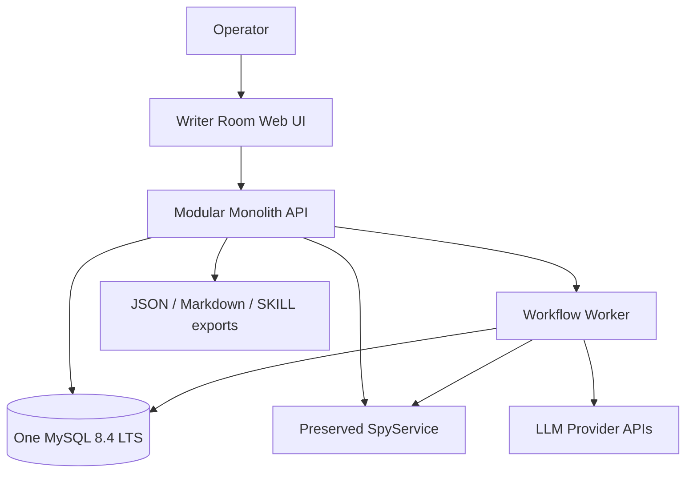
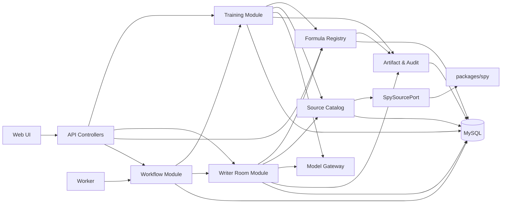
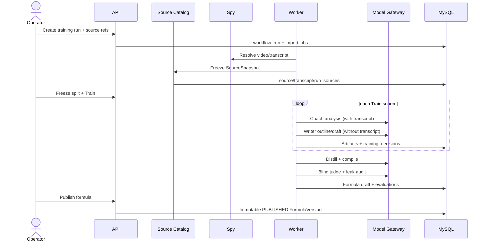
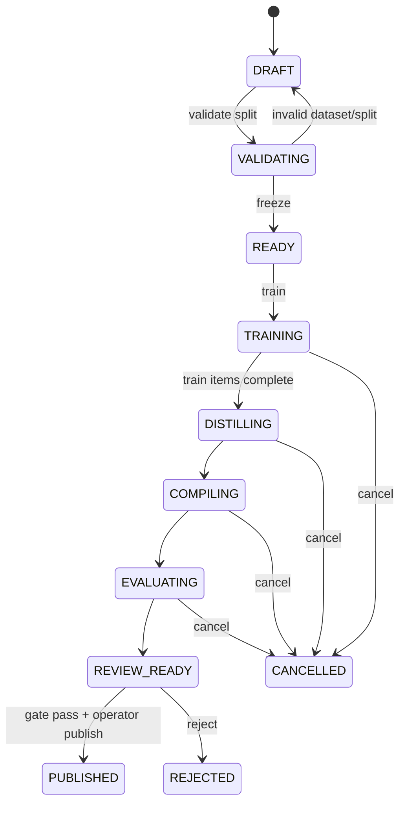
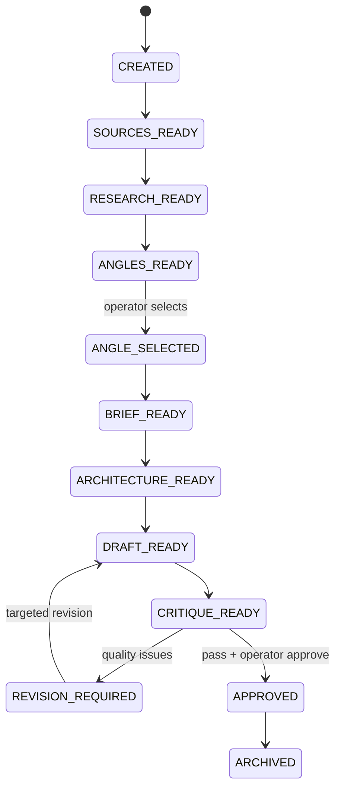

# Solution Design Document

## Validation Checklist

### CRITICAL GATES (Must Pass)

- [x] All required sections are complete
- [x] No clarification placeholders remain
- [x] Architecture pattern is clearly stated with rationale
- [ ] All architecture decisions confirmed by user
- [x] Every v1 interface has a specification

### QUALITY CHECKS (Should Pass)

- [x] All context sources are listed with relevance ratings
- [x] Project commands are discovered from actual project files
- [x] Constraints → Strategy → Design → Implementation path is logical
- [x] Every component in the diagram has a directory mapping
- [x] Error handling covers validation, business, infrastructure, upstream, and quality failures
- [x] Quality requirements are specific and measurable
- [x] Component names are consistent across diagrams and text
- [x] A developer can implement the proposed v1 after the pending ADRs are confirmed

---

## Constraints

- **CON-1 — Greenfield boundary:** Training và Writer Room được viết mới. Không port domain model, orchestrator, tmux agents, Forge, SQLite store, prompt, API hay UI legacy của hai phần này.
- **CON-2 — Preserve Spy:** `packages/spy/**` là subsystem được giữ lại. Hệ mới chỉ phụ thuộc contract công khai; không query trực tiếp `spy.sqlite` và không phụ thuộc schema nội bộ của Spy.
- **CON-3 — One MySQL:** Toàn bộ dữ liệu nghiệp vụ, workflow, artifact và audit của Training + Writer Room dùng một MySQL. Không thêm Redis, queue broker, vector database hoặc object storage trong v1.
- **CON-4 — Training isolation:** Coach được đọc source snapshot; Training Writer không được đọc transcript. Formula Compiler mặc định chỉ đọc decision events + writing policy, không đọc raw transcript.
- **CON-5 — Runtime isolation:** Runtime Writer chỉ nhận Story Brief, Formula Package và evidence snippets đã tuyển chọn; không nhận 5–10 transcript đầy đủ.
- **CON-6 — Proof before publish:** Formula chỉ được publish khi qua holdout khác topic, blind ablation và leakage gate. Training score cao không tự chứng minh transfer.
- **CON-7 — Reproducibility:** Mọi run phải pin source hash, formula version, prompt version, model/config, sampling/seed khi provider hỗ trợ và input artifact hashes.
- **CON-8 — Long-running work:** Spy và model calls có thể kéo dài/phát lỗi. API không giữ HTTP request hoặc DB transaction trong lúc gọi upstream.
- **CON-9 — Simple first release:** V1 ưu tiên single-user/trusted operator, manual quality gates và polling. Multi-user, realtime collaboration, vector search và service extraction bị hoãn.
- **CON-10 — Untrusted content:** Transcript, metadata và text từ web là dữ liệu không tin cậy; không được coi nội dung trong source là system instruction.

## Implementation Context

### Required Context Sources

#### Documentation Context

```yaml
- doc: /Users/jc/Downloads/01-offline-formula-training-architecture.html
  relevance: CRITICAL
  why: "Nguồn yêu cầu cho dataset, Coach↔Writer loops, decision log, distillation, formula, holdout và ablation."

- doc: /Users/jc/Downloads/02-runtime-script-generation-architecture.html
  relevance: CRITICAL
  why: "Nguồn yêu cầu cho research map, thesis, story brief, two-pass writing, critics và runtime state machine."

- doc: plan/spy.md
  relevance: HIGH
  why: "Xác định khả năng và ranh giới của subsystem Spy được giữ lại."

- doc: docs/dna-spy-board-loop-agent-spawn.md
  relevance: LOW
  why: "Chỉ dùng để biết cơ chế orchestration cũ không thuộc greenfield scope; không port sang thiết kế mới."

- url: https://dev.mysql.com/doc/refman/8.4/en/innodb-locking-reads.html
  relevance: MEDIUM
  why: "Tài liệu chính thức cho MySQL job leasing bằng FOR UPDATE SKIP LOCKED."
```

#### Code Context

```yaml
- file: packages/spy/src/index.ts
  relevance: HIGH
  why: "Public SpyService boundary: acquisition, result, transcript và analytical reads."

- file: packages/spy/src/schema.ts
  relevance: HIGH
  why: "Source/video/transcript/evidence contracts mà Spy hiện expose."

- file: packages/spy/src/source-pack.ts
  relevance: MEDIUM
  why: "Cho thấy source material là untrusted và cách Spy hiện đóng gói transcript."

- file: packages/spy/src/mcp-tools.ts
  relevance: MEDIUM
  why: "Tên tool, scope và giới hạn output hiện có; hệ mới không phụ thuộc MCP nếu chạy cùng process."

- file: package.json
  relevance: MEDIUM
  why: "Xác nhận Bun + TypeScript workspace và các command hiện tại trong worktree chuyển tiếp."

- file: tsconfig.base.json
  relevance: MEDIUM
  why: "Xác nhận strict TypeScript conventions hiện tại có thể tiếp tục dùng."
```

#### External APIs

```yaml
- service: SpyService
  doc: packages/spy/src/index.ts
  relevance: CRITICAL
  why: "Nguồn duy nhất để acquire/resolve video, transcript và metadata trong v1."

- service: LLM provider(s)
  doc: "Provider adapter contract sẽ được đặt tại apps/server/src/platform/ai/"
  relevance: HIGH
  why: "Thực thi các logical roles Coach, Writer, Distiller, Compiler, Judge, Editor và Critics."

- service: MySQL 8.4 LTS
  doc: https://dev.mysql.com/doc/refman/8.4/en/
  relevance: CRITICAL
  why: "System of record và durable job queue duy nhất của hệ mới."
```

### Implementation Boundaries

- **Must Preserve:** Public behavior của `packages/spy`; content hashes/evidence refs; khả năng đọc video/transcript đã acquire.
- **Can Modify:** Root workspace config và toàn bộ Training/Writer/API/Worker/Web sau khi người dùng hoàn tất cleanup.
- **Must Not Touch:** Không sửa hoặc migrate storage của Spy trong spec này; không phục hồi bất kỳ Training/Writer legacy nào; không xóa các thay đổi đang có trong dirty worktree.
- **New source of truth:** MySQL là source of truth của Training/Writer. `.json`, `.jsonl`, `.md` và `SKILL.md` chỉ là export/render từ canonical rows/artifacts.

### External Interfaces

#### System Context Diagram



#### Interface Specifications

```yaml
inbound:
  - name: "Operator Web/API"
    type: HTTP/HTTPS
    format: REST JSON
    authentication: "v1 local trusted operator; loopback binding. Auth required before any remote exposure."
    data_flow: "Create datasets/projects, issue stage commands, choose angle, publish formula, approve/export draft."

outbound:
  - name: "SpySourcePort"
    type: "In-process TypeScript port in v1; HTTP/MCP adapter allowed later"
    format: "SourceSnapshot contract"
    authentication: "Process-local; Spy scopes apply if MCP adapter is used"
    data_flow: "Acquire or resolve immutable video/transcript snapshots."
    criticality: HIGH

  - name: "ModelGateway"
    type: HTTPS
    format: "Provider-specific request; validated structured response"
    authentication: "Server-side secret only"
    data_flow: "Logical agent role invocations, usage and provider request IDs."
    criticality: HIGH

data:
  - name: "TrainingWriterMySQL"
    type: MySQL 8.4 LTS / InnoDB / utf8mb4
    connection: "Pooled server-side connection"
    data_flow: "All project state, immutable artifacts, jobs, provenance, evaluation and audit."
```

### Cross-Component Boundaries

- **API Contracts:** Request/response schemas ở `packages/contracts`; domain state không được đổi bằng generic `PATCH status`.
- **Module ownership:** Mỗi module ghi table của mình qua repository riêng. Writer không ghi Formula Registry; Training không ghi Writer projects; Workflow không diễn giải domain artifact.
- **Shared resources:** Cùng MySQL instance/schema, cùng Artifact Store abstraction, Job Queue, Model Gateway và SpySourcePort.
- **Breaking changes:** Contract/artifact có `schema_version`; API dùng `/api/v1`; migration chỉ additive trong một release rồi mới cleanup ở release sau.
- **Dependency direction:** API/worker → application modules → ports → adapters. Domain modules không import web, HTTP, provider SDK hoặc Spy internals.

### Project Commands

Commands đang tồn tại, được đọc từ `package.json` ngày 2026-08-09:

```bash
Install:     bun install
Test all:    bun test packages/core packages/daemon packages/spy packages/forge
Typecheck:   bun run typecheck
Spy CLI:     bun run spy
Web dev:     bun run web:dev
App dev:     bun run app:dev
```

Commands mục tiêu phải được tạo tại milestone P1; đây là contract build, không phải claim rằng chúng đã tồn tại:

```bash
Dev:         bun run dev
Test:        bun test
Typecheck:   bun run typecheck
Lint:        bun run lint
Build:       bun run build
DB migrate:  bun run db:migrate
DB rollback: bun run db:rollback
DB seed:     bun run db:seed
Worker:      bun run worker
```

## Solution Strategy

- **Architecture Pattern:** Modular monolith với hai process từ cùng codebase (`api` và `worker`), một web client và một MySQL.
- **Integration Approach:** Giữ Spy sau `SpySourcePort`; snapshot input từ Spy vào MySQL trước khi chạy Training/Writer để source hash không drift.
- **Persistence Approach:** Dữ liệu cần query/report/provenance được normalize; payload stage linh hoạt lưu `JSON`; prose/transcript/artifact export lưu `LONGTEXT`. Không dùng filesystem làm source of truth.
- **Workflow Approach:** Command → operation → stage run → durable MySQL job. Worker claim job bằng lease; stage output bất biến; project chỉ giữ pointer tới artifact hiện hành.
- **AI Approach:** Coach/Writer/Editor/Critic là logical roles qua Model Gateway, không phải process/terminal riêng. Mọi structured output được schema-validate trước khi commit.
- **Justification:** Cách này giữ deployment và transaction đơn giản, đáp ứng yêu cầu một MySQL, tránh network boundary sớm nhưng vẫn bảo vệ ranh giới Training/Writer/Spy.
- **Key Decisions:** Manual gate cho split/freeze, angle selection, formula publish và final approve trong v1; regenerate tạo version mới và làm stale descendants; runtime pin exact FormulaVersion.

Các invariant xuyên hệ thống:

1. Research trả lời “có gì để nói”.
2. Editorial Thesis trả lời “bài này muốn chứng minh điều gì”.
3. Formula trả lời “nói điều đó như thế nào”.
4. Training Evidence Corpus không được dùng làm Project Evidence Pack của Writer.
5. Published FormulaVersion là immutable; draft đang chạy không tự nhảy sang `latest`.

## Building Block View

### Components



| Component | Responsibility | Explicit non-responsibility |
|---|---|---|
| API Controllers | Validate transport, auth boundary, command idempotency and response mapping | Không chứa prompt/business rules |
| Source Catalog | Resolve Spy refs, freeze SourceSnapshot, deduplicate by content hash | Không crawl YouTube trực tiếp |
| Training Module | Dataset/split, Coach↔Writer loops, decision events, distill/compile/evaluate | Không viết production script |
| Formula Registry | Lifecycle, immutable package, publish/retire/resolve exact version | Không distill rules |
| Writer Room Module | Research map, thesis, brief, architecture, draft, critique, revision, approve | Không đọc training transcript |
| Workflow Module | Operations, jobs, retries, leases, cancellation, stage checkpoints | Không quyết định quality pass |
| Model Gateway | Provider abstraction, schema validation, usage/cost capture | Không sở hữu domain state |
| Artifact & Audit | Immutable versions, lineage, current pointers and audit timeline | Không diễn giải artifact content |
| Web UI | Human gates, progress, artifact comparison and export | Không gọi provider/Spy/MySQL trực tiếp |

### Directory Map

```text
.
├── apps/
│   ├── server/
│   │   └── src/
│   │       ├── api/                    # NEW: REST controllers + Problem Details
│   │       ├── modules/
│   │       │   ├── source-catalog/     # NEW: Spy adapter + SourceSnapshot
│   │       │   ├── training/           # NEW: greenfield training domain/application
│   │       │   ├── formula-registry/   # NEW: immutable FormulaVersion lifecycle
│   │       │   ├── writer-room/        # NEW: greenfield runtime writing pipeline
│   │       │   └── workflow/           # NEW: operations, stage runs, jobs
│   │       ├── platform/
│   │       │   ├── ai/                 # NEW: provider adapters and prompt registry
│   │       │   ├── db/                 # NEW: pool, transaction, repositories
│   │       │   ├── observability/      # NEW: logs, metrics, traces
│   │       │   └── security/           # NEW: content and output boundaries
│   │       ├── api-main.ts              # NEW: API process entry
│   │       └── worker-main.ts           # NEW: worker process entry
│   └── web/
│       └── src/                         # NEW: Training, Formula, Writer screens
├── packages/
│   ├── contracts/                       # NEW: Zod/JSON schemas shared by web/server
│   └── spy/                             # PRESERVE: no greenfield rewrite
├── db/
│   ├── migrations/                      # NEW: ordered forward/rollback SQL
│   └── seeds/                           # NEW: deterministic local/test fixtures
└── docs/specs/001-greenfield-training-writer-room/
    └── solution-design.md                # NEW: this document
```

### Interface Specifications

#### Interface Documentation References

```yaml
interfaces:
  - name: "REST API v1"
    doc: "This document: Internal API Changes"
    relevance: CRITICAL
    sections: [conventions, training, formula_registry, writer_room, operations]
    why: "Command surface duy nhất cho Web UI và automation."

  - name: "SpySourcePort"
    doc: packages/spy/src/index.ts
    relevance: CRITICAL
    sections: [SpyService, source and transcript schemas]
    why: "Cô lập greenfield modules khỏi Spy storage và MCP details."

  - name: "Artifact contracts"
    doc: "packages/contracts/src/artifacts/*.ts (NEW)"
    relevance: CRITICAL
    sections: [schema_version, producer, consumer, lineage]
    why: "JSON/Markdown trong hai tài liệu được thống nhất thành versioned canonical artifacts."
```

#### Data Storage Changes

Không migrate schema Training/Writer cũ. Tạo một schema MySQL mới, mặc định `writer_room`, với InnoDB, `utf8mb4`, timestamp UTC `DATETIME(3)`, ULID `CHAR(26)` cho public IDs và SHA-256 hex `CHAR(64)` cho content hashes.

Mục tiêu tối giản là chỉ normalize dữ liệu cần query, join, provenance hoặc release gate. Những output stage có cùng lifecycle được gom vào một bảng `artifacts`.

```yaml
Table: style_profiles
  id: CHAR(26) PK
  name: VARCHAR(160) NOT NULL
  external_channel_id: VARCHAR(160) NULL
  language: VARCHAR(16) NOT NULL
  description: TEXT NULL
  settings_json: JSON NOT NULL
  created_at, updated_at: DATETIME(3)
  indexes:
    - INDEX(external_channel_id, language)

Table: source_videos
  id: CHAR(26) PK
  provider: VARCHAR(32) NOT NULL
  external_id: VARCHAR(160) NOT NULL
  external_channel_id: VARCHAR(160) NULL
  title: VARCHAR(500) NOT NULL
  duration_seconds: INT UNSIGNED NULL
  published_at: DATETIME(3) NULL
  canonical_url: VARCHAR(1000) NOT NULL
  metadata_json: JSON NOT NULL
  ingested_via: VARCHAR(32) NOT NULL
  created_at, updated_at: DATETIME(3)
  indexes:
    - UNIQUE(provider, external_id)
    - INDEX(external_channel_id, published_at)

Table: transcript_versions
  id: CHAR(26) PK
  source_video_id: CHAR(26) FK source_videos.id RESTRICT
  version_no: INT UNSIGNED NOT NULL
  language: VARCHAR(16) NOT NULL
  raw_text: MEDIUMTEXT NULL
  normalized_text: MEDIUMTEXT NOT NULL
  segments_json: JSON NOT NULL
  quality_flags_json: JSON NOT NULL
  normalizer_version: VARCHAR(100) NULL
  source_sha256: CHAR(64) NOT NULL
  content_sha256: CHAR(64) NOT NULL
  spy_ref_json: JSON NOT NULL
  created_at: DATETIME(3)
  indexes:
    - UNIQUE(source_video_id, content_sha256)
    - UNIQUE(source_video_id, version_no)
    - UNIQUE(id, source_video_id)  # enables composite ownership FK from run_sources

Table: workflow_runs
  id: CHAR(26) PK
  kind: VARCHAR(24) NOT NULL              # TRAINING | WRITING
  style_profile_id: CHAR(26) NULL FK style_profiles.id RESTRICT
  title: VARCHAR(500) NULL
  status: VARCHAR(40) NOT NULL
  current_stage: VARCHAR(64) NOT NULL
  selected_formula_version_id: CHAR(26) NULL FK formula_versions.id RESTRICT
  config_json: JSON NOT NULL
  code_version: VARCHAR(100) NOT NULL
  lock_version: INT UNSIGNED NOT NULL DEFAULT 0
  created_at, updated_at, completed_at, archived_at: DATETIME(3) NULL
  indexes:
    - INDEX(kind, status, updated_at)
    - INDEX(style_profile_id, created_at)
    - INDEX(selected_formula_version_id)

Table: run_sources
  run_id: CHAR(26) FK workflow_runs.id RESTRICT
  source_video_id: CHAR(26) FK source_videos.id RESTRICT
  transcript_version_id: CHAR(26) FK transcript_versions.id RESTRICT
  role: VARCHAR(24) NOT NULL              # TRAIN | H1 | H2 | RESEARCH
  topic_label: VARCHAR(160) NULL
  series_key: VARCHAR(160) NULL
  rank_no: INT UNSIGNED NULL
  score_json: JSON NOT NULL
  source_snapshot_json: JSON NOT NULL
  created_at: DATETIME(3)
  indexes:
    - PRIMARY KEY(run_id, source_video_id)
    - INDEX(run_id, role)
    - INDEX(transcript_version_id)
  constraints:
    - COMPOSITE FK(transcript_version_id, source_video_id) -> transcript_versions(id, source_video_id)

Table: stage_jobs
  id: CHAR(26) PK                     # also returned as operation_id
  run_id: CHAR(26) FK workflow_runs.id RESTRICT
  parent_job_id: CHAR(26) NULL FK stage_jobs.id RESTRICT
  stage: VARCHAR(64) NOT NULL
  variant_key: VARCHAR(160) NOT NULL DEFAULT ''
  status: VARCHAR(32) NOT NULL         # QUEUED|RUNNING|SUCCEEDED|FAILED_*|CANCELLED
  attempt_no, max_attempts: INT UNSIGNED
  idempotency_key: VARCHAR(200) NOT NULL
  dedupe_key: CHAR(64) NOT NULL
  input_manifest_json: JSON NOT NULL
  error_json: JSON NULL
  available_at, locked_until, heartbeat_at: DATETIME(3) NULL
  locked_by: VARCHAR(160) NULL
  created_at, started_at, finished_at: DATETIME(3) NULL
  indexes:
    - UNIQUE(idempotency_key)
    - UNIQUE(dedupe_key)
    - INDEX(status, available_at)
    - INDEX(run_id, stage, created_at)

Table: model_executions
  id: CHAR(26) PK
  stage_job_id: CHAR(26) FK stage_jobs.id RESTRICT
  provider, model_id, role_name: VARCHAR(160) NOT NULL
  prompt_name, prompt_version: VARCHAR(160) NOT NULL
  prompt_snapshot: MEDIUMTEXT NOT NULL
  prompt_sha256: CHAR(64) NOT NULL
  parameters_json, input_manifest_json: JSON NOT NULL
  seed: BIGINT NULL
  provider_request_id: VARCHAR(255) NULL
  input_tokens, output_tokens: INT UNSIGNED NULL
  cost_microunits: BIGINT UNSIGNED NULL
  status: VARCHAR(32) NOT NULL
  response_sha256: CHAR(64) NULL
  error_json: JSON NULL
  created_at, finished_at: DATETIME(3) NULL
  indexes:
    - INDEX(stage_job_id, created_at)
    - INDEX(provider_request_id)

Table: artifacts
  id: CHAR(26) PK
  run_id: CHAR(26) FK workflow_runs.id RESTRICT
  artifact_type: VARCHAR(64) NOT NULL
  variant_key: VARCHAR(160) NOT NULL DEFAULT ''
  version_no: INT UNSIGNED NOT NULL
  schema_version: VARCHAR(32) NOT NULL
  payload_json: JSON NULL
  payload_text: MEDIUMTEXT NULL
  content_sha256: CHAR(64) NOT NULL
  input_artifact_ids_json: JSON NOT NULL
  supersedes_artifact_id: CHAR(26) NULL FK artifacts.id RESTRICT
  producer_job_id: CHAR(26) FK stage_jobs.id RESTRICT
  producer_execution_id: CHAR(26) NULL FK model_executions.id RESTRICT
  state: VARCHAR(24) NOT NULL             # CURRENT|SUPERSEDED|STALE
  head_marker: TINYINT NULL               # 1 only for CURRENT, NULL otherwise
  created_at: DATETIME(3)
  indexes:
    - UNIQUE(run_id, artifact_type, variant_key, version_no)
    - UNIQUE(run_id, artifact_type, variant_key, head_marker)
    - INDEX(content_sha256)
    - INDEX(producer_job_id)
  constraints:
    - CHECK(payload_json IS NOT NULL OR payload_text IS NOT NULL)

Table: training_decisions
  id: CHAR(26) PK
  run_id: CHAR(26) FK workflow_runs.id RESTRICT
  transcript_version_id: CHAR(26) FK transcript_versions.id RESTRICT
  stage: VARCHAR(32) NOT NULL
  issue_text: TEXT NOT NULL
  rule_candidate: TEXT NOT NULL
  rule_fingerprint: CHAR(64) NOT NULL
  why_original_does_it: TEXT NOT NULL
  before_artifact_id, after_artifact_id: CHAR(26) FK artifacts.id RESTRICT
  before_score, after_score: DECIMAL(5,2) NULL
  evidence_json: JSON NOT NULL
  accepted: BOOLEAN NOT NULL DEFAULT FALSE
  created_at: DATETIME(3)
  indexes:
    - INDEX(run_id, rule_fingerprint)
    - INDEX(run_id, transcript_version_id, stage)

Table: formula_versions
  id: CHAR(26) PK
  style_profile_id: CHAR(26) FK style_profiles.id RESTRICT
  source_training_run_id: CHAR(26) FK workflow_runs.id RESTRICT
  version_no: INT UNSIGNED NOT NULL
  version_label: VARCHAR(64) NOT NULL
  status: VARCHAR(24) NOT NULL             # DRAFT|REVIEW_READY|PUBLISHED|RETIRED
  guide_text: TEXT NOT NULL
  rules_json, avoid_json, recommended_modes_json: JSON NOT NULL
  policy_artifact_id, evidence_artifact_id: CHAR(26) FK artifacts.id RESTRICT
  package_sha256: CHAR(64) NOT NULL
  token_count: INT UNSIGNED NOT NULL
  eval_score: DECIMAL(5,2) NULL
  published_at, retired_at, created_at: DATETIME(3) NULL
  indexes:
    - UNIQUE(style_profile_id, version_no)
    - UNIQUE(style_profile_id, version_label)
    - INDEX(style_profile_id, status, published_at)

Table: research_claims
  id: CHAR(26) PK
  run_id: CHAR(26) FK workflow_runs.id RESTRICT
  claim_key: CHAR(64) NOT NULL
  claim_type: VARCHAR(32) NOT NULL
  claim_text: TEXT NOT NULL
  confidence: DECIMAL(5,4) NOT NULL
  verification_status: VARCHAR(24) NOT NULL  # EXTRACTED|CORROBORATED|AUTHORITATIVE|DISPUTED|REJECTED
  labels_json, attributes_json: JSON NOT NULL
  created_at: DATETIME(3)
  indexes:
    - UNIQUE(run_id, claim_key)
    - INDEX(run_id, claim_type, verification_status)

Table: claim_evidence
  id: CHAR(26) PK
  claim_id: CHAR(26) FK research_claims.id CASCADE
  transcript_version_id: CHAR(26) FK transcript_versions.id RESTRICT
  relation: VARCHAR(24) NOT NULL           # SUPPORTS|CONTRADICTS|CONTEXT
  start_ms, end_ms: INT UNSIGNED NULL
  snippet: TEXT NOT NULL
  confidence: DECIMAL(5,4) NOT NULL
  verified: BOOLEAN NOT NULL DEFAULT FALSE
  evidence_sha256: CHAR(64) NOT NULL
  created_at: DATETIME(3)
  indexes:
    - INDEX(claim_id, relation)
    - INDEX(transcript_version_id, start_ms)

Table: evaluations
  id: CHAR(26) PK
  run_id: CHAR(26) FK workflow_runs.id RESTRICT
  formula_version_id: CHAR(26) NULL FK formula_versions.id RESTRICT
  target_artifact_id: CHAR(26) FK artifacts.id RESTRICT
  dataset_role: VARCHAR(16) NOT NULL       # TRAIN|H1|H2|RUNTIME
  ablation_group: VARCHAR(8) NOT NULL      # A..F
  repeat_no: INT UNSIGNED NOT NULL
  blind_label: VARCHAR(64) NOT NULL
  judge_execution_id: CHAR(26) FK model_executions.id RESTRICT
  scores_json: JSON NOT NULL
  overall_score, leak_score: DECIMAL(5,2) NOT NULL
  passed: BOOLEAN NOT NULL
  created_at: DATETIME(3)
  indexes:
    - INDEX(formula_version_id, dataset_role, ablation_group)
    - INDEX(run_id, target_artifact_id)

Table: workflow_events
  id: BIGINT UNSIGNED AUTO_INCREMENT PK
  run_id: CHAR(26) FK workflow_runs.id RESTRICT
  stage_job_id: CHAR(26) NULL FK stage_jobs.id RESTRICT
  event_type: VARCHAR(64) NOT NULL
  actor_type, actor_id: VARCHAR(160) NOT NULL
  payload_json: JSON NOT NULL
  created_at: DATETIME(3)
  indexes:
    - INDEX(run_id, id)
    - INDEX(event_type, created_at)
```

Storage rules:

- Transcript và artifact không update content tại chỗ; version mới tạo row mới.
- `run_sources` pin đúng `transcript_version_id`; metadata động của Spy được snapshot để audit.
- Published FormulaVersion bất biến; thay đổi tạo version mới. Runtime pin exact `selected_formula_version_id`.
- `artifacts.head_marker=1` chỉ có trên current artifact. Regenerate đổi head và đánh dấu descendant `STALE` trong một transaction có optimistic lock trên `workflow_runs.lock_version`.
- Stable IDs nằm trong JSON artifact phải được contract-validate; chỉ promote thành column/table khi cần query hoặc enforce integrity.
- Xóa vật lý bị cấm cho run/formula/source đã publish hoặc referenced; archive và retention job là mặc định.
- `MEDIUMTEXT` chứa transcript/draft v1. Object storage chỉ được thêm sau khi đo volume và xác nhận ADR mới.

Canonical artifact types:

| Pipeline | Artifact types |
|---|---|
| Training | `coach_analysis`, `outline`, `draft`, `critique`, `training_evidence_corpus`, `writing_policy`, `formula_candidate`, `formula_evidence`, `leak_report`, `scorecard` |
| Writer | `source_set`, `research_map`, `thesis_candidates`, `angle_selection`, `story_brief`, `story_architecture`, `draft`, `critique`, `approval`, `export` |

#### Internal API Changes

API conventions:

- Base path `/api/v1`; JSON only, except export download.
- Long-running command returns `202 Accepted` with `{ "operation_id": "...", "status_url": "..." }`.
- Mọi POST command nhận header `Idempotency-Key`; aggregate mutations nhận `If-Match` hoặc `expected_version`.
- Không có endpoint `PATCH status`; state transition chỉ qua named command.
- Sync error và async job error cùng dùng Problem Details shape ở phần Error Handling.

Training and Formula Registry:

| Method | Path | Request chính | Success |
|---|---|---|---|
| POST | `/api/v1/style-profiles` | `name, channel_ref, language, settings` | `201 StyleProfile` |
| POST | `/api/v1/training-runs` | `style_profile_id, source_refs[], split_policy, run_config` | `201 WorkflowRun` ở `DRAFT` |
| POST | `/api/v1/training-runs/{id}/sources:import` | Spy refs hoặc immutable SourceSnapshot contract | `202 operation_id` |
| POST | `/api/v1/training-runs/{id}/actions/validate-split` | optional split overrides | `202 operation_id` |
| POST | `/api/v1/training-runs/{id}/actions/freeze` | `expected_version` | `200 run` ở `READY` |
| POST | `/api/v1/training-runs/{id}/actions/train` | budgets, max loop iterations | `202 operation_id` |
| POST | `/api/v1/training-runs/{id}/actions/distill` | no body | `202 operation_id` |
| POST | `/api/v1/training-runs/{id}/actions/compile` | formula limits | `202 operation_id` |
| POST | `/api/v1/training-runs/{id}/actions/evaluate` | evaluation policy | `202 operation_id` |
| GET | `/api/v1/training-runs/{id}` | — | run + stage summary |
| GET | `/api/v1/training-runs/{id}/artifacts` | type, variant, state | paged artifacts |
| GET | `/api/v1/training-runs/{id}/decisions` | source, stage, accepted | paged decisions |
| GET | `/api/v1/training-runs/{id}/evaluation` | — | ablation + holdout scorecard |
| POST | `/api/v1/formula-versions/{id}/actions/publish` | `expected_version`, confirmation | published immutable version |
| POST | `/api/v1/formula-versions/{id}/actions/retire` | reason | retired version; existing pinned runs unaffected |
| GET | `/api/v1/formulas` | style_profile, language, status | version list |
| GET | `/api/v1/formula-versions/{id}/package` | — | canonical Formula Package |

Writer Room:

| Method | Path | Request chính | Success |
|---|---|---|---|
| POST | `/api/v1/writer-projects` | `title, audience, target_words, formula_version_id` | `201 WorkflowRun` |
| POST | `/api/v1/writer-projects/{id}/sources:import` | 5–10 Spy refs or discovery result refs | `202 operation_id` |
| POST | `/api/v1/writer-projects/{id}/actions/research` | research constraints | `202 operation_id` |
| POST | `/api/v1/writer-projects/{id}/actions/generate-angles` | candidate count 3–5 | `202 operation_id` |
| POST | `/api/v1/writer-projects/{id}/angles/{angle_id}/actions/select` | `expected_version`, optional note | selected angle + downstream invalidation |
| POST | `/api/v1/writer-projects/{id}/actions/generate-brief` | optional operator constraints | `202 operation_id` |
| POST | `/api/v1/writer-projects/{id}/actions/generate-architecture` | — | `202 operation_id` |
| POST | `/api/v1/writer-projects/{id}/actions/generate-draft` | target length override | `202 operation_id` |
| POST | `/api/v1/writer-projects/{id}/actions/critique` | critic set | `202 operation_id` |
| POST | `/api/v1/writer-projects/{id}/actions/revise` | issue IDs/sections | `202 operation_id` |
| POST | `/api/v1/writer-projects/{id}/actions/regenerate` | `from_stage, reason, overrides` | `202 operation_id` |
| POST | `/api/v1/writer-projects/{id}/actions/approve` | confirmation or explicit override reason | approval artifact |
| POST | `/api/v1/writer-projects/{id}/actions/archive` | reason | archived run |
| GET | `/api/v1/writer-projects/{id}` | — | current state + heads |
| GET | `/api/v1/writer-projects/{id}/artifacts` | type, state, version | paged artifact history |
| GET | `/api/v1/writer-projects/{id}/timeline` | cursor | paged workflow events |
| GET | `/api/v1/writer-projects/{id}/export` | format `md|json|skill` | downloadable render |

Operations:

| Method | Path | Behavior |
|---|---|---|
| GET | `/api/v1/operations/{id}` | Job status, progress, safe error and links to output artifacts |
| POST | `/api/v1/operations/{id}/actions/cancel` | Cooperative cancel; completed artifacts are retained |
| POST | `/api/v1/operations/{id}/actions/retry` | New attempt for retryable/manual-review failure, same logical input |

#### Application Data Models

```pseudocode
ENTITY SourceSnapshot
  FIELDS:
    sourceVideoId, transcriptVersionId, metadataSnapshot, normalizedTranscript,
    timedSegments, qualityFlags, contentHash, capturedAt
  INVARIANT:
    immutable after run_sources pins it

ENTITY FormulaVersion
  FIELDS:
    id, styleProfileId, version, guideText, rules[], avoid[], recommendedModes[],
    evidenceArtifactId, evaluationSummary, contentHash, status
  INVARIANTS:
    published content is immutable
    contains writing policy, never topic claims/entities
    runtime pins exact version

ENTITY ResearchClaim
  FIELDS:
    id, text, type, confidence, verificationStatus, evidence[]
  INVARIANTS:
    factual claim in approved draft has at least one provenance edge
    DISPUTED/REJECTED claim cannot be must-use

ENTITY StoryBrief
  FIELDS:
    title, centralThesis, beliefBefore, beliefAfter, centralTension,
    storyQuestion, mustUseClaimIds, optionalClaimIds, avoidAngles,
    targetWords, tone
  INVARIANTS:
    references only claims from the same writer run
    does not contain full source transcript

ENTITY Artifact
  FIELDS:
    runId, type, variantKey, version, schemaVersion, payload, contentHash,
    inputArtifactIds, producerJobId, supersedesId, state
  INVARIANTS:
    append-only content
    exactly one current head per run/type/variant
```

#### Integration Points

```yaml
- from: Source Catalog
  to: SpyService
  protocol: "TypeScript port in-process"
  operations:
    - resolve spy run/video snapshot
    - read paged timed transcript
    - optionally start/wait acquisition through explicit operator command
  data_flow: "Import immutable SourceSnapshot; never expose Spy DB tables."

- from: Workflow Worker
  to: Model Gateway
  protocol: HTTPS via provider adapter
  data_flow: "Role-scoped input projection -> structured output -> schema validation."
  critical_controls:
    - provider secrets server-side
    - timeout, retry and cost budget
    - prompt/response hash and usage audit
    - no raw provider error returned to browser

- from: API and Worker
  to: MySQL
  protocol: pooled MySQL connection
  data_flow: "Transactions, job lease, artifact/version commit and audit."
```

### Implementation Examples

#### Example: Atomic artifact regeneration

**Why this example:** Regenerate phải giữ lịch sử, làm stale đúng downstream artifacts và chống hai worker cùng đổi head.

```typescript
async function commitArtifact(result: StageResult, expectedRunVersion: number) {
  return db.transaction(async (tx) => {
    const run = await tx.runs.lock(result.runId);
    if (run.lockVersion !== expectedRunVersion) throw versionConflict();

    await tx.artifacts.clearHead(result.runId, result.type, result.variantKey);
    await tx.artifacts.markDescendantsStale(result.supersededArtifactId);
    const artifact = await tx.artifacts.insertImmutable(result, { headMarker: 1 });
    await tx.runs.advanceCheckpoint(result.runId, result.nextStage, expectedRunVersion);
    await tx.events.append(result.runId, "ARTIFACT_COMMITTED", { artifactId: artifact.id });
    return artifact;
  });
}
```

#### Example: MySQL job claim

**Why this example:** Một MySQL vẫn hỗ trợ nhiều worker mà không cần Redis/broker. `SKIP LOCKED` chỉ dùng cho queue-like table, đúng phạm vi được MySQL khuyến nghị.

```sql
START TRANSACTION;
SELECT id
FROM stage_jobs
WHERE status = 'QUEUED' AND available_at <= UTC_TIMESTAMP(3)
ORDER BY available_at, created_at
LIMIT 1
FOR UPDATE SKIP LOCKED;

UPDATE stage_jobs
SET status = 'RUNNING', locked_by = ?, locked_until = ?, heartbeat_at = UTC_TIMESTAMP(3)
WHERE id = ?;
COMMIT;
```

#### Test Examples as Interface Documentation

```typescript
it("never projects transcript into Training Writer input", async () => {
  const input = await trainingInputProjector.forWriter(trainingItemId);
  expect(input).toHaveKeys(["analysis", "feedback", "currentFormula"]);
  expect(JSON.stringify(input)).not.toContain("normalizedTranscript");
});

it("reselecting angle invalidates only descendants", async () => {
  await selectAngle(projectId, angleB, expectedVersion);
  expect(await head("research_map")).toRemainCurrent();
  expect(await head("story_brief")).toBeStale();
  expect(await head("draft")).toBeStale();
});
```

## Runtime View

### Primary Flow

#### Primary Flow A: Train and publish a Formula

1. Operator tạo Style Profile và import ít nhất tám source đa topic từ Spy.
2. Source Catalog snapshot metadata + transcript version vào MySQL.
3. Hệ thống deduplicate và đề xuất split Train/H1/H2 theo topic/series/time; operator freeze split.
4. Với từng Train source, Coach đọc snapshot và tạo normalized analysis; Training Writer không thấy transcript.
5. Writer/Coach chạy outline loop rồi draft loop có giới hạn; mỗi revision tạo artifact và TrainingDecision.
6. Distiller gom decision xuyên video, tách Writing Policy khỏi topic knowledge.
7. Compiler tạo Formula candidate ngắn, imperative và traceable về decision/evaluation.
8. Judge chạy blind ablation trên H1/H2; Leak Auditor kiểm lexical/entity/semantic leakage.
9. Nếu release gate pass, operator publish immutable FormulaVersion; nếu fail, run ở `REVIEW_READY` hoặc `REJECTED`, không tự tune trên frozen H2.



Training state machine:



Per-source Training item uses job/artifact checkpoints:

```text
PENDING → ANALYZING → OUTLINE_LOOP → DRAFT_LOOP → COMPLETED | REVIEW_REQUIRED | SKIPPED
```

#### Primary Flow B: Write and approve a new script

1. Operator tạo Writer Project với title, audience, target length và exact FormulaVersion.
2. Operator/import flow chọn 5–10 source đa góc nhìn từ Spy; Source Catalog freeze versions.
3. Research stage extract claim/evidence độc lập và dựng Research Map; không output outline.
4. Editorial stage tạo 3–5 thesis candidates; Judge chấm, operator chọn một angle.
5. Editor tạo Story Brief với belief shift, tension và allowed claim IDs.
6. Writer pass 1 tạo Story Architecture; pass 2 viết draft bằng Brief + curated evidence + Formula.
7. Structure, Originality và Evidence Critics trả issue theo section, không mặc định rewrite cả bài.
8. Revision chỉ sửa section được chọn; critique lại đến khi pass hoặc cần operator override.
9. Operator approve và export Markdown/JSON; mọi factual claim giữ provenance.



Evaluation tùy chọn của Writer Room dùng đủ sáu group để đo đúng layer tạo gain: A `Title`, B `Title+Research`, C `Title+Formula`, D `Title+Research+Formula`, E `Title+Research+Thesis`, F `Title+Research+Thesis+Formula`. Editorial layer chỉ được coi có giá trị khi E vượt B theo policy; F là full-system candidate.

### Error Handling

Sync API errors và `stage_jobs.error_json` dùng cùng RFC 9457-style Problem Details:

```json
{
  "type": "https://writer-room.local/problems/source-not-ready",
  "title": "Source is not ready",
  "status": 422,
  "code": "SOURCE_NOT_READY",
  "detail": "Transcript version is missing or below the quality gate.",
  "instance": "/api/v1/operations/01...",
  "trace_id": "01...",
  "retryable": false,
  "operation_id": "01...",
  "errors": [{ "field": "source_refs[2]", "reason": "missing transcript" }]
}
```

| Class | HTTP / job behavior | Recovery |
|---|---|---|
| Invalid input/schema | 400/422, `FAILED_FINAL` | Sửa input; không auto retry |
| Invalid state/version | 409 `INVALID_STATE`/`VERSION_CONFLICT` | Reload aggregate và submit lại với version mới |
| Insufficient/diverse sources | 422 | Bổ sung source hoặc sửa split |
| Spy source pending | 422 hoặc retryable job nếu acquisition đang chạy | Wait explicit Spy operation rồi retry import |
| Provider timeout/429/5xx | 429/502/503/504, `FAILED_RETRYABLE` | Exponential backoff + jitter, tôn trọng `Retry-After`, tối đa 5 attempts |
| Structured output invalid | Retry tối đa 2 repair attempts rồi `FAILED_FINAL` | Review prompt/model output |
| Quality/leakage gate fail | 422 `QUALITY_GATE_FAILED`/`LEAKAGE_DETECTED` | Human review; không coi là infra retry |
| Job lease expired | Reconciler đưa về queue nếu attempt còn | At-least-once execution; artifact commit deduplicated |
| Cancel requested | Cooperative cancel, `CANCELLED` | Giữ artifact đã commit; resume bằng command mới |

Không giữ DB transaction trong lúc gọi Spy/LLM. Không log raw provider body, secret hoặc toàn transcript trong error. Crash sau provider call có thể gây duplicate charge; hệ thống chỉ bảo đảm effectively-once artifact commit, không hứa exactly-once external call.

### Complex Logic

#### Algorithm A: Training isolation, distillation and release

```text
INPUT: style_profile, >=8 pinned transcript versions, split policy, evaluation policy
OUTPUT: REVIEW_READY FormulaVersion or quality failure

1. VALIDATE SOURCES
   - Transcript quality pass.
   - Deduplicate exact/near-duplicate source before split.
   - Require topic diversity; group series/near variants together.

2. SPLIT AND FREEZE
   - TRAIN: 5–8 sources across topics.
   - H1: >=1 source near the training distribution.
   - H2: >=2 sources from distinct held-out topic clusters for publish gate.
   - Freeze H2; never use H2 feedback to edit the same candidate.

3. TRAIN EACH TRAIN SOURCE
   - Coach projection includes SourceSnapshot.
   - Writer projection includes analysis + feedback + current formula only.
   - Outline loop before full draft loop; max iterations and token/cost budgets.
   - Append TrainingDecision for each meaningful revision.

4. DISTILL
   - Group by rule_fingerprint across independent transcript versions.
   - Promote only repeated rule candidates with positive score delta.
   - Reject entity, claim, topic and quote-specific rules.
   - Render separate training evidence corpus and writing policy.

5. COMPILE
   - Dedupe/resolve conflicts.
   - Render imperative FormulaPackage with stable rule IDs and avoid list.
   - Enforce provisional <=1,200 tokens and <=20 active rules.

6. EVALUATE BLIND
   - A: title only; B: title + research; C: title + formula; D: title + research + formula.
   - Randomize blind labels; use >=3 independent repeats.
   - Evaluate H1/H2, leakage, factuality and provenance separately.

7. RELEASE DECISION
   - Require C>A by configured margin/win rate on frozen H2.
   - Require no factuality/provenance regression and leak gate pass.
   - Pass -> REVIEW_READY; operator publish creates immutable version.
```

#### Algorithm B: Writer artifact invalidation

```text
DEPENDENCY DAG:
sources -> research_map -> thesis_candidates -> angle_selection
        -> story_brief -> story_architecture -> draft -> critique -> approval/export
formula_version -------------------------------> draft

WHEN regenerating artifact X:
1. Create a new stage job with input hash and reason.
2. Never overwrite old artifact.
3. On successful commit, mark old head SUPERSEDED.
4. Traverse descendants of old head through input_artifact_ids and mark them STALE.
5. Do not stale ancestors or sibling variants.
6. Atomically advance current stage/head under workflow_runs.lock_version.
7. A stale artifact remains readable/exportable for audit but cannot be approved.
```

## Deployment View

### Single Application Deployment

- **Environment:** V1 runs as a Bun/TypeScript server on the same trusted host/network as Spy, with separate API and worker processes from the same release image. Web is static build served by API or reverse proxy.
- **Database:** One MySQL 8.4 LTS schema. MySQL is the only required stateful service for Training/Writer.
- **Configuration:** `DATABASE_URL`, provider credentials, loopback/listen address, job lease/heartbeat, concurrency, budgets, Spy data/config path and log level. Secrets are server-only.
- **Dependencies:** MySQL, preserved `packages/spy`, provider APIs, yt-dlp/ffmpeg only through Spy when acquisition is explicitly requested.
- **Performance:** Sync CRUD/status p95 under 300 ms at 20 requests/s on reference local deployment, excluding upstream calls. Job enqueue under 1 second. AI throughput is budget/concurrency-bound, not HTTP-bound.
- **Backup:** Daily backup plus binary-log point-in-time recovery where deployed persistently; quarterly restore drill. V1 target RPO 24 hours, RTO 4 hours.

### Multi-Component Coordination

- **Deployment Order:** MySQL backup → forward migration → server API → worker → web.
- **Version Dependencies:** API and worker deploy from the same commit/code version. Worker refuses jobs whose artifact schema version it does not support.
- **Feature Flags:** `TRAINING_ENABLED`, `WRITER_ENABLED`, `SPY_IMPORT_ENABLED`, `AUTO_ANGLE_JUDGE_ENABLED`; flags stop new commands but never hide stored data.
- **Rollback Strategy:** Stop worker, roll back API/web code only if it remains compatible with additive migration. Destructive down-migration requires explicit maintenance window and backup restore plan.
- **Data Migration Sequencing:** Expand → deploy dual-read/write only when required → backfill → contract in later release. Never combine table drop with first consumer deployment.

Build and rollout sequence:

| Phase | Scope | Exit gate |
|---|---|---|
| P0 — Decisions & contracts | Confirm ADRs, artifact schemas, state transition matrix, release thresholds, Spy snapshot contract | Contract fixtures and transition table approved |
| P1 — Foundation | Greenfield workspace, MySQL migrations, repositories, Source Catalog, Artifact Store, MySQL jobs, Model Gateway fake adapter, errors/observability | Restart-safe deterministic workflow test passes |
| P2 — Training vertical slice | Import/freeze split, Coach analysis, capped outline/draft loops, decision log, distill, compile, blind eval/leak audit, manual publish | One real style profile produces an auditable published Formula |
| P3 — Writer vertical slice | Manual 5–10 sources, research claims/map, 3–5 angles, manual select, brief, two-pass draft, three critics, revision, approve/export | One title completes end-to-end with 100% factual provenance |
| P4 — Hardening | Optional Spy discovery, progress/SSE, budgets, backup/restore, load/security tests, evaluation dashboard | All acceptance/security/operations gates pass |
| P5 — Evidence-driven scale only | Object storage, search/vector DB, service extraction | Added only when measured volume/latency justifies it |

## Cross-Cutting Concepts

### Pattern Documentation

```yaml
- pattern: "Modular Monolith + Ports and Adapters"
  relevance: CRITICAL
  why: "Giữ module isolation mà không tạo microservice/network complexity."

- pattern: "Immutable Artifact + Current Head"
  relevance: CRITICAL
  why: "Regenerate, audit, rollback và reproducibility cùng dùng một pattern."

- pattern: "Transactional Job Lease"
  relevance: HIGH
  why: "Long-running stages dùng chính MySQL, có retry/cancel/reconcile."

- pattern: "Role-scoped Input Projection"
  relevance: CRITICAL
  why: "Thực thi writer-blind-transcript bằng code boundary thay vì chỉ prompt."

- pattern: "Problem Details"
  relevance: HIGH
  why: "Một error model cho sync API, async job và UI recovery."
```

### User Interface & UX

**Information Architecture**

- Navigation: `Training` → run detail, `Formulas` → registry/version detail, `Writer Room` → project detail. Spy giữ entry point riêng của nó.
- Training detail: Sources/Split → Per-video loops → Decisions → Policy/Formula → Evaluation → Publish.
- Writer detail: Sources → Research → Angles → Brief → Architecture → Draft → Critique → Export.
- Mỗi stage hiển thị current artifact, previous versions, input lineage, model/cost và retry/regenerate action phù hợp.

```text
┌─────────────────────────────────────────────────────────────┐
│ Writer Project: Why ...               Formula: channel-x v2 │
├──────────┬──────────┬────────┬───────┬───────┬──────────────┤
│ Sources  │ Research │ Angles │ Brief │ Draft │ Critique     │
├──────────┴──────────┴────────┴───────┴───────┴──────────────┤
│ Current stage artifact                                      │
│ Provenance / versions / issues / cost                        │
├─────────────────────────────────────────────────────────────┤
│ [Regenerate stage] [Retry operation] [Approve / Export]     │
└─────────────────────────────────────────────────────────────┘
```

**Interaction Design**

- Long job: immediate operation card, progress polling every 2–5 seconds, cancel/retry; refresh never loses state.
- Stale artifact: visible warning and read-only history; approve button disabled.
- Manual gates: split freeze, angle select, formula publish and draft approve require explicit confirmation.
- Destructive-looking actions archive rather than delete by default.
- Accessibility target: WCAG 2.2 AA for keyboard navigation, focus, contrast and status announcements.

### System-Wide Patterns

- **Security:** Parameterized SQL; strict request and model-output schemas; transcript prompt-injection boundary; HTML/Markdown escaping in preview; provider secret isolation; URL/domain allow-list and Spy-owned fetch to prevent SSRF.
- **Authorization:** V1 loopback/trusted operator. Any non-loopback deployment is blocked until authentication, ownership and authorization are implemented.
- **Error Handling:** Stable error codes, trace IDs, retryable flag and checkpoint preservation.
- **Performance:** Bounded model/Spy concurrency, paginated history, no transcript in list responses, no JSON field indexing until a measured hot query exists.
- **Logging/Auditing:** Structured log keyed by trace/run/job/execution; workflow_events for human gates and overrides; no secrets/raw transcript in normal logs.
- **Data protection:** Source hash, retention policy, archive/export/delete workflow, encrypted transport to MySQL/provider and encrypted storage where deployment supports it.
- **Observability:** Queue depth/age, lease expiry, stage success rate, provider latency/error, tokens/cost, formula pass rate, leakage and provenance coverage.

### Multi-Component Patterns

- **Communication:** API writes commands/jobs; worker polls MySQL. No in-memory queue is authoritative.
- **Consistency:** Local ACID transaction for state/job/artifact head. External provider calls are outside transaction and reconciled by idempotent commit.
- **Concurrency:** One active mutating workflow per run; optimistic `lock_version`; workers claim distinct jobs with `FOR UPDATE SKIP LOCKED`.
- **Shared Code:** Transport/artifact schemas in `packages/contracts`; domain modules expose application ports, not repositories.
- **Circuit Breaking:** Provider adapter pauses new attempts after configurable consecutive transient failures; queued work remains durable.
- **Trace Propagation:** `trace_id` flows API → stage job → model execution → event/log.

## Architecture Decisions

- [ ] **ADR-1 — Scope of one MySQL:** One MySQL is source of truth for new Training + Writer Room; Spy keeps its internal storage and is accessed only through `SpySourcePort`.
  - Rationale: Preserves the only subsystem explicitly kept and avoids risky cross-store migration.
  - Trade-offs: Project snapshot duplicates selected transcript text from Spy for reproducibility.
  - User confirmed: _Pending_

- [ ] **ADR-2 — Modular monolith:** One codebase, separate API/worker processes, no microservices in v1.
  - Rationale: Clear module boundaries with simple deployment and local transactions.
  - Trade-offs: Scaling and fault isolation are process-level, not service-level.
  - User confirmed: _Pending_

- [ ] **ADR-3 — MySQL durable jobs:** `stage_jobs` + lease/heartbeat/`SKIP LOCKED`, without Redis or broker.
  - Rationale: Satisfies one-database constraint and expected initial throughput.
  - Trade-offs: Queue operations share DB capacity and delivery remains at-least-once.
  - User confirmed: _Pending_

- [ ] **ADR-4 — Canonical artifact store:** Generic immutable `artifacts` table; JSON/Markdown/SKILL are artifact types/exports rather than separate stores.
  - Rationale: One versioning/lineage/regenerate mechanism for both pipelines.
  - Trade-offs: Integrity of stable IDs inside JSON is enforced by contracts/application tests.
  - User confirmed: _Pending_

- [ ] **ADR-5 — Logical AI roles:** Coach/Writer/Distiller/Editor/Critic run through Model Gateway jobs, not terminal/tmux/interactive agent processes.
  - Rationale: Deterministic contracts, budgets, retry and input isolation are easier to enforce.
  - Trade-offs: No interactive long-lived agent context; each invocation reconstructs allowed context.
  - User confirmed: _Pending_

- [ ] **ADR-6 — Manual v1 gates and user model:** Single trusted operator; manual split freeze, angle selection, formula publish and final approval.
  - Rationale: Quality judgments are not mature enough for unattended publishing.
  - Trade-offs: Lower automation and no collaborative ownership in v1.
  - User confirmed: _Pending_

- [ ] **ADR-7 — Formula identity and size:** Formula belongs to `(style profile, language, recommended modes)`, version is immutable; provisional limit is 1,200 tokens and 20 active rules, not a hard 4KB byte limit.
  - Rationale: Token/rule count maps better to model context than encoded byte size.
  - Trade-offs: Runtime must resolve compatibility and cannot silently use latest.
  - User confirmed: _Pending_

- [ ] **ADR-8 — Provisional quality gate:** Publish requires total sources >=8, H2 >=2 distinct held-out topic clusters, >=3 blind repeats, C beats A by >=0.5/10 mean and >=60% pairwise wins, no factuality/provenance regression, and leakage gate pass.
  - Rationale: Converts “wins consistently” into a testable starting policy while protecting transfer.
  - Trade-offs: Thresholds require calibration with real human-rated examples and may be revised by a new policy version.
  - User confirmed: _Pending_

- [ ] **ADR-9 — MySQL text retention:** Full pinned transcripts and v1 artifacts remain in MySQL; object storage/search are deferred until measured volume requires them.
  - Rationale: Simplest backup, consistency and reproducibility model for initial scale.
  - Trade-offs: Database backups grow; retention and archive discipline are mandatory.
  - User confirmed: _Pending_

- [ ] **ADR-10 — Verification policy:** YouTube cross-source corroboration marks a claim `CORROBORATED`; claims requiring factual authority must additionally reach `AUTHORITATIVE` through an approved external reference before final approval.
  - Rationale: Multiple videos are not automatically authoritative evidence.
  - Trade-offs: Authoritative-source research is not supplied by current Spy contract and may require a later research adapter or operator input.
  - User confirmed: _Pending_

## Quality Requirements

Provisional measurable targets; ADR-8 confirmation locks release thresholds.

- **Performance:** CRUD/status endpoints p95 <300 ms and job enqueue <1 s at 20 req/s on reference host, excluding Spy/LLM latency.
- **Worker recovery:** A worker crash makes an abandoned job claimable within 60 s after configured lease expiry; no completed artifact is duplicated.
- **Concurrency:** Default maximum 2 concurrent model calls and 1 Spy import; configurable without code change.
- **Training dataset:** Publish candidate uses >=8 clean, deduplicated sources with Train 5–8, H1 >=1 and H2 >=2 distinct held-out topics.
- **Training isolation:** 100% Training Writer execution manifests contain zero transcript/raw source fields; tested at projector and integration boundaries.
- **Formula transfer:** On frozen H2 and >=3 blind repeats, group C exceeds A by >=0.5/10 mean, wins >=60% paired comparisons and does not reduce factuality/provenance score.
- **Formula compactness:** <=1,200 tokens and <=20 active rules unless a versioned policy override is recorded.
- **Leakage:** Zero copied normalized sequences of >=12 words in Formula; zero topic entity/claim promoted as rule; semantic/entity scan must pass the calibrated threshold.
- **Writer provenance:** 100% factual claims in an approved draft resolve to at least one non-rejected ClaimEvidence; disputed claims are explicitly qualified or excluded.
- **Writer originality:** No draft section may depend on one source for both structure and most wording; Originality Critic must pass or operator records an override.
- **Reliability:** Stage execution is at-least-once, artifact persistence effectively-once by dedupe/input hash, and every state change has a workflow event.
- **Security:** Prompt-injection, SSRF, SQL injection, stored-XSS and unauthorized non-loopback access tests pass before remote deployment.
- **Backup:** Daily backup completes successfully; quarterly restore drill meets RPO 24 h and RTO 4 h.
- **Usability:** Operator can resume after refresh/restart, identify current/stale artifacts and recover every failed job without DB/manual file edits.

## Acceptance Criteria

**Main Flow Criteria — Training**

- [ ] WHEN an operator imports Spy refs, THE SYSTEM SHALL pin exact transcript versions and content hashes before training.
- [ ] IF the source set has fewer than eight clean/diverse items or an invalid split, THEN THE SYSTEM SHALL reject freeze with actionable validation errors.
- [ ] WHILE a Training Writer invocation runs, THE SYSTEM SHALL exclude transcript and raw source wording from its input manifest.
- [ ] WHEN a Coach-driven revision improves an outline/draft, THE SYSTEM SHALL append a queryable TrainingDecision linking before/after artifacts and evidence.
- [ ] WHEN compiling a Formula, THE SYSTEM SHALL exclude topic-specific claims/entities and produce traceable stable rule IDs.
- [ ] IF H2, ablation, factuality or leakage gates fail, THEN THE SYSTEM SHALL prevent Formula publish.
- [ ] WHEN a Formula is published, THE SYSTEM SHALL make its content immutable and allow existing runtime projects to retain their pinned version after retirement.

**Main Flow Criteria — Writer Room**

- [ ] WHEN research starts, THE SYSTEM SHALL create claims/evidence/research map without producing a source-derived outline.
- [ ] WHEN angles are generated, THE SYSTEM SHALL produce 3–5 debatable candidates with support, counterpoints, novelty and source-independence scores.
- [ ] WHEN an operator selects a new angle, THE SYSTEM SHALL keep sources/research current and mark brief/architecture/draft/critique descendants stale.
- [ ] WHEN Writer generates prose, THE SYSTEM SHALL use only Story Brief, curated evidence, exact FormulaVersion and target constraints.
- [ ] WHEN Critics identify localized issues, THE SYSTEM SHALL create section-addressed critique and revise selected sections without overwriting prior draft versions.
- [ ] IF an approved draft contains an unsupported or rejected factual claim, THEN THE SYSTEM SHALL block approval unless the claim is removed or evidence is added.
- [ ] WHEN an operator approves a passing draft, THE SYSTEM SHALL create an immutable approval artifact and export Markdown/JSON from current heads.

**Error and Operations Criteria**

- [ ] WHEN the same command is submitted with the same Idempotency-Key, THE SYSTEM SHALL return the same logical operation and not call the model twice after a successful output exists.
- [ ] WHEN a worker dies during a leased job, THE SYSTEM SHALL reconcile/retry it after lease expiry without duplicating the committed artifact.
- [ ] WHEN an upstream returns a transient error, THE SYSTEM SHALL retry within budget and preserve the run at the last valid checkpoint.
- [ ] IF model output violates its schema after repair attempts, THEN THE SYSTEM SHALL fail the job safely and expose a sanitized, non-retryable error.
- [ ] WHEN an operation is cancelled, THE SYSTEM SHALL stop future work, retain completed artifacts and record the actor/reason.
- [ ] WHILE an artifact is stale, THE SYSTEM SHALL keep it readable for audit and prevent it from being approved as current.

**Security and Data Criteria**

- [ ] THE SYSTEM SHALL treat source text as untrusted data and prevent it from overriding system/developer instructions.
- [ ] THE SYSTEM SHALL use parameterized SQL and escape rendered Markdown/HTML.
- [ ] IF the server binds beyond loopback, THEN THE SYSTEM SHALL refuse startup until authentication/authorization is configured.
- [ ] THE SYSTEM SHALL store source, artifact, prompt and Formula hashes sufficient to audit the exact input manifest of every model execution.

## Risks and Technical Debt

### Known Technical Issues

- Worktree hiện ở trạng thái tái thiết với nhiều deletion/modification/untracked files. Implementation phải bắt đầu sau khi người dùng chốt cleanup baseline; spec này không được dùng làm lý do restore legacy files.
- Spy hiện dùng SQLite/artifact store nội bộ. Cross-store consistency không dùng distributed transaction; Source Catalog phải snapshot hoàn chỉnh trước khi tạo `run_sources`.
- Provider model có thể không deterministic byte-for-byte dù lưu seed/config. Reproducibility ở đây là replayable inputs/config + audit, không phải bảo đảm cùng output.
- Formula quality thresholds chưa được calibrate bằng human-rated corpus thực tế.

### Technical Debt

- Polling operation status thay vì SSE trong P1–P3.
- Single-user loopback mode; chưa có workspace ownership, RBAC hoặc collaboration.
- Transcript segments trong JSON; chưa có full-text/semantic search nội bộ. Discovery/ranking thuộc Spy.
- Generic artifact JSON có integrity ở application contract thay vì mọi quan hệ đều là FK.
- Full text trong MySQL sẽ làm backup tăng; P5 phải dựa trên measurement trước khi thêm object storage.

### Implementation Gotchas

- Split không được random đơn giản; phải giữ cùng series/near-duplicate trong một side để tránh leakage.
- H2 bị freeze; không được đọc feedback H2 rồi recompile cùng candidate và gọi lại đó là holdout.
- `why_original_does_it` có thể vô tình chứa quote/entity từ source; phải sanitize trước khi Distiller/Compiler dùng.
- Formula Compiler không được “tiện tay” đọc transcript vì decision data thiếu; thiếu evidence phải fail/review, không mở rộng quyền âm thầm.
- `must_use_claim_ids` chỉ được chứa `CORROBORATED`/`AUTHORITATIVE`, hoặc explicitly qualified `DISPUTED` claim theo policy.
- Không dùng `latest formula` trong một active Writer run.
- Claim similarity/n-gram không đủ chống leakage một mình; kết hợp entity, phrase và semantic checks.
- `SKIP LOCKED` chỉ dùng cho queue rows; không dùng để đọc domain state nhất quán.
- Không giữ transaction trong provider call; CAS/input hash xử lý race khi response quay về.
- MySQL `ENUM` không dùng cho evolving workflow states; dùng `VARCHAR` + application state machine/constraint tests.

## Glossary

### Domain Terms

| Term | Definition | Context |
|---|---|---|
| Style Profile | Identity của style/channel/language mà Formula học theo | Parent của Training run và Formula versions |
| Training Evidence Corpus | Topic/source evidence dùng để phân tích/audit training; không đưa thẳng sang runtime | Thay tên “training research pack” để tránh nhầm |
| Project Evidence Pack | Claim/evidence được tạo mới theo title và thesis của Writer Project | Runtime Writer input |
| Formula | Tập writing rules ngắn, imperative, không chứa topic knowledge | Output duy nhất nối Training sang Writer |
| H1 | Holdout gần phân phối training | Sanity check |
| H2 | Frozen holdout khác topic | Transfer/release proof |
| Ablation | So sánh các tổ hợp Title/Research/Thesis/Formula | Đo gain của từng layer |
| Story Brief | Contract giữa Editorial và Writer | Thesis, belief shift, tension, allowed claims |
| Story Architecture | Section/question/reveal/evidence/transition map trước prose | Writer pass 1 |
| Leakage | Copy wording/entity/topic knowledge hoặc memorization từ source | Formula/draft release gate |

### Technical Terms

| Term | Definition | Context |
|---|---|---|
| Modular monolith | Một codebase/deployment unit có module boundary nội bộ rõ | V1 architecture |
| SourceSnapshot | Immutable copy của exact Spy input used by a run | Reproducibility boundary |
| Artifact head | Version hiện hành của một artifact type/variant | UI and state checkpoint |
| Stale artifact | Artifact vẫn lưu nhưng upstream input đã bị supersede | Không được approve |
| Lease | Quyền xử lý job có thời hạn, gia hạn bằng heartbeat | Worker crash recovery |
| Input manifest | Ordered IDs/hashes/config used for a stage/model call | Dedupe and audit |
| Effectively-once commit | Job có thể chạy lại nhưng chỉ một logical artifact được current | At-least-once worker model |

### API/Interface Terms

| Term | Definition | Context |
|---|---|---|
| Idempotency-Key | Client command key returning the same logical operation on retry | All POST commands |
| expected_version / If-Match | Optimistic concurrency token | Mutating aggregate commands |
| operation_id | `stage_jobs.id` exposed for polling/cancel/retry | Async API |
| Problem Details | Stable structured API/job error shape | Sync and async recovery |
| SpySourcePort | Internal adapter contract over preserved Spy | No direct Spy DB access |
| Formula Package | Canonical runtime projection of one published FormulaVersion | Exact-version Writer input |
