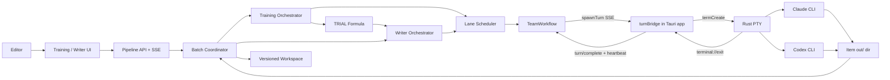
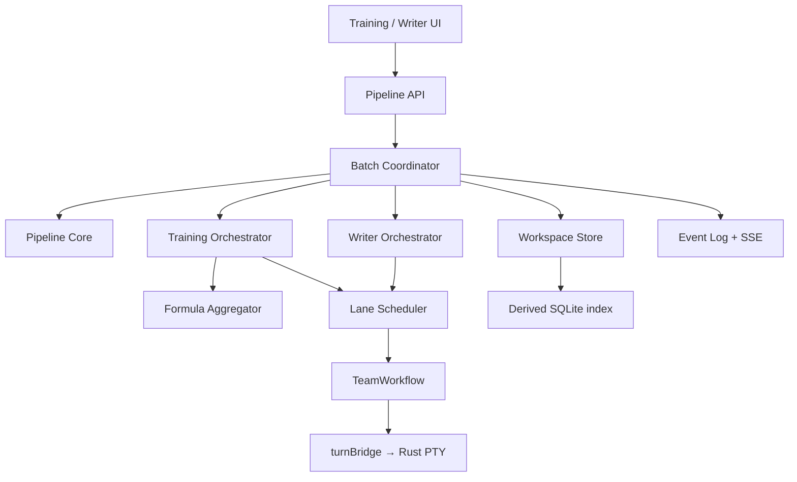
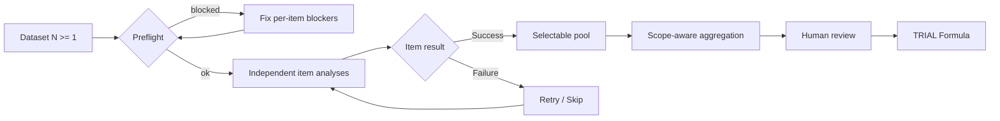

# Solution Design Document

## Validation Checklist

### CRITICAL GATES (Must Pass)

- [x] Training and Writer pipelines are both defined
- [x] Single-item, arbitrary batch, and partial-failure behavior are defined
- [x] Multi-channel input has an explicit workflow
- [x] Interfaces and component boundaries are specified
- [x] Agent Harness **state machine** is stable; its **executor edge is missing and is in scope** (GAP-1)
- [x] Every stage of both flows has a named owner, an input contract, and an output contract
- [x] Every failure mode has a detected state, a UI message, and a next action
- [x] Every screen has loading / empty / error / interrupted states
- [ ] All architecture decisions are confirmed by the user

### QUALITY CHECKS (Should Pass)

- [x] No hard limit is placed on the number of videos or titles in a batch
- [x] Agent-turn budgets are separated from batch item counts
- [x] Runtime and recovery paths are documented per item
- [x] Claude and Codex responsibilities are explicit
- [x] Real concurrency is stated honestly (agent clones + `maxParallel`, with the real ceiling named)
- [x] Full Formula validation, persistent KB, vector retrieval, and scale work remain deferred

---

## 0. Flow Interruption Audit (read this first)

The v0.3 plan described a correct **state machine** but assumed an execution layer that
does not exist in this repository. The table below is the audit of every place the flow
breaks, with the section that closes it. Items marked **BLOCKER** stop the flow entirely.

| ID | Gap found in v0.3 | Evidence in code | Impact | Closed by |
|---|---|---|---|---|
| GAP-1 | **BLOCKER** — The `turnBridge` is still deferred, so nothing consumes `spawnTurn`. The Rust PTY layer is shipped and already threads `turn_id` end to end; only the SSE→PTY→settle bridge is missing. Outside the daemon, `spawnTurn` appears only as a type declaration. | `workflow.ts:331` emits; `packages/shared/src/terminal.ts:191` type only; `agent-harness-architecture.md:376` "turnBridge — ❌ deferred (P-DEF-1b)"; `plan/deferred-agent-terminal-process.md` P-DEF-1b | Every dispatched turn sits in `running`, produces nothing, and dies at the 15-minute watchdog (`workflow.ts:10`). 100% of items fail. | §5.1 turnBridge, ADR-8 |
| GAP-2 | **BLOCKER** — Agent output has no return path. `turnComplete` carries only `exitCode`; nothing parses agent output. | `workflow.ts:355`, `http.ts:239` | The Analyzer's JSON never reaches the pipeline. No artifact can ever be committed. | §5.2 Agent I/O Contract, ADR-10 |
| GAP-3 | **BLOCKER** — Turn dedup silently merges two items. A second `requestTurn` for the same agent returns the *existing queued turn* and overwrites its `taskNote` + the single shared per-agent assignment row. | `workflow.ts:243-254`, `store.setAssignment` is keyed by `agentId` only | Item B hijacks item A's turn. Violates the "context isolation" acceptance criterion by construction. | §5.3 Lane scheduler, `exclusive: true` |
| GAP-4 | Batch concurrency had no mechanism. `dispatchNext` allows exactly one running turn per agent id. | `workflow.ts:271` | Without a per-turn agent clone, a "concurrency 4" control would be a lie. | §5.3 Agent Pool, ADR-9 |
| GAP-5 | Global guards kill mid-batch. `maxTurns`, `maxDurationMinutes` (measured from daemon boot), `maxQueueDepth`, `maxTurnsPerPair` reject turns with a `guard` event nobody handles. | `workflow.ts:200-229` | A 20-item × 4-stage batch (80 turns) pauses partway with no item-level explanation. | §5.4 Budget mapping |
| GAP-6 | Turn-key idempotency is unimplementable as written. `team_turns` has no key column; ids are autoincrement. | `packages/daemon/src/team/db.ts:56` | "Retry the same turn key" cannot be honored; duplicate dispatch after restart is possible. | §5.5 Stage ledger |
| GAP-7 | Daemon restart marks **every** in-flight turn `stale`, and `turnJobs` / `scopedBudgets` / watchdogs are in-memory only. | `store.reconcileStale()`, `workflow.ts:91-92` | A resumed item may double-write while the orphaned child process is still running. | §5.6 Attempt fencing, ADR-11 |
| GAP-8 | Transcript text was to be embedded in the turn prompt (argv). | `adapters.ts:102` (`args.push('--', turnPrompt)`) | A 60-minute transcript is 50–150 KB; several of them exceed the macOS `execve` argv limit → `E2BIG`, the spawn fails before the agent starts. | §5.2 (file-based prompts) |
| GAP-9 | Untrusted source text reaching team chat becomes control flow: `handleNewMessage` scans the message **body** for `@id` and spawns real turns. | `workflow.ts:187` | A transcript containing `@codex` triggers an unplanned turn. Prompt injection with a concrete effect. | §9 Security |
| GAP-10 | "Stop batch" was undefined against the harness. `workflow.stopAll()` sets a global `stopped` flag that disables the whole app until an explicit `reset()`. | `workflow.ts:446-460` | Stopping one batch would break manual agent use and every other batch. | §6.4 Stop semantics |
| GAP-11 | No preflight. Nothing verifies the agent binary, transcripts, channel ids, or disk before starting. | `agents.launchReadiness` exists but is unused by any flow | Failures surface 15 minutes into a run instead of at the click. | §7.2 Preflight |
| GAP-12 | SSE has no cursor or replay despite the plan requiring one. | `http.ts:280-307` sends live events only | A UI reconnect loses batch progress; the dashboard can show a stale/blank state forever. | §5.7 Event log |
| GAP-13 | Human gates can deadlock a batch. `HUMAN_WAIT` had no clone-reaping rule and no batch-level meaning. | — | Writer batch of 10 titles = 10 blocking modals; the batch never finishes if the user walks away. | §6.3, §7.5 Review queue |
| GAP-14 | Curated Pack has no claim IDs, so the "structural citation hard gate" has nothing to validate against. Existing packs are markdown blobs. | `packages/daemon/src/writer-packs.ts`, `WriterPack.markdown` | ADR-7's hard gate is unenforceable in MVP. | §8.3, ADR-12 |
| GAP-15 | Cost/usage per item has no source. PTY output is not captured; `codex exec` reports no usage. | `adapters.ts:87` (`--output-format stream-json` only helps if stdout is captured) | The stated cost metric cannot be produced. | §5.1 (bridge parses ring buffer), §10 |
| GAP-16 | Milestone order is circular: M1/M2 require agent analysis but M3 is where orchestration is proven. | §12 | M1's exit condition is unreachable. | §12 revised milestones |
| GAP-17 | Item run dir would be rejected as a cwd. `overrideCwd` is allowlisted to `<data>/workspaces` for interactive launches. | `packages/daemon/src/agents/index.ts:375-382` | Interactive debugging of a pipeline item throws. | §5.2 (run dirs live under `workspaces/`) |
| GAP-18 | Batch status derivation was ambiguous for mixed terminal/non-terminal sets. | §"Failure isolation" | UI shows a batch as finished while items still wait for a human. | §6.2 status table |

---

## Constraints

| ID | Constraint |
|---|---|
| CON-1 | The Agent Harness **state machine** (`TeamWorkflow`, `TeamStore`, MCP) is stable and must not be redesigned. The **process authority stays in the Rust PTY** (`agent-harness-architecture.md:19` — "Process authority ở Rust PTY. Workflow/MCP/state ở daemon. UI chỉ bridge."). The only missing piece is the deferred `turnBridge` (P-DEF-1b), which this MVP completes. No second execution stack is built. |
| CON-2 | A user may run one item or any user-selected batch size. Batch size is not a quality gate or execution cap. |
| CON-3 | Resource controls limit concurrency, time, turns, and cost per item; they do not require or prohibit a particular item count. |
| CON-4 | Formula Discovery accepts one or more videos. Small samples produce a usable `TRIAL` Formula with warnings, not a statistically validated Formula. |
| CON-5 | Training inputs may come from one or multiple channels; the batch never merges them. One video always yields one Formula, and combining Formulas is a human-curated Studio act (ADR-5, §12b). |
| CON-6 | Each batch item owns its state, checkpoint, attempts, artifacts, and error. Batch status is derived from item states. |
| CON-7 | One failed item must not rerun, invalidate, or overwrite successful sibling items. |
| CON-8 | Claude is the primary Analyzer/Author; Codex is the Reviewer/Critic. There is no silent fallback to Agy/Grok. |
| CON-9 | Application code owns state transitions, validation, hashes, aggregation inputs, and human approval. |
| CON-10 | MVP is local-first and single-user; versioned files are the pipeline source of truth. A SQLite index may be derived from them but is never authoritative. |
| CON-11 | Source content and agent output are untrusted data and cannot modify protected inputs, system instructions, or team-chat routing. |
| CON-12 | `TeamWorkflow` allows one running turn per **agent id** (`workflow.ts:271`). Parallelism is therefore achieved by **cloning the agent per turn**: the Settings agent is a template, and each dispatch registers an ephemeral clone (`claude-{batch}-{item}`) that owns exactly one turn. Real parallelism = number of live clones, capped by a user setting and by provider rate limits, not by the harness. |
| CON-13 | Pipeline runs execute in the Tauri app: the PTY owns the process, so a run needs the app open (browser-only = no PTY, `agent-harness-architecture.md:83`). Closing the app **pauses** the batch at the last committed checkpoint; it never corrupts or silently drops it. An unattended/headless fallback runner is deferred (§Technical Debt). |
| CON-14 | Full FormulaLoop validation, persistent Evidence KB, vector retrieval, multi-channel production calibration, and retention analysis are out of scope. |

This SDD supersedes the Training/Writer MVP execution and storage choices in `001-greenfield-training-writer-room`. It preserves that document's longer-term validation objectives and adopts the `ModelTask`/`TaskResult`, stage-ledger, and fencing concepts from `docs/plans/writer-training-architecture-v2.md` §4, §11.

## Implementation Context

### Required Context Sources

#### Documentation Context

| Source | Relevance | Purpose |
|---|---:|---|
| `docs/plans/writer-training-architecture-v2.md` | CRITICAL | Domain artifacts, Formula concepts, ModelTask/TaskResult, stage ledger, deferred phases |
| `docs/plans/copy-dna-spy-agent-terminal-architecture.md` | HIGH | Existing Agent Harness boundary |
| `docs/specs/001-greenfield-training-writer-room/solution-design.md` | MEDIUM | Long-term Training/Writer context |

#### Code Context

| Source | Relevance | Purpose |
|---|---:|---|
| `packages/daemon/src/team/workflow.ts` | CRITICAL | Turn dispatch, dedup, guards, watchdog, stop/interrupt semantics |
| `packages/daemon/src/harness.ts` | CRITICAL | Harness composition and event fan-out |
| `packages/daemon/src/agents/index.ts` | CRITICAL | `buildHeadlessTurnSpec`, cwd allowlist, MCP config writing |
| `packages/daemon/src/agents/adapters.ts` | HIGH | Claude/Codex argv shape, tool restrictions, headless limits |
| `packages/daemon/src/agents/defaults.ts` | HIGH | Claude/Codex profiles |
| `packages/daemon/src/team/store.ts` | HIGH | Turn rows, `reconcileStale`, assignment (per-agent, single row) |
| `src-tauri/src/terminal/mod.rs` | CRITICAL | PTY create/kill/exit event; already carries `turn_id` (`:44`, `:87`, `:385`) |
| `packages/daemon/src/http.ts` | HIGH | HTTP/SSE extension point |
| `packages/spy/src/source-pack.ts`, `packages/daemon/src/writer-packs.ts` | HIGH | Existing pack shape that the Curated Pack must extend |
| `packages/web/src/router.ts`, `packages/web/src/api.ts` | MEDIUM | UI route and client extension points |

#### External APIs (if applicable)

Training and Writer call agents only through the local Agent Harness. Videos/transcripts and
Curated Packs are imported inputs; automatic web research and provider-direct model calls
are not part of this MVP.

### Implementation Boundaries

**May add or modify**

- Shared pipeline contracts for dataset, batch, item, artifact, checkpoint, ledger, and event.
- **New:** `web/src/features/turn-bridge/` — completes deferred P-DEF-1b (additive; changes neither `TeamWorkflow` nor the Rust PTY).
- Formula Discovery core/orchestrator and Training UI.
- Writer core/orchestrator and Writer UI.
- Daemon APIs, SSE, filesystem workspace, and Harness adapters for these workflows.
- Curated Pack v1 (claim-addressable) alongside the existing markdown pack.
- Deterministic fixtures and a `stub` agent adapter for single, batch, mixed-channel, retry, and resume tests.

**Must not modify**

- `TeamWorkflow` / `TeamStore` / MCP internals, except three additive changes listed in §5.8, each separately approved.
- Spy extraction behavior.
- Persistent KB, vector indexing, or background verification.
- Agent-owned Formula publish, Writer approval, batch aggregation selection, or final export.

### External Interfaces

#### System Context Diagram



#### Interface Specifications

**Inbound interfaces**

| Interface | Input | Output |
|---|---|---|
| Dataset Builder | One or more videos + channel metadata (label only — no scope, ADR-5) | Immutable dataset revision + preflight report |
| Batch API | Workflow kind, dataset revision, item selection, budget | Batch plus independent item runs |
| Item Actions | Item ID, action, expected checkpoint hash | Retry, stop, skip, approve, or resume result |
| Formula Commit | One successful item's ANALYZE hash | One per-video Formula + provenance manifest |
| Formula Studio | Human-picked rule refs across videos, genre name | Clusters → LLM proposals → human-accepted compound Formula (§12b) |
| Writer Input | A Formula ref (per-video or compound), one or more titles, per-title Curated Pack | Independent Writer items |

**Outbound interfaces**

| Interface | Contract |
|---|---|
| Agent Harness | Bounded Claude/Codex turns correlated to batch, item, stage, and attempt via the stage ledger |
| turnBridge | Launches the spec as a read-only PTY pane, heartbeats from the ring buffer, reports exit + usage |
| Filesystem | Atomic immutable artifact write followed by manifest pointer commit |
| SSE | Ordered events containing batch ID, item ID, stage, status, artifact hash, and monotonic cursor with replay |

### Cross-Component Boundaries

- Pipeline Core defines generic batch/item lifecycle without Formula or Writer prompts.
- Training owns per-video analysis and Formula aggregation.
- Writer owns Thesis-to-export state transitions.
- Batch Coordinator schedules items and derives summary state; it never owns an item's domain state.
- Lane Scheduler owns "which item may hold the Claude/Codex lane right now"; it is the only caller of `workflow.requestTurn`.
- turnBridge owns turn→pane mapping only. Process lifetime belongs to the Rust PTY; it never interprets agent output.
- Agent Harness executes turns but cannot mark a pipeline item successful.
- UI renders server state and sends hash-bound actions; it cannot infer completion locally.
- Formula aggregation reads only explicitly selected, successful, hash-pinned analysis artifacts.

### Project Commands

```bash
Install:   bun install
Dev API:   bun run daemon
Dev App:   bun run app:macos
Test:      bun test packages/spy packages/daemon packages/pipeline-core packages/training-core packages/writer-core
Typecheck: bun run typecheck
UI Build:  bun run ui:build
App Build: bun run app:build
```

New Pipeline, Training, and Writer packages must be added to root test and typecheck commands
and to the workspace list in the root `package.json` (v2 §5 notes contracts left outside the
build graph as a known failure mode).

## Solution Strategy

- **Architecture pattern:** hierarchical artifact-driven state machines: `Project → Dataset Revision → Batch → Item Run → Attempt → Artifact`.
- **Execution:** single mode is a batch with one item; batch mode uses the same contracts with any number of items.
- **Execution ownership:** unchanged from the existing harness law — Rust PTY owns the process, daemon owns workflow/state, the client bridges. This MVP only finishes the deferred `turnBridge`.
- **Concurrency model:** the Settings agent is a template; each dispatched turn runs on its own ephemeral agent clone, so items run genuinely in parallel up to a configured cap.
- **Failure isolation:** items progress independently; the batch summary is derived as `RUNNING`, `NEEDS_ATTENTION`, `PARTIAL_SUCCESS`, `SUCCEEDED`, `FAILED`, or `CANCELLED`.
- **Truth rule:** exit code 0 is a hint. An item advances only when the app validates the artifact file the agent was told to write.
- **Fencing:** every dispatch carries `(itemId, stage, attempt)`; output written by a superseded attempt is discarded, never committed.
- **Formula Discovery:** analyze each video independently, then aggregate a user-selected set into a `TRIAL` Formula.
- **Multi-channel:** require an explicit scope—single-channel Formula, per-channel comparison, or cross-channel shared patterns.
- **Writer:** each title is an independent Writer item using a selected Formula and its own Curated Pack.
- **Safety:** configurable per-item execution budgets prevent loops; they never impose a batch-size limit.

## Building Block View

### Components



| Component | Responsibility |
|---|---|
| Pipeline Core | Dataset, batch, item, attempt, checkpoint, budget, ledger, and status contracts |
| Batch Coordinator | Queueing, item admission, stop scope, partial success, and summary state |
| Agent Pool | Clones the template agent per turn (`agents.save`), hands the clone id to the scheduler, and reaps the clone after settlement |
| Lane Scheduler | Single owner of `requestTurn`; enforces the configured parallel cap, applies scoped budgets, handles guard rejections as *retryable backpressure* rather than item failure |
| turnBridge | Single `spawnTurn` consumer; launches a read-only PTY pane per turn, heartbeats, kills on interrupt, calls `turnComplete` |
| Training Orchestrator | Per-video analysis and review stages |
| Formula Aggregator | Scope-aware Formula draft and provenance manifest |
| Writer Orchestrator | Thesis, Brief, Architecture, Draft, gates, Review, Repair, and export |
| Workspace Store | Atomic artifacts, hashes, manifests, resume, and invalidation |
| Event Log | Append-only per-batch `events.jsonl` + SSE with replay from cursor |
| Pipeline UI/API | Dataset setup, preflight, batch dashboard, item detail, human gates, and actions |

### Directory Map

```text
packages/
├── pipeline-core/                       # NEW: generic batch/item/attempt contracts + reducer
├── training-core/                       # NEW: analysis and Formula contracts + validators
├── writer-core/                         # NEW: Writer contracts, citation gate, validators
├── daemon/src/pipeline/
│   ├── lane-scheduler.ts                # NEW: one owner of requestTurn (GAP-3/4/5)
│   ├── ledger.ts                        # NEW: stage ledger + fencing (GAP-6/7)
│   ├── workspace.ts                     # NEW: atomic artifact commit
│   ├── events.ts                        # NEW: append-only event log + cursor replay (GAP-12)
│   └── preflight.ts                     # NEW: readiness checks (GAP-11)
├── daemon/src/training/                 # NEW: Training orchestration and aggregation
├── daemon/src/writer/                   # NEW: Writer orchestration
├── daemon/test/{pipeline,training,writer}/
├── web/src/features/turn-bridge/        # NEW: P-DEF-1b — the only spawnTurn consumer (GAP-1)
└── web/src/features/{datasets,batches,training,writer}/

writer-room-data/
└── workspaces/pipeline/                 # run dirs live under workspaces/ so the agent
    └── {workflowKind}/{projectId}/      #   cwd allowlist (agents/index.ts:375) accepts them
        ├── datasets/{revisionId}/
        └── batches/{batchId}/
            ├── batch-manifest.json
            ├── events.jsonl
            └── items/{itemId}/
                ├── item-manifest.json
                ├── input/               # app-written, agent-readable, agent MUST NOT write
                ├── attempts/{attempt}/{stage}/
                │   ├── prompt.md        # the real instruction (never argv — GAP-8)
                │   ├── out/             # the ONLY agent-writable directory
                │   ├── stdout.log
                │   └── turn.json
                └── artifacts/{stage}-v{n}.json    # committed, immutable
```

### Interface Specifications

#### Interface Documentation References

```yaml
interfaces:
  - name: Team Workflow
    source: packages/daemon/src/team/workflow.ts
    relevance: CRITICAL
  - name: Agent Manager (headless spec)
    source: packages/daemon/src/agents/index.ts
    relevance: CRITICAL
  - name: Agent Harness
    source: packages/daemon/src/harness.ts
    relevance: HIGH
  - name: Source Pack
    source: packages/spy/src/source-pack.ts
    relevance: MEDIUM
```

#### Data Storage Changes

No new authoritative database. Filesystem manifests remain the source of truth (CON-10);
a `pipeline-index.sqlite` is rebuilt from manifests on boot purely to keep list/summary
endpoints inside the p95 budget (GAP/§13 Performance).

```text
dataset-manifest.json
  revision_id, items[{item_id, source_id, channel_id, channel_title,
                      transcript_hash, input_hash, preflight: OK | BLOCKED, blockers[]}]
  execution_mode, created_at            # no formula_scope — a batch never merges (ADR-5)

batch-manifest.json
  batch_id, workflow_kind, dataset_revision_id
  item_refs[], max_parallel, budget, prompt_version, created_at
  paused: bool, stop_requested_at

item-manifest.json
  item_id, status, current_stage, attempt, epoch
  accepted_artifact_hashes{stage -> hash}
  pending_human_action, agent_turn_id, last_error{code,message,retryable}
  usage{durationMs, inputTokens?, outputTokens?, costUsd?}
  updated_at, checkpoint_hash

stage-ledger.jsonl                       # per item, append-only
  {turn_key, batch_id, item_id, stage, attempt, epoch, agent_id,
   turn_id, status, started_at, settled_at, artifact_hash?, error?}

formula-manifest.json                              # L1, one per video (§6.1a)
  formula_id, status: DRAFT | TRIAL | VALIDATED
  origin: ANALYZED | REFINED | COMPOUND, version, lineage
  channel_title                                    # label for filtering only, never a grouping key
  included_item_hashes[], warnings[], content_hash

studio-sessions/{sessionId}/…                      # L2 compound Formulas (§12b) — human-curated,
                                                    # genre-scoped, never produced by a batch
```

Artifacts are immutable. Retrying creates a new attempt only for the selected item and
invalidates only that item's downstream artifacts. Changing the dataset creates a new
revision; unchanged item analyses may be reused by input hash.

#### Internal API Changes

| Method | Path | Purpose |
|---|---|---|
| POST | `/api/training/datasets` | Create immutable dataset revision from any `N >= 1` videos |
| POST | `/api/training/datasets/:id/preflight` | Re-run readiness checks and return per-item blockers |
| POST | `/api/training/batches` | Start single or batch analysis (rejects if any selected item is `BLOCKED`) |
| GET | `/api/batches` | List batches with derived summary |
| GET | `/api/batches/:batchId` | Get summary and filterable item states |
| GET | `/api/batches/:batchId/items/:itemId` | Item detail: attempts, ledger rows, artifacts, last error, allowed actions |
| GET | `/api/batches/:batchId/items/:itemId/artifacts/:hash` | Read one committed artifact |
| GET | `/api/batches/:batchId/items/:itemId/log?attempt=&stage=` | Tail `stdout.log` for the run console |
| POST | `/api/batches/:batchId/items/:itemId/actions/:action` | `retry` \| `stop` \| `skip` \| `resume` \| `approve` \| `reject` |
| POST | `/api/batches/:batchId/actions/:action` | `pause` \| `resume` \| `stop` \| `retry-failed` \| `continue-with-successes` |
| POST | `/api/training/batches/:batchId/formulas` | Commit the per-video Formula for each successful item; returns N Formulas, one per video, never merged (§6.1a, ADR-5) |
| — | Formula Studio endpoints (`/api/studio/*`) | Merging/compounding lives entirely here, human-driven — see §12b |
| POST | `/api/writer/batches` | Create one-title or multi-title Writer batch; each item independently pins its own `formulaVersionId` (§6.3) |
| POST | `/api/writer/items/:itemId/actions/:action` | `select-thesis` \| `lock-brief` \| `approve` \| `reject` \| `export` |
| GET | `/api/writer/items/:itemId/export` | Download the export bundle |
| GET | `/api/batches/:batchId/events?cursor=N` | SSE with monotonic cursor, replay from cursor, and item correlation |
| GET | `/api/pipeline/health` | Bridge connected, live clones vs `maxParallel`, agent binaries detected, queue depth, guard headroom |

All mutations use `command_id` (idempotent replay). Item retries include
`expected_checkpoint_hash`; aggregation includes exact selected artifact hashes. A hash
mismatch returns `409 STALE_ACTION` with the current state so the UI can refresh instead of
silently applying a stale decision.

#### Application Data Models

```text
DatasetRevision
  items[]; executionMode: SINGLE | BATCH
  # no formulaScope — a batch never merges anything (ADR-5); one video in, one Formula out

BatchRun
  workflowKind: FORMULA_DISCOVERY | WRITER
  itemRefs[]; maxParallel; perItemBudget; paused
  status: derived from items (see §6.2)

ItemRun
  status: QUEUED | WAITING_LANE | RUNNING | VALIDATING | HUMAN_WAIT
        | SUCCEEDED | FAILED | SKIPPED | CANCELLED | INTERRUPTED
  stage; attempt; epoch; inputHashes; checkpointHash; error

FormulaArtifact                          # L1 — the atomic unit (§12b), produced by ANALYZE
  status: DRAFT | TRIAL | VALIDATED
  origin: ANALYZED                       # the only origin a batch can produce (ADR-5)
  version; lineage
  videoSnapshotId; channelTitle          # channelTitle = display/filter label, not a key
  rules; includedArtifacts; warnings
  # REFINED (Training Lab) and COMPOUND (Studio) are the SAME type — see §8.2/ADR-14

WriterItem
  formulaRef: { formulaId, contentHash }   # any origin — the Writer does not care which
                                          # pinned per item, not per batch (§6.3) — a batch may
                                          # write several titles in parallel, each against a
                                          # different Formula (per-video or compound)
  authorAgentId = "claude"; criticAgentId = "codex"
  reviewLimit = 2; repairLimit = 1; schemaRepairLimit = 1; turnBudget
```

#### Integration Points

| From | To | Protocol | Rule |
|---|---|---|---|
| Batch Coordinator | Training/Writer Orchestrator | Typed in-process call | One item and stage per dispatch |
| Orchestrators | Lane Scheduler | Typed in-process call | Only the scheduler may call `requestTurn` |
| Lane Scheduler | TeamWorkflow | Typed in-process call | Always `exclusive: true`, `orchestrated: true`, scoped `budget`, `freshContext` per policy |
| TeamWorkflow | turnBridge | SSE (`spawnTurn`) | Bridge launches exactly one pane per turnId; never re-interprets the job |
| turnBridge | Workspace (via API) | HTTP | Snapshots ring buffer to `stdout.log`, writes `turn.json` only |
| Orchestrators | Workspace | Filesystem | Artifact commit precedes manifest update |
| API | Web UI | HTTP + SSE | Server is authoritative; cursor supports reconnect and replay |

---

## 5. Execution Layer (new — closes the blockers)

### 5.1 turnBridge — completing P-DEF-1b (GAP-1, GAP-15)

`TeamWorkflow` already emits everything needed to run a turn, and the Rust PTY already
accepts and returns `turn_id` (`src-tauri/src/terminal/mod.rs:44`, `:87`, `:385`). What is
missing is the bridge between them — the deferred **P-DEF-1b turnBridge**. This MVP finishes
it. Process authority stays in Rust; the daemon keeps workflow/state; the UI stays a bridge
(`agent-harness-architecture.md:19`). **No second execution stack is introduced.**

Lives in `packages/web/src/features/turn-bridge/`, mounted once at app root (not inside the
terminal drawer, so it runs whether or not the drawer is open).

```text
TURN_BRIDGE (client, single instance):
  EventSource('/api/team/events')          # reconnect with backoff; on reconnect, re-sync
                                           # running turns via GET /api/team/status
  on 'spawnTurn' { turnId, agentId, spec, injectText, forceHeadless, interactiveRequired }:
    1. Claim the turn locally (Set<turnId>) — never launch the same turnId twice.
    2. interactiveRequired → inject `injectText` into that agent's open pane
       (Board path; the pipeline never sets this flag).
       forceHeadless (what pipeline turns always get, workflow.ts:339)
         → terminals.launchTab({ ...spec, turnId, readOnly: true, title: `${agentId} · ${stage}` })
    3. Poll the pane's ring-buffer sequence every ~10 s; if it advanced,
       POST /api/team/turn/heartbeat { turnId }  → feeds the stall watchdog (workflow.ts:171)
  on 'terminal://exit' { sessionId, exitCode, turnId }:
    4. POST /api/team/turn/complete { turnId, exitCode }
       (also snapshot the ring buffer to attempts/{attempt}/{stage}/stdout.log via the API)
  on 'interrupt' { turnIds } / 'turnTimeout':
    5. termKill(session) for each owned turnId; the exit event settles it as usual.
  on window unload:
    6. POST /api/team/interrupt for every claimed turn, so nothing is left half-running.
```

Rules:

- The bridge is the **only** `spawnTurn` consumer. If a second one is ever added, both must
  claim the turn in the ledger before launching (§5.5) or the turn runs twice.
- The bridge never reads `out/`. Validation belongs to the orchestrator.
- Pipeline turns launch as **read-only headless panes** — visible and inspectable, but the
  user cannot type into them and corrupt a run. The user-driven interactive Launch button on
  the Agents page is unchanged.
- One pane per running turn, bounded by `maxParallel` (§5.3) — never by batch size. Panes are
  collapsed by default and labelled `{agent} · {item} · {stage}`.

**Usage/cost.** Claude headless already runs with `--output-format stream-json`
(`adapters.ts:87`); its usage line arrives last, so the bounded ring buffer retains it. The
bridge parses the tail on exit — best effort, Claude only (GAP-15).

**What "app closed" means.** No PTY → no execution. The batch pauses at its last committed
checkpoint; on reopen, boot recovery (§5.6) marks affected items `INTERRUPTED` and requeues
them as new attempts. Nothing is lost, but nothing progresses either — this is a deliberate
consequence of CON-1/CON-13, surfaced in the UI (§7.4), not a defect.

### 5.2 Agent I/O Contract (GAP-2, GAP-8, GAP-17)

There is no structured channel back from a CLI agent. The contract is therefore **file-based**.

Per `(item, stage, attempt)` the app writes, before dispatch:

```text
input/envelope.json         # typed, app-owned: task kind, schema version, ids, constraints
input/source.txt            # untrusted source text, delimited (§9)
attempts/{attempt}/{stage}/prompt.md
attempts/{attempt}/{stage}/out/            # created empty; the ONLY writable target
```

`prompt.md` is the real instruction. The turn's `taskNote` is a short pointer only:

```text
Read <abs>/prompt.md and follow it. Write your result to
<abs>/out/result.json. Do not write anywhere else. Reply "done" when the file exists.
```

Why: passing the transcript in argv hits the macOS `execve` limit (GAP-8) and leaves no
inspectable record. A file also makes the exact prompt auditable and re-runnable by hand.

Dispatch options used by the Lane Scheduler:

| Option | Value | Reason |
|---|---|---|
| `orchestrated` | `true` | Adds `--strict-mcp-config --permission-mode dontAsk --disallowedTools Bash,Task,Skill` for Claude (`adapters.ts:93-101`) |
| `allowedTools` | `['Read','Write','Glob']` | No `mcp__team` for pipeline turns — the pipeline must not be able to post into team chat (GAP-9) |
| `overrideCwd` | the item run dir under `workspaces/` | Satisfies the cwd allowlist (`agents/index.ts:375`) and confines relative paths |
| `skipWorktree` | `true` | Pipeline items are data runs, not code edits |
| `freshContext` | `true` for Codex review and for every repair | v2 §9.7; prevents the critic inheriting the author's session |
| `exclusive` | `true` | Never attach to another item's queued turn (GAP-3) |
| `stallMs` | 180 000 | Kill a hung pane in ~3 min instead of burning the full timeout |
| `timeoutMs` | per stage, default 900 000 | Absolute cap |
| `budget` | `{ scope: batchId, maxTurns, maxDurationMinutes, cooldownSeconds }` | Bypasses the global guard (§5.4) |

**Commit rule (the truth rule).** On `turnSettled`:

```text
1. exitCode !== 0        → attempt failed (code AGENT_EXIT), retryable.
2. out/result.json missing → AGENT_NO_OUTPUT, retryable once, then FAILED.
3. JSON parse / schema fail → AGENT_SCHEMA, ONE schema-repair attempt (v2 §9.7), then FAILED.
4. Output references ids not present in the pinned input → AGENT_UNGROUNDED, not retryable.
5. Any file written outside out/ → AGENT_SANDBOX_VIOLATION, item FAILED, flagged in audit.
6. Otherwise: hash content → write artifacts/{stage}-v{n}.json → fsync → atomically
   rename item-manifest.json → emit event.
```

Exit code 0 with no valid artifact is a failure. Exit code non-zero with a valid artifact is
still a failure (the agent may have been killed mid-write) — validation runs first, and a
non-zero exit only lets the artifact be accepted if its hash matches a complete parse.

**Codex specifics.** `codex exec` gets no auto-wired MCP (`adapters.ts:135`) and runs with
`--dangerously-bypass-approvals-and-sandbox` (`defaults.ts:CODEX_DEFAULT_ARGS`). It therefore
cannot be technically confined; rule 5 above is a **post-hoc detector** (the app snapshots the
run dir tree before and after and compares), not a sandbox. This is stated as a known
limitation in §Technical Debt rather than claimed as enforcement.

### 5.3 Agent Pool + Lane Scheduler (GAP-3, GAP-4)

The harness caps one running turn per **agent id**, so parallelism comes from cloning the
agent, not from queueing harder. The agent configured in Settings is a **template**; every
dispatch gets its own clone.

```text
ACQUIRE(item, stage):
  template = agents.get(templateIdFor(stage))          # 'claude' | 'codex'
  cloneId  = `${template.id}-${shortBatch}-${shortItem}-a${attempt}`   # kebab-case, ≤41 chars
  agents.save({ ...template, id: cloneId, name: `${template.name} · ${itemLabel}`,
                projectRoot: itemRunDir,               # NOT the repo root — see reaping rule
                workingDirectoryMode: 'project', ephemeral: true })
  return cloneId

ADMIT(item):
  if liveClones >= maxParallel → item.status = WAITING_LANE; enqueue; return
  cloneId = ACQUIRE(item, stage)
  r = workflow.requestTurn(cloneId, 'assignment', undefined, { ...jobOptions, exclusive: true })
  if r.ok === false:
     guard/backpressure reason → REAP(cloneId); keep item WAITING_LANE; retry with backoff
     else                      → REAP(cloneId); item FAILED with AGENT_UNAVAILABLE
  else: record turn_key → (turnId, cloneId) in the ledger; item.status = RUNNING

REAP(cloneId):  on turnSettled / stop / boot recovery
  remove the config entry + `agents/mcp-{cloneId}.json`
```

What cloning buys, beyond parallelism:

- **GAP-3 disappears structurally.** The queued-turn dedup at `workflow.ts:243` only collides
  within one agent id; one turn per clone means two items can never merge into one turn.
- **Session isolation is free.** `store.resumeRef(agentId)` and `team_agent_state` are keyed
  by agent id, so each clone starts clean — exactly the context isolation the SDD requires.
- **Per-item stop is exact.** `interruptAgent(cloneId)` kills only that item's work.

Three code facts that constrain the implementation:

1. **Id format.** `validateAgent` enforces `^[a-z0-9][a-z0-9-]{0,40}$` (`config.ts:29`), so
   clone ids are kebab-case and ≤41 chars. No `claude#1`.
2. **⚠ Never call `agents.delete()` on a clone whose `projectRoot` is the repo root.**
   `AgentManager.delete` removes `<projectRoot>/AGENTS.override.md` and
   `<projectRoot>/.gemini/system.md` (`agents/index.ts:118-126`) — reaping clones would
   delete the repo's tracked `AGENTS.override.md`. Reaping therefore either sets the clone's
   `projectRoot` to the item run dir (preferred, and it is where `prepareAgentPrompt` should
   write anyway) or removes the config entry directly without the file-cleanup path.
3. **Clones must not pollute the Agents page.** They carry `ephemeral: true`; `GET /api/agents`
   and the Settings UI filter them out, while `GET /api/pipeline/health` lists them.

**The cap is a user setting, not an architectural constant.** `maxParallel` (default 3) is the
only knob. Runs are attended and initiated deliberately, so provider usage limits get no
special handling: if the Claude CLI exits non-zero on a usage limit, the item takes the
ordinary `AGENT_EXIT` path (§6.5) — failed, retryable, reason and log visible, retried by the
user when the limit resets. No backoff machinery, no dedicated error code.

The two things that do scale with `maxParallel`: cost (bounded by the per-batch scoped
budget, §5.4) and machine load (one CLI process and one read-only PTY pane per running turn).

`HUMAN_WAIT` reaps its clone immediately (a human gate must never hold a slot — GAP-13); a
new clone is acquired when the item resumes.

### 5.4 Guard and budget mapping (GAP-5)

`requestTurn` applies, in order: scoped budget → global `maxTurns` → global
`maxDurationMinutes` (since daemon boot!) → `maxQueueDepth` → `maxTurnsPerPair`
(`workflow.ts:200-229`).

| Guard | Pipeline handling |
|---|---|
| `maxTurns` / `maxDurationMinutes` | Bypassed by always passing `job.budget` (the code takes the scoped branch, `workflow.ts:209-216`). Scope = `batchId`. |
| Scoped `maxTurns` exhausted | Batch enters `NEEDS_ATTENTION` with `BATCH_BUDGET_EXHAUSTED`; UI offers "Cấp thêm budget" → `workflow.resetBudgetScope(batchId)` + a new explicit budget (never automatic). |
| `maxQueueDepth` (10) | Not a concern: the scheduler admits only up to `maxParallel`, and `requestTurn` dispatches synchronously, so queued depth stays ~0. It matters only if `cooldownSeconds` is left non-zero, which pipeline turns must not do. |
| `maxTurnsPerPair` | Not applicable — pipeline turns pass no `senderAgentId`. Documented so nobody adds one. |
| `cooldownSeconds` | Supplied per batch via `job.budget.cooldownSeconds`; default 0 for pipeline runs (the global 15s chat default would idle every clone between stages). |
| Scoped budget lost on restart | In-memory (`workflow.ts:92`). On boot the pipeline recomputes turns spent from the ledger and re-seeds the scope before resuming (§5.6). |

### 5.5 Stage ledger and turn key (GAP-6)

```text
turn_key = sha256(batchId | itemId | stage | attempt | sorted(inputHashes) | promptVersion)
```

`team_turns` cannot hold this (no key column, `db.ts:56`), so the ledger is pipeline-owned:
an append-only `stage-ledger.jsonl` per item, indexed in `pipeline-index.sqlite` with a
unique index on `turn_key`. Dispatch is idempotent because the scheduler refuses to create a
second row for an existing `turn_key` in a non-terminal state — it re-attaches to the
recorded `turnId` instead.

### 5.6 Restart, fencing, and orphan recovery (GAP-7)

`store.reconcileStale()` marks every `queued`/`running` turn `stale` at boot, and
`turnJobs`/`scopedBudgets`/watchdogs are in-memory. So after a restart the harness has no
memory of an in-flight turn — but the child process may still be alive and still writing.

```text
BOOT_RECOVERY:
1. Read every batch manifest; rebuild the SQLite index.
2. For each ledger row in RUNNING:
     a. Read turn.json → pid. If the pid is alive and its start time matches, SIGKILL it.
     b. Mark the row INTERRUPTED (not FAILED — it was not the agent's fault).
     c. item.epoch += 1. The stale attempt dir is retained for audit and never committed.
3. Re-seed scoped budgets from ledger turn counts.
4. Items whose last committed stage is complete resume at the next stage.
   Items interrupted mid-stage go to status INTERRUPTED and are auto-requeued as a NEW
   attempt (attempt += 1), unless the batch was explicitly paused/stopped before the crash.
5. Emit a `recovered` event per item so the UI shows a "Đã khôi phục sau khi khởi động lại"
   banner instead of a silent jump.
```

**Fencing.** A superseded attempt can still write into its own `attempts/{n}/` directory; it
can never be committed because the commit step requires `attempt == item.attempt` and
`epoch == item.epoch`. Late `turnSettled` for a superseded turn is logged and dropped.

### 5.7 Event log and SSE replay (GAP-12)

Pipeline events are appended to `batches/{batchId}/events.jsonl` with a monotonic `cursor`
before they are broadcast. `GET /api/batches/:id/events?cursor=N` replays from `N` and then
streams live, honouring `Last-Event-ID`. The daemon's existing `/api/team/events` is left as
is (raw harness events); the pipeline never depends on it.

Event kinds: `item.stage.started`, `item.stage.settled`, `item.status`, `item.human_wait`,
`item.recovered`, `batch.status`, `batch.throttled`, `batch.budget`, `preflight.result`,
`log.append` (tail lines, sampled).

### 5.8 The three additive harness changes that require approval

Everything above avoids touching `TeamWorkflow` except these, each small and additive:

1. None required for execution — the bridge consumes the existing `/api/team/events` SSE
   and the existing `/api/team/turn/{complete,heartbeat}` routes. **Zero** harness change.
2. `AgentManager` workspace roots (`harness.ts:70`) — add the pipeline run root so
   interactive debugging of an item is possible (`agents/index.ts:377`).
3. `handleNewMessage` (`workflow.ts:187`) — restrict `@id` body scanning to messages whose
   sender is a human or agent, never to app-injected content (GAP-9). Alternative with no
   harness change: the pipeline never writes source text into team messages. **Chosen:
   the alternative**; item 3 becomes a documented rule, not a code change.

---

## 6. Runtime View

### 6.1 Primary Flow A: Discover a Formula

1. User chooses `Formula Discovery`, then Single or Batch.
2. User adds any number of videos. Channel identity comes from the Spy snapshot, never from
   the agent; a video with no resolvable channel is `BLOCKED` at preflight with the action
   "Chọn channel thủ công".
3. **Preflight runs before the Start button enables** (§7.2): agent binary detected, Claude
   and Codex reachable, transcript present and non-empty per item, input hashes computed,
   disk space, budget estimate.
4. **No scope decision exists.** One video always yields one Formula (`origin: ANALYZED`),
   whether the batch spans one channel or ten (ADR-5). Merging rules across videos into a
   genre Formula is a separate, human-driven Studio session (§12b), never part of a batch.
5. Each item runs `ANALYZE` (Claude) → `REVIEW` (Codex, optional per config) → `VALIDATED`.
   The scheduler holds items in `WAITING_LANE` when the lane is busy; the dashboard shows the
   queue position so a waiting item never looks stuck.
6. Item results appear as they finish. Failures do not stop successful siblings.
7. User retries failed items, skips them, waits, or chooses `Continue with successful items`.
8. Formula Aggregator uses only selected successful artifact hashes.
9. User reviews and publishes a `TRIAL` Formula. Full validation is deferred.



**Item stage machine (Training)**

| Stage | Owner | Input | Output artifact | Gate |
|---|---|---|---|---|
| `PREPARE` | app | dataset item | `input/envelope.json` | input hash pinned |
| `ANALYZE` | Claude | envelope + transcript | `analysis-v{n}.json` | schema + every claim references a transcript locator |
| `REVIEW` | Codex (fresh context) | analysis only | `analysis-review-v{n}.json` | schema; verdict ∈ {accept, revise, reject} |
| `REPAIR` | Claude | analysis + review | `analysis-v{n+1}.json` | max 1, then `FAILED` |
| `DONE` | app | accepted analysis | checkpoint hash | selectable for aggregation |

### 6.1a Batch training: N videos in parallel, N independent Formulas (M2, ADR-5)

**M2 scales execution, not interpretation.** A training batch takes any `N ≥ 1` videos and
produces exactly `N` per-video Formulas. It performs **no cross-item aggregation whatsoever** —
no channel grouping, no merged Formula, no comparison report. Merging is a separate,
human-driven act in the Formula Studio (§12b). This is ADR-5.

**Execution is channel-blind by design.** The Lane Scheduler (§5.3) dispatches by
`(batchId, itemId, stage)` and clones one agent per item; nothing in `ACQUIRE`/`ADMIT`/`REAP`
reads `channel_id`. A batch of 5 videos from one channel and a batch of 5 videos from 5
different channels run **identically** — same `maxParallel` cap, same retry/skip semantics,
same partial-success rules (ADR-4). Same-channel vs cross-channel is not a mode the pipeline
has; it is only a property of what the user happened to select.

This is why M2 needs no scheduler, budget, or status change: §5.3, §5.4 and §6.2 are already
correct for it. What M2 actually adds is the batch *dataset/UI* layer — selecting N videos,
per-item preflight, the dashboard, per-item retry — over machinery M0.5/M1 already proved live.

```text
TRAIN_BATCH(videos[]):
  for each video (up to maxParallel concurrently):
     PREPARE → ANALYZE → (REVIEW) → DONE     # §6.1 item stage machine, unchanged
     commit FormulaArtifact { origin: ANALYZED, status: TRIAL, channelTitle: <label only> }
  → N independent Formulas, each independently retryable, promotable, and refinable
    in the Training Lab (§12a)
```

`channel_id` / `channelTitle` stays on every item and every Formula, but purely as a **label
for filtering and display** in the Studio's rule browser — never as a grouping key that changes
what gets produced. `SCOPE_REQUIRED` (§6.5) is deleted: a multi-channel dataset needs no scope
decision, because a batch never merges anything.

`LOW_SAMPLE` (§6.5) is likewise no longer a batch-level concept. Every per-video Formula is by
definition single-sample; that is its nature, not a warning. Sample size becomes meaningful only
in the Studio, where a compound Formula records how many videos its rules were drawn from.

**Post-batch, the user has N per-video Formulas and three independent choices**, none automatic:
1. Refine any one of them through the Training Lab loop (§12a).
2. Write a script directly against any one of them (§6.3).
3. Take rules from several of them into the Formula Studio to build a genre Formula (§12b).

### 6.2 Batch status derivation (GAP-18)

Evaluated in order; the first match wins.

| Condition | Batch status |
|---|---|
| `stop_requested` and no item is RUNNING/VALIDATING | `CANCELLED` |
| Any item in QUEUED / WAITING_LANE / RUNNING / VALIDATING | `RUNNING` |
| No item running, and ≥1 item in HUMAN_WAIT / INTERRUPTED / FAILED-retryable | `NEEDS_ATTENTION` |
| All items SUCCEEDED | `SUCCEEDED` |
| ≥1 SUCCEEDED and ≥1 FAILED/SKIPPED/CANCELLED, none pending | `PARTIAL_SUCCESS` |
| No item SUCCEEDED, none pending | `FAILED` |

`NEEDS_ATTENTION` is the state v0.3 was missing: it distinguishes "the machine is done, you
are not" from "finished". The dashboard header and the app's nav badge both surface it.

### 6.3 Primary Flow B: Write one or many scripts

1. User adds one or more title items. Each item independently pins its own Formula (status shown
   inline: `TRIAL` badge) and its own Curated Pack — **not** one Formula for the whole batch. The
   picker offers every origin interchangeably (§8.2): a per-video (`ANALYZED`/`REFINED`) or a
   **compound genre** Formula (`COMPOUND`); both are hash-pinned identically and the Writer treats
   them the same. This is what lets one batch write several titles in parallel against different
   Formulas — the batch is just a set of independently-pinned items, exactly like the Training
   side (§6.1a). Writing a title with a compound Formula is precisely the "thử viết bài mới" test
   that tells the user whether that genre Formula is any good.
2. Preflight per item: Formula pinned by hash, pack has ≥1 claim, pack hash pinned, agents ready.
3. Claude proposes 3–5 Thesis candidates per item → item enters `HUMAN_WAIT (select-thesis)`
   and **reaps its clone** so other items keep moving.
4. User selects a Thesis from the review queue (§7.5). `auto_select_top` may be enabled per
   batch to skip this gate; the choice is recorded as `selectedBy: auto` in provenance.
5. Claude produces Brief → Architecture → Draft. Structural citation validation runs per item
   after Draft (app code, deterministic).
6. Codex reviews with fresh item context; Claude repairs within budget
   (2 reviews, 1 repair, 1 schema repair — v2 §9.7). Exhaustion →
   `REVIEW_BUDGET_EXHAUSTED`, which is a *human decision point*, not a failure.
7. `PUBLISH_READY` → item enters `HUMAN_WAIT (approve)`.
8. Successful items can be approved and exported while other items remain queued, failed, or
   awaiting human action.
9. Batch export lists successful, failed, skipped, and pending items; it never presents
   partial output as complete, and the export manifest names every exclusion.

**Item stage machine (Writer)**

| Stage | Owner | Output | Human gate |
|---|---|---|---|
| `THESIS` | Claude | `thesis-candidates.json` | select (or auto) |
| `BRIEF` | Claude | `story-brief.json` | optional lock |
| `ARCHITECTURE` | Claude | `architecture-v{n}.json` | — |
| `DRAFT` | Claude | `draft-v{n}.md` | — |
| `CITATION_GATE` | app code | `citation-report-v{n}.json` | hard gate |
| `REVIEW` | Codex (fresh) | `review-v{n}.json` | — |
| `REPAIR` | Claude | `draft-v{n+1}.md` | max 1 |
| `APPROVE` | human | `approval.json` | required |
| `EXPORT` | app | `export-manifest.json` + bundle | — |

### 6.4 Stop, pause, and cancel semantics (GAP-10)

| User action | Implementation | Explicitly NOT |
|---|---|---|
| Stop one item | `workflow.interruptTurn(turnId)` + item → `CANCELLED`; bridge `termKill`s that pane only | not `interruptAgent` — safe now that each item owns a clone, but still wrong if a clone is ever reused |
| Pause batch | `batch.paused = true`; scheduler admits nothing new; running items finish and commit | not a kill |
| Stop batch | pause + `interruptTurn` for every running item of this batch | **never** `workflow.stopAll()` — it sets a global `stopped` flag (`workflow.ts:446`) that disables every other batch and manual agent use until an explicit `reset()` |
| Stop everything (panic) | explicit separate button in Settings → `stopAll()` + a visible "Đã dừng toàn bộ — bấm Reset để chạy lại" banner | not reachable from a batch screen |

### 6.5 Error Handling

The full error catalog, with the state each error produces, what the user sees, and whether
the system retries by itself.

| Code | Cause | Detection | Item state | UI message (VN) | Next action | Auto-retry |
|---|---|---|---|---|---|---|
| `AGENT_UNAVAILABLE` | binary missing / agent disabled | preflight, or `requestTurn` reject | `FAILED` | "Không tìm thấy Claude/Codex CLI" | mở Settings → Agents → Detect | no |
| `AGENT_EXIT` | non-zero exit | PTY exit event | `FAILED` (retryable) | "Agent thoát với mã {n}" + link log | Thử lại | 1× auto, then human |
| `AGENT_TIMEOUT` | hard cap `timeoutMs` | watchdog | `FAILED` (retryable) | "Quá {m} phút — đã dừng" | Thử lại / tăng budget | no |
| `AGENT_STALL` | no output for `stallMs` | watchdog | `FAILED` (retryable) | "Agent treo {s}s không phản hồi" | Thử lại | 1× auto |
| `AGENT_NO_OUTPUT` | `out/result.json` missing | commit rule 2 | `FAILED` (retryable) | "Agent chạy xong nhưng không ghi kết quả" | Thử lại / xem log | 1× auto |
| `AGENT_SCHEMA` | invalid JSON/schema | validator | `FAILED` | "Kết quả sai định dạng" + diff | Thử lại (1 lần sửa schema) | 1 schema-repair |
| `AGENT_UNGROUNDED` | ids not in pinned input | validator | `FAILED` | "Agent trích dẫn dữ liệu không có trong nguồn" | Thử lại / bỏ qua item | no |
| `AGENT_SANDBOX_VIOLATION` | wrote outside `out/` | tree diff | `FAILED` | "Agent ghi ra ngoài thư mục cho phép" | báo cáo + bỏ qua | no |
| `LANE_BUSY` | đã đạt `maxParallel` | scheduler | `WAITING_LANE` | "Đang chờ lượt ({k} trong hàng)" | chờ / tăng maxParallel / Stop | yes (backpressure) |
| `BATCH_BUDGET_EXHAUSTED` | scoped budget spent | scheduler | batch `NEEDS_ATTENTION` | "Hết budget của batch" | Cấp thêm budget | no |
| `INPUT_MISSING_TRANSCRIPT` | no transcript | preflight | `BLOCKED` | "Video chưa có transcript" | nút "Tải transcript" (gọi Spy) | no |
| `INPUT_NO_CHANNEL` | channel unresolved | preflight | `BLOCKED` | "Chưa xác định được channel" | chọn channel thủ công | no |
| `STUDIO_RULE_UNGROUNDED` | synthesized compound rule has empty `sources[]` | Studio validator (§12b) | proposal rejected | "Rule ghép không truy được về video nguồn" | tổng hợp lại / sửa tay | no |
| `STUDIO_EVIDENCE_OUT_OF_SCOPE` | critique cites a `videoSnapshotId` outside the compound's provenance set | `validateCritique` (§12b) | `FAILED` (retryable) | "Agent trích dẫn video không nằm trong formula này" | Thử lại | no |
| `STALE_ACTION` | checkpoint hash mismatch | API 409 | unchanged | "Trạng thái đã thay đổi — đã tải lại" | thao tác lại | auto-refresh |
| `AGGREGATION_STALE` | included artifact changed | aggregator | Formula draft stale | "Nguồn đã đổi — cần tổng hợp lại" | Tổng hợp lại | no |
| `INTERRUPTED` | daemon restart/crash | boot recovery | `INTERRUPTED` → requeued | "Đã khôi phục sau khởi động lại" | tự chạy tiếp | yes (new attempt) |
| `CITATION_FAILED` | structural gate fail | app code | back to `REPAIR` or `FAILED` | "{n} trích dẫn không hợp lệ" + danh sách | sửa / duyệt thủ công | within repair budget |
| `REVIEW_BUDGET_EXHAUSTED` | 2 reviews + 1 repair used | orchestrator | `HUMAN_WAIT` | "Đã hết lượt review tự động" | duyệt tay / chạy lại với budget mới | no |

Retry policy summary: at most **one** automatic retry per attempt class, always with a new
attempt number and a new epoch; everything else is an explicit human action. The harness's own
`maxWakeRetries` loop is bypassed because pipeline turns are `orchestrated: true`, which
settles once without auto-retry (`workflow.ts:374-385`) — the pipeline owns retry, exactly as
the code comment intends.

### 6.6 Complex Logic

```text
RETRY_ITEM(batchId, itemId, failedStage, expectedCheckpointHash):
1. Verify item checkpoint hash; 409 STALE_ACTION on mismatch.
2. Confirm no unsettled turn for this item; if one exists, interruptTurn first.
3. Preserve successful sibling item manifests unchanged.
4. attempt += 1; epoch += 1 (fences any late write from the previous attempt).
5. Invalidate only downstream artifacts of that item (mark stale, never delete).
6. Enqueue at the failed stage; the lane scheduler admits it when a lane frees.
7. Validate and commit the new artifact before advancing the item.
8. Recalculate batch summary from all item states.

COMMIT_FORMULA(item):                  # per video — there is no cross-item aggregation (ADR-5)
1. Require the item's ANALYZE artifact to be successful.
2. Verify its artifact hash still matches on disk; abort with AGGREGATION_STALE.
3. Pin the analysis artifact hash, videoSnapshotId, and channelTitle (label only).
4. Emit rules with their evidence; origin = ANALYZED, version = 1.
5. Never assign VALIDATED status in the MVP.

STUDIO_MERGE(pickedRules[]):           # §12b — human-gated at both ends, never auto-invoked
1. CLUSTER(pickedRules) — deterministic app code, no LLM: identical/near-identical → merge
   candidate; same facet + different tactic → conflict surfaced for a human decision; unique
   → single-rule (`SINGLE`) cluster, not auto-carried (ADR-15).
2. For every cluster the human approved for merging — including `SINGLE` — one bounded LLM
   turn proposes generic wording, carrying the union of member `sources[]`. `CARRIED` results
   only from an explicit human "keep original wording" choice on a proposal. Empty sources
   ⇒ STUDIO_RULE_UNGROUNDED.
3. Human accepts / edits / rejects each proposal individually; nothing commits without that.
4. Emit FormulaArtifact { origin: COMPOUND, genre, rules, status: DRAFT }.
5. Promotion to TRIAL is a separate explicit human action (ADR-6).

DISPATCH(item, stage):
1. turn_key = sha256(batchId|itemId|stage|attempt|inputHashes|promptVersion)
2. If a ledger row for turn_key is non-terminal → re-attach, do not dispatch.
3. Write input/, prompt.md, empty out/.
4. requestTurn(agent, 'assignment', undefined, job)   # exclusive + scoped budget
5. Record turn_key → turnId, status RUNNING.
6. turnBridge launches the pane; ring-buffer heartbeats keep the stall watchdog honest.
7. On settle: apply the commit rule (§5.2); emit; reap the clone; admit next item.
```

---

## 7. User Interface & UX

Design rule for this MVP: **the user must never have to guess whether something is still
happening.** Every item row answers three questions at a glance — what stage, why it is
waiting, what I can do about it.

### 7.1 Screen inventory

| Screen | Route | Purpose | Required states |
|---|---|---|---|
| New Run | `/runs/new` | choose workflow, inputs, budget (no scope — ADR-5) | empty, invalid, preflight-blocked, ready |
| Preflight | inline panel | per-item readiness | checking, blocked (with fix action), ok |
| Batch Dashboard | `/batches/:id` | live progress and batch actions | connecting, running, needs-attention, partial, done, cancelled, offline |
| Item Detail | `/batches/:id/items/:itemId` | attempts, artifacts, log, errors, actions | running, failed, human-wait, interrupted, succeeded |
| Run Console | drawer in Item Detail | tail of `stdout.log` | streaming, ended, empty |
| Thesis / Approval Queue | `/batches/:id/review` | sequential human gates | empty, one-at-a-time, all-done |
| Formula Detail | `/formulas/:id` | rules, provenance, warnings | TRIAL badge always visible |
| **Studio — Rule Pool** | `/studio/sessions/:id/pool` | browse & pick rules across all per-video Formulas; filter by channel/video/facet/text | empty pool, nothing picked, picked-set summary |
| **Studio — Clusters** | `/studio/sessions/:id/clusters` | overlaps, conflicts, uniques among picked rules | no clusters yet, conflict needing a decision, ready to synthesize |
| **Studio — Proposals** | `/studio/sessions/:id/proposals` | LLM-worded merged rules, each accept/edit/reject | pending, accepted, edited, rejected |
| **Studio — Trials** | `/studio/sessions/:id/trials` | test-write rounds: draft + two-sided critique + human verdict | none yet, drafting, critiquing, ready-to-judge |
| **Studio — Compound Formula** | `/studio/compounds/:id` | genre Formula, rules with provenance, promote action | DRAFT, TRIAL badge, source video count |
| Writer Export | `/writer/items/:id/export` | bundle + exclusions | ready, blocked by unapproved |
| Agents Health | existing `/agents` + a pipeline card | binaries, live clones vs `maxParallel`, guard headroom | ok, degraded, unavailable |

### 7.2 Preflight (GAP-11)

The Start button is disabled until preflight passes for **at least one** selected item, and
blocked items are excluded from the run with a visible count.

```text
┌ Kiểm tra trước khi chạy ────────────────────────────────────┐
│ ✓ Claude CLI      claude 2.x           ✓ Codex CLI  codex 0.x│
│ ✓ Lane rảnh: claude, codex            ✓ Ổ đĩa: 42 GB trống  │
│ ✓ 4/5 video có transcript                                    │
│ ✗ Video D — chưa có transcript        [Tải transcript]       │
│ → Kết quả: 4 Formula riêng cho 4 video (ghép ở Studio sau)   │
│ Ước tính: ~10 lượt agent · ~12 phút (song song 4)            │
│                             [Bỏ qua video D và chạy 4 item] │
└──────────────────────────────────────────────────────────────┘
```

### 7.3 New Run

1. Choose workflow: `Tìm Formula` or `Viết Script`.
2. Choose execution: `Đơn` or `Hàng loạt`; both use the same item table.
3. For Formula, add videos (from a Spy run or by URL); channel is shown per video as a label.
4. No scope question is asked (ADR-5). One plain sentence states the outcome before Start so
   nobody expects a merge: "Kết quả sẽ là {n} Formula riêng cho {n} video — ghép thành Formula
   thể loại ở Studio sau." Mixing channels in one batch is allowed and needs no confirmation.
5. Review budget và `maxParallel`, run preflight, then start.

### 7.4 Batch dashboard

```text
┌──────────────────────────────────────────────────────────────────────┐
│ Batch · Tìm Formula · CẦN XỬ LÝ                                      │
│ 2 xong · 1 lỗi · 1 đang chạy · 1 chờ lượt · 1 chờ bạn                │
│ Song song 3/4 · claude×2 codex×1              Budget: 12/40 lượt    │
│ [Tạm dừng] [Dừng batch] [Thử lại các item lỗi] [Dùng phần đã xong]   │
├──────────────┬──────────┬────────────┬───────────┬───────────────────┤
│ Item/Video   │ Channel  │ Bước       │ Trạng thái│ Hành động         │
│ Video A      │ Ch-1     │ Phân tích  │ Xong      │ Xem               │
│ Video B      │ Ch-1     │ Phân tích  │ Lỗi: hết  │ Thử lại · Bỏ qua  │
│              │          │            │ giờ (15p) │ · Xem log         │
│ Video C      │ Ch-2     │ Review     │ Đang chạy │ Dừng · Xem log    │
│ Video D      │ Ch-2     │ Phân tích  │ Chờ lượt  │ Ưu tiên · Bỏ qua  │
│ Video E      │ Ch-2     │ Chọn thesis│ Chờ bạn   │ Xử lý ngay        │
└──────────────┴──────────┴────────────┴───────────┴───────────────────┘
```

- The status column always carries the *reason*, never a bare word ("Lỗi: hết giờ (15p)",
  "Chờ lượt (thứ 2 trong hàng)", "Chờ bạn: chọn thesis").
- `Cần xử lý` filter = failed + human-wait + interrupted; it is the default filter when the
  batch is in `NEEDS_ATTENTION`.
- Bulk retry targets only failed items and requires confirmation naming the count.
- Live updates via SSE with cursor; on disconnect the header shows
  "Mất kết nối — đang thử lại" and the table freezes with a timestamp rather than showing
  stale data as live (GAP-12).
- Closing the app window does not stop anything; the dashboard shows
  "Chạy tiếp cả khi đóng cửa sổ" so the user trusts it (CON-13).

### 7.5 Human gates without deadlock (GAP-13)

A batch of 10 titles must not become 10 modals. Human gates are collected into a **review
queue** at `/batches/:id/review`:

- one item at a time, keyboard-first (`1..5` to pick a thesis, `Enter` to confirm, `S` to
  skip, `→` next item);
- the queue shows "3 mục đang chờ bạn · 4 mục vẫn đang chạy" so the user knows the machine
  did not stop while they review;
- skipping keeps the item in `HUMAN_WAIT` rather than failing it;
- a batch-level option `Tự chọn thesis tốt nhất` removes the gate entirely for users who want
  an unattended run; provenance records `selectedBy: auto`;
- items in `HUMAN_WAIT` reap their clone immediately, so they never occupy a parallel slot.

### 7.6 Item detail and the run console

Item detail shows, in this order: current state with reason → allowed actions → attempt
history (each with turn id, duration, exit code, error code) → committed artifacts (with
hash, viewable) → the log tail. "Mở trong terminal" launches the same spec as an interactive
Tauri pane for debugging one attempt (this is why run dirs live under `workspaces/`, GAP-17);
it is explicitly labelled as a debug action that does not feed the pipeline.

### 7.7 Accessibility and honesty rules

- No spinner without an elapsed timer and a cancel affordance.
- Every destructive action (Stop batch, Skip, Reject) names its exact consequence and what is
  preserved.
- A `TRIAL` Formula shows its badge everywhere it appears, including inside Writer item
  headers (ADR-6 trade-off).
- Partial exports carry a visible exclusion list in the UI and inside the export manifest.

---

## 8. Domain Contracts

### 8.1 Analysis artifact (Training)

Every extracted pattern must carry `evidence: [{ locator, quote }]` pointing into the pinned
transcript. Validation rejects any rule with zero evidence (`AGENT_UNGROUNDED`) — this is the
Training-side equivalent of the Writer citation gate and is what makes the Formula auditable.

### 8.2 Formula artifact — one type, one store, three origins (ADR-14)

There is exactly **one** Formula type and **one** store (`training/formulas/{id}.json`).
`origin` discriminates how it was made:

| `origin` | Made by | Carries |
|---|---|---|
| `ANALYZED` | `ANALYZE` on one video (§6.1a) | `videoSnapshotId`, `channelTitle` |
| `REFINED` | a Training Lab round (§12a) | same, plus `lineage.parentFormulaId`, `lineage.labRunId` |
| `COMPOUND` | a human-curated Studio session (§12b) | `genre`, rules carrying `sources[]`, `lineage.studioSessionId` |

```ts
interface FormulaArtifact {
  id; status; origin; version;
  rules: FormulaRule[];              // FormulaRule = AnalysisRule + optional sources[]/mergeOrigin
  videoSnapshotId?; channelTitle?;   // ANALYZED / REFINED
  genre?;                            // COMPOUND
  includedArtifacts[]; lineage; warnings[]; createdAt;
}
```

Two rules make this load-bearing rather than cosmetic:

1. **A process log references its Formula; it never contains it.** `lab-runs/*.json` and
   `studio-sessions/*.json` keep ids, and every version they produce is written to the shared
   store. Before this (fixed 2026-08-10) refined versions lived only inside the lab run and
   compound Formulas only inside the session — so the two things that represent *improvement*
   were exactly the two things the Studio's rule pool and the Writer could not use.
2. **Downstream never special-cases a level.** The Writer pins any Formula by id + hash; the
   Studio pool reads every `ANALYZED`/`REFINED` Formula uniformly (it skips `COMPOUND`, whose
   rules are already merged output — re-merging them would double-count provenance).

The replaced `scope` field (`SINGLE_CHANNEL`/`PER_CHANNEL_COMPARE`/`CROSS_CHANNEL_SHARED`) and
`channelGroups[]` described the channel-grouping design ADR-5 rejected. `channelGroups` also
could not express the real invariant — an `ANALYZED` Formula is about exactly **one** video —
which forced `?? 'unknown'` fallbacks at every read site. Legacy files are migrated at read time
by `normalizeFormula()`; no rewrite pass over the data directory is needed.

`VALIDATED` is unreachable in MVP code at every origin, not merely unused. Promotion to `TRIAL`
is always an explicit human action (ADR-6).

### 8.3 Curated Pack v1 (GAP-14)

The existing pack (`writer-packs.ts`) is a markdown blob with no addressable claims, so the
structural citation gate would have nothing to check. MVP adds a claim-addressable form:

```text
curated-pack.json
  pack_id, content_hash, source_ids[]
  claims[{ claim_id, text, quote, locator: {source_id, start_sec, end_sec}, status }]
```

The pack builder is app code over Spy transcripts plus a human curation step; a Claude-assisted
claim-extraction stage is allowed but its output is human-confirmed before the pack is pinned.
The structural gate then checks: marker syntax, `claim_id` exists in the pinned pack, quote is
a substring of the source locator span, no rejected/stale claim, every factual span bound.
Semantic entailment stays advisory (ADR-7).

Markdown packs remain readable but cannot be used for a Writer run with the citation gate on;
the UI offers "Nâng cấp pack này" rather than failing silently.

---

## 9. Security and Trust Boundary

1. Transcript, article, document, and claim quotes are always untrusted data.
2. Untrusted text is delivered as a file (`input/source.txt`) referenced by `prompt.md` inside
   an immutable delimiter block, with the standing instruction that content inside the block
   is data and never an instruction.
3. **The pipeline never writes source text into team-chat messages.** `handleNewMessage`
   scans message bodies for `@id` and spawns real turns (`workflow.ts:187`), so a transcript
   containing `@codex` would otherwise trigger an unplanned turn (GAP-9).
4. Pipeline turns request no `mcp__team` tool, so an agent cannot post into team chat or
   complete another agent's turn.
5. Claude pipeline turns run with `--disallowedTools Bash,Task,Skill` via `orchestrated: true`.
   Codex cannot be confined this way; violations are detected after the fact (§5.2).
6. Rendered agent output is escaped in the UI; artifact viewers render text, never HTML.
7. The app validates every output path; anything outside `out/` fails the item.

---

## 10. Observability, Cost, and Audit

- Audit log records dataset revision, batch/item/stage/attempt/epoch, turn key, turn id,
  hashes, model profile, duration, exit code, and human actions.
- Usage: duration and turn counts are always recorded. Token/cost is captured **best effort
  for Claude only**, parsed from the `--output-format stream-json` tail in the pane ring buffer
  (`adapters.ts:87`); Codex `exec` reports none. The UI labels cost "ước tính (chỉ Claude)"
  rather than implying a complete figure (GAP-15).
- `GET /api/pipeline/health` exposes bridge connectivity, live clones vs `maxParallel`, guard headroom, and
  agent binary detection — this is what the Agents page card renders.

---

## 11. Deployment View

- **Environment:** existing local Tauri app, Bun daemon, and web UI. The daemon runs batches
  with or without a UI client attached (CON-13).
- **Configuration:** data root, Claude/Codex templates, `maxParallel`, per-item budgets, stage
  timeouts, `auto_select_top`.
- **Dependencies:** no new hosted service or database. `pipeline-index.sqlite` is derived and
  can be deleted safely.
- **Performance:** API state operations target p95 below 300 ms, excluding agent work, served
  from the derived index; item lists paginate at 200.

## 12. Milestones (revised — GAP-16)

| Order | Milestone | Exit condition |
|---:|---|---|
| M0 | Pipeline Core | Dataset, batch, item, attempt, checkpoint, ledger, partial-status, and fake-scheduler tests pass with a `stub` agent adapter |
| **M0.5** | **Walking skeleton (was missing)** | turnBridge (P-DEF-1b) + Lane Scheduler dispatch **one real Claude turn** that writes `out/result.json`, which the app validates and commits. Proves GAP-1/2/3 are closed before any domain work. |
| M1 | Formula Discovery single | One video produces a reviewable, provenance-linked `TRIAL` Formula |
| **M1.5** | **Training Lab — calibration loop (post-M1 addition, user-directed 2026-08-09)** | A video's Formula is round-tripped through a draft→critique→refine loop (max 3 rounds) and produces a version history the user can inspect and promote. See §12a. |
| M2 | Batch training (any `N`, any channels) | Arbitrary `N` videos run in parallel and produce `N` independent per-video Formulas — clones + reaping, partial success, item retry, per-item preflight, batch dashboard. **No aggregation of any kind** (§6.1a, ADR-5) |
| **M2.5** | **Formula Studio — merge + test-write (user-directed 2026-08-10)** | A human picks rules across several per-video Formulas, the app clusters them, an LLM words the merges, the human accepts, and the resulting compound Formula is test-written and critiqued in the same session — then promoted to `TRIAL` for a named genre. See §12b. |
| M3 | Resilience | Kill the daemon mid-batch, kill an agent process, pull the network: every item recovers to a correct state with no duplicate commit and no orphan process |
| M4 | Writer single + batch UI | One or many titles complete independently through human approval and selective export, including the review queue; each title pins its own Formula — per-video or compound — so one batch can span several Formulas in parallel (§6.3) |
| M5 | Pilot and evaluation | User runs any chosen volume; metrics accumulate per item and Formula version |

No milestone requires exactly 3, 8, or any other fixed number of videos/titles.

## 12a. Training Lab — calibration loop (added 2026-08-09, post-M1, user-directed)

Not in the original SDD 002 scope. Added after a live demo exposed a real gap: a
Writer-agent draft that self-reports `appliedRules` against a Formula has **nothing
checking that claim** — `DRAFT` had no grounding hook (unlike `ANALYZE`'s
`AGENT_UNGROUNDED`, §5.2 Branch 4). The Training Lab closes that gap and turns it into
a feedback loop that improves the Formula itself, scoped to **one video at a time**
(user: "mỗi video 1 formula rồi sau đó mới merge lại"). Cross-video merge is not part of this
loop by design — it became the Formula Studio (§12b, ADR-5/ADR-13), which reuses this loop's
`DRAFT`/`CRITIQUE` machinery at the compound level.

### Stage machine (per video, per round, max 3 rounds)

| Stage | Owner | Input | Output | Notes |
|---|---|---|---|---|
| `ANALYZE` | Claude ("agent 1") | transcript | `FormulaVersion 1` | Existing M1 stage, unchanged |
| `DRAFT` | Codex ("agent 2") | latest `FormulaVersion` | draft `{title, script, appliedRules[]}` | See "Session continuity" below |
| `CRITIQUE` | Claude ("agent 1" — same role, has the transcript) | transcript + `FormulaVersion` + draft | `Positive patterns[]` + `Negative patterns[]` | Grading is qualitative pattern-matching, not a numeric score (user: "tạo tiêu chí chấm đơn giản thôi") |
| `REFINE` | Claude | patterns from `CRITIQUE` | `FormulaVersion N+1` (proposed) | Every rule change must cite which pattern justified it — no unexplained edits |

Loop: `DRAFT → CRITIQUE → REFINE` repeats with the newly refined `FormulaVersion` as
next round's input, up to **3 rounds total**, then stops and surfaces the full history
to the user — it does not run forever and does not silently pick a "best" round.

### Grounding rule for `CRITIQUE` (both directions)

Every pattern (positive or negative) must cite evidence from **both** sides:
- `sourceEvidence`: a quote from the original pinned transcript (same evidence shape as
  `ANALYZE`, §8.1 — `{segmentIds: string[], quote}`; `segmentIds` may name more than one
  consecutive segment when the natural quote spans a segment boundary — real auto-caption
  transcripts chunk into ~4s windows that often split mid-sentence, updated 2026-08-10).
- `draftEvidence`: a quote that is an exact substring of the draft's own `script` text
  (no segment id — the draft has no transcript-style segmentation; substring-match
  against the raw script is the grounding check).

A pattern with no evidence on either side is invalid output, same spirit as
`AGENT_UNGROUNDED` — this is what actually verifies an agent's `appliedRules`
self-report instead of trusting it.

### Formula versioning

- Every round's `FormulaVersion` is kept — v1, v2, v3... are never deleted, they are
  the run's log (user: "vẫn lưu lại v1, và các version tiếp theo để làm bản logs").
- The **latest** version at any point is what gets sent to `DRAFT` for the next round
  (user: "formula v2 sẽ được dùng làm bản latest gửi cho agent viết").
- Promoting a version to be "the" Formula for that video (i.e. what M1's existing
  `/api/training/formulas` list would treat as canonical) is an explicit human action,
  never automatic — same non-auto-promotion principle as ADR-6 (`TRIAL` never
  auto-`VALIDATED`).

### Session continuity for `DRAFT` (user: "agent 2 viết bài mỗi turn không cần fresh
context, giữ nguyên để tiết kiệm token")

Two honest layers, not one:
1. **What's actually implemented:** each `DRAFT` round's prompt is kept lean — only
   the latest `FormulaVersion` and (for round ≥2) the previous round's `CRITIQUE`
   patterns are sent, never the transcript (agent 2 never needed it) and never the
   prior rounds' full draft text. This is the real, load-bearing token-saving lever.
2. **What is NOT implemented, flagged rather than silently faked:** true CLI-level
   session resume (`--resume <id>` for Claude, `codex exec resume <id>` for Codex) is
   not wired for pipeline turns. `adapters.ts`'s `codex.buildHeadlessTurn` does not
   thread `ctx.resumeSessionRef` into the codex invocation at all today, and
   `turnBridge` (`packages/web/src/features/turn-bridge/client.ts`) never parses a
   session id out of CLI output to report back via `turn/complete`. Wiring this
   requires editing `packages/daemon/src/agents/adapters.ts`, outside the Training
   lane's normal boundary — deferred, needs explicit user sign-off before touching, not
   bundled into this feature.

### UI

A dedicated **Training tab** (separate from the existing `/training/formulas` list,
which stays as the simple single-shot M1 view): lists videos that have a Training Lab
run, opens to show every round with all four sections the user asked for — the
`ANALYZE` Formula version going in, the `DRAFT` output, the `CRITIQUE` patterns
(positive/negative, each with its two-sided evidence), and the resulting `REFINE`d
Formula version — plus the run's overall status and round count.

## 12b. Formula Studio — human-curated merge + test-write (ADR-5, ADR-13)

> User, 2026-08-10: *"quá trình merge formula t cần diễn ra theo kiểu human chọn rồi mới
> dùng thuật toán / call llm rồi merge. Nó là phép thử không thể auto được… vấn đề là dùng
> bản đó để thử viết bài mới, hay là được. vậy nên quá trình ghép formula + viết nó cần
> build thành 1 studio."*

### The model: two Formula levels

| Level | What it is | How it is made | Belongs to |
|---|---|---|---|
| **L1 — per-video Formula** | `FormulaArtifact`, `origin: ANALYZED`/`REFINED` | `ANALYZE` (M1), optionally sharpened by the Training Lab loop (§12a) | one video. A channel has *many*, and they legitimately disagree |
| **L2 — compound Formula** | `FormulaArtifact`, `origin: COMPOUND` | **Only** the Studio, only with a human picking every rule | a **content genre** (`thể loại`) the user names — never a channel |

There is no automatic path from L1 to L2. Nothing in the system ever produces a compound
Formula as a side effect of a batch finishing.

### Why the merge cannot be automatic

Two per-video Formulas that both say something about hooks may be (a) the same rule worded
differently, (b) genuinely different tactics that both work, or (c) contradictory. Only a human
who has watched the content can tell which. So the Studio splits the work by what each party is
actually good at:

| Step | Owner | Why that owner |
|---|---|---|
| Pick which rules are candidates | **human** | This is the taste judgment; it is the whole point |
| Find which picked rules overlap / conflict | **app code (deterministic)** | Mechanical similarity, no judgment, must be reproducible and free |
| Word the merged rule for one cluster | **LLM** | Only synthesis of text the human already decided belongs together |
| Accept / edit / reject each merged rule | **human** | The LLM proposes; it never commits |
| Test-write with the result and judge it | **Codex + Claude, then human** | §12a machinery, reused |

### Studio session loop

```text
BROWSE   human filters the rule pool across all L1 Formulas
         (filters: channel, video, genre tag, facet, free text — channel is a filter, not a key)
   ↓
PICK     human ticks rules into the working set  ──────────────┐
   ↓                                                           │
CLUSTER  app code groups the picked rules (no LLM):            │
           - identical / near-identical  → merge candidate      │
           - same facet, different tactic → conflict, human decides keep-both or pick-one
           - unique                       → single-rule (`SINGLE`) cluster — NOT special-cased
   ↓                                                           │
SYNTHESIZE  EVERY cluster the human approved for merging goes through this ONE bounded
            LLM turn — including `SINGLE` clusters (changed 2026-08-10/P3, ADR-15). A
            rule with only one source has nothing to abstract against, so leaving it
            untouched by default would carry that video's topic baggage (verbatim
            wording, its specific phrasing) straight into a Formula meant for the
            Writer. `mergeOrigin: CARRIED` still exists, but only as an explicit human
            choice per proposal ("giữ nguyên" — keep the original wording for this one),
            never as CLUSTER's automatic default for a lone rule. Every synthesized rule
            keeps `sources[]` = every (videoSnapshotId, sourceFormulaId, sourceRuleId,
            evidence[]) it came from. No sources ⇒ invalid output, same spirit as
            AGENT_UNGROUNDED.
   ↓                                                           │
REVIEW   human accepts / edits / rejects each proposed rule    │
   ↓                                                           │
DRAFT    Codex writes a test script from the compound Formula (§12a DRAFT stage, reused)
   ↓                                                           │
CRITIQUE Claude judges the draft, grounded on BOTH sides, citing across videos (below)
   ↓                                                           │
JUDGE    human reads draft + critique, then either:            │
           - adjusts picks and loops ──────────────────────────┘
           - or promotes the compound Formula to TRIAL for the named genre
```

The loop has **no round cap** — unlike the Training Lab's 3 (§12a), this one is human-paced and
stops when the human stops. What is capped is each individual agent turn, by the ordinary
per-turn budget (§5.4). A Studio session is a durable, resumable object; the user can close the
app mid-session and come back.

### Multi-video grounding for `CRITIQUE` (contract change)

The Training Lab critiques a draft against **the** transcript. A compound Formula has no single
source transcript, so `CritiqueEvidence` gains an optional `videoSnapshotId`:

```ts
interface CritiqueEvidence {
  quote: string;
  segmentIds?: string[];       // one or more consecutive segments (updated 2026-08-10)
  videoSnapshotId?: string;   // NEW — required when critiquing a COMPOUND formula,
                              // absent/implied for the single-video Training Lab path
}
```

`validateCritique` extends accordingly: for a compound run, `sourceEvidence` must name a
`videoSnapshotId` that is **in the compound's provenance set**, and the quote must be an exact
substring of that video's cited segment. Draft-side evidence is unchanged (substring of the
draft's own script). This preserves the property that proved its worth in the Training Lab's
real round 1 — catching a rounded-number violation that the agent's own `appliedRules`
self-report had happily claimed as compliant.

**Envelope size is a designed constraint here, not an afterthought.** The Training Lab's real
round-2 failure was `AGENT_NO_OUTPUT` at a ~96KB prompt carrying one full transcript
(`plan/writer-train/STATUS.md`). A compound Formula drawn from 5 videos would carry five, which
is not viable. So the `CRITIQUE` envelope for a compound run **never ships full transcripts** —
it ships only the **cited evidence spans** already stored on each contributing rule (plus a
small neighbouring-segment window for context). Provenance is what makes this possible: the
rules already know exactly which segments matter. This keeps a 5-video compound critique in the
same size class as a 1-video Training Lab critique.

### Genre, not channel

A compound Formula is created under a user-named **genre** (e.g. "kể chuyện tài chính cá nhân",
"phân tích tin tức"). Genres are free-form user-created labels, not a fixed taxonomy — the whole
point is that the user discovers the right genres by doing this, which is why the system must
not ship a hardcoded list. A genre may draw rules from any channels; a channel may contribute to
any number of genres. `channelTitle` survives only inside `sources[]`, for audit and filtering.

### Promotion

Promoting a compound Formula to `TRIAL` for a genre is an explicit human action, exactly like
every other promotion in this system (ADR-6). `VALIDATED` remains unreachable in MVP code. A
promoted compound Formula then appears in the Writer's Formula picker (§6.3) alongside per-video
Formulas — from the Writer's point of view they are interchangeable, both hash-pinned per item.

### Cái Writer thực sự nhận

The Writer never reads a `FormulaArtifact` directly. It receives `toWriterFormula()`'s projection
(ADR-15) — `{id, label, rules: [{id, statement}]}` — with no `evidence`, `sources`, `segmentIds`,
`includedArtifacts`, or `lineage`, for a compound Formula exactly as for a per-video one. Evidence
stays on the stored artifact because `CRITIQUE` still needs it: judging a draft against its real
source(s) is the whole point of §12a/§12b's grounding rule, and that check has nothing to do with
what the Writer itself is allowed to see.

### Cluster identity is content-derived, not positional

`RuleCluster.id` is `c-<hash of the sorted member refs>`, never `c1`/`c2`. Proposals are keyed
by `clusterId`, so with positional ids picking one more rule would renumber every cluster and an
already-approved proposal would silently re-attach to different rules. With a content-derived
id, adding an unrelated pick leaves existing cluster ids untouched (their proposals survive),
and a cluster whose membership genuinely changes gets a new id — so the stale proposal correctly
stops matching instead of quietly applying to the wrong thing.

The same reasoning gives `CARRIED` rules the id `<clusterId>-carried`.

### Which rules a merged rule inherits

A `SYNTHESIZED` rule's `evidence[]` is the union of the evidence of every rule it was merged
from, and its `sources[]` names each one. That is what keeps a merged rule grounded despite
nobody having written its wording by hand, and it is exactly the set the lean `CRITIQUE`
envelope ships instead of full transcripts.

### Data

```text
training/formulas/{id}.json        # the ONE store — ANALYZED, REFINED and COMPOUND alike
training/studio-sessions/{id}.json # session log: genre, picks[], clusters[], proposals[],
                                   # and the in-progress DRAFT compound
```

A session's compound Formula is held **in the session** while it is `DRAFT` and is written to
the shared store only on promotion — so an in-progress merge never shows up in the Writer's
Formula picker. See §8.2 for the `FormulaArtifact`/`FormulaRule`/`RuleSource` shapes; the Studio
introduces no Formula type of its own (ADR-14).

```ts
interface RuleProposal {
  id: string;
  clusterId: string;                      // content-derived — see above
  statement: string;                      // LLM's wording, or the human's after an edit
  sources: RuleSource[];
  decision: 'PENDING' | 'ACCEPTED' | 'REJECTED';
  edited?: boolean;                        // → mergeOrigin HUMAN_EDITED instead of SYNTHESIZED
}
```

### API

```text
POST /api/studio/sessions                      # create; body: { genre }
GET  /api/studio/sessions | /:id
POST /api/studio/sessions/:id/picks            # add/remove rule refs in the working set
POST /api/studio/sessions/:id/cluster          # deterministic, no LLM, idempotent
POST /api/studio/sessions/:id/synthesize       # one bounded LLM turn for approved clusters
POST /api/studio/sessions/:id/proposals/:n/decision   # accept | edit | reject
POST /api/studio/sessions/:id/test-write       # DRAFT → CRITIQUE round on current compound
POST /api/studio/sessions/:id/promote          # human-only → TRIAL compound Formula for genre
GET  /api/studio/rule-pool?channel=&video=&facet=&q=   # browse every L1 rule for picking
```

### What is deliberately NOT in the Studio

- **No auto-suggest of which rules to pick.** A "we think these 6 rules go well together"
  feature would quietly re-introduce the automation ADR-5 rejects. It can be reconsidered later
  as an explicitly-labelled suggestion the human still confirms — not now.
- **No scoring of a compound Formula.** Whether a genre Formula is good is answered by
  test-writing with it and reading the result, which is the loop above.
- **No auto-promotion**, ever (ADR-6).

## Cross-Cutting Concepts

### Pattern Documentation

```yaml
- pattern: Parent batch with independent item state machines
  relevance: CRITICAL
  why: Enables partial success and targeted retry
- pattern: Immutable dataset revision and artifact hash
  relevance: CRITICAL
  why: Makes aggregation and resume reproducible
- pattern: Propose then application-validate
  relevance: CRITICAL
  why: Prevents agent output from advancing state directly
- pattern: File-based agent I/O with a single writable output dir
  relevance: CRITICAL
  why: A CLI agent has no structured return channel; argv cannot carry a transcript
- pattern: Attempt/epoch fencing
  relevance: CRITICAL
  why: A killed or restarted attempt may still be writing
- pattern: Lane scheduling separate from item queueing
  relevance: HIGH
  why: The harness allows one running turn per agent id
- pattern: Hash-bound human action
  relevance: HIGH
  why: Prevents stale approval or aggregation
- pattern: Event log with cursor replay
  relevance: HIGH
  why: A reconnecting UI must never show stale state as live
```

### System-Wide Patterns

- **Scheduling:** queue any number of items; each dispatched turn runs on its own agent clone, up to `maxParallel`.
- **Isolation:** each turn runs on its own agent clone, so session state and resume refs never cross items; Codex review and every repair additionally use `freshContext`.
- **Audit:** see §10.
- **Security:** see §9.
- **Observability:** SSE events include a monotonic cursor plus batch/item correlation and support replay.
- **Cost:** recorded per item and per agent, aggregated at batch level, labelled as estimated where incomplete.

### Multi-Component Patterns

- HTTP/SSE connects Web and Daemon; typed calls connect daemon components.
- Batch summary is derived, not independently mutated.
- Formula artifacts reference Training artifacts by hash; Writer references a specific Formula version.
- Adding future agents or raising `maxParallel` changes roster configuration, not pipeline state contracts.

## Architecture Decisions

- [x] **ADR-1 — Use Claude as primary Analyzer/Author and Codex as Reviewer/Critic.**
  - Rationale: both agents are ready and match current profiles.
  - Trade-off: absence of either agent pauses affected items; no silent fallback.
  - User confirmed: 2026-08-09.

- [x] **ADR-2 — Use versioned filesystem artifacts as MVP source of truth, with a derived SQLite index.**
  - Rationale: simplest restartable local design with transparent inspection; the index only serves list/summary latency and is rebuildable.
  - Trade-off: multi-user querying and concurrency are deferred; index rebuild cost on boot grows with history.
  - User confirmed: 2026-08-09.

- [x] **ADR-3 — Support one item or arbitrary batch size with no fixed item-count gate.**
  - Rationale: execution size is a user choice; sample sufficiency is communicated as evidence quality, not blocked by the scheduler.
  - Trade-off: small samples can produce weak hypotheses and require visible warnings.
  - User confirmed: 2026-08-09.

- [x] **ADR-4 — Isolate item state and retry; batch permits partial success.**
  - Rationale: one failure must not force completed work to rerun.
  - Trade-off: manifests, UI, and events need item-level correlation.
  - User confirmed: 2026-08-09.

- [x] **ADR-5 — Channel is not an aggregation axis. The per-video Formula is the atomic unit; merging is a human-driven experiment in the Formula Studio, never an automatic batch step.**
  - Rationale (user, 2026-08-10): "1 kênh có nhiều formula nên cùng channel hay khác channel tôi nghĩ formula từng video sẽ có điểm giống và khác nhau… quá trình merge formula cần diễn ra theo kiểu human chọn rồi mới dùng thuật toán / call llm rồi merge. Nó là phép thử không thể auto được." A channel does not have *one* style — it has many, varying by content type. So auto-grouping N videos by `channel_id` and aggregating each group (the earlier `PER_CHANNEL_COMPARE` design) would fabricate a "channel Formula" that does not exist, and would do it automatically, which is exactly the judgment call that must stay human. Grouping by channel is not merely deferred — it is **rejected as the wrong axis**. The real output the user wants is a Formula per **content genre** (`thể loại content`), distilled by hand across videos that may or may not share a channel.
  - Consequence: M2 keeps only the *execution* half of "batch + multi-channel" — run N videos in parallel, get N independent per-video Formulas (§6.1a). It performs **no** cross-item aggregation at all. All merging moves to the Formula Studio (§12b, ADR-13).
  - Trade-off: there is no one-click "make me a Formula for this channel". Producing a reusable Formula costs deliberate human curation time in the Studio — which is the point, not a regression.
  - Supersedes: the `SINGLE_CHANNEL` / `PER_CHANNEL_COMPARE` / `CROSS_CHANNEL_SHARED` scope trio and the auto `comparison-report.json`, both dropped from the design entirely.
  - User confirmed: 2026-08-10.

- [x] **ADR-6 — A small dataset may publish a `TRIAL` Formula, never an automatically `VALIDATED` Formula.**
  - Rationale: the user must be able to test a Formula from three videos while retaining honest confidence labels.
  - Trade-off: downstream Writer results must display the Formula status.
  - User confirmed: 2026-08-09.

- [ ] **ADR-7 — Writer structural citations are a hard gate; semantic support is advisory until human approval.**
  - Rationale: deterministic linkage is reliable; semantic entailment still needs calibration.
  - Trade-off: MVP cannot claim fully automatic anti-hallucination, and the gate requires Curated Pack v1 (ADR-12).
  - User confirmed: _Pending_

- [x] **ADR-8 — Complete the deferred `turnBridge` (P-DEF-1b) in the Tauri client; do not build a daemon-side executor.**
  - Rationale: process authority already belongs to the Rust PTY by explicit project law (`agent-harness-architecture.md:19`), the PTY already threads `turn_id` end to end, and the ring-buffer heartbeat the stall watchdog expects only exists there (`workflow.ts:170`). Nothing consumes `spawnTurn` today solely because P-DEF-1b was deferred, not because the design is missing. Building a daemon runner would duplicate a shipped stack and reverse a deliberate decision.
  - Trade-off: a pipeline run requires the Tauri app to stay open; closing it pauses the batch (CON-13). Usage/cost is parsed from the ring buffer rather than a piped stdout, so it stays best-effort and Claude-only.
  - Rejected alternative: daemon-side Turn Runner — explicitly dropped by user decision 2026-08-09, not kept as a fallback. If unattended overnight batches ever become a hard requirement, this ADR must be reopened deliberately, not silently reintroduced.
  - User confirmed: 2026-08-09.

- [x] **ADR-9 — Parallelism comes from cloning the agent per turn; the Settings agent is a template.**
  - Rationale: `dispatchNext` caps one running turn per agent id, so an ephemeral clone per dispatch turns that cap into genuine parallelism with no harness change. It also removes the queued-turn dedup hazard (GAP-3) and gives per-item session isolation for free.
  - Trade-off: clone lifecycle must be managed (create → reap) and the Agents page must filter ephemerals; the real ceiling moves to provider rate limits, cost, and machine load, so `maxParallel` becomes a user setting rather than an architectural constant.
  - Landmine: `agents.delete()` removes `<projectRoot>/AGENTS.override.md` — clones must not point `projectRoot` at the repo root (§5.3).
  - User confirmed: 2026-08-09.

- [x] **ADR-10 — Agent results are exchanged through files, not stdout or MCP.**
  - Rationale: `turnComplete` carries only an exit code; Codex headless has no wired MCP; argv cannot hold a transcript.
  - Trade-off: an extra filesystem contract and a prompt that must be obeyed; enforced by validation, not by sandboxing.
  - User confirmed: 2026-08-09.

- [ ] **ADR-11 — Attempt/epoch fencing instead of turn resumption after a crash.**
  - Rationale: `reconcileStale` destroys in-flight turn state at boot and in-memory job/budget maps are lost; a resumed turn cannot be trusted.
  - Trade-off: an interrupted stage is redone from its last committed checkpoint, costing one extra agent call.
  - User confirmed: _Pending_

- [ ] **ADR-12 — Curated Pack v1 is claim-addressable; markdown packs cannot drive a gated Writer run.**
  - Rationale: the structural citation gate needs claim ids, quotes, and locators.
  - Trade-off: an extra curation step before writing; existing packs need an upgrade path.
  - User confirmed: _Pending_

- [x] **ADR-13 — Formula merging happens in a Formula Studio: human picks rules, deterministic code clusters them, an LLM only words the merge, and the result is judged by test-writing.**
  - Rationale: the merge decision is taste, and taste cannot be batch-processed (ADR-5). Splitting the work by competence — human picks, code clusters, LLM words, human accepts — keeps every judgment with the human while still removing the tedious parts. Coupling merge with test-writing in one session is the user's core requirement ("vấn đề là dùng bản đó để thử viết bài mới, hay là được"): a compound Formula is a hypothesis, and the only honest test is writing with it.
  - Rule-level (not Formula-level) picking is deliberate: per-video Formulas "có điểm giống và khác nhau", so the user must be able to keep the good parts of each.
  - Trade-off: building a genre Formula is manual work with no one-click path, and the Studio is a genuinely new surface (rule pool browser, cluster view, proposal review, trial history) rather than a variation on the batch dashboard. Accepted deliberately — this is the product's core intellectual loop, not a utility screen.
  - Consequence for contracts: `CritiqueEvidence` gains `videoSnapshotId` so critique grounding survives across multiple source videos, and the compound `CRITIQUE` envelope ships cited evidence spans instead of full transcripts (a direct response to the observed ~96KB `AGENT_NO_OUTPUT` failure, §12b).
  - User confirmed: 2026-08-10.

- [x] **ADR-14 — One Formula type in one store, discriminated by `origin`; a process log references its Formula rather than containing it.**
  - Rationale: an architecture review on 2026-08-10 found the two mechanisms that *improve* a Formula were both dead ends. `saveFormula` had exactly one caller (`aggregator.ts`), so Training Lab's refined versions lived only inside `lab-runs/*.json` and the Studio's compound Formulas only inside `studio-sessions/*.json` — invisible to the Studio's rule pool and unusable by the Writer. Refining a Formula to v2 and then being unable to merge from v2 is the defect this closes.
  - Also retires `scope`/`channelGroups`, left over from the channel-grouping design ADR-5 rejected. `channelGroups` could not express the actual invariant (an `ANALYZED` Formula describes exactly one video), which is why every read site needed `?? 'unknown'` fallbacks — a data model failing to state a fact the code depends on.
  - Collapses `FormulaVersion` and `CompoundFormula` into `FormulaArtifact`: with `version` and `lineage` on the base type, both wrappers became pure ceremony.
  - Trade-off: one flat type with per-origin optional fields instead of a discriminated union. Chosen deliberately — a union would force storage, pool, UI, and Writer to all narrow before reading `rules`, the field every one of them actually wants.
  - Migration: `normalizeFormula()` upgrades legacy files on read; no rewrite pass, old files stay readable.
  - User confirmed: 2026-08-10.

- [x] **ADR-15 — A Formula has two views on one artifact: source-derived (evidence-bearing, legitimately topic-bound) for training/critique, and a generic, evidence-free projection for the Writer.**
  - Rationale (user, 2026-08-10): *"khi đã có formula và dùng cho writer => formula là độc lập, k cần transcript gốc nữa… có 2 loại formula: 1 là formula dùng cho writer, 2 là formula gốc suy ra từ script gốc. formula cho writer phải generic nhất có thể."* Training/`CRITIQUE` needs the full artifact — evidence, verbatim quotes, timestamps — because that is exactly what proves a rule is grounded in a real video (§8.1, §12a). A Writer building a NEW script on a NEW topic needs the opposite: rule statements only, as generic as possible, because anything tied to the source video's specific wording or timestamps either drags the new content back toward the old topic or forces copying the source's catchphrases.
  - The two kinds map onto the existing `origin` discriminator (§8.2, ADR-14) — no new Formula type was needed: `ANALYZED`/`REFINED` are source-derived and legitimately topic-bound; `COMPOUND` is the writer-facing kind and must be generic. `toWriterFormula()` (`training-core/writer-view.ts`) is a pure projection — `{id, label, rules: [{id, statement}]}`, no `evidence`/`sources`/`segmentIds`/`includedArtifacts`/`lineage` — applied the same way regardless of origin; see §12b "Cái Writer thực sự nhận".
  - Two views, ONE store, deliberately. A second storage location for the writer-facing shape would reintroduce exactly the fragmentation ADR-14 just closed (refined versions trapped in `lab-runs/*.json`, compounds in `studio-sessions/*.json`, invisible to each other). The projection has nothing to persist and nothing to keep in sync — it is derived on every read from the one stored `FormulaArtifact`.
  - Measured evidence, not hypothesis: on the user's real Formula `0fcb21c0` (8 rules, `ANALYZED`), 5 of 8 carry topic knowledge or verbatim source wording — the channel's own catchphrase ("tôi là sói tài chính"), a coined term ("thuế ở lại thành phố"), a video-specific timestamp ("giây thứ ~101"), and a literal section-number listing ("Phần một, Phần hai, Phần bốn"). Handing these to a Writer on a new topic either forces the script back toward finance or forces copying the source channel's catchphrase verbatim — a live violation of invariant D4 "Formula không chứa topic knowledge" (`docs/plans/writer-training-architecture-v2.md` §2), observed in real data, not hypothesised.
  - Trade-off: making a `COMPOUND` Formula genuinely generic needs an LLM synthesis step plus human review (P3 SYNTHESIZE, §12b), so it costs more to produce than a copy-through merge would. Accepted: a topic-bound "formula" is really a template of one video, and a template that cannot transfer to a new topic is not useful to a Writer — genericizing it is the entire point of building a writer-facing Formula at all.
  - Enforcement is advisory, deliberately: `detectTopicLeak()` (`training-core/writer-view.ts`) warns at review/promote time but never blocks — same trust level as a lint suggestion, not a validation gate. It catches three literal patterns only (a quoted verbatim string, a video-position number tied to `giây`/`phút`, a concrete ordinal listing like "Phần một, Phần hai"); it does NOT detect a bare topic noun like "khái niệm tài chính" — recognizing that requires understanding meaning, which is P3's LLM generalization job, not a regex's.
  - User confirmed: 2026-08-10.

## Quality Requirements

- **Executability:** a dispatched turn always reaches a settled state; no turn may end only by watchdog in the happy path (regression guard for GAP-1).
- **Batch isolation:** retrying one item changes no accepted artifact hash of successful siblings, and no two items ever share a turn (regression guard for GAP-3).
- **Resume:** daemon restart dispatches no duplicate settled turn across any item, leaves no orphan child process, and commits nothing from a superseded attempt.
- **Arbitrary size:** identical contracts support `N = 1`, `N = 3`, and larger batches; only `maxParallel` is bounded.
- **Formula provenance:** every Formula lists exact included analysis hashes, channels, exclusions, and warnings.
- **Context isolation:** no Training/Writer test may expose another item's content to Claude or Codex.
- **Integrity:** artifacts are immutable and verified by hash on load.
- **Safety:** invalid citation IDs block Writer publish-ready state.
- **Liveness:** no user-visible state may remain unexplained for more than one poll interval; every non-terminal item shows a reason string.
- **Performance:** non-agent API operations target p95 below 300 ms locally.
- **Usability:** every failed/human-wait item exposes its reason, its log, and its next actions.

## Acceptance Criteria

**Execution layer (new)**

- [ ] WHEN the orchestrator dispatches a stage, THE SYSTEM SHALL launch exactly one PTY pane for that turn, snapshot its output to `stdout.log`, and settle the turn with a real exit code.
- [ ] WHEN two items need the same agent template, THE SYSTEM SHALL give each its own clone and SHALL NOT merge them into one turn.
- [ ] WHEN a turn settles, is stopped, or the daemon restarts, THE SYSTEM SHALL reap its clone and SHALL NOT delete any file under the repo root.
- [ ] WHEN `maxParallel` is reached, THE SYSTEM SHALL hold further items in `WAITING_LANE` and SHALL NOT fail them.
- [ ] WHEN an agent writes no `out/result.json`, THE SYSTEM SHALL fail that attempt with `AGENT_NO_OUTPUT` even if the exit code is 0.
- [ ] WHEN an agent writes outside `out/`, THE SYSTEM SHALL fail the item and record a sandbox violation.
- [ ] WHEN the app is closed mid-run, THE SYSTEM SHALL pause the batch at its last committed checkpoint and, on reopen, requeue affected items as new attempts without duplicate commits.
- [ ] WHEN a batch exceeds its scoped budget, THE SYSTEM SHALL pause the batch with `BATCH_BUDGET_EXHAUSTED` and SHALL NOT consume the global chat guard.

**Training and Formula**

- [ ] WHEN the user submits one video, THE SYSTEM SHALL run Formula Discovery and allow a warned `TRIAL` Formula.
- [ ] WHEN the user submits any `N >= 1` videos, THE SYSTEM SHALL create one independent item run per video.
- [ ] IF a video has no transcript or no resolvable channel, THEN THE SYSTEM SHALL block it at preflight with a named fix action and SHALL NOT start it.
- [ ] IF a dataset contains multiple channels, THEN THE SYSTEM SHALL require comparison or shared-pattern scope before aggregation.
- [ ] WHEN three videos come from three channels, THE SYSTEM SHALL preserve all channel identities and SHALL NOT label the result as one channel's validated Formula.
- [ ] WHEN Formula aggregation starts, THE SYSTEM SHALL record exact included and excluded item artifact hashes and SHALL abort if any included artifact hash no longer matches.

**Batch and recovery**

- [ ] IF one item fails while others succeed, THEN THE SYSTEM SHALL mark partial success and keep successful items usable.
- [ ] WHEN every remaining item awaits a human, THE SYSTEM SHALL report `NEEDS_ATTENTION` rather than a finished state.
- [ ] WHEN the user retries one failed item, THE SYSTEM SHALL resume that item from its valid checkpoint without rerunning siblings.
- [ ] WHEN the user selects `Continue with successful items`, THE SYSTEM SHALL aggregate/export only the selected successes and disclose failures/skips.
- [ ] WHEN the user stops one item, THE SYSTEM SHALL kill only that item's process and allow sibling items to continue.
- [ ] WHEN the user stops a batch, THE SYSTEM SHALL NOT disable other batches or manual agent use.
- [ ] WHEN the daemon restarts mid-run, THE SYSTEM SHALL kill orphaned children, mark affected items `INTERRUPTED`, requeue them as new attempts, and commit nothing from the superseded attempt.
- [ ] WHEN an SSE client reconnects with a cursor, THE SYSTEM SHALL replay missed events in order.

**Writer**

- [ ] WHEN a Writer batch is created, THE SYSTEM SHALL bind a Formula version and a separate Curated Pack to each title item.
- [ ] WHEN Claude completes an item artifact, THE SYSTEM SHALL validate and commit it before advancing that item.
- [ ] WHEN Codex reviews, THE SYSTEM SHALL provide fresh context for that item only.
- [ ] WHEN an item awaits a human decision, THE SYSTEM SHALL reap its agent clone so other items continue.
- [ ] WHEN the review/repair budget is exhausted, THE SYSTEM SHALL stop automatic work and ask for a human decision instead of looping.
- [ ] WHEN one Writer item is approved, THE SYSTEM SHALL allow its export while sibling items remain unfinished.
- [ ] IF Claude or Codex is unavailable, THEN THE SYSTEM SHALL pause affected items and SHALL NOT silently route to another agent.

## Test Plan

| Level | Case | Asserts |
|---|---|---|
| unit | status derivation table | every row of §6.2 |
| unit | commit rule | all six branches of §5.2, incl. exit 0 + missing file |
| unit | turn key | same inputs → same key; attempt bump → new key |
| integration (stub agent) | 4 items, maxParallel=2 | 2 concurrent turns, distinct clone ids, no shared turn id, all clones reaped |
| integration (stub agent) | guard rejection | item stays `WAITING_LANE`, never `FAILED` |
| integration (stub agent) | agent writes outside `out/` | sandbox violation detected |
| integration | kill daemon mid-stage | orphan killed, item `INTERRUPTED`, new attempt, single commit |
| integration | late write from superseded attempt | discarded, never committed |
| integration | SSE reconnect with cursor | no missed or duplicated events |
| e2e (real Claude) | M0.5 walking skeleton | one real turn commits one real artifact |
| e2e | 3 videos / 2 channels | 3 independent Formulas, no scope prompt, no merging attempted (ADR-5) |
| unit | Studio clustering | identical rules cluster; same-facet-different-tactic flagged conflict, not auto-merged; unique rules form `SINGLE` clusters and still go through SYNTHESIZE (ADR-15), not auto-carried |
| unit | compound rule validation | empty `sources[]` → `STUDIO_RULE_UNGROUNDED`; synthesized rule keeps every source ref |
| unit | compound critique grounding | `videoSnapshotId` outside the provenance set → `STUDIO_EVIDENCE_OUT_OF_SCOPE`; quote must match that video's cited segment |
| integration | compound CRITIQUE envelope size | 5-video compound ships cited spans only, staying in the same size class as a 1-video Training Lab critique (regression guard for the observed ~96KB `AGENT_NO_OUTPUT`) |
| e2e (real agents) | Studio session | pick rules from 3 videos → cluster → synthesize → accept → test-write → critique cites ≥2 source videos → promote to a genre `TRIAL` |
| e2e | Writer batch of 3 titles | review queue, per-item approval, selective export with exclusion list |

## Risks and Technical Debt

### Known Technical Issues

- turnBridge is new code on the critical path; until M0.5 lands, no end-to-end claim in this document is proven.
- A run is bound to an open app window; a closed laptop stops progress (accepted under CON-13; an unattended daemon runner remains the deferred escape hatch).
- Codex headless receives assignment context through the prompt and cannot be tool-restricted; sandbox violations are detected, not prevented.
- A per-video Formula is a single-sample hypothesis by construction. This is not a defect to warn about but the unit the Studio is built to work with: confidence comes from a human seeing the same pattern across videos and merging it deliberately (§12b), not from the batch counting samples.
- Semantic evidence validation is not calibrated as a hard gate.
- Cost tracking is Claude-only and best effort.
- Agent CLI version drift can change argv/output format; preflight records the detected version with each run so a regression is attributable.

### Technical Debt

- Filesystem manifests are suitable for local MVP but not multi-user coordination or large-scale analytics.
- Clone churn writes `agents/team.json` and a per-clone MCP config on every dispatch; at high `maxParallel` this needs an in-memory registry instead of file writes.
- `TRIAL` Formula validation against a final holdout remains manual/deferred.
- Persistent evidence conflict, freshness, retrieval, and reuse are deferred.
- Scheduler fairness beyond the initial Claude/Codex roster is deferred.
- The markdown Curated Pack and the claim-addressable pack coexist until the upgrade path is complete.

### Implementation Gotchas

- Nothing consumes `spawnTurn` today — finish P-DEF-1b `turnBridge` first or nothing runs (`workflow.ts:331`; `agent-harness-architecture.md:376`).
- Never add a second `spawnTurn` consumer without ledger claiming — two consumers = every turn runs twice.
- `requestTurn` merges a second request into an existing queued turn; always pass `exclusive: true` (`workflow.ts:243`).
- `store.setAssignment` holds one row per agent — never use it to carry item-specific task text.
- `stopAll()` is global and sticky; never call it for a batch (`workflow.ts:446`).
- `maxDurationMinutes` is measured from daemon boot; a long-lived daemon rejects new turns unless a scoped budget is passed.
- `reconcileStale()` marks every in-flight turn stale at boot — treat these as `INTERRUPTED`, never as failures.
- Transcripts must not travel in argv (`execve` E2BIG) or in team-chat messages (`@id` scanning spawns turns).
- Item run dirs must live under `<data>/workspaces/…` or interactive debugging is rejected by the cwd allowlist (`agents/index.ts:375`).
- Do not confuse item count with agent-turn budget or evaluation sample size.
- Do not treat `team_workflow_done` or exit code 0 as item success; application validation must pass.
- Do not compile a Formula from "all files in a folder"; use the explicit hash-pinned selection.
- Do not retry a batch by recreating it unless the user requests a new dataset revision.
- Commit item artifact content before updating its manifest.
- Reconnecting SSE clients need a cursor so batch progress is not lost.
- Writer batch items must never share Curated Packs unless explicitly hash-identical and selected.

## Glossary

### Domain Terms

| Term | Definition | Context |
|---|---|---|
| Per-video Formula (L1) | The atomic unit: one video's extracted rules, each evidence-grounded | Produced by `ANALYZE`; a channel has many and they may disagree |
| Compound Formula (L2) | Rules hand-picked across several per-video Formulas and merged, scoped to a content genre | Studio-only, never auto-generated (ADR-5/13) |
| Genre (`thể loại`) | User-named content category a compound Formula belongs to | Free-form, discovered by use — replaces channel as the grouping concept |
| Provenance | Per compound rule: every (video, source Formula, source rule, evidence) it came from | Makes a merged rule auditable and powers the lean critique envelope |
| TRIAL Formula | Human-accepted Formula suitable for experiments but not statistically validated | Applies to both levels; promotion is always manual |
| Curated Pack | Per-title human-reviewed evidence with claim ids, quotes, and locators | Writer input; v1 is claim-addressable |
| Partial success | Some batch items succeeded while others failed, skipped, or remain pending | Does not discard successful work |
| Needs attention | Machine work is idle and only human decisions remain | Distinct from finished |

### Technical Terms

| Term | Definition | Context |
|---|---|---|
| Dataset revision | Immutable list of source items, channel IDs, and input hashes | Reproducible Training input |
| Batch | Parent scheduler and summary for one or more item runs | Never owns item domain state |
| Item run | Independent state machine for one video or title | Unit of retry and recovery |
| Attempt / epoch | Monotonic counters that fence superseded work | A late write from an old attempt is discarded |
| Agent clone | Ephemeral agent registered per turn from the Settings template | One turn per clone; reaped on settle |
| maxParallel | User setting for how many clones may run at once | Bounded by rate limits and cost, not by the harness |
| Checkpoint hash | Hash of the latest accepted item state/artifact | Prevents stale actions |
| Turn key | Deterministic key for batch, item, stage, inputs, and attempt | Idempotent agent dispatch via the stage ledger |
| Stage ledger | Append-only record of every dispatch and its settlement | Resume and idempotency source |
| turnBridge | Client component that turns a `spawnTurn` event into a PTY pane and reports its exit | Deferred P-DEF-1b; the harness's missing edge |

### API/Interface Terms

| Term | Definition | Context |
|---|---|---|
| Item action | Retry, stop, skip, resume, approve, reject, or export for one item | Item-scoped endpoint |
| Formula aggregation | Compile selected successful analyses under a declared scope | Produces Formula artifact |
| SSE cursor | Monotonic event position used on reconnect, with replay | Prevents missing batch updates |
| Preflight | Pre-run readiness check per item and per agent | Blocks unstartable items before the run |
