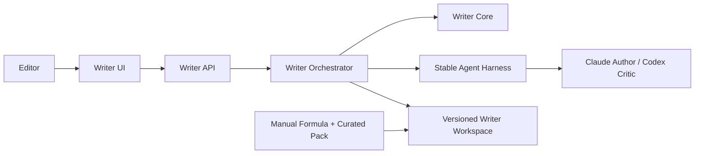
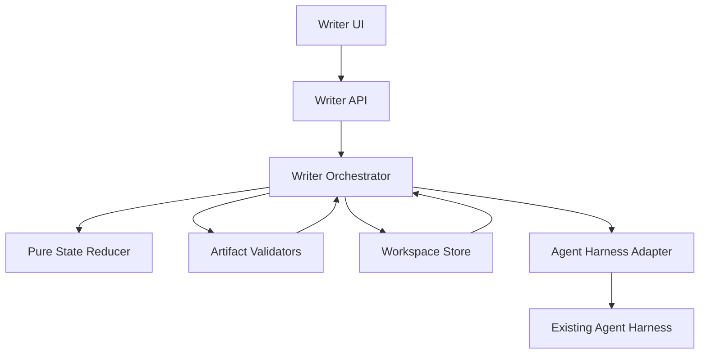
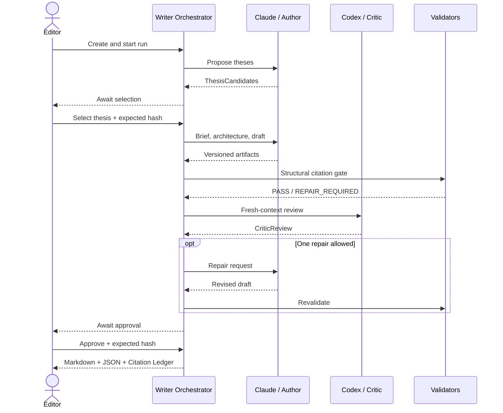

# Solution Design Document

## Validation Checklist

### CRITICAL GATES (Must Pass)

- [x] All required SDD sections are complete
- [x] No unresolved placeholders remain
- [x] Architecture pattern is explicit
- [ ] Architecture decisions are confirmed by the user
- [x] Interfaces and component boundaries are specified
- [x] Existing Agent Harness runtime is confirmed stable by the user

### QUALITY CHECKS (Should Pass)

- [x] Scope is limited to a usable Writer MVP
- [x] Requirements are measurable
- [x] Runtime and failure paths are documented
- [x] Existing Agent/Terminal architecture is reused, not duplicated
- [x] FormulaLoop, persistent KB, vector retrieval, and scale work are excluded

---

## Constraints

| ID | Constraint |
|---|---|
| CON-1 | The existing Agent Harness runtime is stable. Its orchestration path has not been tested and will be verified during Writer integration, not as a prerequisite. |
| CON-2 | Formula and Thesis value has already been checked outside Agent Chat; this MVP does not repeat D0. |
| CON-3 | Formula v0 and Curated Pack are manually prepared and human-reviewed inputs. |
| CON-4 | The MVP uses two logical roles: Author and Critic. It allows at most two reviews and one repair. |
| CON-5 | Application code owns state transitions, validation, hashes, and approval. An agent may only propose output artifacts. |
| CON-6 | MVP is local-first and single-user. Versioned files are the Writer source of truth. |
| CON-7 | Persistent Evidence KB, FormulaLoop automation, vector retrieval, multi-channel support, and retention analysis are out of scope. |
| CON-8 | Transcript, source, Formula, and agent output are untrusted content and must never be interpreted as system instructions. |
| CON-9 | The initial test roster contains only `claude` as Author and `codex` as Critic. Agy/Grok are not automatic fallbacks in this MVP. |

This SDD supersedes the Writer MVP execution and storage choices in `001-greenfield-training-writer-room`. It does not supersede that document's long-term Training/Formula objectives.

## Implementation Context

### Required Context Sources

#### Documentation Context

| Source | Relevance | Purpose |
|---|---:|---|
| `docs/plans/writer-training-architecture-v2.md` | CRITICAL | Domain flow, gates, artifacts, and deferred phases |
| `docs/plans/copy-dna-spy-agent-terminal-architecture.md` | HIGH | Agent Harness boundary and operating assumptions |
| `docs/specs/001-greenfield-training-writer-room/solution-design.md` | MEDIUM | Long-term domain context; overridden where this SDD differs |

#### Code Context

| Source | Relevance | Purpose |
|---|---:|---|
| `packages/daemon/src/harness.ts` | CRITICAL | Existing Agent Harness adapter boundary |
| `packages/daemon/src/agents/defaults.ts` | HIGH | Existing `claude` Author and `codex` Editor/Critic profiles |
| `packages/daemon/src/agents/adapters.ts` | HIGH | Claude Code and Codex interactive/headless launch contracts |
| `packages/daemon/src/team/workflow.ts` | HIGH | Turn dispatch, fresh context, budget, and settlement semantics |
| `packages/shared/src/terminal.ts` | HIGH | Shared agent/team contracts and events |
| `packages/spy/src/source-pack.ts` | MEDIUM | Existing source segment and locator shape |
| `packages/daemon/src/http.ts` | HIGH | HTTP/SSE extension point |
| `packages/web/src/router.ts` | MEDIUM | Writer UI route extension point |

#### External APIs (if applicable)

The Writer MVP does not call a model provider directly. All agent work goes through the existing Agent Harness. Source research is imported as a Curated Pack; automatic web verification is out of scope.

### Implementation Boundaries

**May add or modify**

- New Writer core package containing contracts, validators, and state reducer.
- New daemon Writer workspace, orchestrator, Harness adapter, and HTTP routes.
- New web Writer workspace and approval screens.
- Tests and fixtures for Writer contracts and recovery.

**Must not modify during Writer MVP**

- Agent/Terminal/MCP internals except for a separately approved bug fix.
- Spy extraction behavior.
- FormulaLoop, persistent KB, or vector indexing.
- Agent-owned approval or publish transitions.

### External Interfaces

#### System Context Diagram



#### Interface Specifications

**Inbound interfaces**

| Interface | Input | Output |
|---|---|---|
| Writer HTTP API | Project/run commands and expected artifact hash | Run state, actionable errors, artifact metadata |
| Writer SSE | Run identifier | State, artifact, validation, agent-turn, and approval events |
| Manual import | Formula v0 and Curated Pack files | Validated immutable input artifacts |

**Outbound interfaces**

| Interface | Contract |
|---|---|
| Agent Harness | Submit bounded turns to agent IDs `claude` and `codex`; receive settled results and events |
| Filesystem | Atomic write to versioned artifact, then hash and manifest commit |

### Cross-Component Boundaries

- `writer-core` contains no filesystem, HTTP, UI, or Agent Harness code.
- Daemon owns persistence, orchestration, validation execution, and event emission.
- Agent Harness owns process/session execution only; it does not decide Writer state.
- The initial role binding is `claude → Author` and `codex → Critic`; changing this binding creates a new run configuration and audit record.
- Web UI sends commands and renders server state; it does not infer completion locally.
- Public shared contracts are additive during MVP; breaking changes require an ADR update.

### Project Commands

```bash
Install:   bun install
Dev API:   bun run daemon
Dev App:   bun run app:macos
Test:      bun test packages/spy packages/daemon
Typecheck: bun run typecheck
UI Build:  bun run ui:build
App Build: bun run app:build
```

Writer tests must be added to the root `test` and `typecheck` scripts when the new package is introduced.

## Solution Strategy

- **Architecture pattern:** artifact-driven state machine with human approval gates.
- **Integration:** Writer Orchestrator dispatches Author turns to Claude and Critic turns to Codex through the existing Agent Harness, then validates every returned artifact before advancing state.
- **Persistence:** immutable, hash-addressed files plus a run manifest; no new Writer database in MVP.
- **Quality control:** structural citation validation is a hard gate; semantic evidence review is advisory and human approval remains final.
- **Delivery order:** build deterministic core and workspace first, then test orchestration while integrating real agents, add UI, and pilot on real titles.

## Building Block View

### Components



| Component | Responsibility |
|---|---|
| Writer Core | Schemas, transition rules, validation results, limits |
| Workspace Store | Atomic artifact write, hash, manifest, resume scan |
| Writer Orchestrator | Resolve next action, dispatch turn, validate, commit, pause |
| Harness Adapter | Bind Claude to Author and Codex to Critic; translate Writer turns without changing Harness internals |
| Writer API/SSE | Idempotent commands and observable run state |
| Writer UI | Inputs, thesis selection, brief lock, approval, export |

### Directory Map

```text
packages/
├── writer-core/                         # NEW: pure contracts, FSM, validators
├── daemon/src/writer/                   # NEW: workspace, orchestrator, Harness adapter
├── daemon/test/writer/                  # NEW: contract, crash/resume, integration tests
└── web/src/features/writer/             # NEW: Writer workflow UI

writer-room-data/writer/projects/{projectId}/runs/{runId}/
├── context/                             # Formula, Curated Pack, project request
├── output/                              # Thesis, brief, architecture, drafts, reviews, export
└── system/                              # Manifest, hashes, validation and turn logs
```

### Interface Specifications

#### Interface Documentation References

```yaml
interfaces:
  - name: Agent Harness
    source: packages/daemon/src/harness.ts
    relevance: CRITICAL
  - name: Team Workflow
    source: packages/daemon/src/team/workflow.ts
    relevance: HIGH
  - name: Source Pack
    source: packages/spy/src/source-pack.ts
    relevance: MEDIUM
```

#### Data Storage Changes

No database migration is required. Each run stores:

```text
run-manifest.json
  run_id, project_id, status, current_stage
  input_hashes, accepted_artifact_hashes
  review_count, repair_count, turn_count
  pending_human_action, last_error, updated_at

artifact file
  schema_version, artifact_id, run_id, stage
  content, created_at, producer, content_hash
```

An existing artifact is never overwritten. A corrected artifact receives a new version; the manifest points to the accepted version.

#### Internal API Changes

| Method | Path | Purpose |
|---|---|---|
| POST | `/api/writer/projects` | Create project and import validated Formula/Pack |
| POST | `/api/writer/projects/:id/runs` | Create a run and bind Author/Critic agents |
| GET | `/api/writer/runs/:runId` | Return resolved state and artifact metadata |
| POST | `/api/writer/runs/:runId/actions/:action` | Start, stop, retry, select thesis, lock brief, approve, reject, export |
| GET | `/api/writer/runs/:runId/events` | Stream run events over SSE |

Mutating requests include `command_id`; human decisions also include `expected_artifact_hash`. Repeated commands return the original result, while stale hashes are rejected.

#### Application Data Models

```text
WriterRun
  status, stage, input hashes, accepted artifact hashes
  authorAgentId = "claude", criticAgentId = "codex"
  reviewCount <= 2, repairCount <= 1, turnCount <= 8

EvidenceClaim
  claimId, claimText, sourceId, exactQuote, locator

ValidationResult
  verdict: PASS | REPAIR_REQUIRED | HUMAN_REVIEW
  issues[]: code, severity, artifactId, claimId?, message
```

#### Integration Points

| From | To | Protocol | Rule |
|---|---|---|---|
| Writer Orchestrator | Agent Harness | In-process TypeScript API | One bounded, idempotent turn request |
| Writer API | Web UI | HTTP + SSE | Server is authoritative for state |
| Writer Orchestrator | Workspace | Local filesystem | Atomic write before manifest commit |

## Runtime View

### Primary Flow

#### Primary Flow: Produce and approve one script

1. Editor creates a run from title, audience, target length, Formula v0, and Curated Pack; the run binds Claude as Author and Codex as Critic.
2. Claude proposes Thesis candidates; Editor selects one.
3. Claude creates Story Brief; Editor locks it.
4. Claude creates Architecture and Draft with `[c:CLAIM_ID]` markers.
5. Application runs structural citation validation.
6. Codex reviews with fresh context. If required, Claude repairs once.
7. Application revalidates and optionally runs Codex review two; no third review is allowed.
8. Editor approves the publish-ready draft.
9. System exports Markdown, structured JSON, and Citation Ledger.



### Error Handling

| Failure | System behavior | Recovery |
|---|---|---|
| Agent Harness unavailable | Run enters `BLOCKED_DEPENDENCY`; no state advance | Retry after Harness is healthy |
| Claude or Codex unavailable | Run pauses and identifies the missing agent; no silent provider fallback | Restore that agent or explicitly create a new run configuration |
| Agent turn timeout/crash | Preserve last committed artifact and pending turn record | Retry same idempotency key |
| Invalid artifact schema | Reject artifact and show validation issues | One bounded regeneration or human stop |
| Missing/unknown citation | Block publish-ready transition | Repair draft or Curated Pack |
| Stale human action | Return conflict with current artifact hash | Refresh UI and decide again |
| Daemon restart | Recompute state from manifest and committed artifacts | Resume the unresolved action only |
| Budget exhausted | Stop automatic turns | Human may export current draft or close run |

### Complex Logic (if applicable)

```text
RESOLVE_NEXT_ACTION(run):
1. Load and verify manifest plus accepted artifact hashes.
2. If a human action is pending, do not dispatch an agent.
3. Validate the current artifact before resolving a transition.
4. Enforce review <= 2, repair <= 1, turn <= 8.
5. Create a deterministic turn key from run, stage, input hashes, and attempt.
6. Dispatch through Harness only when no settled result exists for that key.
7. Validate agent output, commit a new artifact version, then advance state.
```

## Deployment View

### Single Application Deployment

- **Environment:** existing local Tauri app, Bun daemon, and web UI.
- **Configuration:** Writer data root and existing Agent Harness configuration.
- **Dependencies:** no new hosted service or database.
- **Performance:** UI/API state operations target p95 below 300 ms, excluding agent execution.

### Multi-Component Coordination (if applicable)

| Order | Milestone | Exit condition |
|---:|---|---|
| M0 | Writer Core | Contracts, reducer, citation gate, limits, and fixtures pass without agents |
| M1 | Workspace + fake dispatcher | Full flow resumes after daemon restart and never overwrites artifacts |
| M2 | Claude/Codex orchestration | Run Claude Author → Codex Critic end-to-end; test both adapters, turn settlement, fresh context, stop/retry, and crash recovery |
| M3 | API + UI | Human selection, brief lock, approval, errors, and export work end-to-end |
| M4 | Pilot | Run 5–10 real titles; record edit time, failures, unsupported claims, and cost |

Each milestone is independently reversible. An orchestration defect found in M2 blocks M3 onward but does not invalidate Writer Core or Workspace work.

## Cross-Cutting Concepts

### Pattern Documentation

```yaml
- pattern: Artifact-driven state machine
  relevance: CRITICAL
  why: Makes resume and audit deterministic
- pattern: Propose then validate
  relevance: CRITICAL
  why: Prevents agent output from advancing state by itself
- pattern: Hash-bound human action
  relevance: HIGH
  why: Prevents approval of a stale artifact
```

### User Interface & UX (if applicable)

- One Writer workspace shows inputs, current stage, active artifact, validation issues, and next allowed action.
- Human gates are explicit: Select Thesis, Lock Brief, Approve/Reject Draft.
- Stop, retry, and export are visible; automatic loops are not hidden.
- UI disables stale actions after receiving a newer artifact event.

```text
┌──────────────────────────────────────────────────────────┐
│ Writer Run · Stage · Agent status · Budget               │
├───────────────────┬──────────────────────────────────────┤
│ Formula / Pack    │ Current artifact                    │
│ Thesis / Brief    │ Validation and Critic issues        │
│ Architecture      │                                      │
│ Draft versions    │ [Select/Lock/Approve] [Stop] [Retry]│
└───────────────────┴──────────────────────────────────────┘
```

### System-Wide Patterns

- **Security:** escape rendered Markdown; treat all imported and generated text as data; restrict Writer writes to its run directory.
- **Audit:** log command ID, turn key, input/output hashes, validator result, and human decision.
- **Reliability:** atomic file writes, immutable versions, idempotent commands, deterministic resume.
- **Observability:** correlate UI, Writer run, Harness job, and artifact IDs.
- **Cost:** count turns, duration, and available usage metadata separately for Claude and Codex; no unbounded critic loop.

### Multi-Component Patterns (if applicable)

- HTTP/SSE is used between Web and Daemon; in-process typed calls are used inside Daemon.
- Shared contracts are versioned and additive during MVP.
- Writer and Agent Harness keep separate state; correlation IDs link them without sharing ownership.

## Architecture Decisions

- [x] **ADR-1 — Use the existing Agent Harness with Claude as Author and Codex as Critic.**
  - Rationale: both agents are ready for the initial tests and their current default profiles already match these roles.
  - Trade-off: orchestration defects may surface during M2; absence of either agent pauses the run because MVP has no silent fallback.
  - User confirmed: 2026-08-09; Agent layer complete, Claude and Codex selected for testing.

- [ ] **ADR-2 — Use versioned filesystem artifacts as the Writer MVP source of truth.**
  - Rationale: shortest path to observable, restartable local MVP without introducing a second job database.
  - Trade-off: querying and multi-user concurrency are deferred.
  - User confirmed: _Pending_

- [ ] **ADR-3 — Use manual Formula v0 and human-curated evidence for MVP.**
  - Rationale: isolates Writer flow from FormulaLoop and KB validity risk.
  - Trade-off: preparation remains manual.
  - User confirmed: _Pending_

- [ ] **ADR-4 — Structural citations are a hard gate; semantic evidence is advisory until human approval.**
  - Rationale: deterministic checks can reliably block broken IDs/locators, while semantic entailment still needs calibration.
  - Trade-off: MVP cannot claim fully automatic anti-hallucination.
  - User confirmed: _Pending_

- [ ] **ADR-5 — Cap the run at two Critic reviews, one Author repair, and eight total agent turns.**
  - Rationale: keeps behavior, cost, and recovery understandable during pilot.
  - Trade-off: difficult drafts stop for human handling rather than looping.
  - User confirmed: _Pending_

## Quality Requirements

- **Reliability:** 100% of crash/resume fixtures continue from the last committed artifact without duplicate accepted output.
- **Integrity:** committed artifacts are immutable and every accepted artifact hash is verified on load.
- **Safety:** all invalid or unknown citation markers in fixture drafts block `PUBLISH_READY`.
- **Bounded execution:** no run exceeds two reviews, one repair, or eight turns without a new explicit human command.
- **Performance:** non-agent Writer API operations have p95 latency below 300 ms on the local target machine.
- **Usability:** every paused state exposes one clear reason and the allowed recovery actions.
- **Auditability:** every exported factual claim maps to a claim ID, quote, locator, and source entry in Citation Ledger.

## Acceptance Criteria

**Main flow**

- [ ] WHEN the Editor creates a valid run, THE SYSTEM SHALL preserve Formula, Curated Pack, request, and their hashes as immutable inputs.
- [ ] WHEN Author output passes schema validation, THE SYSTEM SHALL commit a new artifact version before advancing the run.
- [ ] WHILE Thesis selection or Brief lock is pending, THE SYSTEM SHALL NOT dispatch the next Author turn.
- [ ] WHEN the Editor approves the current draft hash, THE SYSTEM SHALL export Markdown, JSON, and Citation Ledger for that exact version.

**Agent integration**

- [ ] WHEN a Writer turn is dispatched, THE SYSTEM SHALL use the existing Agent Harness and a deterministic turn key.
- [ ] WHEN a run is created without an explicit roster override, THE SYSTEM SHALL bind `claude` as Author and `codex` as Critic.
- [ ] WHEN M2 orchestration tests run, THE SYSTEM SHALL verify Claude Author output, Codex fresh-context review, turn settlement, stop/retry, and daemon-restart recovery before enabling Writer UI integration.
- [ ] IF Claude or Codex is unavailable, THEN THE SYSTEM SHALL pause and SHALL NOT silently route the turn to another configured agent.
- [ ] WHEN a Critic turn starts, THE SYSTEM SHALL use fresh context containing only the approved input artifacts required for review.
- [ ] WHEN an agent reports completion, THE SYSTEM SHALL validate its artifact before changing Writer state.

**Error and recovery**

- [ ] IF a draft contains a missing or unknown claim marker, THEN THE SYSTEM SHALL block `PUBLISH_READY` and identify the location.
- [ ] WHEN the daemon restarts, THE SYSTEM SHALL reconstruct the run from committed files and resume only unresolved work.
- [ ] IF a human action contains a stale artifact hash, THEN THE SYSTEM SHALL reject it without modifying state.
- [ ] IF the repair or review limit is reached, THEN THE SYSTEM SHALL pause for human action and SHALL NOT start another automatic loop.

## Risks and Technical Debt

### Known Technical Issues

- Agent runtime is complete, but Claude/Codex orchestration behavior is untested; M2 may reveal lifecycle or adapter-contract changes.
- Semantic claim-to-evidence validation is not calibrated enough to be a hard automatic gate.
- Existing SDD 001 describes different runtime/storage choices; this scoped SDD must be treated as authoritative for Writer MVP.

### Technical Debt

- Filesystem manifests are suitable for local MVP but not multi-user concurrency or cross-project analytics.
- Curated Pack construction and Formula maintenance remain manual.
- Persistent evidence conflict/freshness handling is deferred to a later SDD after MVP value is observed.

### Implementation Gotchas

- Do not treat `team_workflow_done` as `writer_stage_done`; Writer validation must still pass.
- Commit artifact content before updating the manifest pointer.
- Retry the same turn key after crash; do not create a new logical attempt unless the prior result is settled as failed.
- Codex headless turns currently receive assignment/message context through the prompt rather than automatically wired Team MCP; M2 must verify context completeness explicitly.
- A citation marker proves linkage syntax, not semantic support; the UI must preserve this distinction.
- Never let an agent edit protected inputs, the manifest, approval records, or exported final files directly.

## Glossary

### Domain Terms

| Term | Definition | Context |
|---|---|---|
| Formula v0 | Human-written channel style rules | Input to Author and Critic |
| Thesis | The script's central claim and angle | First human selection gate |
| Curated Pack | Human-reviewed claims with exact quotes and locators | Evidence input for one title |
| Citation Ledger | Export mapping factual claims to their supporting sources | Final audit artifact |

### Technical Terms

| Term | Definition | Context |
|---|---|---|
| Artifact | Versioned, validated output with content hash | Unit of Writer progress |
| Turn key | Deterministic idempotency key for one agent action | Crash-safe dispatch |
| State reducer | Pure function resolving run state from accepted artifacts | Resume and transition logic |
| Hard gate | Validation failure that prevents state advance | Schema and structural citations |

### API/Interface Terms

| Term | Definition | Context |
|---|---|---|
| Agent Harness | Existing process/session execution layer | Executes Author and Critic turns |
| SSE | Server-Sent Events | Streams Writer run changes to UI |
| Expected artifact hash | Hash supplied with a human command | Rejects stale decisions |
