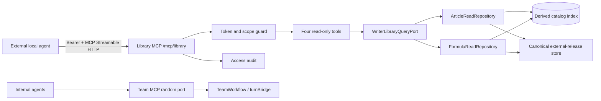
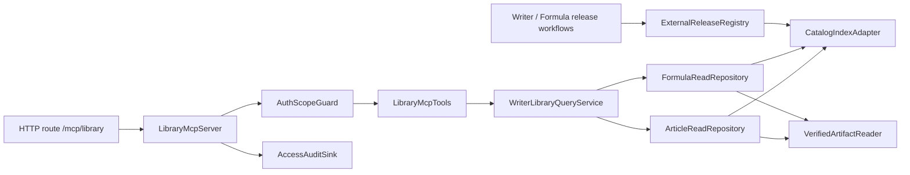
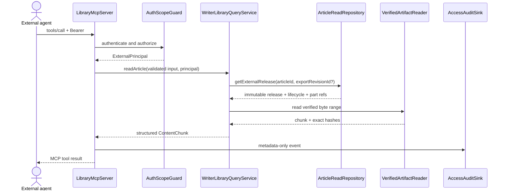

# Solution Design Document

## Validation Checklist

### CRITICAL GATES (Must Pass)

- [x] All required design sections are complete.
- [x] No clarification placeholder remains.
- [x] Architecture pattern and separation from Team MCP are explicit.
- [ ] All architecture decisions are confirmed by the user.
- [x] Every v1 MCP interface has an input, output, authorization, pagination, and error contract.
- [ ] Canonical Article export and Formula Registry contracts exist in code; today they exist only in plans.

### QUALITY CHECKS (Should Pass)

- [x] Context sources have relevance ratings.
- [x] Commands come from the current root `package.json`.
- [x] Constraints lead to a storage-neutral read model and a separate MCP adapter.
- [x] Every proposed component has a directory mapping.
- [x] Error handling and fail-closed integrity behavior are specified.
- [x] Performance, payload, security, and audit targets are measurable.
- [x] Team MCP, Spy MCP tools, Source Packs, and the new Library MCP do not overlap.
- [x] A developer can implement the contract/fixture phase without inventing domain semantics.

---

## Constraints

| ID | Constraint |
|---|---|
| CON-1 | This is a new read-only MCP for external agents. It must not be added to Team MCP, turnBridge, `TeamWorkflow`, or the Team tool namespace. |
| CON-2 | V1 exposes only two domain resources: completed Writer articles and saved Formula versions. It has no create, update, delete, approve, publish, execute, or generic artifact-read capability. |
| CON-3 | An externally visible article release is an immutable human-approved export. A draft, stale artifact, `PUBLISH_READY` item without approval, Spy Source Pack, or mutable workspace head is not an article release. Lists show only the active release; an exact older external release remains readable until a later lifecycle event revokes or archives it. |
| CON-4 | An externally visible Formula is an exact immutable external release. No request resolves an unpinned `latest` Formula. External release lifecycle (`ACTIVE|RETIRED`) and evidence quality (`TRIAL|VALIDATED`) are separate axes. Whether a `TRIAL` Formula may be externally released is an explicit pending ADR because SDD 002 and domain plan v2 currently disagree. |
| CON-5 | Formula files and Writer export parts are immutable and hash-pinned by release records. Activation validates the approval/current-input binding once and freezes that proof; after activation, only sequenced lifecycle events change external readability. A missing/invalid binding at activation, hash mismatch, missing release record, revoked/archived release, or path escape fails closed and returns no content. |
| CON-6 | The current confirmed MVP storage decision is versioned filesystem artifacts as source of truth with a rebuildable SQLite index (`002` ADR-2). MCP transport must still depend on repository ports so this choice can change without breaking the public contract. |
| CON-7 | Current `writer-packs.ts` records are Spy Source Packs, not finished articles. They must not be exposed or renamed at the MCP boundary as articles. |
| CON-8 | V1 is local-first and single-user: the server binds loopback and is used by agents on the same machine. Remote network exposure is a separate future design requiring TLS and stronger identity management. |
| CON-9 | External content can be large. List calls are metadata-only; get calls use deterministic, resumable chunks with a hard response cap. Silent truncation is prohibited. |
| CON-10 | Article prose/citations, Formula exemplars, audit files, and imported text remain untrusted data at the client boundary. Only `formula.md` and `avoid.md` from an externally released Formula version (`ACTIVE` or exact-ID `RETIRED`) are classified as published writing policy; retirement removes recommendation/list visibility but does not rewrite immutable content trust. No retrieved content grants tools or authorization. |
| CON-11 | Formula exemplars may be withheld by rights/retention policy. Formula audit files require a stronger scope than runtime Formula files. |
| CON-12 | The checkout currently has only `pipeline-core` primitives. `training-core`, `writer-core`, Formula Registry, Article catalog, and canonical production artifacts do not exist yet; production MCP enablement is gated on them. |

---

## Implementation Context

### Required Context Sources

#### Documentation Context

```yaml
- doc: docs/plans/writer-training-architecture-v2.md
  relevance: CRITICAL
  why: "Defines immutable artifacts, Formula Package, Writer approval/export graph, stale rules, and security boundary."

- doc: docs/specs/002-writer-agent-mvp/solution-design.md
  relevance: CRITICAL
  why: "Contains the confirmed filesystem-source/derived-index ADR and current pipeline artifact direction."

- doc: docs/specs/001-greenfield-training-writer-room/solution-design.md
  relevance: MEDIUM
  why: "Provides earlier Formula and Writer entity/API vocabulary; storage choices superseded by SDD 002 are not adopted."

- url: https://github.com/modelcontextprotocol/typescript-sdk/blob/main/docs/server.md
  relevance: MEDIUM
  why: "Current official conceptual guidance only; implementation API is pinned to the installed v1.30.0 declarations below."
```

#### Code Context

```yaml
- file: packages/daemon/src/http.ts
  relevance: CRITICAL
  why: "Stable loopback daemon listener and composition root where the new endpoint belongs."

- file: packages/daemon/src/team/mcp.ts
  relevance: HIGH
  why: "Existing coordination MCP whose audience, token lifecycle, tools, and implementation must remain separate."

- file: packages/daemon/src/harness.ts
  relevance: HIGH
  why: "Proves Team MCP is harness-owned and the app MCP provision hook is currently null."

- file: packages/daemon/src/writer-packs.ts
  relevance: CRITICAL
  why: "Existing Source Pack staging that must not be mistaken for finished Writer articles."

- file: packages/pipeline-core/src/workspace-store.ts
  relevance: HIGH
  why: "Current atomic artifact primitive; not yet a complete immutable artifact graph or query catalog."

- file: packages/spy/src/mcp-tools.ts
  relevance: MEDIUM
  why: "Reusable scope/output-limit ideas, but not a registry or data source for the Library MCP."

- file: package.json
  relevance: HIGH
  why: "Actual workspace commands and installed MCP SDK/Zod versions."

- file: node_modules/@modelcontextprotocol/sdk/dist/esm/server/webStandardStreamableHttp.d.ts
  relevance: CRITICAL
  why: "Normative installed v1.30.0 transport options and Bun/Web Request API for this design."
```

#### External APIs (if applicable)

```yaml
- service: Model Context Protocol
  doc: https://github.com/modelcontextprotocol/typescript-sdk/blob/main/docs/server.md
  relevance: CRITICAL
  why: "External agents connect over the standard MCP Streamable HTTP transport."
```

### Implementation Boundaries

- **Must Preserve**
  - Team MCP remains harness-owned, random-port, per-run-token coordination infrastructure.
  - `TeamWorkflow`, turnBridge, PTY process authority, and `team_*` tools remain unchanged.
  - Published Formula packages and approved Writer exports remain immutable and hash-pinned.
  - Spy data and Source Packs remain acquisition/research inputs, not public Writer outputs.
- **Can Modify**
  - Daemon composition and HTTP routing to mount a separate `/mcp/library` handler.
  - New contracts, repository ports, query service, token configuration, audit sink, and tests.
  - Future Writer/Training domain repositories to implement the read ports.
  - Root/package scripts to include new packages and tests.
- **Must Not Touch**
  - Team MCP tool list/auth fallback for this feature.
  - Spy tool mutation surface.
  - Formula publication or Writer approval rules.
  - Raw filesystem paths, SQL, or arbitrary artifact IDs as public MCP inputs.

### External Interfaces

#### System Context Diagram



#### Interface Specifications

```yaml
inbound:
  - name: "External Writer Library MCP"
    type: HTTP on loopback
    path: /mcp/library
    format: MCP Streamable HTTP / JSON-RPC
    authentication: "Authorization: Bearer <persistent scoped token>"
    data_flow: "List and read approved Article external releases and Formula external releases."

outbound:
  - name: "ArticleReadRepository"
    type: In-process TypeScript port
    authentication: Process-local
    data_flow: "Query eligible article metadata and verified immutable export content."
    criticality: HIGH

  - name: "FormulaReadRepository"
    type: In-process TypeScript port
    authentication: Process-local
    data_flow: "Query externally released Formula versions and verified package files."
    criticality: HIGH

data:
  - name: "Canonical external-release store"
    type: Content-addressed blobs + immutable release records/events
    connection: Verified repository adapter
    data_flow: "Canonical bytes served externally plus frozen approval/export/publication proof. Writer/Formula workspaces remain provenance inputs, not a second read authority."

  - name: "Pipeline catalog index"
    type: SQLite derived index
    connection: Read-only queries during MCP calls
    data_flow: "Fast list/filter lookup; rebuildable from manifests and never authoritative."

  - name: "Library MCP credential registry"
    type: Owner-only local config
    connection: Token hash lookup
    data_flow: "Persistent token IDs, hashes, scopes, expiry, and revocation."
```

### Cross-Component Boundaries (if applicable)

- **API Contracts:** the four MCP tool schemas, error codes, immutable IDs, hashes, cursor behavior, and scope names are public versioned contracts.
- **Ownership:** Writer validates approval/current-input hashes when preparing an Article release; Formula validates its release gates when preparing a Formula release. `ExternalReleaseRegistry` alone freezes those proofs, commits externally served bytes, and owns sequenced post-release visibility. Domain read repositories project that canonical state. Library service owns caller authorization, row filtering, pagination, chunking, and public DTO mapping. MCP adapter owns protocol/auth translation. Eligibility is not reimplemented in `library-core`.
- **Shared Resources:** MCP reads the derived pipeline index and canonical external-release store through repository ports. It never owns or rewrites them. Post-release Writer workspace staleness has no implicit effect; invalidation must append `ARCHIVE|REVOKE` through the registry before it changes external visibility.
- **Breaking Change Policy:** additive optional fields are allowed within schema version `1.x`; renames, changed defaults, status semantics, or ID meaning require a new tool/schema major version.

### Project Commands

```bash
Install:   bun install
Dev API:   bun run daemon
Dev App:   bun run app:macos
Test:      bun test packages/spy packages/daemon packages/pipeline-core
Typecheck: bun run typecheck
UI Build:  bun run ui:build
App Build: bun run app:build
```

When `library-core` and `release-registry` are added, root `test` and `typecheck` scripts must include both packages. Registry crash, idempotency, reducer-transition, and corruption tests are a production readiness gate.

---

## Solution Strategy

- **Architecture Pattern:** hexagonal read model: external MCP adapter → application query port → domain repository ports → verified catalog/artifact adapters.
- **Integration Approach:** mount a logical server named `writer-room-library` at the daemon's stable loopback listener, `/mcp/library`. Compose it in `createHttpApp`, beside Spy and the Agent Harness, not inside `createAgentHarness`.
- **Justification:** external discovery needs a stable endpoint and persistent credential; Team MCP intentionally has an ephemeral endpoint/token and coordination-only audience. Repository ports prevent transport code from locking domain storage or scanning incomplete workspaces.
- **Key Decisions:** read-only four-tool surface; explicit external-release records; exact immutable IDs/per-part hashes; stateless Streamable HTTP; scoped bearer; snapshot keyset pagination; chunked content; fail-closed integrity.

### Delivery Plan

| Phase | Scope | Exit gate |
|---|---|---|
| M0 — Decisions | Confirm ADR-M1..M7, especially Article history and `TRIAL` Formula external release. | No unresolved semantic choice affects wire fields or eligibility. |
| M1 — Contracts/fixtures | Add `library-core`, strict wire schemas, release-record/lifecycle/digest fixtures, repository ports, and cursor test vectors. | Contract tests, canonical digest vectors, and schema round-trips pass; no daemon endpoint yet. |
| M2 — Canonical domain projection | Writer and Formula workflows submit prepared releases to the single-writer `ExternalReleaseRegistry`; it commits records/parts and lifecycle events; fix write-once artifact primitive. | Production readiness preflight passes on real manifests; Source Packs cannot enter catalog. |
| M3 — Catalog/read service | Deterministic index projector, generation/snapshot pagination, verified no-follow artifact reader, scope/row filtering, chunking. | Rebuild equivalence, corruption, Unicode chunk, historical release, and concurrent activation tests pass. |
| M4 — MCP/auth/audit | Mount pinned stateless SDK handler, credential CLI/store, Host/Origin/rate guards, four tools, durable audit. | Protocol/auth/audit/separation tests pass; no `team_*`/`spy_*` or mutation appears. |
| M5 — External client E2E | Client setup docs and SDK/Inspector smoke test across restart/revoke/catalog rebuild. | External client lists/reads one Article and Formula; restart keeps URL/token; rebuild invalidates cursor safely. |

M1 can start before Writer/Formula production code. M4 must not be enabled in production until M2 and M3 gates pass.

---

## Building Block View

### Components



| Component | Responsibility | Explicit non-responsibility |
|---|---|---|
| `LibraryMcpServer` | MCP SDK transport, request lifecycle, protocol result mapping | Domain status decisions, filesystem access |
| `AuthScopeGuard` | Bearer validation, principal/scopes, optional row filters | Accepting identity from tool arguments |
| `LibraryMcpTools` | Strict Zod schemas and four tool handlers | SQL, path resolution, approval/publication |
| `WriterLibraryQueryService` | Principal filtering, pagination, chunking, public projections | Re-deriving approval/publication/staleness; mutating state |
| `ArticleReadRepository` | Authoritative externally released Article projection from approval/export/lifecycle records | Deciding caller auth |
| `FormulaReadRepository` | Authoritative externally released Formula projection from registry/lifecycle records | Compiling Formula or deciding caller auth |
| `ExternalReleaseRegistry` | Sole writer of cross-domain release sequence, immutable release records, parts, and lifecycle events; owns lock, CAS, commit, and recovery rules | Serving MCP calls or deciding caller scopes |
| `VerifiedArtifactReader` | Root confinement, regular-file check, size/hash verification | Best-effort recovery from corrupt data |
| `AccessAuditSink` | Metadata-only access events | Logging content, bearer, cursor, prompt, or path |

### Directory Map

**Component: library contracts/core**

```text
packages/library-core/                         # NEW
  package.json                                 # NEW: zero-I/O domain package
  src/contracts.ts                             # NEW: DTOs, pages, errors, statuses
  src/ports.ts                                 # NEW: query and repository ports
  src/index.ts                                 # NEW
  test/contracts.test.ts                       # NEW
```

**Component: canonical external-release registry**

```text
packages/release-registry/                     # NEW; shared domain infrastructure, not MCP
  package.json                                 # NEW
  src/contracts.ts                             # NEW: release/event schemas and transition reducer
  src/registry.ts                              # NEW: single-writer lock, commit, recovery
  src/projector.ts                             # NEW: deterministic event fold
  test/registry.test.ts                        # NEW: crash/idempotency/transition fixtures
```

**Component: daemon Library MCP**

```text
packages/daemon/src/
  library/                                     # NEW
    service.ts                                 # query orchestration, chunks, projections
    cursors.ts                                 # signed list/content cursors
    artifact-reader.ts                         # confined/hash-verified reads
    catalog-adapters.ts                        # derived index + manifests
    errors.ts                                  # stable domain errors
    mcp/
      server.ts                                # official SDK, stateless transport
      auth.ts                                  # persistent scoped bearer
      tools.ts                                 # four tools and schemas
      audit.ts                                 # metadata-only audit
  http.ts                                      # MODIFY: compose and route /mcp/library
  paths.ts                                     # MODIFY: config/audit paths
  index.ts                                     # MODIFY: lifecycle export/shutdown if needed
  test/library/                                # NEW: contract/repository/protocol/auth/E2E
```

**Component: canonical domain adapters (after domain implementation)**

```text
packages/daemon/src/
  writer/article-library-query.ts              # NEW: ArticleReadRepository adapter
  formula/formula-library-query.ts             # NEW: FormulaReadRepository adapter
```

Do not add Library contracts to `shared/terminal.ts`; terminal contracts and domain library contracts have different ownership.

### Interface Specifications

#### Interface Documentation References

```yaml
interfaces:
  - name: "Writer Artifact and Export Contract"
    doc: docs/plans/writer-training-architecture-v2.md
    relevance: CRITICAL
    sections: [6, 9.2, 9.3, 9.8, 12]
    why: "Defines immutable refs, approval/export binding, staleness, and content trust."

  - name: "Formula Package Contract"
    doc: docs/plans/writer-training-architecture-v2.md
    relevance: CRITICAL
    sections: [7.3, 7.5]
    why: "Defines publication gate, package files, manifest, and hashes."

  - name: "MCP Server Transport"
    doc: https://github.com/modelcontextprotocol/typescript-sdk/blob/main/docs/server.md
    relevance: HIGH
    sections: [Transports, Deployment]
    why: "Official SDK and localhost hardening guidance."
```

#### Data Storage Changes

No MCP-owned copy of Article or Formula content is allowed. Content artifacts, release records, and lifecycle events are canonical versioned files. The SQLite catalog is a disposable projection.

Every externally readable bundle has per-part hashes; an Article has no ambiguous single “content hash”:

```yaml
ArtifactPartRef:
  name: prose.md | structured.json | citation-ledger.json | external-manifest.json |
        formula.md | avoid.md | exemplars.md | scorecard.json |
        leak-report.json | fingerprint-targets.json
  artifact_id: immutable artifact ID
  media_type: text/markdown | application/json
  byte_length: integer
  sha256: lowercase 64-hex
  content_role: untrusted_data | published_policy
  external_release_allowed: true
  is_external_manifest: boolean

CanonicalProofRef:
  proof_id: immutable provenance ID
  schema_version: exact proof schema version
  sha256: hash of canonical proof JSON bytes; also its private blob locator
  byte_length: integer

ArticleReleaseRecord:
  schema_version: writer-room.article-release/v1
  digest_algorithm: writer-room-bundle-digest/v1
  lifecycle_reducer_version: writer-room.external-release-reducer/v1
  article_id: stable Writer item ID; one title/output, never a project-or-item union
  writer_project_id: stable parent project/batch ID
  export_revision_id: immutable public release ID
  approved_draft_artifact_id: provenance only; not public content identity
  approval_artifact_id: immutable approval binding
  activation_proof: CanonicalProofRef using writer-room.article-activation-proof/v1
  formula_version_id: exact Formula version used by the draft
  formula_package_digest: exact Formula release digest
  title: string
  language: string
  content_mode: string
  word_count: integer
  parts: ArtifactPartRef[]
  prose_sha256: sha256 of the prose part
  release_digest: aggregate digest defined below
  release_manifest_sha256: sha256 of immutable external-manifest.json bytes
  external_release_allowed: true
  release_policy_version: string
  rights_decision_ref: immutable ID/hash
  approved_at: datetime
  released_at: datetime

FormulaReleaseRecord:
  schema_version: writer-room.formula-release/v1
  digest_algorithm: writer-room-bundle-digest/v1
  lifecycle_reducer_version: writer-room.external-release-reducer/v1
  formula_id: stable family ID
  formula_version_id: immutable version ID
  version_label: string
  style_profile_id: string
  language: string
  recommended_modes: string[]
  quality_status: TRIAL | VALIDATED
  activation_proof: CanonicalProofRef using writer-room.formula-activation-proof/v1
  parts: ArtifactPartRef[]
  package_digest: aggregate digest defined below
  release_manifest_sha256: sha256 of immutable external-manifest.json bytes
  external_release_allowed: true
  release_policy_version: string
  rights_decision_ref: immutable ID/hash
  rule_count: integer
  token_count: integer
  released_at: datetime

ExternalReleaseLifecycleEvent:
  schema_version: writer-room.external-release-event/v1
  reducer_version: writer-room.external-release-reducer/v1
  event_id: immutable sortable ID
  event_seq: monotonically increasing but not necessarily contiguous integer
  resource_kind: article | formula
  resource_release_id: export_revision_id | formula_version_id
  action: ACTIVATE | RETIRE | ARCHIVE | REVOKE
  expected_previous_status: ABSENT | RELEASED | ACTIVE | RETIRED
  expected_article_head_release_id: string | null
  occurred_at: datetime
  actor_ref: app/human audit reference
  reason: bounded string

ExternalManifest:
  schema_version: writer-room.external-manifest/v1
  digest_algorithm: writer-room-bundle-digest/v1
  resource_kind: article | formula
  resource_release_id: export_revision_id | formula_version_id
  aggregate_digest: release_digest | package_digest
  payload_parts: ArtifactPartRef[] excluding external-manifest.json
  release_policy_version: string
  rights_decision_ref: immutable ID/hash

ArticleActivationProof:
  schema_version: writer-room.article-activation-proof/v1
  draft: { artifact_id, sha256 }
  approval: { artifact_id, sha256, approved_subject_sha256 }
  evidence: { curated_pack_id, curated_pack_sha256 }
  formula: { formula_version_id, package_digest }
  export_manifest: { artifact_id, sha256 }
  eligibility_policy_version: string
  validated_at: datetime

FormulaActivationProof:
  schema_version: writer-room.formula-activation-proof/v1
  internal_manifest: { artifact_id, sha256 }
  internal_package_digest: sha256
  human_release_approval: { artifact_id, sha256, approved_subject_sha256 }
  quality_status: TRIAL | VALIDATED
  gate_policy_version: string
  gate_evidence: [{ gate_id, artifact_id, sha256 }]
  external_release_policy_version: string
  validated_at: datetime
```

Part invariants are validated before activation:

- Part names are unique within a release; duplicate names are invalid.
- Article requires exactly `prose.md`, `structured.json`, `citation-ledger.json`, and `external-manifest.json`; `prose_sha256` equals the `prose.md` part SHA-256.
- Formula requires `formula.md`, `avoid.md`, and `external-manifest.json`; exemplar/audit parts are optional external projections but, if present, must be named exactly as above and rights-allowed.
- An external release record contains only externally readable parts, so every listed part has `external_release_allowed=true`; an internal package file withheld by rights/retention is omitted from both this record and `external-manifest.json`, preventing metadata leakage. The internal Formula package manifest remains separate canonical provenance.
- Exactly one part has `is_external_manifest=true`, its name is `external-manifest.json`, and its SHA-256 equals `release_manifest_sha256`.
- Every other part has `is_external_manifest=false`; those parts match `ExternalManifest.payload_parts` exactly and are the aggregate digest inputs. The manifest does not list/hash itself.
- Each release has exactly one private `activation_proof` blob. It is not an externally readable part and is omitted from the bundle digest/manifest, but the release record hash-binds it. Article proof fields must equal the release's approval/draft/Formula/export fields; Formula proof fields must equal its package/quality fields and contain the gate set required by the allowlisted policy selected after ADR-M3. Missing, mismatched, duplicate-gate, unknown-policy, or non-canonical proof data prevents `ACTIVATE`.

Release records never change. `ExternalReleaseRegistry` is the only component allowed to allocate the cross-domain sequence or write under the canonical release root. Writer and Formula workflows call its in-process command port; they never append events independently. Retirement, archive, revocation, and a new Article head are append-only event files under `external-release-events/`. The derived index folds release records plus events. It stores an append-only row per release, a current-head projection, event history, monotonic `catalog_seq`, and `catalog_generation`.

Allowed lifecycle transitions:

| Kind | Prior state | Action | Result/readability |
|---|---|---|---|
| Article release | `ABSENT` | `ACTIVATE` | `RELEASED`; exact-readable; becomes Article head |
| Article release | `RELEASED` | `ARCHIVE` or `REVOKE` | terminal and not externally readable; clear head if it points here |
| Formula version | `ABSENT` | `ACTIVATE` | `ACTIVE`; list/exact-readable |
| Formula version | `ACTIVE` | `RETIRE` | `RETIRED`; hidden by default list, exact-readable |
| Formula version | `ACTIVE` or `RETIRED` | `REVOKE` | terminal and not externally readable |

All other transitions, including reactivation, duplicate activation, Article `RETIRE`, and Formula `ARCHIVE`, are invalid. Replaying the same `event_id` with byte-identical content is idempotent; the same ID with different bytes is corruption. Each event uses expected prior state/head as compare-and-swap under the release-ledger lock.

Durable publication protocol:

1. Write every content part with create-new (`wx`); an existing path is accepted only if its bytes/hash match exactly. Fsync files and parent directories.
2. Canonicalize and materialize the private activation-proof blob, validate it against the prepared domain artifacts and allowlisted policy, then write the immutable external manifest and release record with create-new. Validate all cross-field invariants and fsync files/directories.
3. `ExternalReleaseRegistry` takes the one cross-process release lock, verifies `expected_previous_status`/head, reserves a strictly increasing `event_seq` by atomic counter replace+fsync (crash gaps are allowed), then writes the event to a temp file, fsyncs it, atomically renames it to `<event_seq_20d>-<sha256(event_id)>.json`, and fsyncs the events directory. Read/rebuild validates that the embedded `event_id` hashes to the filename.
4. The lifecycle event rename is the visibility commit. Only then may the derived index project the release.

The registry is the sole event writer; readers ignore temp files. On restart it validates the counter and all committed event filenames/content, advances a lagging counter to the highest valid sequence, and treats a conflicting ID, reused/decreasing sequence, or committed event with missing/mismatched content as corruption. Parts/records left before an activation event are invisible orphans and may be reclaimed after a retention window. An event that references a missing/mismatched record or part is corruption: projection/readiness stops fail-closed rather than skipping it. Registry/projector validators dispatch only the exact allowlisted schema/reducer/digest versions above; an unknown version fails readiness rather than being guessed.

`release_digest`/`package_digest` use `writer-room-bundle-digest/v1`: sort all parts in the external release record where `is_external_manifest=false` (all have `external_release_allowed=true`) by unique UTF-8 part name; append one byte row per part as `name NUL media_type NUL decimal_byte_length NUL lowercase_sha256 LF`; SHA-256 the concatenated rows. Part names/media types cannot contain NUL or LF. The one immutable `external-manifest.json` contains exactly those externally readable non-manifest payload parts and the aggregate digest; the canonical release record separately binds `release_manifest_sha256`, avoiding a self-hash cycle. No manifest is redacted on read.

The registry materializes the bytes it serves; domain workspaces are provenance sources, not alternate content authorities. Canonical layout under the configured data directory is deterministic and never exposes raw IDs as path segments:

```text
library-releases/
  blobs/{sha256[0:2]}/{sha256}                         # exact part bytes; create-new/deduplicated
  records/articles/{sha256(article_id)}/{sha256(export_revision_id)}.json
  records/formulas/{sha256(formula_version_id)}.json
  external-release-events/{event_seq_20d}-{sha256(event_id)}.json
  state/event-sequence.json
  locks/registry.lock
```

`ArtifactPartRef.artifact_id` and `CanonicalProofRef.proof_id` are provenance identities, not locators. `ExternalReleaseRegistry` and `VerifiedArtifactReader` resolve part/proof bytes solely as `blobs/{sha256[0:2]}/{sha256}` from the validated digest; the stored blob must be a regular non-symlink file with exactly the declared length/hash. Record lookup hashes the UTF-8 opaque ID to a lowercase SHA-256 path component, then validates that the record's embedded ID matches the requested ID. Event lookup does the same for `event_id`; no caller-controlled raw ID is a path component. The registry copies/materializes prepared domain bytes and canonical proof JSON into this store before activation; registry retention owns these bytes, and no domain-workspace deletion can silently remove an active release or its activation proof.

The projector preserves canonical `event_seq` as `catalog_seq`; backdated insertion, duplicate sequence, and sequence reuse are invalid, while crash gaps are valid. A list cursor pins `catalog_generation` and a `snapshot_seq`; the index retains as-of history for at least the one-hour cursor TTL. Rebuild creates a new generation and invalidates old cursors rather than pretending the snapshot survived. Boot and incremental projection use the same deterministic projector and reject duplicate/decreasing sequences.

Credential and access-audit metadata live in an operational `config/library-mcp.sqlite`, not the content catalog. Its directory is mode `0700`, database/key files mode `0600`, and create/revoke/audit use SQLite transactions. Corruption or permission failure disables Library MCP fail-closed.

```yaml
LibraryMcpCredential:
  token_id: indexed random ID
  subject: immutable stable principal ID; equals token_id in v1 and never display name
  name: bounded string
  secret_hash: sha256 of the 256-bit random secret
  scopes: string[]
  allowed_writer_project_ids: string[] | null
  allowed_style_profile_ids: string[] | null
  restriction_version: integer
  created_at: datetime
  expires_at: datetime | null
  revoked_at: datetime | null
```

Bearer format is `wrmcp_<token_id>.<base64url_256_bit_secret>`. The raw secret is displayed once and never stored. A separate persistent 256-bit cursor HMAC key has a `kid`; rotation retains the previous key for the cursor TTL. Bearer material is never reused as a cursor key.

V1 assigns `subject=token_id` atomically at credential creation. `name` is display metadata only; it never participates in authorization, cursor policy identity, or audit attribution.

#### Internal API Changes

The new HTTP route is protocol transport, not a REST domain endpoint:

```yaml
Endpoint: External Writer Library MCP
  Method: POST only; GET and DELETE return 405 with Allow: POST
  Path: /mcp/library
  Authentication: Bearer token in Authorization header only
  SDK: "@modelcontextprotocol/sdk 1.30.0, WebStandardStreamableHTTPServerTransport"
  Mode: "stateless; fresh McpServer + transport for each POST; enableJsonResponse=true"
  Request: "single MCP JSON-RPC message, body <=128 KiB; Content-Type application/json; Accept includes application/json and text/event-stream; JSON-RPC batch rejected before SDK dispatch"
  Response: "JSON for requests; notification/response-only POST returns 202 empty; <=64 KiB serialized CallToolResult"
  Timeout: "5s list/protocol call; 15s content call"
  Host: "exact configured 127.0.0.1:<port> and explicitly configured localhost aliases only"
  Origin: "absent allowed for native clients; non-empty Origin rejected unless explicitly allowlisted"
  Forbidden: "query-string token, legacy Team SSE, wildcard CORS, reuse of one stateless transport across requests"
```

After initialization, clients send the SDK-required `Mcp-Protocol-Version` header. The Library route is matched before static-file routing and catches/maps all errors before the daemon's generic catch can expose a raw `Error.message`. Missing/invalid/revoked bearer returns HTTP `401` with `WWW-Authenticate`. A valid principal missing a tool/part scope receives HTTP `200` with an MCP `isError: true` result and stable `FORBIDDEN`; row-inaccessible IDs return `NOT_FOUND`.

Rate limiting uses a token bucket: authenticated token ID `60 requests/minute`, burst `15`; unauthenticated source `20/minute`, burst `5`; at most four concurrent content reads. State may reset on restart. `RATE_LIMITED` includes `retry_after_ms`/`Retry-After`. Canonical files are capped at 16 MiB to bound verification CPU.

Token management is not exposed as an unauthenticated daemon REST API. V1 uses an owner-run CLI:

```text
bun run library-mcp:token create --name <name> --scope <scope,...>
bun run library-mcp:token list
bun run library-mcp:token revoke --id <token_id>
```

#### Application Data Models

Wire DTOs use `snake_case` exclusively. Internal TypeScript may use camelCase only behind an explicit tested mapper. In the declarations below every field is required unless marked `?`; every object, including nested objects, uses `additionalProperties: false` in the generated JSON Schema.

```ts
interface PageWire<T> {
  schema_version: '1.0';
  request_id: string;
  items: T[];
  page: {
    next_cursor: string | null;
    has_more: boolean;
    catalog_generation: string;
    snapshot_seq: number;
  };
}

interface ContentChunkWire {
  media_type: 'text/markdown' | 'application/json';
  part_sha256: string;
  total_bytes: number;
  range: { start_byte: number; end_byte_exclusive: number };
  content_chunk: string;
  next_content_cursor: string | null;
  complete: boolean;
  content_role: 'untrusted_data' | 'published_policy';
}

interface ExternalPrincipal {
  subject: string;
  token_id: string;
  scopes: Set<string>;
  allowed_writer_project_ids?: Set<string>;
  allowed_style_profile_ids?: Set<string>;
  restriction_version: number;
  expires_at?: string;
}

interface WriterLibraryQueryPort {
  listArticles(query: ArticleListQuery, principal: ExternalPrincipal): Promise<ArticleListResultWire>;
  readArticle(query: ArticleReadQuery, principal: ExternalPrincipal): Promise<ArticleGetResultWire>;
  listFormulas(query: FormulaListQuery, principal: ExternalPrincipal): Promise<FormulaListResultWire>;
  readFormulaFile(query: FormulaReadQuery, principal: ExternalPrincipal): Promise<FormulaGetResultWire>;
}

interface ArticleReadRepository {
  listExternalReleases(query: ArticleCatalogQuery): Promise<RepositoryPage<ArticleReleaseProjection>>;
  getExternalRelease(articleId: string, exportRevisionId?: string): Promise<ArticleReleaseProjection | null>;
}

interface FormulaReadRepository {
  listExternalReleases(query: FormulaCatalogQuery): Promise<RepositoryPage<FormulaReleaseProjection>>;
  getExternalRelease(formulaVersionId: string): Promise<FormulaReleaseProjection | null>;
}
```

#### MCP Tool Contracts

All IDs are `1..64`, cursors `1..4096`, SHA-256 fields exactly 64 lowercase hex, RFC3339 timestamps at most 40 characters, titles at most 500, language at most 32, content mode at most 64, recommended modes at most 20 entries of 64 characters, and list limits `1..50` with default `20`. Output arrays and strings carry these same caps. A single bounded record that still cannot fit returns `RESULT_TOO_LARGE`.

The serialized-size cap applies to the complete MCP `CallToolResult`, including both `structuredContent` and `content[].text`, before HTTP framing. Text fallback is compact JSON of the same wire DTO. The service measures the full result and deterministically reduces a page/chunk before returning it.

##### `writer_articles_list`

Scope: `library.articles.read`.

```yaml
input:
  language: string?          # 2..32
  content_mode: string?      # <=64
  formula_version_id: string?
  released_after: RFC3339 datetime?
  released_before: RFC3339 datetime?
  limit: integer?            # default 20, max 50
  cursor: opaque string?
```

```ts
interface ArticleSummaryWire {
  article_id: string;
  writer_project_id: string;
  export_revision_id: string;
  title: string;
  language: string;
  content_mode: string;
  word_count: number;
  approved_at: string;
  released_at: string;
  prose_sha256: string;
  release_digest: string;
  formula: { formula_version_id: string; package_digest: string };
}
type ArticleListResultWire = PageWire<ArticleSummaryWire>;
```

Sort is fixed: `(released_at DESC, article_id DESC)`. The repository selects the active release as of the cursor's `snapshot_seq`; list contains at most one release per `article_id`. Full prose, actor identity, internal path, Source Pack, prompt, and evidence pack are excluded.

##### `writer_article_get`

Base scope: `library.articles.read` for `prose.md|structured.json`. `citation-ledger.json|external-manifest.json` additionally require `library.articles.audit.read`; an authenticated caller missing the part scope receives `FORBIDDEN`. A nonexistent, row-inaccessible, or non-released part receives `NOT_FOUND`.

```yaml
input:
  article_id: string         # required
  export_revision_id: string? # omitted = active external release at first request
  part: prose.md | structured.json | citation-ledger.json | external-manifest.json  # default prose.md
  content_cursor: opaque string?
  chunk_bytes: integer?      # 4096..24576, default 16384
```

```ts
interface ArticleGetResultWire {
  schema_version: '1.0';
  request_id: string;
  article_id: string;
  writer_project_id: string;
  export_revision_id: string;
  title: string;
  released_at: string;
  release_digest: string;
  formula: { formula_version_id: string; package_digest: string };
  part: 'prose.md' | 'structured.json' | 'citation-ledger.json' | 'external-manifest.json';
  chunk: ContentChunkWire;
}
```

The first response pins `export_revision_id`, part, and part hash. Every later cursor stays on that immutable release even if a new active release appears. Exact historical external releases remain readable until an `ARCHIVE|REVOKE` event; authorization and lifecycle are rechecked on every chunk. Every Article part uses `content_role=untrusted_data`.

##### `writer_formulas_list`

Scope: `library.formulas.read`.

```yaml
input:
  style_profile_id: string?
  language: string?
  recommended_mode: string?
  include_retired: boolean?  # default false
  limit: integer?            # default 20, max 50
  cursor: opaque string?
```

```ts
interface FormulaSummaryWire {
  formula_id: string;
  formula_version_id: string;
  version_label: string;
  release_status: 'ACTIVE' | 'RETIRED';
  quality_status: 'TRIAL' | 'VALIDATED';
  style_profile_id: string;
  language: string;
  recommended_modes: string[];
  rule_count: number;
  token_count: number;
  package_digest: string;
  released_at: string;
  retired_at: string | null;
}
type FormulaListResultWire = PageWire<FormulaSummaryWire>;
```

Sort is fixed: `(released_at DESC, formula_version_id DESC)`. Retired versions are hidden from list by default but remain readable by exact ID until `REVOKE`.

##### `writer_formula_get`

Base scope: `library.formulas.read`.

```yaml
input:
  formula_version_id: string # required; never 'latest'
  file: formula.md | avoid.md | exemplars.md | external-manifest.json |
        scorecard.json | leak-report.json | fingerprint-targets.json
  content_cursor: opaque string?
  chunk_bytes: integer?      # 4096..24576, default 16384
```

```ts
interface FormulaGetResultWire {
  schema_version: '1.0';
  request_id: string;
  formula_id: string;
  formula_version_id: string;
  version_label: string;
  release_status: 'ACTIVE' | 'RETIRED';
  quality_status: 'TRIAL' | 'VALIDATED';
  package_digest: string;
  file: 'formula.md' | 'avoid.md' | 'exemplars.md' | 'external-manifest.json' |
        'scorecard.json' | 'leak-report.json' | 'fingerprint-targets.json';
  chunk: ContentChunkWire;
}
```

`scorecard.json`, `leak-report.json`, and `fingerprint-targets.json` additionally require `library.formulas.audit.read`. `external-manifest.json` is a pre-materialized immutable public artifact, not a redaction performed during the call. `exemplars.md` exists in the external release record only when rights/retention policy allows release.

Only `formula.md` and `avoid.md` use `content_role=published_policy` for both `ACTIVE` and exact-ID `RETIRED` external releases; retirement changes recommendation/list visibility, not immutable role. `exemplars.md`, `external-manifest.json`, and audit files use `untrusted_data`. No part grants filesystem, network, tool, or authorization privileges.

#### Integration Points

```yaml
- from: LibraryMcpTools
  to: WriterLibraryQueryPort
  protocol: in-process TypeScript
  data_flow: "Validated identity-based queries; no raw path or SQL."

- from: ArticleReadRepository
  to: Writer export manifests and derived index
  protocol: manifest/index adapter
  data_flow: "Approved/exported article projection and exact immutable artifacts."

- from: FormulaReadRepository
  to: Formula Registry manifests and derived index
  protocol: manifest/index adapter
  data_flow: "Active/retired external release projection and package files."
```

### Implementation Examples

#### Example: Exact-revision content cursor

**Why this example:** a long article may be read across multiple calls while a new revision is published.

```ts
// Strategic shape only; implementation must use canonical encoding and HMAC.
type ContentCursorPayload = {
  v: 1;
  kid: string;
  kind: 'article' | 'formula';
  resource_id: string;
  immutable_release_id: string; // export_revision_id or formula_version_id
  aggregate_digest: string;     // release_digest or package_digest
  part: string;
  part_sha256: string;
  byte_offset: number;
  principal_policy_hash: string; // subject + token restriction version + effective row filters
  expires_at: number;
};
```

The cursor is opaque and HMAC-signed. On continuation, explicit `article_id`/`export_revision_id`/`part` or `formula_version_id`/`file` must match it exactly; a mismatch is `CURSOR_INVALID`. Authorization and release lifecycle are rechecked even though the cursor binds a principal policy hash. Byte ranges are half-open `[start_byte,end_byte_exclusive)`. Empty content is `[0,0)`; an offset beyond length or inside a UTF-8 code point is invalid. The chunker ends at a valid code-point boundary, so concatenated UTF-8 bytes reproduce the exact part hash.

#### Example: Eligibility before content read

```text
Resolve opaque article ID
  → apply principal row filter
  → resolve active release or exact export_revision_id
  → require immutable ArticleReleaseRecord containing approval/current-input proof validated at ACTIVATE
  → require no later ARCHIVE/REVOKE event and external release allowed
  → resolve confined artifact path
  → open no-follow; verify regular file, size, and SHA-256 from the same descriptor
  → return bounded chunk
```

No failed step falls back to another revision or returns a preview.

#### Test Examples as Interface Documentation

```ts
test('article cursor remains pinned when a new revision is published', async () => {
  const first = await client.callTool('writer_article_get', { article_id: 'a1', chunk_bytes: 4096 });
  await fixture.publishRevision('a1', 'rev-2');
  const second = await client.callTool('writer_article_get', {
    article_id: 'a1',
    export_revision_id: first.export_revision_id,
    content_cursor: first.chunk.next_content_cursor,
  });
  expect(second.export_revision_id).toBe(first.export_revision_id);
  expect(second.chunk.part_sha256).toBe(first.chunk.part_sha256);
});
```

---

## Runtime View

### Primary Flow

#### Primary Flow: External agent reads an article

1. External agent connects to the stable loopback endpoint with a scoped bearer token.
2. Transport authenticates the token before dispatching JSON-RPC.
3. SDK validates the strict tool input schema; schema-invalid arguments return JSON-RPC `-32602 InvalidParams` before handler execution.
4. Query service applies scope and optional project/style row filters.
5. Domain repository reads an external-release projection from the derived index and confirms the authoritative release record/lifecycle.
6. Verified reader opens the confined non-symlink file and hashes/reads from the same descriptor.
7. Service returns metadata plus a bounded chunk and an exact-revision cursor.
8. Audit sink records subject/tool/resource/version/hash/outcome/bytes/latency, never content or secrets.



### Error Handling

Missing, malformed, expired, or revoked bearer credentials return HTTP `401` with `WWW-Authenticate` before MCP dispatch. After authentication, scope/domain failures always return an HTTP `200` MCP result with `isError: true`, a structured snake-case error, and JSON text fallback:

```ts
interface LibraryToolError {
  schema_version: '1.0';
  request_id: string;
  error: {
    code:
      | 'INVALID_ARGUMENT'
      | 'NOT_FOUND'
      | 'FORBIDDEN'
      | 'CURSOR_INVALID'
      | 'CURSOR_EXPIRED'
      | 'RATE_LIMITED'
      | 'DATA_NOT_READY'
      | 'INTEGRITY_ERROR'
      | 'RESULT_TOO_LARGE'
      | 'SERVICE_UNAVAILABLE'
      | 'INTERNAL';
    message: string;
    retryable: boolean;
    retry_after_ms?: number;
  };
}
```

| Failure | Behavior |
|---|---|
| Missing/malformed/revoked/expired bearer | HTTP 401; audit denial; no protocol body containing secret detail |
| Authenticated principal missing tool/part scope | HTTP 200 MCP `isError:true`, code `FORBIDDEN`; no content |
| Inaccessible ID versus nonexistent ID | Both return `NOT_FOUND` to low-trust principals |
| JSON/schema-invalid tool arguments | SDK JSON-RPC `-32602 InvalidParams`; audit as protocol error; handler/repository not invoked |
| Schema-valid but domain-invalid field combination | HTTP 200 MCP `isError:true`, code `INVALID_ARGUMENT`; no repository read after domain validation failure |
| Invalid cursor signature/filter/selector mismatch | `CURSOR_INVALID`; no repository read |
| Expired cursor | `CURSOR_EXPIRED`; caller restarts list/read from first request |
| Article not externally released or Formula lacks an external release record | Hidden from list; exact lookup returns `NOT_FOUND` externally |
| Release archived/revoked | Exact lookup and existing cursors return `NOT_FOUND`; no fallback to another release |
| Missing file/path escape/any symlink/hash mismatch | `INTEGRITY_ERROR`; no bytes returned; high-severity audit/alert |
| Catalog/index unavailable | `SERVICE_UNAVAILABLE`, retryable; do not scan the filesystem as fallback |
| Production repositories not implemented | Server disabled or empty fixture mode; production call returns `DATA_NOT_READY` only to owner-level clients |
| Response would exceed cap | Deterministically shrink list page or content chunk; if one atomic bounded record still cannot fit, `RESULT_TOO_LARGE` |
| Durable audit commit unavailable | `SERVICE_UNAVAILABLE`; no successful content response is sent |

### Complex Logic (if applicable)

```text
ALGORITHM: List eligible resources with stable keyset pagination
INPUT: filters, signed cursor, principal
OUTPUT: page of summaries, next cursor

1. VALIDATE strict schema and bounds.
2. AUTHZ scope and derive row filters from principal, not caller arguments.
3. VERIFY cursor signature, key ID, expiry, schema, effective filter/restriction hash,
   catalog_generation, and snapshot_seq.
4. QUERY as-of snapshot_seq using fixed sort and seek tuple; select the active Article
   head or active/retired Formula release according to tool filters.
5. DOMAIN REPOSITORY verifies authoritative release records and lifecycle events.
6. VERIFY the authoritative external manifest and per-part hashes, or fail closed.
7. REDUCE page length deterministically if serialized output approaches 64 KiB.
8. SIGN next cursor with generation, snapshot_seq, restriction version, filter hash,
   and last sort tuple.
9. COMMIT a durable redacted audit event; if it fails, fail the read closed.
10. RETURN structured result plus compact JSON text fallback.
```

---

## Deployment View

### Single Application Deployment

- **Environment:** existing Bun daemon, same stable listener as the local REST/UI service, default `127.0.0.1:4187`.
- **Endpoint:** `http://127.0.0.1:<WRITER_ROOM_PORT>/mcp/library`.
- **Configuration:** disabled until canonical repositories and at least one scoped credential exist. Proposed flags: `WRITER_ROOM_LIBRARY_MCP_ENABLED`, request/output caps, rate limit; bearer value is never accepted from env logs or query strings.
- **Dependencies:** pin `@modelcontextprotocol/sdk@1.30.0` and Zod explicitly in the owning package for v1; Writer/Formula query-port implementations; `release-registry`; derived catalog index; canonical external-release store. Any SDK major/entry-point migration requires protocol fixtures to pass before merge.
- **Performance:** fresh stateless JSON-response transport per POST; GET/DELETE 405; no server-side MCP session, resumability, SSE, or notification stream in v1; local keyset queries and bounded file ranges.
- **Shutdown:** Library MCP closes with the daemon HTTP lifecycle. `harness.dispose()` remains Team-only.

Remote mode is not enabled by binding `0.0.0.0`. A future remote deployment requires a new ADR covering HTTPS termination, Host/Origin allowlists, trusted proxy configuration, OAuth/PAT policy, rate limiting, and multi-user row authorization.

### Multi-Component Coordination (if applicable)

- **Deployment Order:** canonical Writer export/Formula Registry manifests → derived index adapters → Library query service → MCP endpoint → external client configuration.
- **Version Dependencies:** tool schema `1.0` requires Article/Formula manifest schema versions explicitly accepted by the repository adapter.
- **Feature Flag:** keep endpoint disabled until repository preflight passes; health exposes only `{enabled, url, ready}`, never a token. Readiness requires write-once release-store persistence (`wx` or existing-hash equality), the registry activation commit, frozen approval/current-input binding, deterministic index rebuild equivalence, canonical digest fixtures, path/symlink confinement, and registry crash/corruption tests. Merely finding directories/files is insufficient.
- **Rollback Strategy:** disable the endpoint without altering canonical artifacts/index; revoke credentials; Team MCP remains unaffected.
- **Data Migration Sequencing:** materialize external-release blobs/records/manifests and sequenced lifecycle events through the registry, rebuild the derived index, verify its generation/projector digest, then enable list tools. MCP never writes content migrations.

---

## Cross-Cutting Concepts

### Pattern Documentation

```yaml
- pattern: "Immutable artifact + rebuildable index"
  source: docs/specs/002-writer-agent-mvp/solution-design.md
  relevance: CRITICAL
  why: "Confirmed MVP source-of-truth decision."

- pattern: "Exact Formula version and hash pinning"
  source: docs/plans/writer-training-architecture-v2.md
  relevance: CRITICAL
  why: "Prevents reproducibility loss and accidental latest-version drift."

- pattern: "Hexagonal read adapter"
  source: docs/specs/003-external-writer-library-mcp/solution-design.md
  relevance: CRITICAL
  why: "New boundary preventing protocol/storage coupling."
```

### User Interface & UX (if applicable)

No new content UI is required for v1. Credential management starts as an owner-run CLI to avoid adding an unauthenticated token-minting REST endpoint.

**Information Architecture**

- CLI prints server URL, token ID, scopes, expiry, and the raw token once on creation.
- List output never prints raw token hashes or content.
- A future Settings screen may wrap the same owner-only credential service through Tauri IPC.

**Interaction Design**

- Create: explicit name, scopes, optional expiry and row restrictions; confirmation shows one-time token.
- Revoke: immediate; existing stateless calls complete, later requests fail.
- Health: enabled/ready/url only.
- Accessibility: future UI uses existing form and banner patterns; not a v1 blocker.

### System-Wide Patterns

- **Security:** loopback bind; persistent random 256-bit `token_id.secret` bearer; indexed SHA-256 secret hash; timing-safe comparison; explicit scopes/row filters; exact Host validation; absent-or-allowlisted Origin; body/rate/output/file caps; no query token. Credential/key storage is owner-only and transactional.
- **Error Handling:** stable sanitized domain codes; inaccessible and nonexistent IDs are indistinguishable to external principals; integrity errors fail closed.
- **Performance:** derived index for list/filter, byte-range reads for content, keyset pagination, maximum 50 summaries and 24 KiB content chunks.
- **i18n/L10n:** metadata preserves BCP-47-like language strings; tool names/error codes stay English and stable; user-facing messages may be localized later.
- **Logging/Auditing:** every HTTP MCP request commits one `ExternalMcpAccessEvent` before a successful response. Auth denial/malformed/protocol calls use `tool_name=null`; tool calls include tool/resource metadata. Audit failure makes reads fail closed with `SERVICE_UNAVAILABLE`. Never log bearer, raw cursor, body, prompt, internal path, or SQL.
- **Content trust:** Article parts, Formula exemplars/manifests/audit files are `untrusted_data`; only `formula.md`/`avoid.md` from externally released `ACTIVE` or exact-ID `RETIRED` versions are `published_policy`. Retirement affects recommendation, not immutable role. Neither classification grants tool or authorization privileges.

```ts
interface ExternalMcpAccessEvent {
  request_id: string;
  trace_id: string;
  occurred_at: string;
  subject: string | null;
  token_id: string | null;
  protocol_method: string | null;
  tool_name: string | null;
  resource_kind: 'article' | 'formula' | null;
  resource_id: string | null;
  immutable_release_id: string | null;
  part_sha256: string | null;
  filter_sha256: string | null;
  result_count: number | null;
  response_bytes: number;
  outcome: 'SUCCESS' | 'DENIED' | 'ERROR';
  error_code: string | null;
  latency_ms: number;
}
```

Audit rows live in `config/library-mcp.sqlite` with credential records, WAL/transactions, owner-only permissions, bounded retention (default 90 days), and a daily owner-run prune/checkpoint job. The guarantee is: no successful MCP response without a committed audit row; a process/OS crash can still lose an in-flight request for which no response was sent.

### Multi-Component Patterns (if applicable)

- **Communication:** synchronous in-process ports; no queue or distributed transaction.
- **Data Consistency:** authoritative content-addressed external-release blobs, immutable records/events, plus a rebuildable eventually consistent index. `ACTIVATE` freezes approval/current-input proof; only registry lifecycle events alter later readability. Get verifies the manifest even after index lookup.
- **Shared Code:** `library-core` owns pure DTOs and ports; `release-registry` owns activation/lifecycle eligibility; Writer/Formula adapters validate prepared release proofs and project registry state; daemon Library service owns caller policy/pagination/chunking; daemon MCP owns protocol/auth/audit.
- **Service Discovery:** stable daemon URL; no random-port Team MCP discovery.
- **Circuit Breakers:** not required for local in-process reads; repository unavailable maps to bounded `SERVICE_UNAVAILABLE`.
- **Tracing:** propagate request ID from transport through query/repository/audit.

---

## Architecture Decisions

- [ ] **ADR-M1 — Separate logical server:** mount `writer-room-library` at stable `/mcp/library` in the Bun daemon; do not add tools to Team MCP or construct it in the Agent Harness.
  - Rationale: external discovery and internal turn coordination have different audiences, credentials, endpoint stability, and failure domains.
  - Trade-offs: two MCP implementations/lifecycles must be tested; shared low-level utilities must not collapse their authorization boundaries.
  - User confirmed: _Pending_

- [ ] **ADR-M2 — Article visibility/history:** list only the active non-stale human-approved external release; permit exact older external releases and existing cursors until an explicit `ARCHIVE|REVOKE` event; exclude drafts, `PUBLISH_READY`, Source Packs, and never-released artifacts.
  - Rationale: external agents should not unknowingly consume incomplete or invalidated prose.
  - Trade-offs: immutable historical release storage and lifecycle events are required; draft collaboration needs another surface.
  - User confirmed: _Pending_

- [ ] **ADR-M3 — Formula external release:** expose exact active/retired external releases, separate `release_status` from `quality_status`, and never resolve `latest`. Recommended reconciliation: allow a `TRIAL` Formula to become `ACTIVE` only through an explicit human external-release action (SDD 002 ADR-6); this deliberately supersedes plan v2's stricter use of `PUBLISHED` if confirmed.
  - Rationale: external release eligibility and evidence confidence (`TRIAL`/`VALIDATED`) are different facts; exact versions preserve reproducibility and the conflict between current plans must be explicit.
  - Trade-offs: confirming this changes Formula release semantics relative to plan v2; rejecting it means v1 exposes only Formula versions that pass v2 `FINAL_TESTED→PUBLISHED`.
  - User confirmed: _Pending_

- [ ] **ADR-M4 — Four tools, tools-first:** ship `writer_articles_list`, `writer_article_get`, `writer_formulas_list`, and `writer_formula_get`; no generic artifact/path reader and no MCP Resources in v1.
  - Rationale: tool support is broad, scopes map cleanly, and one interface avoids duplicate retrieval semantics.
  - Trade-offs: large data needs chunk cursors; Resources can be added later only after measured client demand.
  - User confirmed: _Pending_

- [ ] **ADR-M5 — Transport/auth:** pin `@modelcontextprotocol/sdk@1.30.0`; create a fresh `McpServer` + `WebStandardStreamableHTTPServerTransport({sessionIdGenerator: undefined, enableJsonResponse: true})` per POST; return 405 for GET/DELETE; use loopback-only persistent scoped bearer credentials; no legacy SSE/query-token fallback.
  - Rationale: read-only calls need no server session; external configurations need a stable token across daemon restarts.
  - Trade-offs: clients that only support stdio or legacy SSE need a later adapter; a bearer token is capability separation, not protection from a hostile process running as the same OS user.
  - User confirmed: _Pending_

- [ ] **ADR-M6 — Storage-neutral query port:** MCP calls `WriterLibraryQueryPort`; repositories honor the confirmed filesystem-authoritative/derived-index decision and MCP never scans directories or queries Spy storage directly.
  - Rationale: keeps protocol stable, avoids semantic collision with Source Packs, and isolates future storage changes.
  - Trade-offs: production enablement waits for canonical domain manifests and repository adapters.
  - User confirmed: _Pending_

- [ ] **ADR-M7 — Scoped projections:** Article prose/structured parts use `library.articles.read`; citation ledger/external manifest use `library.articles.audit.read`. Formula runtime files use `library.formulas.read`; audit files use `library.formulas.audit.read`; exemplars additionally require an external-release flag.
  - Rationale: provenance, evaluation internals, and exemplars have size, privacy, leakage, and rights risk beyond ordinary runtime use.
  - Trade-offs: clients may need multiple scopes and calls for a full audit bundle.
  - User confirmed: _Pending_

---

## Quality Requirements

| Area | Requirement | Verification |
|---|---|---|
| Performance | With 10,000 catalog records, local p95 list response ≤200 ms and first content chunk ≤250 ms, excluding daemon cold boot/index rebuild. | Fixture benchmark in daemon CI/manual release gate. |
| Payload | Request body ≤128 KiB; list limit ≤50; content chunk ≤24,576 bytes; complete MCP tool result ≤64 KiB. | Boundary tests and serialized-size assertions. |
| Integrity | 100% of returned content is opened no-follow, verified and sliced from the same regular-file descriptor against a release-record part SHA-256 before response; any mismatch returns zero content. | Corruption, symlink, TOCTOU, replacement, and concurrent-publication tests. |
| Pagination | Reconstructing a resource across chunks is byte-identical, including multi-byte Unicode; list pages have no duplicates/omissions under the documented snapshot/keyset model. | Property/fixture tests with concurrent insert and cursor mismatch. |
| Security | 100% of calls require non-revoked scoped credentials; wrong-scope and inaccessible-ID tests return no sensitive difference; no token accepted in URL. | Auth matrix and enumeration tests. |
| Audit | No successful MCP response is sent without a committed access event; denied, malformed, protocol, and tool requests are covered; audit contains no body, token, raw cursor, internal path, SQL, or prompt. | Audit durability/failure and secret-canary tests. |
| Reliability | Daemon restart preserves endpoint path and valid credentials; endpoint disable/revoke does not affect Team MCP or canonical data. | E2E restart/separation tests. |
| Compatibility | SDK client can initialize, list tools, and call all four tools; returned structured output validates against declared output schema and includes text fallback. | Protocol integration test using pinned SDK client; MCP Inspector smoke test. |

---

## Acceptance Criteria

**Main Flow Criteria: External article access**

- [ ] WHEN an authenticated principal with `library.articles.read` lists articles, THE SYSTEM SHALL return only active approved external releases with `article_id`, `writer_project_id`, `export_revision_id`, per-release digest, prose hash, and exact Formula digest.
- [ ] WHEN the principal reads an eligible Article part, THE SYSTEM SHALL return a bounded exact-export chunk and a cursor that cannot move to another export or part.
- [ ] WHEN all chunks are concatenated, THE SYSTEM SHALL reproduce content matching `part_sha256` byte-for-byte.
- [ ] WHEN a newer Article release becomes active, THE SYSTEM SHALL continue an exact older-release cursor only while that older release has no `ARCHIVE|REVOKE` event.

**Main Flow Criteria: External Formula access**

- [ ] WHEN an authenticated principal with `library.formulas.read` lists Formulas, THE SYSTEM SHALL return active external releases and hide retired releases unless requested.
- [ ] WHEN a Formula is read, THE SYSTEM SHALL require an exact version ID and return part SHA-256 plus `package_digest`.
- [ ] IF ADR-M3 permits a human-released `TRIAL` Formula, THEN THE SYSTEM SHALL expose `release_status=ACTIVE` and `quality_status=TRIAL` without conflating them.

**Authorization and separation criteria**

- [ ] WHEN a token is missing, malformed, expired, or revoked, THE SYSTEM SHALL reject the request before tool execution and write a metadata-only denied audit event.
- [ ] IF an authenticated principal lacks a tool/part scope, THEN THE SYSTEM SHALL return MCP `isError:true/FORBIDDEN`; IF it lacks row access, THEN THE SYSTEM SHALL return `NOT_FOUND` and SHALL NOT reveal whether the ID exists.
- [ ] THE SYSTEM SHALL expose no `team_*`, `spy_*`, create, update, delete, approve, publish, execute, or arbitrary path tool from the Library MCP.
- [ ] WHILE Library MCP is disabled or failing, Team MCP and turnBridge SHALL retain their current behavior.

**Integrity and error criteria**

- [ ] WHEN a release record/manifest is missing, its frozen approval binding is missing/hash-invalid or was stale at `ACTIVATE`, a path escapes, any symlink is encountered, or a part hash mismatches, THE SYSTEM SHALL fail closed with `INTEGRITY_ERROR`, emit no content, and record a high-severity event.
- [ ] WHEN an Article/Formula lacks an external release record or has a `REVOKE` event, THE SYSTEM SHALL omit it from lists and return `NOT_FOUND` to exact lookup.
- [ ] IF a result would exceed its payload cap, THEN THE SYSTEM SHALL reduce the deterministic page/chunk and provide a continuation cursor; IF one bounded atomic record cannot fit, THEN it SHALL return `RESULT_TOO_LARGE` rather than truncate.

**Operational criteria**

- [ ] WHEN the daemon restarts on the same configured port, THE SYSTEM SHALL preserve `/mcp/library` and all non-revoked credentials.
- [ ] WHEN the catalog generation is rebuilt or a cursor signing key is no longer retained, THE SYSTEM SHALL reject the old cursor with `CURSOR_INVALID|CURSOR_EXPIRED`, not serve a different snapshot.
- [ ] WHERE production repositories are not ready, THE SYSTEM SHALL remain disabled/fail readiness rather than expose Source Packs or filesystem guesses as articles/Formulas.
- [ ] WHEN remote mode is not separately approved, THE SYSTEM SHALL bind the MCP endpoint only to loopback.

---

## Risks and Technical Debt

### Known Technical Issues

- There is no implemented Article entity, Writer export catalog, Formula Registry, `training-core`, or `writer-core` in the current checkout. Production data retrieval is blocked, although contracts/fixtures/transport can be built first.
- `writer-packs.ts` stores research Source Packs without schema version, content hash, approval, Formula pin, immutable revision, or external-release policy. Reusing it would be a factual and authorization bug.
- `pipeline-core/workspace-store.ts` writes a deterministic stage/version path with mode `w` and maintains only one manifest pointer. It is not yet the multi-artifact immutable graph required by the domain plan.
- Formula status vocabulary conflicts across plans: SDD 002 allows a human-published `TRIAL`, while plan v2 reserves `PUBLISHED` for a Formula that passed final release gates. ADR-M3 must resolve this before an external release action is implemented.
- Team MCP is hand-written minimal JSON-RPC while the public server will use the official SDK. Protocol conformance must be tested independently.
- The repository currently pins `@modelcontextprotocol/sdk@1.30.0`, while the official SDK main branch has newer package/entry-point guidance. Implementation must either stay on the verified local v1.30.0 exports or approve an explicit SDK migration; it must not copy unpinned examples blindly.

### Technical Debt

- MCP Resources/Resource Templates and a stdio adapter are deferred until client demand is measured.
- Remote OAuth, multi-user RBAC, TLS termination, and remote deployment are deferred.
- Owner credential management begins as CLI; a Tauri Settings UI is deferred.
- Catalog index rebuild/reconciliation and retention policy implementation belong to the Writer/Formula domain milestones, not the MCP adapter.
- Search ranking beyond exact filters/keyset listing is deferred; no vector index is introduced for this feature.

### Implementation Gotchas

- Do not make `appMcpProvision` the owner of this server. It may later provide an internal agent a URL/scoped credential, but server lifecycle belongs to the daemon composition root.
- Do not return Team per-run tokens from `/api/team/mcp` as Library credentials.
- Do not accept `subject`, scopes, project IDs, style profile IDs, paths, SQL, or artifact relative paths from tool arguments.
- Do not duplicate a text result and `structuredContent` so fully that the serialized response breaches the cap; measure the complete wire result.
- Byte cursors must not split UTF-8 characters. Hash the canonical bytes, not reserialized or newline-normalized text.
- Cursor signatures must bind key ID, effective filter/restriction hash, catalog generation/snapshot, resource, exact release, part, aggregate/part hashes, expiry, and byte offset. A cursor is not authorization and must be re-authorized on every call.
- Retired Formula exact lookup remains possible for pinned consumers until `REVOKE`, but list defaults do not recommend it.
- An Article `ARCHIVE|REVOKE` event removes both list and exact external access. A merely superseded older external release remains exact-readable; “old” is not synonymous with domain-stale.
- Verified reads reject every symlink, use no-follow open plus `fstat`, hash and slice from the same descriptor, and recheck stat before close; they never hash one path read and return bytes from another.
- Local bearer tokens do not defend against a malicious process with the same OS-user filesystem access. Documentation must state this threat boundary honestly.

---

## Glossary

### Domain Terms

| Term | Definition | Context |
|---|---|---|
| Article | A human-approved, immutable Writer export eligible for external release. | What article tools list/read; not a draft or Source Pack. |
| Export revision | Immutable Article external-release aggregate with multiple hashed parts. | Exact public content identity for chunked reads. |
| Approved draft artifact | Immutable Writer draft bound by approval; provenance for an export, not public bytes identity. | Lineage/audit only. |
| Formula Package | Immutable versioned runtime writing policy bundle with per-part hashes and a release record. | What Formula tools list/read after external release. |
| Release status | External catalog state `ACTIVE` or `RETIRED`, changed through append-only lifecycle events. | Determines Formula list/default exact-read behavior. |
| Quality status | Confidence state such as `TRIAL` or `VALIDATED`. | Describes evidence strength without deciding publication. |
| Source Pack | Spy/research input saved by current `writer-packs.ts`. | Explicitly excluded from Article tools. |
| Active Article release | Latest non-stale, non-archived, non-revoked approved export for one Writer item. | Default export chosen on the first get call/list. |

### Technical Terms

| Term | Definition | Context |
|---|---|---|
| Library MCP | Separate read-only MCP logical server at `/mcp/library`. | External agent interface. |
| Team MCP | Ephemeral coordination MCP used by internal agents/turnBridge. | Out of scope and isolated. |
| Query port | Storage-neutral TypeScript interface used by MCP tools. | Prevents protocol/storage coupling. |
| Derived index | Rebuildable SQLite projection from canonical manifests. | Fast list/filter; never content authority. |
| Keyset pagination | Pagination by stable sorted tuple rather than offset. | Article/Formula list consistency. |
| Content cursor | Signed opaque continuation token pinned to exact hash/version/byte offset. | Large article/Formula reads. |

### API/Interface Terms

| Term | Definition | Context |
|---|---|---|
| Structured content | Schema-validated MCP tool output object. | Primary machine-readable response with text fallback. |
| `library.articles.read` | Scope allowing eligible Article list/get. | Bearer authorization. |
| `library.articles.audit.read` | Stronger scope for citation ledger/external Article manifest. | Article audit access. |
| `library.formulas.read` | Scope allowing externally released Formula runtime files. | Bearer authorization. |
| `library.formulas.audit.read` | Stronger scope for scorecard/leak/fingerprint files. | Formula audit access. |
| `INTEGRITY_ERROR` | Fail-closed result for missing/escaped/mismatched canonical content. | Never includes partial content or internal path. |
