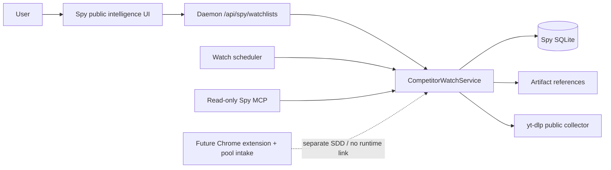
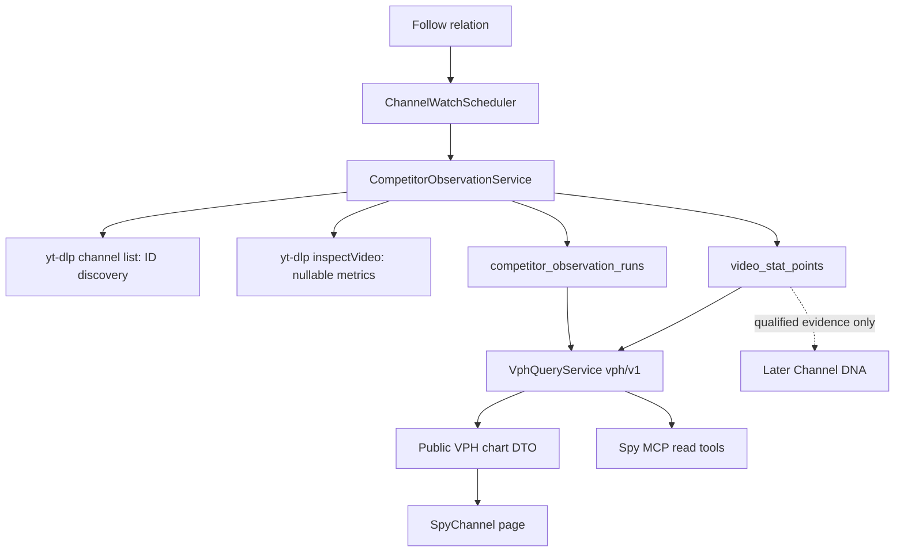
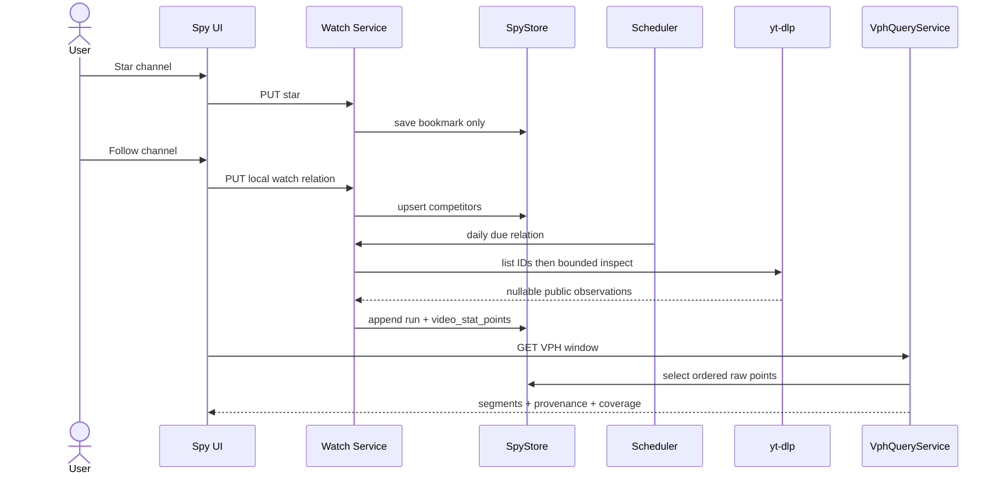

# Solution Design Document

## Validation Checklist

### CRITICAL GATES (Must Pass)

- [x] All required design sections are complete.
- [x] No clarification placeholder remains.
- [x] The active delivery contains no OAuth, Keychain, YouTube Analytics, or “My Channel” implementation.
- [x] Daily competitor VPH is based on two time-stamped public video observations, never a single-snapshot age proxy.
- [x] The watch collector has an explicit yt-dlp-only boundary with no YouTube Data API fallback.
- [x] Existing Spy runs/corpus, legacy competitors relation, P0 loop, and Spy MCP semantics are preserved.
- [ ] All architecture decisions are confirmed by the user.

### QUALITY CHECKS (Should Pass)

- [x] Raw facts, deterministic VPH, and hypotheses are distinct in data/API/UI.
- [x] Chart data has provenance, actual measurement window, gaps, and unknown values instead of fabricated zeroes.
- [x] Scheduler is bounded, idempotent, feature-flagged, and never dispatches an agent/PTY/LLM.
- [x] Schema migration is additive from current Spy schema v6.
- [x] A developer can implement the public-watch scope without activating the paused Spy Loop/P0 work.

## Constraints

| ID | Constraint |
|---|---|
| CON-1 | The current delivery is public competitor intelligence only: saved research, followed channels, public observations, VPH, charts, and later evidence-backed Channel DNA. “Kênh của tôi” is not a page, role, OAuth connection, or analytics ingestion scope. |
| CON-2 | Future first-party data will arrive through a separately designed Chrome extension → pool intake. This SDD must not introduce OAuth, Keychain, YouTube Analytics/Reporting adapters, private fact tables, or a fake ownership claim in anticipation of it. |
| CON-3 | Star means local saved research only. It must not invoke yt-dlp/Data API, create an operation, schedule a job, create a follow relation, dispatch an agent, or modify a source pack. |
| CON-4 | Follow is an explicit local watch-list relation. The existing `competitors(owner_channel_id, competitor_channel_id)` table remains canonical for compatibility. In this single-user delivery, new UI follows use the non-YouTube partition `local-desktop`; legacy MCP callers preserve their supplied partition IDs. |
| CON-5 | A new UI action that writes a role requires a resolved stable YouTube `UC…` channel ID. Handles/source identities are aliases. Existing legacy MCP competitor behavior is preserved rather than tightened to the new UI rule. |
| CON-6 | Scheduled public observation is yt-dlp only. It uses a new collection port and may not call the existing manual acquisition path because that path prefers/falls back to YouTube Data API. Provider failure is explicit and never triggers fallback. |
| CON-7 | VPH is a deterministic rate from at least two valid video observation points: `(end.views - start.views) / actualElapsedHours`. Existing lifetime views/day, channel momentum, and single-snapshot age ratios are not VPH and must not be relabelled. |
| CON-8 | A missing view count, a missing/private/deleted video, an invalid ID, or a decreased public counter is a factual data condition. It is not zero and cannot produce a normal VPH segment. Raw facts remain visible with their status. |
| CON-9 | Raw video points are append-only. VPH is computed at read time under a versioned definition; no interpolation/resampling or automatic LLM explanation is permitted in v1. |
| CON-10 | Charts are evidence displays, not causal proof. They show public source/provenance, actual time window, completeness, and sample counts; a hypothesis is never plotted as a factual metric. |
| CON-11 | Daily/burst collectors do not fetch transcript/frame/media, use search, run a full Spy channel acquisition, start Writer/Team turns, or call Gemini. Channel DNA is user-requested and later than VPH; it is never auto-generated by a watch job. |
| CON-12 | The paused Spy Loop/P0 config, recommendation capture, and 30-day P0 expiry job remain isolated. Watch points and DNA-referenced artifacts are not eligible for that expiry job until their own retention ADR is confirmed. |

## Implementation Context

### Required Context Sources

#### Documentation Context

```yaml
- doc: plan/codex/spy-intelligence-learning-roadmap.md
  relevance: CRITICAL
  why: "Defines the evidence-first/no-copy boundary and already reserves video-stat points plus a strict distinction between observed velocity and a one-snapshot proxy."

- doc: plan/claude/spy-autoloop-design.md
  relevance: HIGH
  why: "Defines the existing topic/loop isolation, scheduler catch-up ideas, and no-parallel-state constraint."

- doc: docs/specs/003-external-writer-library-mcp/solution-design.md
  relevance: MEDIUM
  why: "Repository SDD conventions for immutable references, scopes, fail-closed behavior, and additive contracts."

- url: https://github.com/yt-dlp/yt-dlp
  relevance: CRITICAL
  why: "Primary yt-dlp documentation for dump-json, playlist selection, and fields including channel ID, upload/release time, duration, and view count. Availability is extractor-specific."

- url: https://developers.google.com/youtube/v3/docs/search/list
  relevance: MEDIUM
  why: "Documents why search is not a reliable latest-upload inventory; this feature deliberately does not use search or the Data API."
```

#### Code Context

```yaml
- file: packages/spy/src/store.ts
  relevance: CRITICAL
  why: "Current schema v6, operations idempotency, non-time-series video_snapshots, existing competitors relation, delete behavior, and P0 retention interaction."

- file: packages/spy/src/index.ts
  relevance: CRITICAL
  why: "Existing competitor service behavior and current lifetime/channel momentum metrics that must not be called VPH."

- file: packages/spy/src/acquisition.ts
  relevance: CRITICAL
  why: "Manual channel acquisition prefers/falls back to Data API and is prohibited from the competitor watcher."

- file: packages/spy/src/adapters/ytdlp.ts
  relevance: CRITICAL
  why: "Existing list/inspect process limits and the current `toInfo` unknown-to-zero conversion that the new observation DTO must not use."

- file: packages/spy/src/artifacts.ts
  relevance: HIGH
  why: "Raw evidence artifact-reference pattern for bounded API/chart responses."

- file: packages/spy/src/profile/index.ts
  relevance: MEDIUM
  why: "Existing evidence-backed profiles from which later user-requested DNA can compose."

- file: packages/spy/src/mcp-tools.ts
  relevance: HIGH
  why: "Current tool schema/scope/output-cap pattern and legacy competitors tools."

- file: packages/daemon/src/http.ts
  relevance: HIGH
  why: "Daemon composition, routes, feature isolation, and current P0 retention scheduling."

- file: packages/daemon/src/spy/loop-scheduler.ts
  relevance: MEDIUM
  why: "Catch-up/re-evaluation pattern to adapt without changing the paused loop's behavior."

- file: packages/daemon/src/spy-mcp.ts
  relevance: HIGH
  why: "Strict local Spy MCP allowlist and lockstep tests; mutations remain excluded."

- file: packages/web/src/pages/Spy.tsx
  relevance: HIGH
  why: "Current manual Spy landing page to extend with saved/followed public intelligence."

- file: packages/web/src/pages/SpyRun.tsx
  relevance: HIGH
  why: "Completed channel-run viewer: user entry point for Star and later DNA extraction."

- file: packages/web/src/api.ts
  relevance: HIGH
  why: "Typed web-to-daemon contract convention."

- file: packages/web/src/router.ts
  relevance: HIGH
  why: "Hash-route precedence; channel routes must precede generic Spy run matching."

- file: package.json
  relevance: HIGH
  why: "Actual workspace commands."
```

#### External APIs (if applicable)

```yaml
- service: yt-dlp / YouTube public extractor
  doc: https://github.com/yt-dlp/yt-dlp
  relevance: CRITICAL
  why: "The sole public collector in this delivery. `--dump-json` info fields are extractor-dependent and must be marked unknown when absent."
```

### Implementation Boundaries

- **Must Preserve**
  - Existing manual Spy acquisition, source-pack search semantics, corpus, profiles, legacy `spy_competitors_list/update`, and all old rows.
  - Existing P0 loop feature flags and no-live-provider posture.
  - Existing meaning of lifetime `velocity`/`viewsPerDay`; no public API/UI rename to VPH.
- **Can Modify**
  - Spy schema/migrations, public watch domain, yt-dlp adapter capability, public VPH read model, daemon scheduler/routes, web Spy routes/pages, and read-only Spy MCP tools.
- **Must Not Touch**
  - `AcquisitionService.listChannelVideos` fallback semantics, P0 loop scheduler behavior, Team MCP/PTY, Writer execution, OAuth/Keychain/Analytics code, and automatic Gemini/agent analysis.

### External Interfaces

#### System Context Diagram



#### Interface Specifications

```yaml
inbound:
  - name: Spy Web UI
    type: Loopback HTTP
    authentication: Existing local app/session boundary
    data_flow: "Save, follow/pause/unfollow, request bounded VPH series, and inspect public chart evidence."
  - name: Spy MCP
    type: Existing Spy MCP proxy
    authentication: Existing spy.read scope and local allowlist
    data_flow: "Read public observations/VPH only; no mutation, OAuth, or provider start surface."
  - name: Watch scheduler
    type: In-process daemon job
    authentication: Process-local
    data_flow: "Selects due daily/burst relations and invokes the bounded public collector."
outbound:
  - name: yt-dlp public collector
    type: Child process adapter
    authentication: None
    data_flow: "Discover recent channel video IDs, then inspect a bounded set of individual videos for public metrics."
    criticality: HIGH
data:
  - name: Spy SQLite
    type: SQLite/WAL via SpyStore
    data_flow: "Canonical follow relation, observation runs, immutable video points, and schedule state."
  - name: Spy artifact store
    type: Existing ArtifactRef store
    data_flow: "Raw list/inspect payload reference and integrity digest; API returns previews/references only."
```

### Cross-Component Boundaries

- **API Contracts:** raw point, VPH window, comparability status, chart filter, and watch relation DTO fields are additive/versioned. All VPH responses name their definition version.
- **Domain Ownership:** `SpyStore` owns persisted facts; `CompetitorObservationService` owns collection plan/result persistence; `VphQueryService` owns deterministic pair selection and formula; `ChannelDnaService` is a later user-commanded consumer only; daemon owns due scheduling; web renders supplied facts.
- **Shared Resources:** a watch run may reference public artifacts but cannot write `video_snapshots` as a substitute time-series. Its raw video point table is a separate measured-fact ledger, not a second corpus or candidate index.
- **Breaking Change Policy:** existing manual Spy and competitor MCP fields retain meaning. Additive VPH fields/routes are allowed; a formula/tolerance change increments `definitionVersion`.

### Project Commands

```bash
Install:   bun install
Dev API:   bun run daemon
Dev App:   bun run app:macos
Test:      bun test packages/spy packages/daemon packages/pipeline-core packages/training-core
Typecheck: bun run typecheck
UI Build:  bun run ui:build
App Build: bun run app:build
```

## Solution Strategy

- **Architecture Pattern:** append-only public telemetry: yt-dlp observations → immutable raw video points → deterministic versioned VPH projection → provenance-labelled chart read model.
- **Integration Approach:** extend the existing canonical competitor relation and Spy SQLite. Build a separate yt-dlp-only observation port instead of reusing manual acquisition. Compute VPH from raw points at read time, so a formula revision does not destroy facts.
- **Justification:** VPH requires two actual measurements of the same video. Channel-level totals and current corpus snapshots cannot prove it. This design supports a truthful daily baseline first and optional bounded early-life burst measurement later.
- **Key Decisions:** local watch-list partition; public-only; inspect-for-view-count; unknown stays unknown; actual elapsed window is displayed; no auto agent/LLM; native accessible chart primitives with data-table fallback.

### Delivery Plan

| Phase | Scope | Exit gate |
|---|---|---|
| C0 — Confirm public-watch decisions | Confirm ADR-CI-1 through ADR-CI-9; explicitly defer OAuth/extension intake. | No OAuth/ownership requirement or VPH semantic is ambiguous. |
| C1 — Saved research and follow list | Additive v6→v7 migration for star/follow state; preserve legacy MCP; public list/channel UI. | Star has zero side effects; follow remains canonical `competitors`. |
| C3a — Raw observation | yt-dlp-only run/point ledger, inspect caps, daily scheduler, catch-up/idempotency/kill switch. | No Data API call, unknown-to-zero, duplicate point, transcript/frame, agent, or P0 tick. |
| C3b — VPH read model | `vph/v1` window pair selection, actual elapsed/comparability, public API. | Formula, missing/decrease, 24h tolerance, and no-proxy-label gates pass. |
| C3c — VPH-first charts | Accessible table, heatmap, scatter, cohort, and video drilldown using C3b DTOs. | Every chart cell/tooltip identifies fact/provenance/window; unavailable is never shown as zero. |
| C3d — Optional new-upload burst | Cap-bounded +2/+6/+12/+24h slots and one-slot catch-up behavior. | Daily stays useful when app is offline; burst never promises real-time coverage. |
| C2 — Channel DNA later | User-requested immutable/evidence-pinned DNA from completed runs and qualified public points. | DNA never blocks VPH delivery and never auto-runs from cron. |
| Deferred — First-party extension/pool | A separate SDD for extension permissions, pool protocol, consent, retention, and own-channel comparison. | No implementation work in this milestone. |

## Building Block View

### Components



### Directory Map

**Component**: Spy domain
```text
packages/spy/src/
├── store.ts                                  # MODIFY: explicit v6→v7 migration; watch runs/points/follow CRUD
├── index.ts                                  # MODIFY: facade; preserve legacy competitor delegation
├── channel-intelligence/
│   ├── types.ts                              # NEW: raw point, VPH, chart/filter, watch ports
│   ├── roles.ts                              # NEW: Star/follow/pause/unfollow, no provider side effects
│   ├── observations.ts                       # NEW: yt-dlp-only collection plan and raw persistence
│   ├── vph.ts                                # NEW: vph/v1 pair selection and deterministic projection
│   └── dna.ts                                # NEW later C2: immutable user-requested analysis only
├── adapters/ytdlp.ts                         # MODIFY: nullable observation DTO + inspect-only metrics path
├── artifacts.ts                              # REUSE: raw evidence refs
├── mcp-tools.ts                              # MODIFY later C5: read-only VPH/observation tools
└── acquisition.ts                            # DO NOT USE/MODIFY for watch collector
```

**Component**: daemon
```text
packages/daemon/src/
├── http.ts                                   # MODIFY: public-watch/VPH routes and disabled-by-default composition
├── spy/channel-intelligence-config.ts        # NEW: public-watch config; separate from spy-loop.json
├── spy/channel-watch-scheduler.ts            # NEW: due selection, daily/burst catch-up, concurrency 1
└── spy-mcp.ts                                # MODIFY later: additive read allowlist only
```

**Component**: web
```text
packages/web/src/
├── api.ts                                    # MODIFY: typed watch/VPH chart clients
├── router.ts + main.tsx                      # MODIFY: channels route precedes generic spy run
├── pages/Spy.tsx                             # MODIFY: Saved research / Followed competitors hub
├── pages/SpyRun.tsx                          # MODIFY: Star and later DNA entry after completed channel run
├── pages/SpyChannel.tsx                      # NEW: VPH channel workspace
└── components/spy-vph/                       # NEW: table, heatmap, scatter, cohort, drilldown primitives
```

### Interface Specifications

#### Interface Documentation References

```yaml
interfaces:
  - name: Existing competitor MCP contract
    doc: packages/spy/src/index.ts and packages/spy/src/mcp-tools.ts
    relevance: CRITICAL
    sections: [listCompetitors, updateCompetitors, scopes]
    why: "Canonical relation and old caller behavior remain compatible."
  - name: Existing yt-dlp adapter
    doc: packages/spy/src/adapters/ytdlp.ts
    relevance: CRITICAL
    sections: [listChannel, inspectVideo, process limits, toInfo]
    why: "Separates ID discovery from reliable nullable metric inspection."
  - name: Existing scheduler/config conventions
    doc: packages/daemon/src/spy/loop-scheduler.ts and packages/daemon/src/spy/loop-config.ts
    relevance: HIGH
    sections: [catch-up, flag, clock]
    why: "Reusable scheduler mechanics without coupling to P0 loop state."
```

#### Data Storage Changes

```yaml
Migration: Spy schema v6 -> v7 (single transaction, tested with a v6 fixture)
  ADD to channels: youtube_uc_id TEXT nullable, handle TEXT nullable
  ADD UNIQUE index: channels(youtube_uc_id) WHERE youtube_uc_id IS NOT NULL
  ALTER competitors: ADD watch_status TEXT NOT NULL DEFAULT 'followed'
  ALTER competitors: ADD cadence TEXT NOT NULL DEFAULT 'daily'
  ALTER competitors: ADD last_observed_at TEXT nullable
  ALTER competitors: ADD last_observation_status TEXT nullable
  PRESERVE: all columns/rows and unique(owner_channel_id, competitor_channel_id)

Table: saved_channels (NEW)
  youtube_uc_id: TEXT primary key
  starred_at: TEXT not null
  note: TEXT nullable
  updated_at: TEXT not null
  purpose: "A local bookmark only; never inferred from corpus/follow and never schedules collection."

Table: competitor_observation_runs (NEW)
  id: TEXT primary key
  owner_channel_id: TEXT not null
  competitor_channel_id: TEXT not null
  plan_kind: TEXT not null check(daily|burst)
  plan_version: TEXT not null
  local_date: TEXT not null
  burst_slot: TEXT nullable
  provider_used: TEXT not null check(ytdlp)
  status: TEXT not null check(queued|running|completed|failed|unavailable)
  completeness: TEXT not null check(complete|partial|unavailable)
  started_at: TEXT not null
  completed_at: TEXT nullable
  error_code: TEXT nullable
  error_message: TEXT nullable
  playlist_limit: INTEGER not null
  inspect_attempted: INTEGER not null default 0
  inspect_ok: INTEGER not null default 0
  payload_ref: TEXT nullable
  payload_hash: TEXT nullable
  unique: (owner_channel_id, competitor_channel_id, plan_kind, local_date, burst_slot, plan_version)
  purpose: "One idempotent public collection attempt. A retry reuses this run and cannot create a second point per video."

Table: video_stat_points (NEW)
  id: TEXT primary key
  observation_run_id: TEXT not null references competitor_observation_runs(id)
  source_video_id: TEXT not null
  youtube_uc_id: TEXT nullable
  sampled_at: TEXT not null
  view_count: INTEGER nullable
  like_count: INTEGER nullable
  comment_count: INTEGER nullable
  duration_sec: REAL nullable
  published_at: TEXT nullable
  title: TEXT nullable
  availability: TEXT not null check(present|missing|private|error)
  view_quality: TEXT not null check(known|unknown|decreased_vs_prior)
  provider_used: TEXT not null check(ytdlp)
  inspect_used: INTEGER not null
  raw_ref: TEXT nullable
  raw_hash: TEXT nullable
  created_at: TEXT not null
  unique: (observation_run_id, source_video_id)
  indexes: [source_video_id + sampled_at, youtube_uc_id + sampled_at]
  purpose: "Append-only raw public measurements. A non-null view_count is allowed only after individual inspectVideo succeeds."

Table: tracked_videos (NEW, optional C3d support)
  source_video_id: TEXT primary key
  youtube_uc_id: TEXT not null
  first_seen_run_id: TEXT not null
  last_seen_run_id: TEXT nullable
  last_missing_run_id: TEXT nullable
  published_at: TEXT nullable
  tracking_until: TEXT nullable
  created_at: TEXT not null
  updated_at: TEXT not null
  purpose: "Bounded tracking/burst eligibility; it is not a second follow list or corpus."

Future C2 table: channel_dna_versions (NOT in v7)
  purpose: "A later append-only, evidence-pinned, user-requested DNA version. It does not block VPH."
```

`video_snapshots` remains manual-Spy/corpus evidence. Its non-null `view_count` and run lifecycle make it unsuitable as the VPH time series. `deleteSpyRun` must have no effect on `video_stat_points`.

#### Internal API Changes

```yaml
Endpoint: List saved/followed public channels
  Method: GET
  Path: /api/spy/watchlists/:watchlistId/channels?segment=saved|followed
  Rule: "v1 UI uses watchlistId=local-desktop; existing non-local legacy partitions remain accessible only through current MCP/service paths."
  Response: { channels: ChannelSummary[], nextCursor: string|null }

Endpoint: Star / unstar a resolved channel
  Method: PUT / DELETE
  Path: /api/spy/channels/:youtubeUcId/star
  Request: { note?: string }
  Response: { youtubeUcId: string, starred: boolean, starredAt?: ISO8601 }
  Errors: [404 channel_unknown, 422 channel_unresolved_or_invalid]
  Rule: "Storage-only; no operation or collector."

Endpoint: Follow / pause / unfollow a public competitor
  Method: PUT / PATCH / DELETE
  Path: /api/spy/watchlists/:watchlistId/competitors/:youtubeUcId
  Request: { note?: string, cadence?: daily|manual, watchStatus?: followed|paused }
  Response: { watchlistId, competitorChannelId, watchStatus, cadence, lastObservedAt, nextDueAt? }
  Errors: [422 unresolved_or_invalid_channel, 404 relation_not_found]
  Rule: "Does not require an owned YouTube channel or OAuth."

Endpoint: Read VPH/chart data
  Method: GET
  Path: /api/spy/watchlists/:watchlistId/competitors/:youtubeUcId/vph
  Query: { window?: 24h|1h|7d, from?: ISO8601, to?: ISO8601, ageBucket?: string, durationBucket?: string, publishedWeekday?: 0..6, includeNonComparable?: boolean }
  Response: { definitionVersion, requestedWindow, timezone, provenance, coverage, videos, vphSegments, aggregations }
  Errors: [404 channel_not_followed, 422 invalid_window]

Endpoint: Read one video drilldown
  Method: GET
  Path: /api/spy/videos/:videoId/vph
  Query: { definitionVersion?: 'vph/v1', from?: ISO8601, to?: ISO8601 }
  Response: { rawPoints, vphSegments, provenance, coverage }
```

Later C5 MCP adds read-only `spy_channel_observations` and `spy_video_vph` with capped/paginated response. It does not add Star, follow, provider start, OAuth, or any mutation to the local allowlist. Legacy `spy_competitors_list/update` keep their current schema and behavior; optional cadence/status fields are additive only.

#### Application Data Models

```pseudocode
ENTITY VideoStatPoint
  sourceVideoId, sampledAt, viewCount?, availability, viewQuality
  providerUsed='ytdlp', inspectUsed, observationRunId, rawRef?
  INVARIANT: viewCount is null unless individual inspection returned a known count.

ENTITY VphSegment
  definitionVersion='vph/v1'
  sourceVideoId, requestedWindow, actualElapsedHours
  start{sampledAt, viewCount}, end{sampledAt, viewCount}
  vph?, comparability, reason?, providerUsed
  INVARIANT: vph is present only for two known, present, non-decreasing points with elapsedHours > 0.

ENTITY CompetitorObservationRun
  ownerPartition, competitorUcId, planKind, localDate, burstSlot?, planVersion
  status, completeness, inspectAttempted, inspectOk, payloadRef?
  INVARIANT: tuple is idempotent; a completed run cannot append another point for the same video.
```

#### Integration Points

```yaml
- from: ChannelWatchScheduler
  to: CompetitorObservationService
  protocol: In-process async port
  data_flow: "Due canonical follow relation -> idempotent daily/burst run."
- from: CompetitorObservationService
  to: YtDlpObservationPort
  protocol: Child process adapter
  data_flow: "List channel solely for video IDs; inspect bounded individual videos for nullable public metrics. No AcquisitionService or Data API branch exists."
- from: VphQueryService
  to: SpyStore
  protocol: In-process read port
  data_flow: "Ordered raw points -> vph/v1 segments and chart DTO, always retaining actual times/counts."
```

### Implementation Examples

#### Example: VPH v1 segment construction

```typescript
function toVphSegment(start: VideoStatPoint, end: VideoStatPoint, requestedWindow: '24h') {
  if (start.availability !== 'present' || end.availability !== 'present'
      || start.viewCount === null || end.viewCount === null) {
    return unavailable('missing_measurement');
  }
  const elapsedHours = (Date.parse(end.sampledAt) - Date.parse(start.sampledAt)) / 3_600_000;
  if (!(elapsedHours > 0)) return unavailable('invalid_elapsed_time');
  if (end.viewCount < start.viewCount) return unavailable('count_decreased');

  const vph = (end.viewCount - start.viewCount) / elapsedHours;
  const comparability = elapsedHours >= 18 && elapsedHours <= 30
    ? 'comparable_24h'
    : elapsedHours > 30 ? 'stretched' : 'not_comparable_to_24h';
  return { definitionVersion: 'vph/v1', requestedWindow, elapsedHours, vph, comparability, start, end };
}
```

#### Example: yt-dlp-only observation guard

```typescript
async function observeDue(relation: FollowRelation): Promise<ObservationRun> {
  if (!config.competitorWatch.enabled) return skipped('watch_disabled');
  if (!ports.ytdlp.isAvailable()) return unavailable('ytdlp_unavailable');

  const ids = await ports.ytdlp.listChannelIds(relation.competitorChannelId);
  const inspected = await inspectBoundedTrackedIds(ids, config.inspectCap);
  // No `dataApi`, `AcquisitionService`, transcript, frame, Gemini, or Team branch exists here.
  return store.completeObservationRun(relation, inspected);
}
```

#### Test Examples as Interface Documentation

```typescript
test('a 22-hour window reports its real VPH and is comparable to 24 hours', () => {
  const segment = vph(point('2026-08-30T00:00Z', 300), point('2026-08-30T22:00Z', 1400));
  expect(segment.vph).toBe(50);
  expect(segment.actualElapsedHours).toBe(22);
  expect(segment.comparability).toBe('comparable_24h');
});

test('flat playlist missing view does not become zero', async () => {
  ytdlp.listChannelIds.mockResolvedValue(['abc12345678']);
  ytdlp.inspectVideo.mockResolvedValue({ viewCount: null });
  await observeDue(followed);
  expect(store.latestPoint('abc12345678').viewCount).toBeNull();
  expect(dataApi.calls).toBe(0);
});
```

## Runtime View

### Primary Flow

#### Primary Flow: Follow a competitor and obtain honest 24-hour VPH

1. User finishes a channel Spy run, which resolves the channel to a stable UC ID, then chooses **Star**. Only `saved_channels` changes.
2. User chooses **Follow** from saved research. The relation is created in the local-desktop partition with daily cadence; the UI says monitoring is disabled until its independent feature flag is enabled.
3. When due, the scheduler creates/reuses one idempotent daily observation run. yt-dlp lists a small newest-first channel page for IDs, then individually inspects only bounded tracked/recent IDs.
4. Each inspected video produces an append-only `video_stat_point` with the daemon's actual UTC sample time. A failed/missing inspection produces a status point with `view_count=null`.
5. After two valid points, VphQueryService computes VPH from the actual time delta. A 22h result is comparable to a requested 24h window; a 48h result is returned as a 48h average and not rescaled.
6. The UI shows a VPH table/heatmap/scatter/cohort and links a selected cell to raw video observations. It never fills missing values with zero.



### Error Handling

- **Unresolved channel:** Star/follow returns `channel_unresolved` with “Spy/resolve the channel first”; no row, operation, or provider call.
- **yt-dlp unavailable/error/timeout:** write an `unavailable`/`failed` observation run with `provider_used=ytdlp`; no Data API fallback. Retry eligibility is explicit.
- **Partial list/inspect:** persist known points and per-video missing/error points, mark run `partial`, and show inspected/playlist coverage.
- **Missing/private/deleted video:** store a point with no view count and availability status; preserve previous facts; stop the VPH line rather than continuing it to zero.
- **Counter decrease:** retain raw lower count and flag `decreased_vs_prior`; normal VPH is unavailable for that pair. A raw views chart marks the correction.
- **No pair/window:** return `vph=null`, `reason=insufficient_sample|coverage_daily_only`, not a proxy.
- **Scheduler restart:** one daily tuple and one burst slot are idempotent. Boot catches up at most one missing daily run and, for burst, only the latest missed slot.

### Complex Logic

```
ALGORITHM: Select a vph/v1 pair for a video and requested window
INPUT: ordered VideoStatPoint[], requestedWindow, now
OUTPUT: VphSegment or explicit unavailable segment

1. Keep only present points with non-null view_count and matching provider/version policy.
2. For a chosen end point, choose the immediately preceding valid point; never interpolate.
3. Calculate actualElapsedHours from the two sampled_at values.
4. Reject normal VPH if elapsed <= 0 or end views < start views.
5. Calculate deltaViews / actualElapsedHours.
6. Classify:
   - requested 24h and elapsed in [18,30] => comparable_24h;
   - requested 24h and elapsed >30 => stretched;
   - requested 24h and elapsed <18 => not_comparable_to_24h;
   - requested 1h without burst-compatible [0.5,2] hour pair => coverage_daily_only.
7. Return start/end counts/times, provider, requested/actual window, definition version, and sample reason.
```

## Deployment View

### Single Application Deployment

- **Environment:** existing local daemon + Preact/Tauri app. The daemon is not assumed to run continuously.
- **Configuration:** new `config/channel-intelligence.json`, independent from `spy-loop.json`: `competitorWatch.enabled=false`, timezone `Asia/Ho_Chi_Minh`, daily hour, playlist limit, inspect cap, per-relation wall-clock cap, unavailable pause threshold, optional burst enabled false, and burst slot list.
- **Dependencies:** yt-dlp executable and existing artifact/SQLite services. No Google OAuth/API dependency is introduced.
- **Performance:** scheduler concurrency is 1; daily inspect cap defaults to 20 recent/tracked videos per channel and stops at a bounded wall-clock budget; list-only entries never supply a view count; chart queries cap/paginate raw points. A user sees `partial` instead of an unbounded slow run.

### Multi-Component Coordination

- **Deployment Order:** v6→v7 migration/store → role UI/API with watch disabled → collector/scheduler with flag disabled → VPH service/API → charts → optional burst.
- **Version Dependencies:** daemon, Spy types, and web chart DTOs deploy together. Existing MCP competitor tools remain unaffected until later read tools are added.
- **Feature Flags:** all watch/VPH/burst flags default false. P0 Spy Loop remains independently paused.
- **Rollback Strategy:** disable watch/burst first; preserve append-only raw run/point facts; do not alter manual Spy acquisition or legacy relation rows.
- **Data Migration Sequencing:** explicit transaction-tested migration, not merely `CREATE TABLE IF NOT EXISTS`. Add columns/tables/indexes then bump version after success. Do not create owner/OAuth tables in v7.

## Cross-Cutting Concepts

### Pattern Documentation

```yaml
- pattern: Existing Spy operation idempotency and artifact references
  relevance: CRITICAL
  why: "One daily/burst tuple creates one durable observation attempt and raw evidence stays bounded."
- pattern: New append-only public telemetry
  relevance: CRITICAL
  why: "VPH is reproducible from raw points and formula changes do not rewrite history."
- pattern: Existing Spy MCP scopes/output caps
  relevance: HIGH
  why: "Future VPH reads are allowlisted/capped; no new local mutation is exposed."
```

### User Interface & UX

**Information Architecture:**

```text
Spy
├── Đã lưu nghiên cứu
│   └── Starred channel → Follow when ready
└── Đối thủ đang theo dõi
    └── Channel workspace
        ├── VPH leader table
        ├── VPH heatmap by video/day
        ├── VPH scatter by video age
        ├── Cohort bands (age buckets)
        └── Video drilldown: raw views + VPH segments
```

**VPH-first chart surfaces:**

1. **Follow list:** no decorative chart. Show last run, completeness, number of videos with comparable 24h VPH, and median 24h VPH only when sample count is sufficient; otherwise `—`.
2. **Leader table:** default sort is comparable 24h VPH descending. Columns: title, publish time, latest views, VPH, actual elapsed hours, quality/comparability, sampled time, availability. Unknown sorts last, never as zero.
3. **Heatmap:** rows are up to 20 tracked videos; columns are the last 14 local dates; each cell is a daily VPH segment ending that day. Empty cell says “không đo”. Click opens the drilldown at the raw pair.
4. **Scatter:** x is video age at the end point, y is VPH, size is latest known views, colour is comparability. Caption says it is public observed VPH, not CTR, impressions, causality, or a breakout prediction.
5. **Cohort bands:** 0–24h, 1–3d, 3–7d, 7–30d. Show count, median, P25/P75 only when a cohort has at least three comparable values; otherwise `insufficient sample`.
6. **Video drilldown:** separate upper raw-views line and lower VPH bar/step chart. Missing observations make a visual gap; decreased view counts are marked; VPH bar width reflects actual elapsed hours. Never use a dual axis for views and VPH.
7. **Factor slices:** the same cohort/distribution query can group comparable VPH by duration bucket, publication weekday/hour, and deterministic title-pattern group when enough rows exist. Each slice shows `n`, median and spread; it is segmentation, not causal attribution. Filters always include channel, observation date range, video age, requested/actual window, and comparability.

**Tooltip/provenance requirement:** every chart cell/point includes title/video ID, requested window, actual elapsed hours, start/end timestamps and view counts, VPH or reason, availability/quality, provider `ytdlp`, inspect used, definition `vph/v1`, observation completeness, and UTC plus local time labels.

**Chart implementation:** no chart library exists today. C3c starts with small native SVG/data-driven components for the capped table/heatmap/scatter/drilldown plus a semantic raw-data table fallback; a new dependency requires a later ADR and accessibility review.

### System-Wide Patterns

- **Security:** public collector has no credentials in this delivery. Raw payload may still be untrusted; it is never rendered as executable HTML or an instruction.
- **Error Handling:** provider/output errors have a non-sensitive code, provider name, run status, and retry eligibility. All chart states carry text, not colour alone.
- **Performance:** use keyset/cursor point reads; query only selected channel/video/range; bound inspected videos; no automatic deep evidence work.
- **i18n/L10n:** store sample timestamps in UTC, render local labels in configured watch timezone, and put both in tooltips. VPH unit is `views/hour`.
- **Logging/Auditing:** record run ID, relation, provider, plan/version, counts, duration, and safe error code—not full raw output/transcripts.

### Multi-Component Patterns

- **Communication Patterns:** HTTP/MCP reads are request-response; collection uses existing persisted operation semantics; scheduler is in-process only.
- **Data Consistency:** relation mutations are transactional; raw facts append; VPH is an eventually computed projection whose exact input points are returned with it.
- **Circuit Breakers:** after a configured number of consecutive unavailable runs, pause the affected relation and show the action to resume; never substitute another provider.

## Architecture Decisions

- [ ] ADR-CI-1 — Save versus follow: **Star is a storage-only bookmark. Follow is explicit and uses `competitors` with `owner_channel_id='local-desktop'` for the v1 UI; this is a local partition, not proof of ownership.**
  - Rationale: the product needs a follow list before any first-party intake exists, while legacy callers still use the existing partition field.
  - Trade-offs: multi-watchlist naming is deferred; users see one local follow list initially.
  - User confirmed: _Pending_.

- [ ] ADR-CI-2 — Public source and view reliability: **watch collection is yt-dlp only; list output discovers IDs, while a non-null VPH source view count requires individual inspectVideo.**
  - Rationale: avoids manual acquisition/Data API fallback and flat-list unknown-to-zero data corruption.
  - Trade-offs: bounded per-video inspect is slower; incomplete runs are an expected UI state.
  - User confirmed: _Pending_.

- [ ] ADR-CI-3 — First-party source is deferred: **no OAuth in this SDD. A future Chrome extension → pool intake requires a separate design and does not change the public VPH contract.**
  - Rationale: follows the requested product direction and prevents unrelated credential/security scope creep.
  - Trade-offs: no own-channel analytics or own-vs-competitor comparison in this milestone.
  - User confirmed: _Pending_.

- [ ] ADR-CI-4 — VPH raw facts and formula: **append only `video_stat_points`; compute `vph/v1 = Δviews / actualElapsedHours` at read time from consecutive valid observations; never name lifetime velocity VPH.**
  - Rationale: reproducible metric that exposes missing/corrected data honestly.
  - Trade-offs: some videos have no VPH until their second successful inspection.
  - User confirmed: _Pending_.

- [ ] ADR-CI-5 — 24-hour comparability: **a requested 24h VPH is comparable only when actual elapsed time is 18–30h. Other actual windows are returned and labelled, never rescaled.**
  - Rationale: scheduler misses and burst samples must not masquerade as a daily measurement.
  - Trade-offs: less chart coverage but more credible comparisons.
  - User confirmed: _Pending_.

- [ ] ADR-CI-6 — Daily baseline and optional burst: **ship daily first; optional new-video burst uses +2/+6/+12/+24h slots, caps at eight videos/channel, and catches up at most the latest missed slot.**
  - Rationale: daily supports 24h VPH; burst can reveal the early curve without claiming realtime when the app is offline.
  - Trade-offs: burst coverage degrades to daily if the daemon is not running; no false 1h VPH promise.
  - User confirmed: _Pending_.

- [ ] ADR-CI-7 — DNA ordering: **VPH/charts ship before optional Channel DNA. DNA stays immutable/evidence-pinned and user-requested; watch jobs never invoke LLM/agent/PTY.**
  - Rationale: velocity evidence is the immediate value and prevents analysis cost from hiding measurement defects.
  - Trade-offs: a newly followed channel may have charts before a prose DNA card.
  - User confirmed: _Pending_.

- [ ] ADR-CI-8 — Retention: **exclude watched video points and artifacts referenced by READY DNA from P0's 30-day sweep until a dedicated public-telemetry retention policy is confirmed.**
  - Rationale: retains enough history for VPH/cohort charts and prevents orphaned DNA evidence.
  - Trade-offs: storage grows temporarily; a rolling policy is a later explicit decision.
  - User confirmed: _Pending_.

- [ ] ADR-CI-9 — Chart technology: **use native accessible SVG + semantic table fallback for v1's capped datasets; do not add a chart dependency in C3c without an accessibility/performance ADR.**
  - Rationale: chart needs are bounded and provenance-heavy; a table remains the canonical accessible rendering.
  - Trade-offs: less turnkey interaction than a chart library.
  - User confirmed: _Pending_.

## Quality Requirements

- **Correctness:** a fixture with 300 views then 1,500 views exactly 24h apart yields `50 views/hour`; any unknown/decrease/invalid elapsed pair has `vph=null` and a reason.
- **Reliability:** one `(partition, competitor, planKind, localDate, burstSlot, planVersion)` yields one completed run and one point per video, even after restart/retry; flag off yields zero spawned collector processes.
- **Performance:** daily concurrency 1; default inspect cap 20/channel; chart response caps raw points and uses pagination; p95 visible chart query under 500 ms for 20 videos × 30 daily points from indexed SQLite.
- **Usability:** all VPH visuals show actual elapsed time, public provider, completeness, and point count; unavailable data is visible as text/gap, not zero/color only.
- **Data integrity:** list-only/unknown metrics cannot enter a non-null view count; raw points are immutable; charts return exact start/end evidence.

## Acceptance Criteria

**Main Flow Criteria: [CI-1 — saved research and follow]**

- [ ] WHEN a completed/resolved channel Spy run is starred, THE SYSTEM SHALL persist only the local saved relation and SHALL create zero provider calls, operations, follow rows, clones, turns, or schedules.
- [ ] WHEN a user follows a resolved saved channel, THE SYSTEM SHALL create/update the canonical local competitor relation and SHALL show that daily monitoring is disabled until the independent flag is enabled.
- [ ] WHEN a user pauses/unfollows, THE SYSTEM SHALL stop future work while retaining observation/DNA history.

**Main Flow Criteria: [CI-2 — public observation]**

- [ ] WHEN a daily relation is due and public watch is enabled, THE SYSTEM SHALL create/reuse one idempotent yt-dlp observation run and SHALL only persist a non-null video view count after individual inspection.
- [ ] IF yt-dlp is unavailable, errors, times out, or returns an unknown value, THEN THE SYSTEM SHALL record the explicit public condition and SHALL NOT call YouTube Data API, manual acquisition, transcript/frame fetch, agent, or LLM.
- [ ] WHILE watch is disabled, paused, or already completed for the tuple, THE SYSTEM SHALL create no external process.

**Main Flow Criteria: [CI-3 — VPH]**

- [ ] WHEN two valid points for a video are 22 hours apart, THE SYSTEM SHALL return `(endViews - startViews) / 22`, actual elapsed `22`, and the 24h comparability state.
- [ ] IF a video has fewer than two known points, a missing/private point, a decreased counter, or non-positive elapsed time, THEN THE SYSTEM SHALL return no normal VPH and SHALL preserve the raw condition.
- [ ] WHEN actual elapsed is outside the requested window tolerance, THE SYSTEM SHALL return the actual rate/window with a non-comparable/stretched label and SHALL NOT rescale it.

**Main Flow Criteria: [CI-4 — charts]**

- [ ] THE SYSTEM SHALL render leader table, heatmap, scatter, cohorts, and drilldown only from public VPH DTOs, with provenance/actual-window tooltip fields and semantic table fallback.
- [ ] THE SYSTEM SHALL NOT label a single-snapshot lifetime velocity as VPH, plot unknown as zero, connect a missing-point gap, or present a hypothesis as causal fact.

**Main Flow Criteria: [CI-5 — deferred DNA / first-party]**

- [ ] WHILE C3 is running, THE SYSTEM SHALL NOT create OAuth/Analytics/Keychain code, agent turn, or automatic DNA. Channel DNA is a later manual/evidence-gated capability; first-party intake waits for a separate extension/pool SDD.

## Risks and Technical Debt

### Known Technical Issues

- Current `video_snapshots` are per Spy run and non-null view-count records, not an append-only nullable observation series; delete-run lifecycle makes them unfit for VPH.
- Existing adapter `toInfo` normalizes missing view count to zero, and flat playlist output can omit fields. The watch collector must bypass that mapper for raw metric points.
- Existing manual channel acquisition has Data API-preferred/fallback behavior; calling it in watch code would violate the provider contract.
- Existing velocity/momentum terms use lifetime/age or aggregate views/day proxies. UI/API naming needs a no-proxy regression test.
- Daemon may be closed between burst slots; early VPH coverage cannot be guaranteed.

### Technical Debt

- The web app has no chart library. Native SVG/table v1 limits visual complexity intentionally; later chart-package choice needs an ADR.
- Existing channel identity can be handle/source identity rather than UC ID. C1 adds an alias mapping but must not corrupt existing corpus rows.
- Public content can be private/deleted/corrected; no provider can promise complete time series. Coverage is part of the product, not an error to hide.

### Implementation Gotchas

- Do not use YouTube `search.list`, playlist Data API, or manual acquisition to fill a missing public view count.
- For a raw zero view count, distinguish an explicit inspected zero from an absent field.
- A 48-hour VPH is an average across 48 real hours, not two 24-hour observations. Do not divide/rescale it to make chart cells look comparable.
- Burst and daily may create two points on a calendar day intentionally; point identity includes run and slot, while VPH always uses actual times.
- Any execution of P0 expiry must exclude raw watch points/ready-DNA evidence until retention is implemented.

## Glossary

### Domain Terms

| Term | Definition | Context |
|---|---|---|
| Star / saved research | Local bookmark of a resolved public channel with no collection side effect. | Spy hub. |
| Followed competitor | A channel in the local public watch partition with cadence/status. | Daily/burst scheduler. |
| Observation run | One idempotent attempt to collect a followed channel's public video facts. | Provenance and scheduling. |
| Video stat point | A timestamped public metric observation for one video. | VPH input fact. |
| VPH segment | Deterministic view delta per actual elapsed hour between two valid points. | Charts/API. |
| Comparability | Whether a VPH segment fits its requested measurement window, e.g. 24h. | Chart filtering/label. |
| Channel DNA | Later user-requested versioned analysis pinned to evidence. | Not required for VPH launch. |

### Technical Terms

| Term | Definition | Context |
|---|---|---|
| `vph/v1` | First formula/pair-selection/tolerance definition for public VPH. | API/chart reproducibility. |
| Actual elapsed hours | Exact timestamp difference between a pair of measurements. | Formula and tooltip. |
| Flat playlist | yt-dlp list mode useful for ID discovery but not trusted as a view-metric source. | Collector stage one. |
| Inspect | yt-dlp individual video metadata retrieval used before a known public view count is stored. | Collector stage two. |
| Gap | Visible absence of a usable observation; it is not a zero-valued metric. | Charts. |

### API/Interface Terms

| Term | Definition | Context |
|---|---|---|
| `local-desktop` | V1 local watch-list partition stored in legacy `owner_channel_id`; not a YouTube owner identity. | Follow UI compatibility. |
| `availability` | `present`, `missing`, `private`, or `error` status of a raw video point. | VPH eligibility. |
| `view_quality` | Whether a raw count is known, unknown, or lower than a prior observed count. | Raw chart marker. |
| `definitionVersion` | Formula/query semantics attached to every VPH response. | Future formula evolution. |
