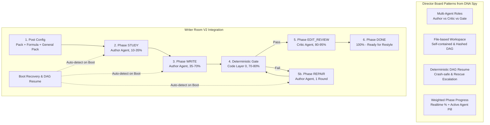

# Kế hoạch tích hợp kiến trúc Director Board (DNA Spy) & Thanh Progress vào Luồng Writer

## 1. Goal Description

Dựa trên chia sẻ chuyên sâu từ **Agy** về kiến trúc **Director Board (DNA Spy)**, kế hoạch này áp dụng trọn vẹn 4 trụ cột cốt lõi vào **Writer Room (Writer v2 flow)**:
1. **Multi-Agent Orchestration (Phân vai & Cô lập trách nhiệm)**:
   - **Author (Codex/Claude)**: Chịu trách nhiệm `STUDY` $\rightarrow$ `WRITE` $\rightarrow$ `REPAIR`.
   - **Critic / Editor (Agy/Claude)**: Đánh giá độc lập ở `EDIT_REVIEW` (không thấy Source Pack để tránh bị bias).
   - **App-owned Authority**: Agent chỉ sinh bản nháp; App chụp snapshot (preimage) trước turn, validator/gate kiểm tra chặt chẽ, nếu vi phạm sẽ rollback hoặc yêu cầu repair.
2. **State Persistence (Lưu trữ trạng thái thuần File-based & DAG Fingerprint)**:
   - Workspace tự chứa theo từng run (`workspaces/pipeline/<runId>/piece/attempts/<n>/`).
   - Đóng dấu `packHash`, `formulaHash`, `generalPackHash`. Nếu input thay đổi, các artifact cấp dưới tự động vô hiệu hóa để bảo vệ tính nhất quán.
3. **Restore Mechanism (Khôi phục đứt gãy & Crash-Safe Resume)**:
   - Quét trạng thái workspace theo DAG tất định khi daemon restart hoặc khi người dùng tiếp tục (`resolveWriterRunResume`).
   - Hỗ trợ khôi phục tức thì tại đúng stage dở dang: `STUDY` $\rightarrow$ `WRITE` $\rightarrow$ `EDIT_REVIEW` $\rightarrow$ `REPAIR` $\rightarrow$ `RESTYLE`.
4. **Weighted Phase Progress Tracking (Thanh tiến độ & Visual Stepper)**:
   - Tính toán phần trăm tiến độ tổng thể theo trọng số giai đoạn (Weighted Phases):
     - `0% - 10%`: Cấu hình (`CONFIGURING / READY`)
     - `10% - 35%`: Đọc Pack & Phân tích (`STUDY`)
     - `35% - 70%`: Viết bài (`WRITE`)
     - `70% - 80%`: Gate tất định (`GATE`)
     - `80% - 95%`: Biên tập & Sửa bài (`EDIT_REVIEW / REPAIR`)
     - `95% - 100%`: Hoàn tất (`DONE`)
   - Cung cấp component UI hiển thị thanh phần trăm mượt mà, step badges (chờ, đang chạy, thành công, lỗi), và nhãn Agent đang thực thi.

---

## 2. Mô hình Kiến trúc & Luồng Xử lý



---

## 3. User Review Required

> [!IMPORTANT]
> **Trọng số tiến độ (Weighted Phase Progress)**:
> Khi một run đang chạy ở stage `WRITE`, thanh tiến độ sẽ hiển thị trong dải `35% - 70%`. Khi chuyển sang `GATE` sẽ là `75%`, `EDIT_REVIEW` là `85%`, và khi hoàn thành là `100%`. Trạng thái này được tính toán động dựa theo `phase`, `status`, `gateResults`, và `editorDefects`.

> [!NOTE]
> **Khôi phục tự động khi Daemon Reboot**:
> Hệ thống sẽ mở rộng `recoverInterruptedWriterRuns` trong `writer-run-v2.ts` để tự động khôi phục mọi post chưa hoàn tất khi daemon khởi động lại, cam kết không làm mất bài viết hay kẹt ở trạng thái zombie.

---

## 4. Chi tiết các file thay đổi

### A. Backend (`packages/daemon`)
1. **Cập nhật `packages/daemon/src/writer/writer-run-v2.ts`**:
   - Thêm logic tính toán `progressPercent` và `activeRole` chuẩn hóa.
   - Hoàn thiện bộ quét `recoverInterruptedWriterRuns(dataDir)` trên boot cho toàn bộ các phase: `STUDY`, `WRITE`, `EDIT_REVIEW`, `REPAIR`, `RESTYLE`.
2. **Cập nhật `packages/daemon/src/http.ts`**:
   - Đăng ký `recoverInterruptedWriterRuns` chạy ngay khi daemon boot.

### B. Frontend (`packages/web`)
1. **Tạo mới `packages/web/src/components/WriterProgressBar.tsx` [NEW]**:
   - Thanh progress bar với % chuyển động mượt mà.
   - Stepper 5 bước: `1. STUDY` $\rightarrow$ `2. WRITE` $\rightarrow$ `3. GATE` $\rightarrow$ `4. EDIT` $\rightarrow$ `5. DONE`.
   - Hiển thị badge vai trò agent đang chạy (`Author: codex` hoặc `Critic: claude`).
2. **Cập nhật `packages/web/src/pages/WriterV2.tsx` [MODIFY]**:
   - Chèn `WriterProgressBar` ngay dưới tiêu đề của `WriterV2RunPage`.
   - Cập nhật nút điều khiển phục hồi khi có đứt gãy.
3. **Cập nhật `packages/web/src/styles.css` [MODIFY]**:
   - Thêm styles cho `.writer-progress-container`, `.writer-progress-bar`, `.writer-progress-fill`, `.writer-stepper`, `.writer-step-node`.

---

## 5. Verification Plan

### Automated Tests
```bash
# Chạy toàn bộ test cases của writer v2
bun test packages/daemon/test/writer/writer-run-v2.test.ts
bun test packages/daemon/test/writer/deterministic-gate.test.ts

# Build frontend kiểm tra typescript và đóng gói
npm --prefix packages/web run build
```

### Manual Verification
1. Mở giao diện Writer Post (`#/writer/v2/<id>`).
2. Bấm **▶ Run Writer v2**: Quan sát thanh progress bar tăng dần đều theo các mốc `10%` $\rightarrow$ `35%` $\rightarrow$ `70%` $\rightarrow$ `85%` $\rightarrow$ `100%`.
3. Kiểm tra các node bước sáng đèn tương ứng theo trạng thái (xanh khi hoàn thành, vàng nhấp nháy khi đang chạy, đỏ khi vi phạm gate).
4. Xác nhận thông tin Agent (`Author` vs `Editor`) hiển thị đúng với từng bước.
